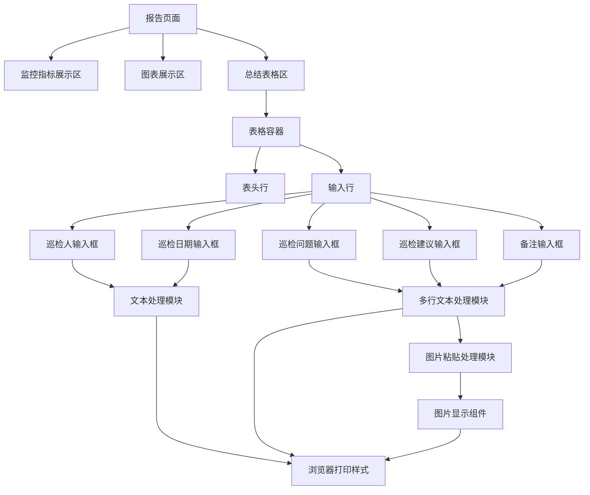
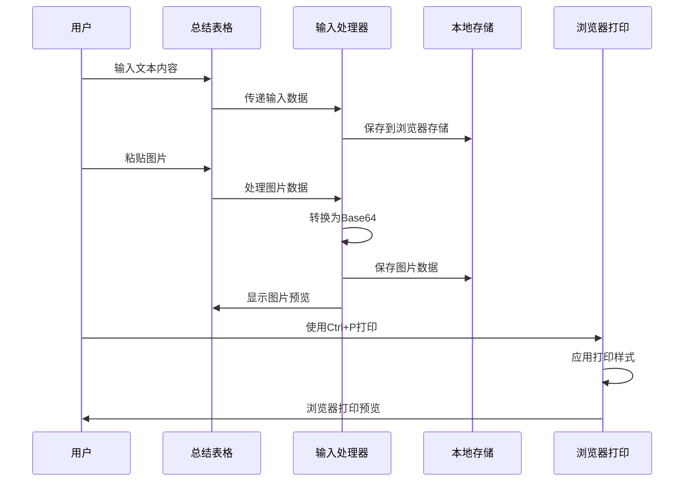
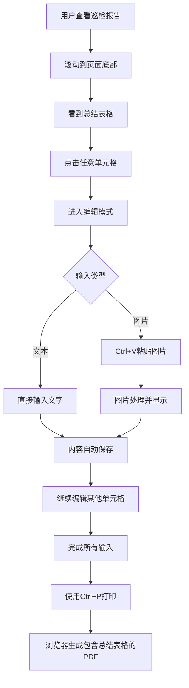
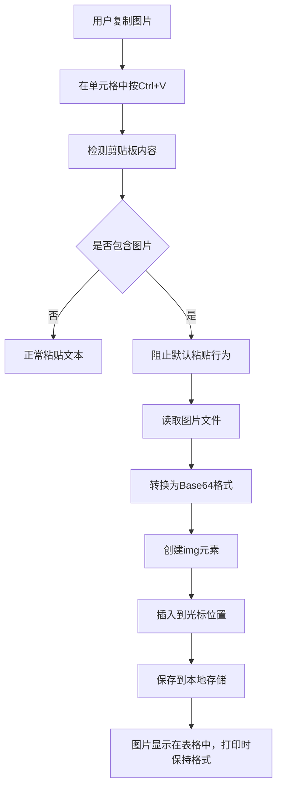

# 报告总结表格功能设计

## 概述

在现有巡检报告系统的基础上，在报告页面的最后增加一个可编辑的总结表格，用于记录巡检相关的人工输入信息。该表格支持文本输入和图片粘贴功能，通过浏览器原生打印功能（Ctrl+P）生成PDF记录。

## 功能需求

### 表格结构

总结表格包含以下字段：

| 字段名称 | 描述 | 输入类型 |
|---------|------|---------|
| 巡检人 | 执行巡检的人员姓名 | 文本输入 |
| 巡检日期 | 执行巡检的日期 | 文本输入 |
| 巡检问题 | 发现的问题描述 | 多行文本输入 |
| 巡检建议 | 针对问题的建议措施 | 多行文本输入 |
| 备注 | 其他补充信息 | 多行文本输入 |

### 交互特性

1. **内容对齐方式**：所有输入框内的文字都靠左置顶对齐
2. **输入框布局**：输入框填满整个单元格，无边距
3. **图片支持**：支持在任意文本输入框中粘贴图片
4. **本地存储**：图片仅在客户端处理，不上传到服务器
5. **打印兼容**：表格内容在浏览器原生打印（Ctrl+P）时正确显示

## 技术架构

### 前端组件架构



### 数据流设计



## 前端实现设计

### HTML结构设计

表格采用响应式设计，确保在不同屏幕尺寸下的可用性：

```html
<div class="summary-section">
    <h2>巡检总结</h2>
    <table class="summary-table">
        <thead>
            <tr>
                <th>巡检人</th>
                <th>巡检日期</th>
                <th>巡检问题</th>
                <th>巡检建议</th>
                <th>备注</th>
            </tr>
        </thead>
        <tbody>
            <tr>
                <td class="input-cell">
                    <div contenteditable="true" class="editable-input single-line"></div>
                </td>
                <td class="input-cell">
                    <div contenteditable="true" class="editable-input single-line"></div>
                </td>
                <td class="input-cell">
                    <div contenteditable="true" class="editable-input multi-line"></div>
                </td>
                <td class="input-cell">
                    <div contenteditable="true" class="editable-input multi-line"></div>
                </td>
                <td class="input-cell">
                    <div contenteditable="true" class="editable-input multi-line"></div>
                </td>
            </tr>
        </tbody>
    </table>
</div>
```

### CSS样式设计

#### 表格基础样式

```css
.summary-section {
    margin-top: 40px;
    padding: 20px 0;
    border-top: 2px solid #e0e0e0;
}

.summary-table {
    width: 100%;
    border-collapse: collapse;
    margin-top: 20px;
    font-size: 14px;
}

.summary-table th,
.summary-table td {
    border: 1px solid #ddd;
    vertical-align: top;
}

.summary-table th {
    background-color: #f8f9fa;
    padding: 12px 8px;
    text-align: center;
    font-weight: bold;
    color: #333;
}
```

#### 可编辑输入框样式

```css
.input-cell {
    padding: 0;
    height: 120px;
    position: relative;
}

.editable-input {
    width: 100%;
    height: 100%;
    padding: 8px;
    border: none;
    outline: none;
    resize: none;
    text-align: left;
    vertical-align: top;
    word-wrap: break-word;
    overflow-y: auto;
}

.single-line {
    white-space: nowrap;
    overflow: hidden;
    text-overflow: ellipsis;
}

.multi-line {
    white-space: pre-wrap;
    line-height: 1.4;
}
```

#### 图片显示样式

```css
.editable-input img {
    max-width: 100%;
    height: auto;
    margin: 5px 0;
    border-radius: 4px;
    box-shadow: 0 2px 4px rgba(0,0,0,0.1);
}

.image-placeholder {
    display: inline-block;
    background-color: #f0f0f0;
    border: 2px dashed #ccc;
    padding: 10px;
    margin: 5px 0;
    border-radius: 4px;
    color: #666;
    font-style: italic;
}
```

#### 浏览器原生打印样式

```css
@media print {
    .summary-table {
        page-break-inside: avoid;
        font-size: 12px;
        border-collapse: collapse;
    }
    
    .summary-table th,
    .summary-table td {
        border: 1px solid #000 !important;
        padding: 8px !important;
    }
    
    .editable-input {
        border: none !important;
        background: white !important;
        -webkit-print-color-adjust: exact;
        color: #000 !important;
        font-size: 11px !important;
    }
    
    .editable-input img {
        max-width: 150px !important;
        max-height: 100px !important;
        page-break-inside: avoid;
    }
    
    /* 隐藏不必要的元素 */
    .no-print {
        display: none !important;
    }
    
    /* 确保表格内容可见 */
    .summary-section {
        page-break-before: auto;
        margin-top: 20px;
    }
}
```

### JavaScript功能实现

#### 图片粘贴处理

```javascript
function setupImagePasteHandling() {
    document.querySelectorAll('.editable-input').forEach(element => {
        element.addEventListener('paste', function(e) {
            const items = e.clipboardData.items;
            
            for (let item of items) {
                if (item.type.startsWith('image/')) {
                    e.preventDefault();
                    const file = item.getAsFile();
                    const reader = new FileReader();
                    
                    reader.onload = function(event) {
                        const img = document.createElement('img');
                        img.src = event.target.result;
                        img.style.maxWidth = '100%';
                        
                        insertImageAtCursor(element, img);
                        saveContentToStorage();
                    };
                    
                    reader.readAsDataURL(file);
                    break;
                }
            }
        });
    });
}

function insertImageAtCursor(container, img) {
    const selection = window.getSelection();
    if (selection.rangeCount > 0) {
        const range = selection.getRangeAt(0);
        if (container.contains(range.commonAncestorContainer)) {
            range.insertNode(img);
            range.setStartAfter(img);
            range.setEndAfter(img);
            selection.removeAllRanges();
            selection.addRange(range);
        } else {
            container.appendChild(img);
        }
    } else {
        container.appendChild(img);
    }
}
```

#### 本地存储管理

```javascript
function saveContentToStorage() {
    const data = {};
    document.querySelectorAll('.editable-input').forEach((element, index) => {
        data[`cell_${index}`] = element.innerHTML;
    });
    
    localStorage.setItem('inspection_summary', JSON.stringify(data));
}

function loadContentFromStorage() {
    const saved = localStorage.getItem('inspection_summary');
    if (saved) {
        const data = JSON.parse(saved);
        document.querySelectorAll('.editable-input').forEach((element, index) => {
            if (data[`cell_${index}`]) {
                element.innerHTML = data[`cell_${index}`];
            }
        });
    }
}

function setupAutoSave() {
    document.querySelectorAll('.editable-input').forEach(element => {
        element.addEventListener('input', debounce(saveContentToStorage, 500));
        element.addEventListener('blur', saveContentToStorage);
    });
}

function debounce(func, wait) {
    let timeout;
    return function executedFunction(...args) {
        const later = () => {
            clearTimeout(timeout);
            func(...args);
        };
        clearTimeout(timeout);
        timeout = setTimeout(later, wait);
    };
}
```

### 浏览器打印优化

为了确保使用Ctrl+P打印时的效果，需要特别优化打印样式：

```javascript
// 浏览器打印优化函数
function optimizeForPrint() {
    // 在打印前确保所有内容可见
    document.querySelectorAll('.editable-input').forEach(element => {
        if (element.innerHTML.trim() === '') {
            element.innerHTML = '&nbsp;'; // 空单元格显示占位符
        }
    });
}

// 监听打印事件
window.addEventListener('beforeprint', function() {
    optimizeForPrint();
    console.log('准备打印，应用打印样式');
});

window.addEventListener('afterprint', function() {
    console.log('打印完成');
});
```

### 浏览器打印指导

为用户提供清晰的打印指导：

```html
<div class="print-instructions no-print">
    <h4>打印说明</h4>
    <ul>
        <li>使用 <kbd>Ctrl+P</kbd>（Windows）或 <kbd>Cmd+P</kbd>（Mac）打印报告</li>
        <li>建议选择A4纸张大小，纵向打印</li>
        <li>在打印选项中勾选"背景图形"以保留表格样式</li>
        <li>如需保存为PDF，在打印对话框中选择"另存为PDF"</li>
    </ul>
</div>
```

## 模板集成设计

### 在report.html中的位置

总结表格将被添加到现有报告模板的最后，在图表区域之后，脚本标签之前：

```html
<!-- 现有的监控指标展示 -->
{{range $groupType := .GroupOrder}}
<!-- ... 现有内容 ... -->
{{end}}

<!-- 新增：总结表格区域 -->
<div class="summary-section">
    <h2>巡检总结</h2>
    
    <!-- 打印说明 -->
    <div class="print-instructions no-print">
        <p><strong>打印说明：</strong>使用 <kbd>Ctrl+P</kbd> 或 <kbd>Cmd+P</kbd> 可打印或导出为PDF。建议在打印设置中选择“背景图形”以保留表格样式。</p>
    </div>
    
    <!-- 总结表格实现 -->
</div>

<!-- 现有的图表脚本 -->
<script>
    // 现有图表代码
    // ...
    
    // 新增：总结表格初始化
    document.addEventListener('DOMContentLoaded', function() {
        setupImagePasteHandling();
        loadContentFromStorage();
        setupAutoSave();
        
        // 浏览器打印优化
        window.addEventListener('beforeprint', optimizeForPrint);
    });
</script>
```

### 响应式设计适配

#### 移动端适配

```css
@media (max-width: 768px) {
    .summary-table {
        font-size: 12px;
    }
    
    .summary-table th,
    .summary-table td {
        padding: 6px 4px;
    }
    
    .input-cell {
        height: 80px;
    }
    
    .editable-input {
        padding: 4px;
        font-size: 12px;
    }
}

@media (max-width: 480px) {
    .summary-table {
        display: block;
        overflow-x: auto;
        white-space: nowrap;
    }
    
    .summary-table tbody,
    .summary-table thead,
    .summary-table tr,
    .summary-table th,
    .summary-table td {
        display: block;
    }
    
    .summary-table thead tr {
        position: absolute;
        top: -9999px;
        left: -9999px;
    }
    
    .summary-table tr {
        border: 1px solid #ccc;
        margin-bottom: 10px;
        padding: 10px;
    }
    
    .summary-table td {
        border: none;
        position: relative;
        padding-left: 30%;
        min-height: 40px;
    }
    
    .summary-table td:before {
        content: attr(data-label);
        position: absolute;
        left: 6px;
        width: 25%;
        font-weight: bold;
        color: #333;
    }
}
```

## 用户交互流程

### 基本使用流程



### 图片处理流程



## 数据管理设计

### 本地存储结构

```javascript
// localStorage存储格式
{
    "inspection_summary": {
        "cell_0": "张三",  // 巡检人
        "cell_1": "2024-01-15",  // 巡检日期
        "cell_2": "发现CPU使用率较高", // 巡检问题
        "cell_3": "建议优化应用程序", // 巡检建议
        "cell_4": "下次重点关注内存使用情况" // 备注
    }
}
```

### 数据持久化策略

1. **自动保存**：每次输入变化后500ms自动保存
2. **手动保存**：失去焦点时立即保存
3. **页面刷新保护**：页面加载时自动恢复上次保存的内容
4. **数据清理**：提供手动清空功能（可选）

## 测试策略

### 功能测试用例

| 测试用例 | 测试步骤 | 预期结果 |
|---------|---------|---------|
| 文本输入测试 | 在各单元格输入文本 | 文本正确显示，格式保持 |
| 图片粘贴测试 | 复制图片并粘贴到单元格 | 图片正确显示在单元格中 |
| 自动保存测试 | 输入内容后刷新页面 | 内容被正确恢复 |
| 打印功能测试 | 填写表格后使用Ctrl+P打印 | 浏览器打印预览正确显示所有内容 |
| 响应式测试 | 在不同设备上查看表格 | 表格在各种屏幕尺寸下正常显示 |

### 兼容性测试

| 浏览器 | 版本要求 | 核心功能支持 |
|--------|---------|-------------|
| Chrome | 80+ | 完全支持 |
| Firefox | 75+ | 完全支持 |
| Safari | 13+ | 完全支持 |
| Edge | 80+ | 完全支持 |

### 性能测试

1. **图片处理性能**：测试大尺寸图片粘贴的响应时间
2. **存储容量测试**：测试localStorage的容量限制
3. **渲染性能**：测试包含多张图片时的页面渲染性能
4. **打印性能**：测试浏览器打印大量内容时的响应时间

## 实施计划

### 开发阶段

| 阶段 | 任务 | 预估时间 |
|------|------|---------|
| 阶段1 | HTML结构和基础CSS样式 | 1天 |
| 阶段2 | JavaScript交互功能开发 | 2天 |
| 阶段3 | 图片粘贴功能实现 | 1天 |
| 阶段4 | 本地存储和自动保存 | 0.5天 |
| 阶段5 | 响应式设计和浏览器打印样式优化 | 1天 |
| 阶段6 | 测试和优化 | 1天 |

### 集成步骤

1. **模板修改**：在report.html中添加总结表格HTML结构
2. **样式集成**：将CSS样式添加到现有样式表中
3. **脚本集成**：将JavaScript功能集成到现有脚本中
4. **测试验证**：确保新功能不影响现有报告功能
5. **文档更新**：更新用户使用说明

## 风险评估与缓解

### 潜在风险

| 风险 | 影响程度 | 缓解措施 |
|------|---------|---------|
| 浏览器兼容性问题 | 中 | 提供降级方案，使用标准Web API |
| 本地存储容量限制 | 低 | 实现图片压缩，提供清理功能 |
| 浏览器打印兼容性 | 中 | 详细测试各浏览器原生打印效果 |
| 性能影响 | 低 | 优化图片处理，使用异步操作 |

### 降级方案

1. **不支持图片粘贴的浏览器**：提供文件上传功能作为替代
2. **LocalStorage不可用**：提供导出/导入功能
3. **浏览器打印异常**：提供页面保存为HTML文件的备用方案
