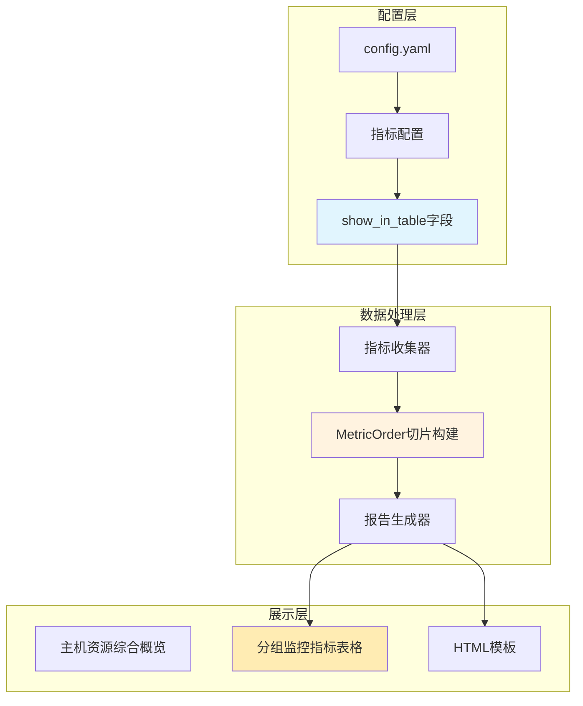
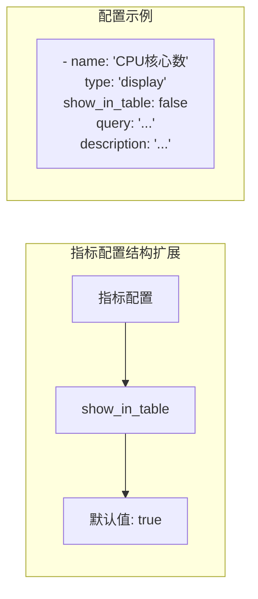
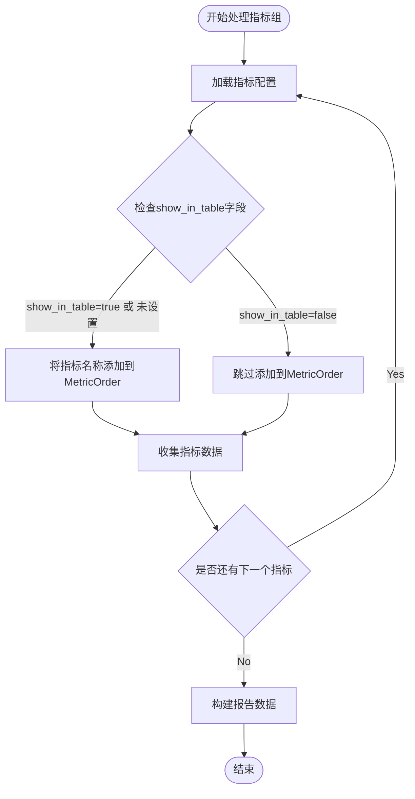
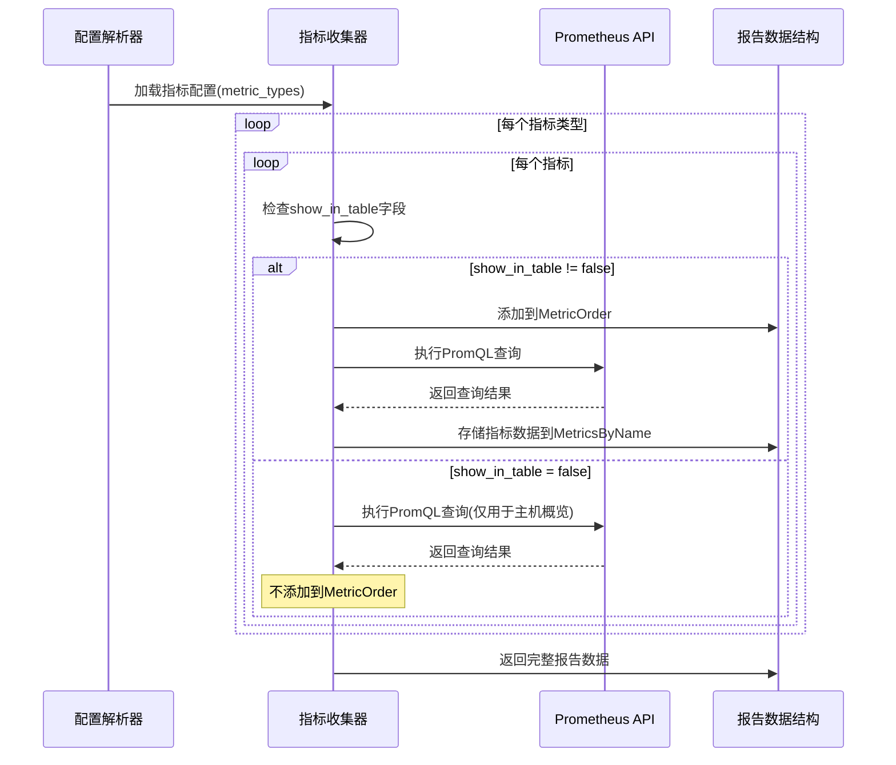
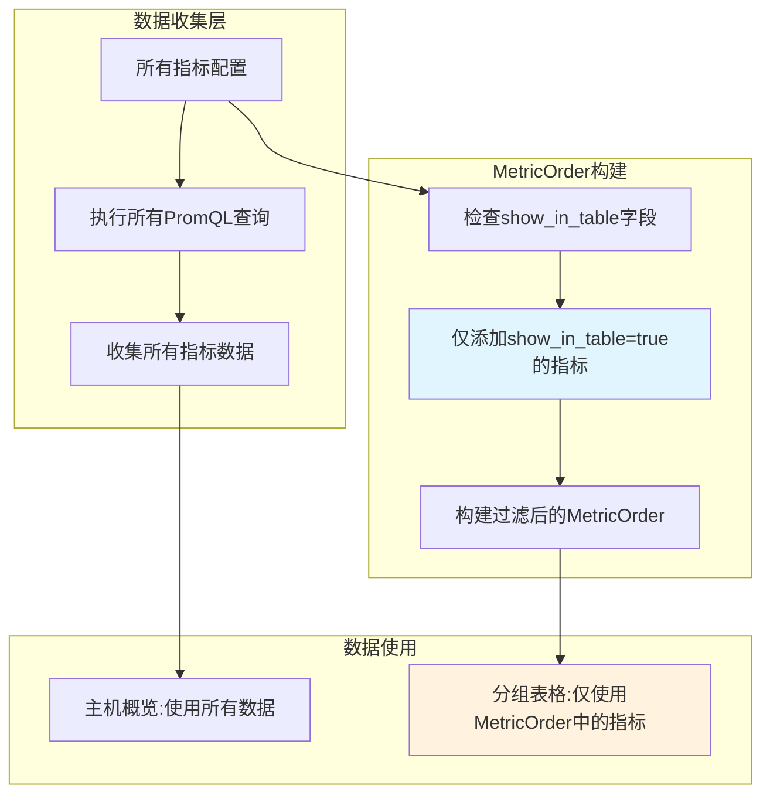
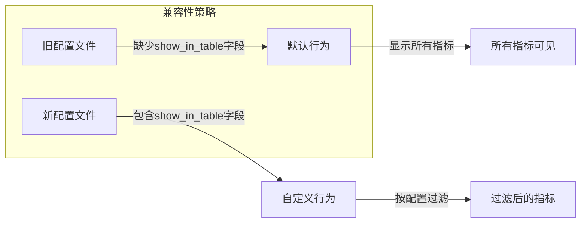
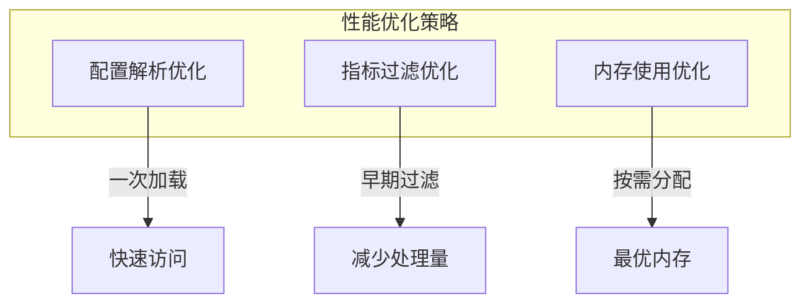
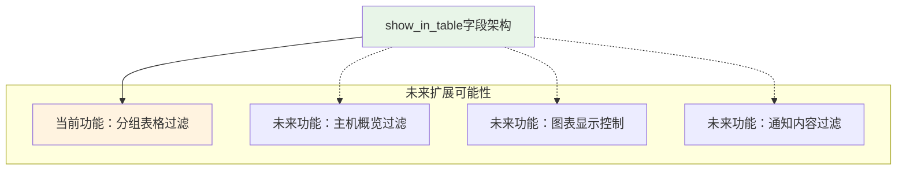
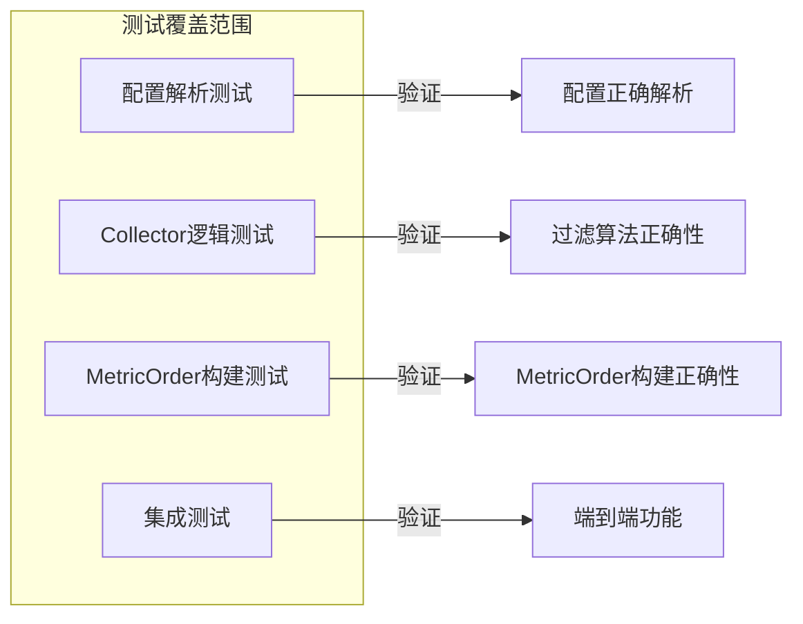

# 基于show_in_table字段的表格显示控制设计

## 概述

本设计旨在解决监控报告中资源指标重复展示的问题。当前系统在主机资源综合概览中已展示了部分基础资源信息（如CPU核心数、内存总量、磁盘可用量等），而在分组监控指标表格中又重复显示这些信息。为避免信息冗余，设计在指标配置层面增加 `show_in_table` 字段，通过在数据收集阶段控制 `MetricOrder` 切片的构建，从而实现指标在分组表格中的显示控制。

## 架构

### 整体架构图



### 配置结构设计



## 配置参数设计

### 指标配置结构扩展

| 配置项 | 类型 | 描述 | 默认值 |
|--------|------|------|----------|
| `show_in_table` | Boolean | 是否在分组表格中显示该指标 | `true` |

### 配置示例

```yaml
metric_types:
- type: "基础资源使用情况"
  metrics:
  - name: "CPU使用率"
    type: "monitoring"
    show_in_table: true  # 显示在分组表格中
    description: "节点CPU使用率统计"
    query: "100 - (avg by(instance) (irate(node_cpu_seconds_total{mode='idle'}[5m])) * 100)"
    threshold: 80
    threshold_type: "greater"
    unit: "%"
    labels:
      instance: "节点"
      
  - name: "CPU核心数"
    type: "display"
    show_in_table: false  # 不在分组表格中显示
    query: "count by (instance) (node_cpu_seconds_total{mode='idle'})"
    description: "节点CPU核心数统计"
    unit: "core"
    labels:
      instance: "节点"
      
  - name: "内存总量"
    type: "display"
    show_in_table: false  # 不在分组表格中显示
    query: "node_memory_MemTotal_bytes"
    description: "节点内存总量统计"
    unit: "B"
    labels:
      instance: "节点"
      
  - name: "内存使用率"
    type: "monitoring"
    show_in_table: true  # 显示在分组表格中
    description: "节点内存使用率统计"
    query: "100 - ((node_memory_MemAvailable_bytes * 100) / node_memory_MemTotal_bytes)"
    threshold: 85
    threshold_type: "greater"
    unit: "%"
    labels:
      instance: "节点"
```

### 配置文件结构扩展

| 配置项 | 类型 | 描述 | 默认值 |
|--------|------|------|---------|
| `display_control` | Object | 显示控制配置的根节点 | - |
| `display_control.group_table_display` | Object | 分组表格显示控制 | - |
| `display_control.group_table_display.enabled` | Boolean | 是否启用分组表格显示过滤 | `true` |
| `display_control.group_table_display.exclude_metrics` | Array | 在分组表格中需要排除的指标名称列表 | `[]` |

### 配置示例

```yaml
# 显示控制配置
display_control:
  group_table_display:
    enabled: true
    exclude_metrics:
      - "CPU核心数"
      - "内存总量" 
      - "磁盘可用量"
      - "内存使用量"
      - "磁盘总量"
```

## 功能设计

### MetricOrder构建逻辑



### 数据收集与处理流程



## 数据模型扩展

### Go结构体扩展

| 字段名 | 类型 | 描述 |
|--------|------|------|
| `ShowInTable` | `bool` | 指标配置中新增的字段，控制是否在分组表格中显示 |

### MetricConfig结构体修改

```go
type MetricConfig struct {
    Name          string            `yaml:"name"`
    Type          string            `yaml:"type"`
    ShowInTable   bool              `yaml:"show_in_table"` // 新增字段
    Description   string            `yaml:"description"`
    Query         string            `yaml:"query"`
    Threshold     float64           `yaml:"threshold"`
    Unit          string            `yaml:"unit"`
    Labels        map[string]string `yaml:"labels"`
    ThresholdType string            `yaml:"threshold_type"`
}
```

### Collector逻辑修改要点

| 修改位置 | 修改内容 | 目的 |
|----------|----------|------|
| MetricOrder构建 | 在添加指标名称到MetricOrder前检查show_in_table字段 | 控制指标在表格中的显示 |
| 数据收集 | 继续收集所有指标数据，但仅将show_in_table=true的指标加入MetricOrder | 保证主机概览可以访问所有数据 |

### 数据流向设计



## 模板渲染逻辑

### HTML模板修改要点

现有的HTML模板通过遍历 `MetricOrder` 切片来渲染指标表格：

```html
{{range $metricName := $group.MetricOrder}}
    {{$metrics := index $group.MetricsByName $metricName}}
    <!-- 渲染指标表格 -->
{{end}}
```

由于我们在Collector阶段已经cope过滤了MetricOrder，模板层不需要做任何修改。

## 兼容性设计

### 向后兼容性



### 默认行为定义

| 场景 | 行为 | 说明 |
|------|------|------|
| 配置文件中无 `show_in_table` 字段 | 显示所有指标 | 保持原有行为，确保向后兼容 |
| `show_in_table: true` | 显示该指标 | 显式启用显示 |
| `show_in_table: false` | 不显示该指标 | 显式禁用显示 |
| 展示类指标的推荐配置 | `show_in_table: false` | 避免在主机概览和分组表格中重复显示 |

## 实现考虑

### 性能优化



### 错误处理

| 错误类型 | 处理策略 | 影响范围 |
|----------|----------|----------|
| 配置文件格式错误 | 使用默认值(true)，记录警告日志 | 全局 |
| show_in_table字段类型错误 | 默认为true，记录警告日志 | 单个指标 |
| PromQL查询失败 | 记录错误日志，继续处理其他指标 | 单个指标 |

### 实现步骤


### 扩展性设计



可以在未来增加更多的显示控制字段：
- `show_in_chart`: 控制是否在图表中显示
- `show_in_summary`: 控制是否在主机概览中显示
- `show_in_notification`: 控制是否在通知中包含

## 测试策略

### 测试用例设计

| 测试场景 | 期望结果 | 验证方法 |
|----------|----------|----------|
| 配置文件中无 `show_in_table` 字段 | 显示所有指标 | 检查生成的HTML包含所有指标表格 |
| `show_in_table: true` | 显示该指标 | 检查HTML中包含该指标的表格 |
| `show_in_table: false` | 不显示该指标 | 检查HTML中不包含该指标的表格 |
| 混合配置场景 | 部分指标显示 | 验证MetricOrder只包含show_in_table=true的指标 |
| Collector处理逻辑 | 数据仍然收集，但MetricOrder被过滤 | 检查MetricsByName包含所有数据，MetricOrder被过滤 |

### 单元测试覆盖



### 验证检查点

| 检查项 | 检查方法 | 重要性 |
|----------|----------|----------|
| MetricConfig结构体解析 | 单元测试验证YAML解析正确性 | 高 |
| MetricOrder切片内容 | 断言验证只包含show_in_table=true的指标 | 高 |
| MetricsByName完整性 | 验证所有指标数据都被收集 | 中 |
| HTML输出正确性 | 验证渲染结果与预期一致 | 高 |
| 向后兼容性 | 验证旧配置文件仍然正常工作 | 高 |