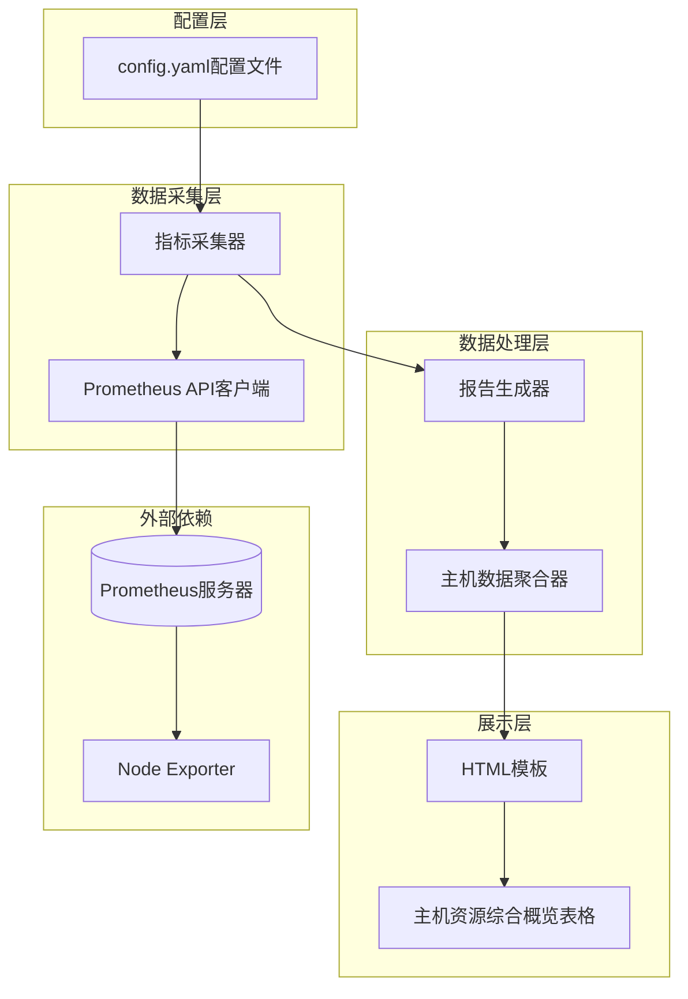
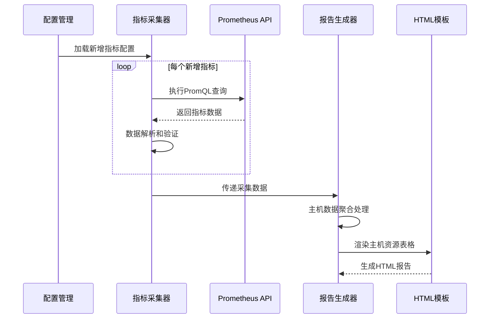
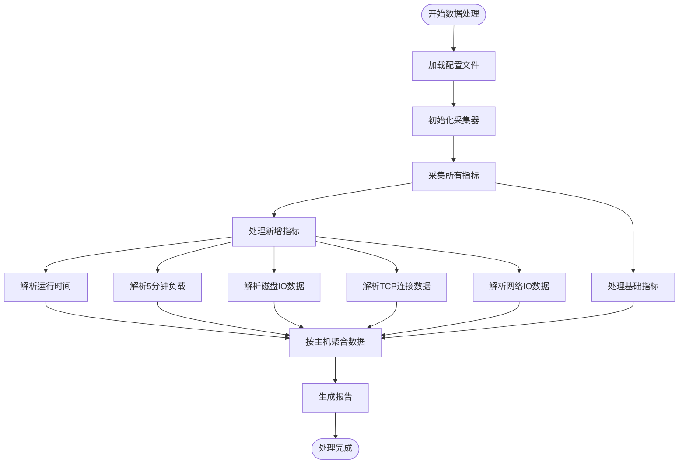

# 主机资源综合概览监控指标扩展设计

## 概述

本设计文档描述了在现有主机资源综合概览功能基础上新增8个展示类监控指标的系统设计方案。新增指标包括运行时间、5分钟负载、30分钟内磁盘读写均值、TCP连接统计和网络流量统计等，这些指标仅用于展示，不进行颜色状态区分。

## 需求分析

### 功能需求

新增展示指标：
- **运行时间**: 系统启动时长
- **5分钟负载**: 系统5分钟平均负载
- **30分钟内磁盘平均读取值**: 基于时间窗口的磁盘读取速率统计
- **30分钟内磁盘平均写入值**: 基于时间窗口的磁盘写入速率统计  
- **TCP连接数**: 当前活跃的TCP连接总数
- **TCP_TW数**: TCP TIME_WAIT状态连接数
- **30分钟内下载速率**: 网络入站流量速率统计
- **30分钟内上传速率**: 网络出站流量速率统计

### 非功能需求

- 所有新增指标均为展示类型（type: "display"），不进行阈值判断和状态颜色区分
- 30分钟时间窗口通过PromQL查询语句的时间范围参数实现
- 保持与现有架构的兼容性，不影响已有功能
- 支持多主机实例的数据采集和展示

## 技术架构

### 系统架构概览



### 数据流设计



## 配置设计

### 指标配置扩展

在现有 `config.yaml` 的基础资源使用情况指标组中新增以下配置：

| 指标名称 | 查询语句 | 时间窗口 | 单位 | 标签 |
|---------|---------|----------|------|-----|
| 运行时间 | `time() - node_boot_time_seconds` | 当前时间点 | s | instance |
| 5分钟负载 | `node_load5` | 当前时间点 | 无 | instance |
| 30分钟内磁盘平均读取值 | `avg_over_time(rate(node_disk_read_bytes_total[5m])[30m:1m])` | 30分钟 | B/s | instance, device |
| 30分钟内磁盘平均写入值 | `avg_over_time(rate(node_disk_written_bytes_total[5m])[30m:1m])` | 30分钟 | B/s | instance, device |
| TCP连接数 | `node_netstat_Tcp_CurrEstab` | 当前时间点 | 个 | instance |
| TCP_TW数 | `node_sockstat_TCP_tw` | 当前时间点 | 个 | instance |
| 30分钟内下载速率 | `avg_over_time(rate(node_network_receive_bytes_total[5m])[30m:1m])` | 30分钟 | B/s | instance, device |
| 30分钟内上传速率 | `avg_over_time(rate(node_network_transmit_bytes_total[5m])[30m:1m])` | 30分钟 | B/s | instance, device |

### 配置结构扩展

```yaml
metric_types:
- type: "基础资源使用情况"
  metrics:
  # 现有指标保持不变...
  
  # 新增展示类指标
  - name: "运行时间"
    type: "display"
    description: "系统运行时长统计"
    query: "time() - node_boot_time_seconds"
    unit: "s"
    labels:
      instance: "节点"
  
  - name: "5分钟负载"
    type: "display"
    description: "系统5分钟平均负载"
    query: "node_load5"
    unit: ""
    labels:
      instance: "节点"
  
  - name: "30分钟内磁盘平均读取值"
    type: "display"
    description: "30分钟内磁盘平均读取速率"
    query: "avg_over_time(rate(node_disk_read_bytes_total[5m])[30m:1m])"
    unit: "B/s"
    labels:
      instance: "节点"
      device: "设备"
```

## 数据模型设计

### 主机汇总结构扩展

扩展现有的 `HostSummary` 结构以支持新增指标：

```go
type HostSummary struct {
    // 现有字段保持不变
    Hostname  string
    IP        string
    CPUCount  int64
    CPUUsage  float64
    CPUStatus string
    MemTotal  float64
    MemUsed   float64
    MemUsage  float64
    MemStatus string
    DiskData  []DiskInfo
    Timestamp time.Time
    
    // 新增字段
    Uptime          float64            // 运行时间(秒)
    Load5           float64            // 5分钟负载
    DiskIOStats     []DiskIOInfo       // 磁盘IO统计
    TCPConnections  int64              // TCP连接数
    TCPTimeWait     int64              // TCP TIME_WAIT连接数
    NetworkStats    []NetworkIOInfo    // 网络IO统计
}

type DiskIOInfo struct {
    Device         string   // 磁盘设备名
    AvgReadRate    float64  // 30分钟平均读取速率
    AvgWriteRate   float64  // 30分钟平均写入速率
}

type NetworkIOInfo struct {
    Interface      string   // 网络接口名
    AvgDownloadRate float64 // 30分钟平均下载速率
    AvgUploadRate   float64 // 30分钟平均上传速率
}
```

### 数据处理流程



## 界面设计

### 主机资源综合概览表格扩展

在现有表格基础上增加新的列：

| 字段类别 | 列名 | 数据源 | 格式化 |
|---------|------|--------|--------|
| 基础信息 | IP地址 | 现有 | 文本 |
| CPU信息 | CPU核心数 | 现有 | 数值 |
| CPU信息 | CPU使用率 | 现有 | 百分比+状态色 |
| 系统信息 | **运行时间** | 新增 | 时长格式化 |
| 系统信息 | **5分钟负载** | 新增 | 小数点2位 |
| 内存信息 | 内存总量 | 现有 | 字节格式化 |
| 内存信息 | 内存使用量 | 现有 | 字节格式化 |
| 内存信息 | 内存使用率 | 现有 | 百分比+状态色 |
| 磁盘信息 | 挂载点 | 现有 | 文本 |
| 磁盘信息 | 磁盘总量 | 现有 | 字节格式化 |
| 磁盘信息 | 磁盘使用量 | 现有 | 字节格式化 |
| 磁盘信息 | 磁盘使用率 | 现有 | 百分比+状态色 |
| 磁盘IO | **磁盘平均读取** | 新增 | 速率格式化 |
| 磁盘IO | **磁盘平均写入** | 新增 | 速率格式化 |
| 网络连接 | **TCP连接数** | 新增 | 数值 |
| 网络连接 | **TCP_TW数** | 新增 | 数值 |
| 网络IO | **下载速率** | 新增 | 速率格式化 |
| 网络IO | **上传速率** | 新增 | 速率格式化 |
| 其他 | 检测时间 | 现有 | 时间格式 |

### 数据格式化规范

| 数据类型 | 格式化规则 | 示例 |
|---------|-----------|------|
| 运行时间 | 自动选择合适单位（天/小时/分钟） | "15天3小时45分钟" |
| 负载值 | 保留2位小数 | "1.25" |
| 网络速率 | 自动单位转换（B/s, KB/s, MB/s） | "12.5 MB/s" |
| 磁盘IO速率 | 自动单位转换（B/s, KB/s, MB/s） | "8.3 MB/s" |
| TCP连接数 | 整数显示 | "1,234" |

## 实现方案

### 阶段一：配置扩展（配置层改动）

**目标**: 在配置文件中添加新增指标定义

**变更内容**:
- 在 `config.yaml` 中的"基础资源使用情况"指标组添加8个新指标配置
- 所有新指标设置 `type: "display"`，确保不进行状态判断
- 配置合适的 PromQL 查询语句，确保30分钟时间窗口正确实现

**验证方式**: 配置文件能够正确加载，新指标定义可被解析

### 阶段二：数据采集增强（数据采集层改动）

**目标**: 扩展指标采集器支持新增指标

**变更内容**:
- 确保现有 `Collector.CollectMetrics()` 方法能够处理新增的展示类指标
- 验证对于 `type: "display"` 的指标，状态始终为 "normal"
- 确保时间窗口查询语句能够正确执行并返回预期数据

**验证方式**: 指标采集器能够成功获取所有新增指标的数据

### 阶段三：数据模型扩展（数据处理层改动）

**目标**: 扩展数据结构支持新增指标

**变更内容**:
- 扩展 `HostSummary` 结构体，添加新增指标字段
- 新增 `DiskIOInfo` 和 `NetworkIOInfo` 结构体
- 在 `GenerateReport` 函数中增加新增指标的数据聚合逻辑

**验证方式**: 主机数据聚合功能能够正确处理和组织新增指标数据

### 阶段四：界面展示实现（展示层改动）

**目标**: 在主机资源综合概览表格中展示新增指标

**变更内容**:
- 修改 HTML 模板，在主机资源表格中增加新的列
- 实现数据格式化函数（运行时间、网络速率等）
- 确保新增列的数据展示正确，无状态颜色标识

**验证方式**: 生成的报告中主机资源表格包含所有新增指标数据

### 阶段五：集成测试（整体验证）

**目标**: 验证完整功能和兼容性

**变更内容**:
- 进行完整的指标采集和报告生成测试
- 验证多主机场景下的数据准确性
- 确保新增功能不影响现有监控指标的正常显示

**验证方式**: 完整的报告生成流程正常工作，所有指标数据准确显示

## 技术约束

### 数据源依赖
- 依赖 Node Exporter 提供的系统指标数据
- 需要 Prometheus 服务器支持时间窗口查询功能
- 查询时间窗口固定为30分钟，通过 PromQL 语法实现

### 性能考虑
- 新增8个指标查询，需要考虑对 Prometheus 查询性能的影响
- 30分钟时间窗口查询可能增加查询延迟
- 建议在非高峰期进行报告生成

### 兼容性要求
- 保持与现有配置格式的完全兼容
- 不影响现有监控类指标的状态判断逻辑
- 确保在缺少某些指标数据时系统能够优雅降级

## 风险评估

### 技术风险
- **数据查询风险**: 30分钟时间窗口查询可能在数据量大的情况下超时
- **指标缺失风险**: 部分节点可能不支持某些网络或磁盘指标
- **格式化风险**: 不同数值范围的格式化可能出现显示异常

### 缓解措施
- 对查询超时进行异常处理，显示"数据获取失败"
- 对缺失的指标数据显示"-"或"N/A"
- 实现健壮的数据格式化函数，处理边界情况

### 回滚方案
- 通过配置文件可以快速禁用新增指标
- 数据结构向后兼容，可以回退到旧版本模板
- 保留原有功能完全不变，新增功能独立可移除

## 验收标准

### 功能验收
1. 配置文件能够正确加载8个新增指标定义
2. 指标采集器能够成功获取所有新增指标数据
3. 主机资源综合概览表格正确显示所有新增列
4. 所有新增指标均无状态颜色标识，仅作展示用途
5. 数据格式化符合预期（时间、速率、数值等）

### 性能验收
1. 新增指标查询不应显著增加报告生成时间（增幅<50%）
2. 在多主机环境下（10+节点）报告生成成功率>95%
3. 系统内存占用增幅<20%

### 兼容性验收
1. 现有监控类指标功能完全不受影响
2. 现有配置文件无需修改即可正常工作
3. 生成的报告在主流浏览器中正常显示

## 测试策略

### 单元测试
- 测试新增指标的配置解析功能
- 测试数据格式化函数的正确性
- 测试主机数据聚合逻辑

### 集成测试  
- 测试完整的指标采集到报告生成流程
- 测试多主机场景下的数据准确性
- 测试异常情况下的系统稳定性

### 验收测试
- 在真实环境中验证所有新增指标的数据准确性
- 验证报告界面的用户体验
- 验证与现有功能的兼容性