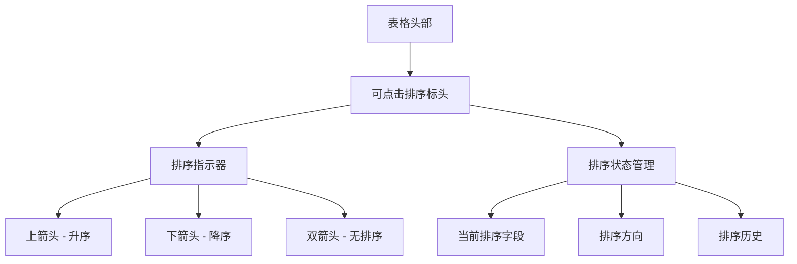
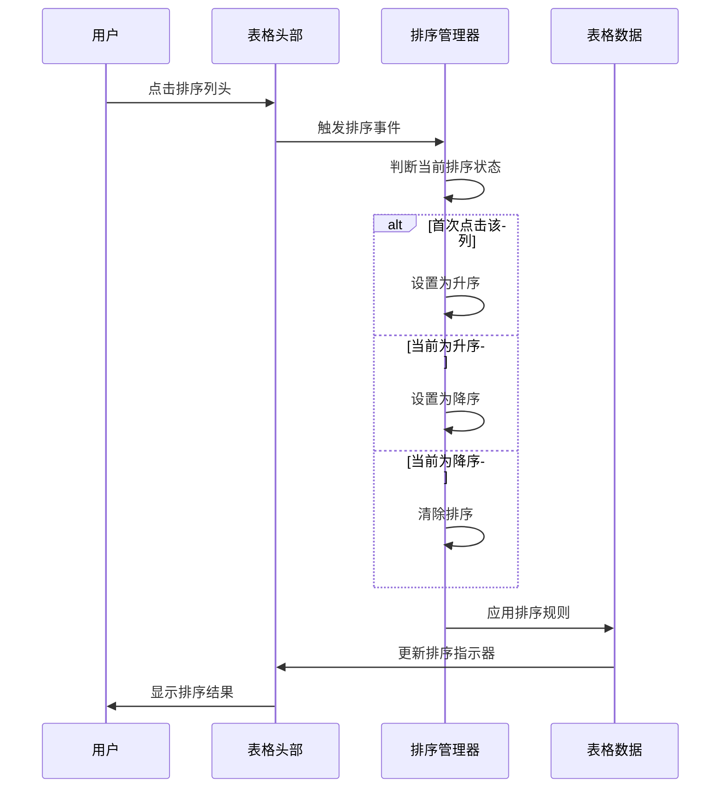
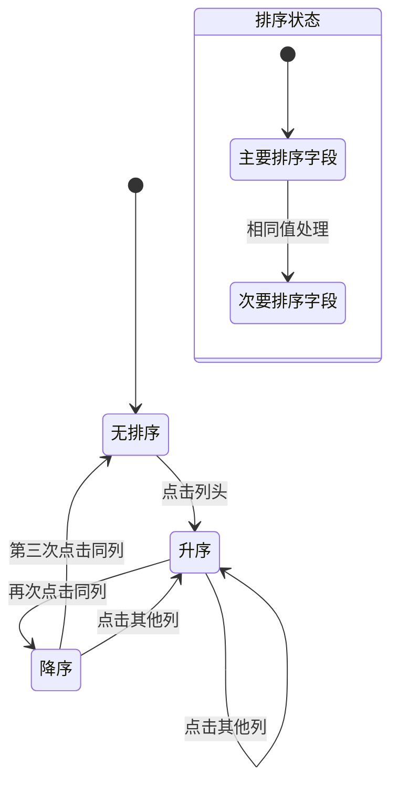
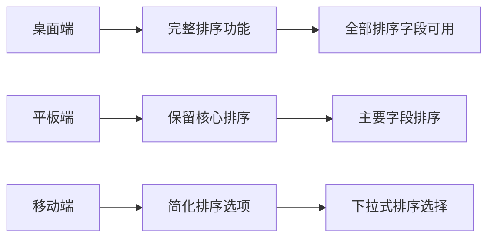
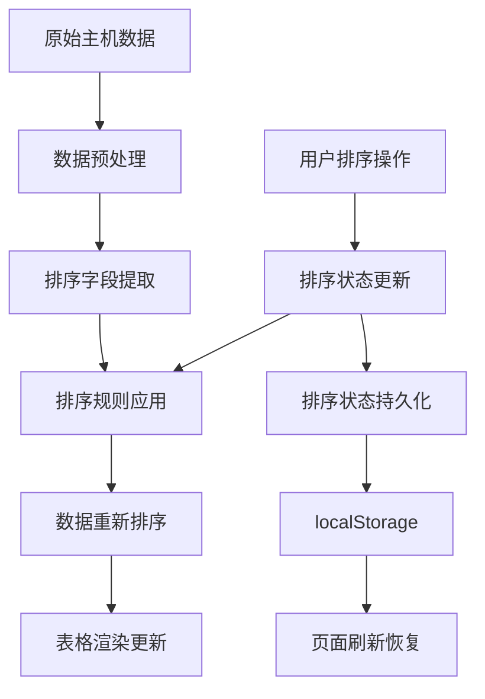
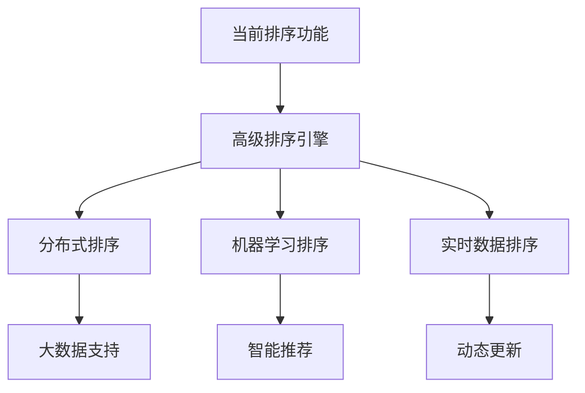

# 主机资源综合预览排序功能设计

## 概述

为了提升用户体验和数据可读性，在主机资源综合预览表格中增加排序功能，允许用户按照关键指标对主机数据进行排序。此功能将使运维人员能够快速识别资源使用情况异常的主机，提高监控效率。

## 需求背景

当前系统展示主机资源综合预览时，由于新增了磁盘读写速率和网络IO速率等指标，页面展示变得紧凑，用户已手动注释了前端页面关于这4个指标的展示。在此背景下，需要增强主机资源表格的交互性，增加排序功能来帮助用户更好地分析和查看数据。

## 功能特性

### 支持的排序字段

1. **IP地址** - 按照IP地址字典序排序
2. **CPU使用率** - 按照CPU使用率数值排序
3. **内存使用率** - 按照内存使用率数值排序
4. **5分钟负载** - 按照系统负载值排序
5. **磁盘使用率** - 按照最高磁盘使用率排序（当主机有多个磁盘时）

### 排序方式

- **升序排列** - 从小到大排序（默认）
- **降序排列** - 从大到小排序
- **多重排序** - 支持二级排序，例如先按CPU使用率排序，再按内存使用率排序

## 技术架构

### 前端交互层

#### 表格头部设计

#### 用户交互流程

### 数据处理层

#### 排序数据结构

| 字段名 | 数据类型 | 排序方式 | 特殊处理 |
|--------|----------|----------|----------|
| IP地址 | string | 字典序 | IP地址数值化排序 |
| CPU使用率 | float64 | 数值 | 百分比值排序 |
| 内存使用率 | float64 | 数值 | 百分比值排序 |
| 5分钟负载 | float64 | 数值 | 直接数值排序 |
| 磁盘使用率 | float64 | 数值 | 取最高磁盘使用率 |

#### 排序算法设计

**主要排序函数**
- 实现多字段排序比较器
- 支持数值型和字符串型字段的混合排序
- 处理特殊情况（如空值、无效数据）

**IP地址排序算法**
- 将IP地址转换为数值进行比较
- 支持IPv4地址的自然排序（例如：192.168.1.1 < 192.168.1.10）

**磁盘使用率聚合算法**
- 当主机包含多个磁盘挂载点时，选择使用率最高的磁盘进行排序
- 确保排序结果能够反映主机的磁盘资源紧张程度

### 状态管理

#### 排序状态定义

## 用户界面设计

### 视觉设计指南

#### 排序指示器样式

| 状态 | 图标 | 颜色 | 说明 |
|------|------|------|------|
| 未排序 | ↕️ | #666 | 灰色双向箭头 |
| 升序 | ↑ | #007bff | 蓝色向上箭头 |
| 降序 | ↓ | #007bff | 蓝色向下箭头 |

#### 表格头部交互

- **悬停效果** - 鼠标悬停时显示排序提示
- **点击反馈** - 点击时提供视觉反馈
- **键盘支持** - 支持Tab键导航和Enter/Space键激活

### 响应式设计

## 实现策略

### 开发阶段

#### 第一阶段：基础排序功能
- 实现前端JavaScript排序逻辑
- 添加表格头部排序控件
- 支持单字段排序

#### 第二阶段：高级排序功能
- 实现多字段排序
- 添加排序状态持久化
- 优化大数据量性能

#### 第三阶段：用户体验优化
- 添加排序动画效果
- 实现排序历史记录
- 增加排序快捷键支持

### 技术选型

#### 前端技术栈
- **排序引擎** - 纯JavaScript实现
- **UI组件** - 基于现有HTML/CSS架构
- **状态管理** - localStorage持久化

#### 性能优化策略
- **虚拟滚动** - 大数据量时的渲染优化
- **排序缓存** - 避免重复排序计算
- **懒加载** - 分页加载大量主机数据

## 数据流设计

### 排序数据流

### 错误处理策略

#### 数据异常处理

| 异常类型 | 处理方式 | 用户体验 |
|----------|----------|----------|
| 空数据 | 显示空状态 | 提示无数据可排序 |
| 格式错误 | 数据修正 | 自动纠正并排序 |
| 网络异常 | 降级处理 | 使用缓存数据排序 |
| 排序失败 | 恢复默认 | 提示并恢复原序 |

## 兼容性考虑

### 浏览器兼容性

| 浏览器 | 版本要求 | 支持程度 |
|--------|----------|----------|
| Chrome | 70+ | 完全支持 |
| Firefox | 65+ | 完全支持 |
| Safari | 12+ | 完全支持 |
| Edge | 79+ | 完全支持 |
| IE | 不支持 | 基础功能降级 |

### 现有功能兼容

- **保持现有表格结构** - 不影响原有的状态高亮显示
- **维护响应式布局** - 确保排序功能在不同屏幕尺寸下正常工作
- **保留过滤功能** - 与未来可能的过滤功能保持兼容

## 测试验证

### 功能测试用例

#### 基础排序测试

| 测试场景 | 期望结果 | 验证要点 |
|----------|----------|----------|
| IP地址排序 | 按数值大小正确排序 | 192.168.1.1 < 192.168.1.10 |
| CPU使用率排序 | 按百分比数值排序 | 数值型排序准确性 |
| 多磁盘主机排序 | 按最高磁盘使用率排序 | 聚合算法正确性 |
| 空值处理 | 空值排在末尾 | 异常数据处理 |
| 相同值排序 | 保持原有顺序 | 稳定排序算法 |

#### 交互测试用例

| 测试场景 | 操作步骤 | 期望结果 |
|----------|----------|----------|
| 单击排序 | 点击列头 | 升序排列 |
| 双击排序 | 再次点击同列 | 降序排列 |
| 三击重置 | 第三次点击同列 | 恢复原序 |
| 切换列排序 | 点击不同列头 | 新列升序排列 |
| 键盘操作 | Tab+Enter操作 | 排序功能激活 |

### 性能测试

#### 性能基准

| 数据量 | 排序耗时 | 内存占用 | 用户体验 |
|--------|----------|----------|----------|
| 100条记录 | <10ms | <1MB | 即时响应 |
| 500条记录 | <50ms | <5MB | 流畅体验 |
| 1000条记录 | <100ms | <10MB | 可接受延迟 |
| 5000条记录 | <500ms | <50MB | 需要优化 |

## 安全考虑

### 客户端安全
- **输入验证** - 对排序参数进行验证
- **XSS防护** - 避免恶意脚本注入
- **内存泄漏** - 及时清理排序状态和缓存

### 数据安全
- **敏感信息保护** - 确保排序过程不泄露敏感数据
- **状态持久化安全** - localStorage数据加密存储

## 未来扩展

### 高级功能规划

#### 自定义排序
- 用户定义排序优先级
- 保存个人排序偏好
- 团队共享排序配置

#### 智能排序建议
- 基于用户行为的排序推荐
- 异常数据优先显示
- 趋势变化排序

#### 导出功能集成
- 按排序结果导出数据
- 排序状态包含在导出配置中
- 支持多种导出格式

### 架构演进方向

这个设计将显著提升用户在查看主机资源数据时的体验，使运维人员能够快速识别和分析关键指标，提高监控工作的效率。