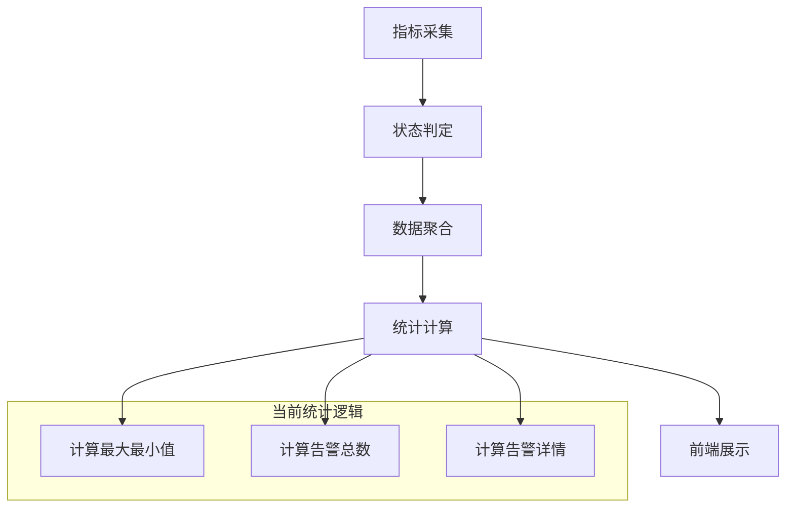
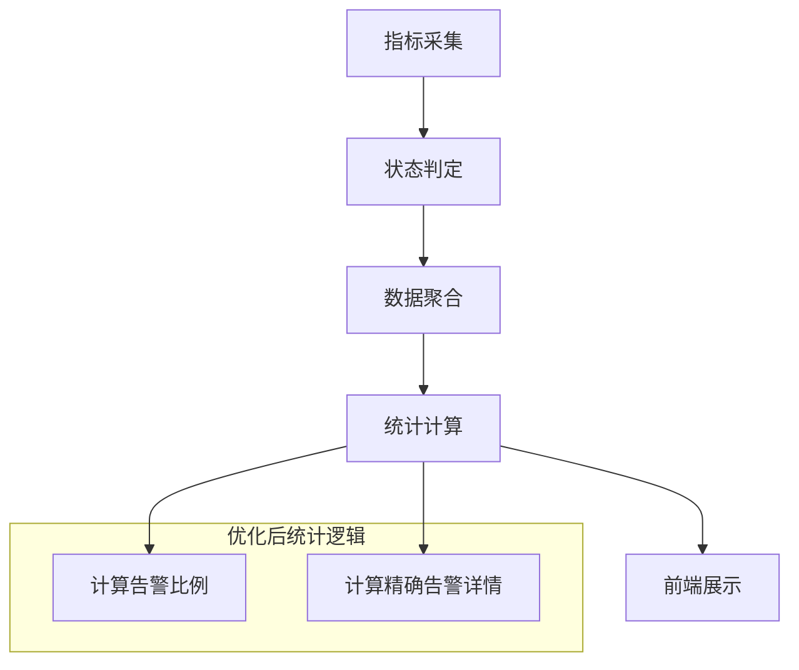
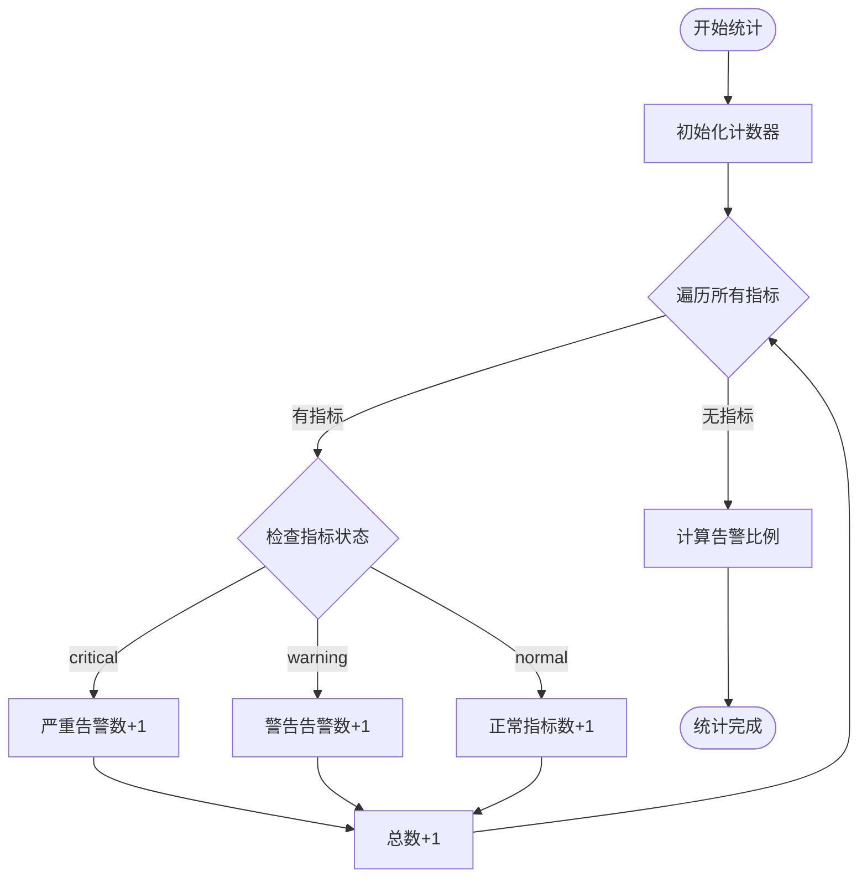

# 指标统计调整设计文档

## 概述

本设计文档描述对PromAI项目中报告统计功能的优化调整，主要针对概览卡片中统计信息的准确性和业务意义进行改进。

### 业务背景

当前系统在生成监控报告时，概览卡片展示的最大值和最小值缺乏明确业务意义，且告警统计逻辑与实际需求不符。需要优化统计算法，使其更准确地反映系统监控状态。

### 核心问题

1. **统计数据意义不明确**：最大值和最小值对于不同类型的指标混合展示时意义模糊
2. **告警统计逻辑错误**：当前计算方式与实际告警判定不一致
3. **告警详情统计不准确**：严重和警告告警的分类统计存在重复计算问题

## 架构设计

### 当前架构分析

### 优化后架构

## 功能设计

### 统计指标重新定义

#### 1. 告警数统计调整

**当前逻辑问题**：
- 简单累加所有warning和critical状态的指标
- 未考虑告警的实际业务含义

**优化后逻辑**：
- 告警数 = 超过警告阈值的指标数 / 收集到的所有指标数
- 以比例形式展示，更直观反映系统健康度

#### 2. 告警详情统计优化

**当前逻辑问题**：
- 严重告警和警告告警存在重复计算
- 统计不准确

**优化后逻辑**：
- 严重告警：超过严重阈值的指标数量
- 警告告警：超过警告阈值但未达到严重阈值的指标数量

### 状态判定规则映射

| 状态类型 | 判定条件 | 统计分类 |
|---------|----------|----------|
| normal | 值在正常范围内 | 正常指标 |
| warning | 超过警告阈值但未达严重阈值 | 警告告警 |
| critical | 超过严重阈值 | 严重告警 |

## 数据模型调整

### GroupStats结构优化

**移除字段**：
- MaxValue (最大值)
- MinValue (最小值)
- Average (平均值)

**保留字段**：
- AlertCount (告警数量)
- CriticalCount (严重告警数)
- WarningCount (警告数量)
- TotalCount (总指标数)

### 告警统计算法

## 前端展示优化

### 概览卡片布局调整

**移除元素**：
- 最大值显示区域
- 最小值显示区域

**保留元素**：
- 告警数比例显示
- 告警详情分类显示

### 统计信息展示格式

| 显示项目 | 格式 | 示例 |
|---------|------|------|
| 告警数 | "告警数/总数" | "16/618" |
| 告警详情 | "严重:数量 警告:数量" | "严重:16 警告:0" |

## 实施方案

### 后端代码调整

#### 1. generator.go 修改要点

**统计计算逻辑优化**：
- 移除 MaxValue、MinValue、Average 的计算
- 优化告警计数逻辑，确保严重和警告不重复计算
- 明确告警数的业务含义

**数据结构调整**：
- GroupStats 结构体字段精简
- 保持向后兼容性

#### 2. 状态统计算法

**告警分类规则**：
- 只有状态为 "critical" 的指标计入严重告警
- 只有状态为 "warning" 的指标计入警告告警
- 告警总数 = 严重告警数 + 警告告警数

### 前端模板调整

#### 1. report.html 修改要点

**移除显示元素**：
- 最大值和最小值的显示区块
- 相关的CSS样式定义

**保留优化元素**：
- 告警数显示保持原有格式
- 告警详情显示保持原有逻辑

#### 2. 样式优化

**布局调整**：
- 概览卡片grid布局从4列调整为2列
- 保持卡片整体美观性

## 测试策略

### 单元测试

**测试覆盖范围**：
- 告警统计算法正确性
- 不同指标状态的计数准确性
- 边界条件处理

### 集成测试

**测试场景**：
- 多种指标类型混合场景
- 不同告警状态分布场景
- 报告生成完整性验证

### 数据验证

**验证要点**：
- 告警数与实际超阈值指标数一致
- 严重和警告告警数量不重复
- 总指标数统计准确

## 兼容性考虑

### 向后兼容

**数据结构**：
- GroupStats 结构保持已有字段
- 新逻辑不影响其他功能模块

**API接口**：
- 报告生成接口保持不变
- 数据格式保持兼容

### 配置文件

**无需调整**：
- 阈值配置逻辑不变
- 指标定义配置不变