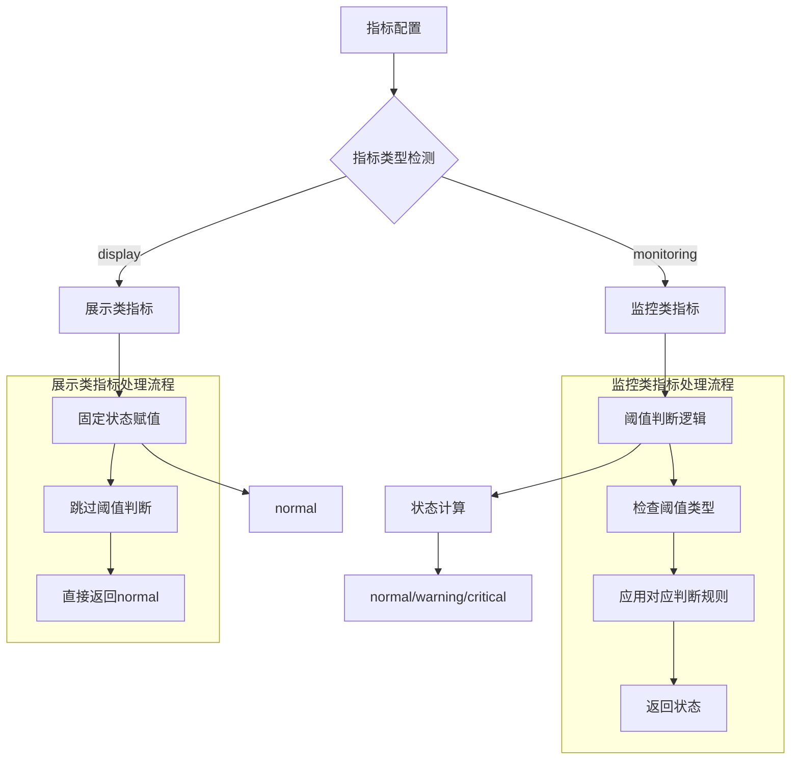
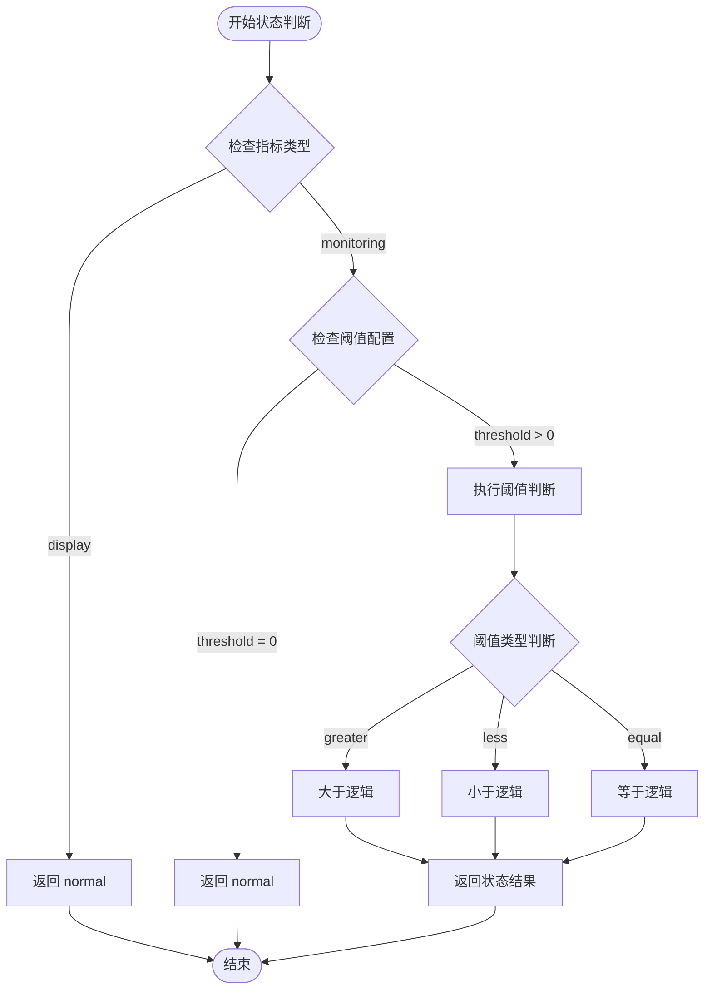
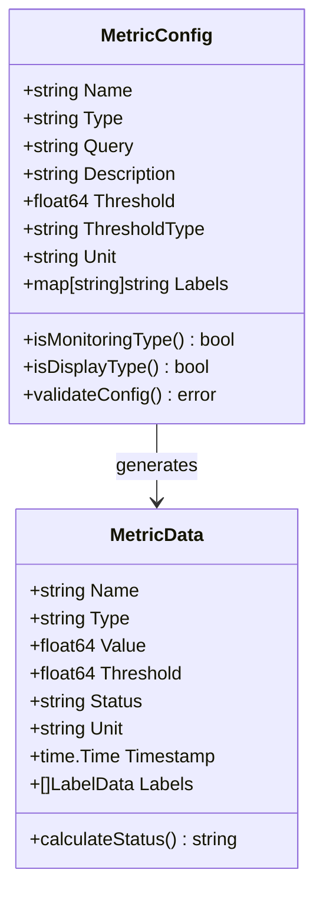
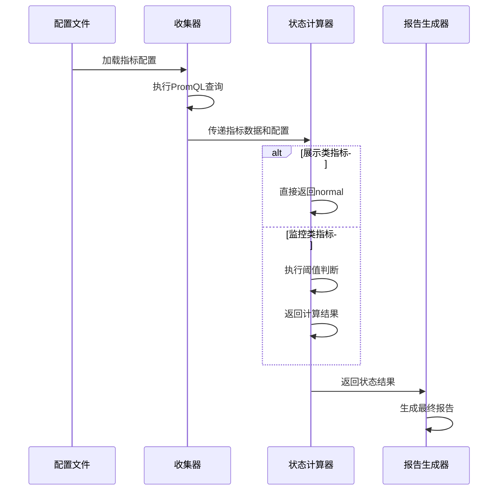

# 指标状态判断逻辑修复设计

## 概述

本设计文档针对 PromAI 项目中指标状态判断逻辑的缺陷进行分析和修复。当前系统存在一个关键问题：某些纯展示类指标（如CPU核心数、内存总量、磁盘可用量等）被错误地应用了阈值判断逻辑，导致这些本应显示为正常状态的指标都被标记为"严重"状态，严重影响了监控报告的准确性和可读性。

## 问题分析

### 当前问题

根据日志输出分析，系统当前存在以下问题：

| 指标名称 | 当前状态 | 期望状态 | 阈值 | 问题描述 |
|---------|---------|---------|------|---------|
| 节点就绪状态 | normal | ✓ | 0 | 正确 |
| Pod运行状态 | critical | ✓ | 1 | 正确 |
| PVC使用率 | normal | ✓ | 90% | 正确 |
| 内存使用量 | critical | normal | 0 | **错误：纯展示指标** |
| 内存总量 | critical | normal | 0 | **错误：纯展示指标** |
| CPU核心数 | critical | normal | 0 | **错误：纯展示指标** |
| 磁盘可用量 | critical | normal | 0 | **错误：纯展示指标** |
| 磁盘使用率 | normal | ✓ | 80% | 正确 |

### 根本原因

1. **配置层面问题**：纯展示类指标在配置中被错误地设置了阈值和阈值类型
2. **逻辑层面问题**：`getStatus` 函数对于阈值为0的指标处理不当
3. **分类缺失**：系统没有区分"监控指标"和"展示指标"两种类型

### 配置文件问题分析

从 `config.yaml` 分析发现：

```yaml
# 问题指标配置示例
- name: "CPU核心数"
  query: "count by (instance) (node_cpu_seconds_total{mode='idle'})"
  description: "节点CPU核心数统计"
  unit: "core"
  # 缺失：threshold 和 threshold_type 配置
  
- name: "内存总量"
  query: "node_memory_MemTotal_bytes"
  description: "节点内存总量统计"
  unit: "B"
  # 缺失：threshold 和 threshold_type 配置
```

当配置中缺失阈值配置时，系统默认设置 `threshold: 0`，并且 `getStatus` 函数默认使用 `"greater"` 类型判断，导致任何大于0的值都被判断为 `critical`。

## 解决方案设计

### 方案架构



### 技术方案

#### 方案一：配置层面解决（推荐）

通过在配置文件中明确标识指标类型来区分监控指标和展示指标：

**配置结构设计：**

| 字段名 | 类型 | 必需 | 描述 | 示例值 |
|--------|------|------|------|-------|
| name | string | ✓ | 指标名称 | "CPU使用率" |
| query | string | ✓ | PromQL查询语句 | "..." |
| type | string | ✓ | 指标类型 | "monitoring" / "display" |
| threshold | float | × | 阈值（仅monitoring类型需要） | 80.0 |
| threshold_type | string | × | 阈值类型（仅monitoring类型需要） | "greater" |
| unit | string | ✓ | 单位 | "%" |

**配置示例：**

```yaml
metrics:
  # 监控类指标
  - name: "CPU使用率"
    type: "monitoring"
    query: "100 - (avg by(instance) (irate(node_cpu_seconds_total{mode='idle'}[5m])) * 100)"
    threshold: 80
    threshold_type: "greater"
    unit: "%"
    
  # 展示类指标
  - name: "CPU核心数"
    type: "display"
    query: "count by (instance) (node_cpu_seconds_total{mode='idle'})"
    unit: "core"
```

#### 方案二：逻辑层面增强

修改 `getStatus` 函数，增加对展示类指标的识别和处理：

**增强的状态判断逻辑：**



### 实施策略

#### 阶段一：配置文件重构

1. **指标分类标识**
   - 为每个指标添加 `type` 字段
   - 区分 `monitoring`（监控类）和 `display`（展示类）

2. **配置验证增强**
   - 监控类指标必须包含 `threshold` 和 `threshold_type`
   - 展示类指标不应包含阈值配置

#### 阶段二：逻辑代码修改

1. **collector.go 修改**
   - 修改 `getStatus` 函数签名，增加 `metricType` 参数
   - 增加展示类指标的特殊处理逻辑

2. **配置结构体更新**
   - 在 `MetricConfig` 结构体中添加 `Type` 字段

#### 阶段三：向后兼容处理

1. **默认值设定**
   - 未配置 `type` 的指标默认为 `monitoring` 类型
   - 保持现有监控指标的行为不变

2. **渐进式迁移**
   - 支持逐步迁移现有配置
   - 提供配置验证工具

## 数据模型设计

### 配置结构体修改



### 状态计算流程



## 实施计划

### 优先级分级

| 优先级 | 任务 | 预估工作量 | 风险等级 |
|--------|------|-----------|---------|
| P0 | 配置文件结构设计和修改 | 2工时 | 低 |
| P0 | getStatus函数逻辑修改 | 3工时 | 中 |
| P1 | 配置验证机制增加 | 2工时 | 低 |
| P1 | 向后兼容性测试 | 4工时 | 中 |
| P2 | 文档更新和示例完善 | 2工时 | 低 |

### 测试验证策略

1. **单元测试**
   - 测试 `getStatus` 函数的各种场景
   - 验证配置解析的正确性

2. **集成测试**
   - 使用真实Prometheus数据进行端到端测试
   - 验证报告生成的正确性

3. **回归测试**
   - 确保现有监控指标行为不变
   - 验证新增展示指标显示正确

## 预期效果

### 修复后的状态预期

| 指标名称 | 修复前状态 | 修复后状态 | 指标类型 |
|---------|-----------|-----------|---------|
| 节点就绪状态 | normal | normal | monitoring |
| Pod运行状态 | critical | critical | monitoring |
| PVC使用率 | normal | normal | monitoring |
| 内存使用量 | critical | **normal** | display |
| 内存总量 | critical | **normal** | display |
| CPU核心数 | critical | **normal** | display |
| 磁盘可用量 | critical | **normal** | display |
| 磁盘使用率 | normal | normal | monitoring |

### 系统改进效果

1. **准确性提升**：消除了纯展示指标的误报告警
2. **可读性增强**：报告中状态显示更加清晰和准确
3. **维护性改善**：配置结构更加清晰，便于后续维护
4. **扩展性增强**：为后续添加新的指标类型提供了基础