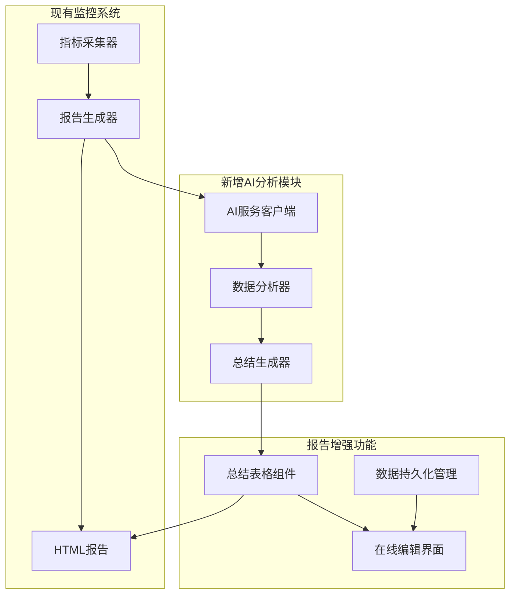
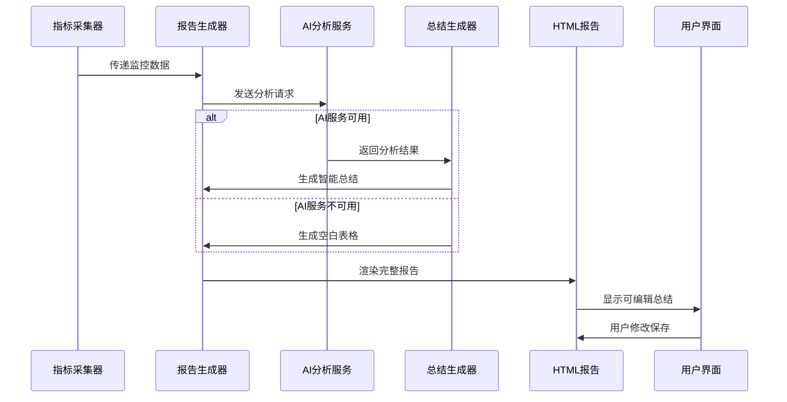
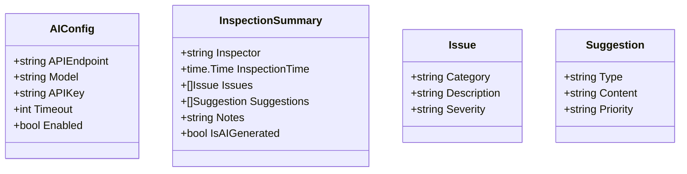
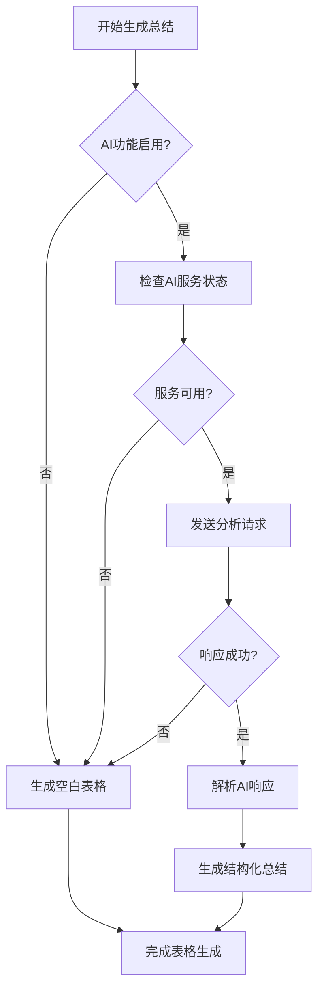
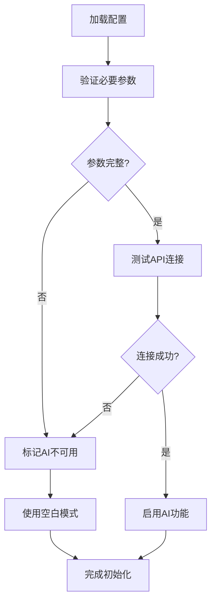

# 项目巡检报告总结功能设计文档

## 概述

本设计文档描述为PromAI项目新增巡检报告总结功能的系统设计。该功能在现有自动化监控报告基础上，集成AI智能分析能力，生成结构化的巡检总结表格，并支持用户在报告页面直接编辑修改。

## 功能目标

- **AI智能总结**：自动分析监控数据并生成巡检总结内容
- **结构化表格**：标准化的巡检信息展示格式
- **在线编辑功能**：支持用户在HTML报告中直接修改总结内容
- **降级机制**：AI服务不可用时提供空白表格供人工填写

## 架构设计

### 系统组件关系



### 数据处理流程



## 详细设计

### AI服务包设计

#### 包结构
```
pkg/ai/
├── client.go      # AI服务客户端
├── analyzer.go    # 数据分析处理
├── summary.go     # 总结内容生成
└── types.go       # 数据类型定义
```

#### 核心数据模型



#### AI客户端接口

| 方法 | 描述 | 输入 | 输出 |
|------|------|------|------|
| AnalyzeMetrics | 分析监控数据 | 监控指标数据 | 分析结果 |
| GenerateSummary | 生成巡检总结 | 报告数据 | 总结内容 |
| ValidateConfig | 验证AI配置 | 配置参数 | 验证结果 |
| HealthCheck | 检查服务状态 | 无 | 健康状态 |

### 总结生成逻辑

#### 生成策略



#### 内容生成规范

**AI生成内容要求**
- 问题描述：每个问题控制在30-50字
- 建议内容：每条建议控制在50-100字
- 问题数量：不超过5个关键问题
- 建议数量：不超过5条可操作建议
- 语言风格：简明扼要，避免技术术语堆砌

**空白表格规范**
- 所有字段默认为空，便于人工填写
- 提供引导性占位符文本
- 显示"AI分析不可用，请手动填写"提示
- 保留"重试AI分析"功能按钮

### 报告模板扩展

#### 总结表格结构

| 字段 | 说明 | AI模式 | 手动模式 |
|------|------|--------|----------|
| 巡检人 | 执行巡检的人员 | "AI智能分析" | 空白 |
| 巡检时间 | 报告生成时间 | 自动填充 | 可编辑 |
| 存在问题 | 发现的关键问题 | AI生成简洁描述 | 空白 |
| 巡检建议 | 改进建议 | AI生成可操作建议 | 空白 |
| 备注 | 补充说明 | 始终空白 | 用户填写 |

#### 前端编辑功能

**交互设计**
- 双击单元格进入编辑模式
- 实时保存到浏览器localStorage
- 提供数据导出功能
- 支持重置为AI建议

**编辑组件架构**


### 配置管理

#### 配置项定义

```yaml
# AI分析配置
ai:
  enabled: true
  api_endpoint: "https://api.siliconflow.cn"
  model: "deepseek-ai/DeepSeek-V3.1"
  api_key: "sk-xxx"
  timeout: 30
  retry_count: 3

# 总结配置
inspection_summary:
  enabled: true
  default_inspector: "系统自动巡检"
  auto_generate: true
  editable: true
```

#### 配置验证流程



## 技术实现要点

### 安全与错误处理

**数据安全**
- API密钥安全存储
- 敏感信息脱敏处理
- 请求频率控制

**容错机制**
- AI服务不可用时自动降级
- 网络超时处理
- 响应格式验证
- 错误日志记录

### 性能优化

**简化策略**
- 取消复杂缓存机制
- AI可用时实时调用
- AI不可用时直接空白
- 前端组件懒加载

### 测试策略

#### 单元测试范围

| 模块 | 测试内容 |
|------|----------|
| AI客户端 | Mock API响应测试 |
| 数据处理 | 序列化反序列化测试 |
| 配置管理 | 参数验证测试 |
| 模板渲染 | HTML生成测试 |

#### 集成测试场景

- 完整报告生成流程
- AI服务集成测试
- 降级机制验证
- 前端编辑功能测试

## 监控与运维

### 关键指标

- AI API调用成功率
- 总结生成成功率
- 用户编辑操作频率
- 系统响应时间

### 日志记录

- AI API调用详细日志
- 总结生成过程日志
- 用户编辑操作审计
- 错误和异常日志

## 扩展性考虑

### 多AI服务支持

**抽象接口设计**
- 统一AI服务接口
- 支持多提供商
- 负载均衡机制
- 故障自动切换

### 个性化配置

**用户定制功能**
- 总结模板自定义
- 分析维度配置
- 输出格式选择
- 字段显示控制

## 实施计划

### 开发阶段

| 阶段 | 内容 | 输出 |
|------|------|------|
| 第一阶段 | AI服务包基础框架 | 接口定义、配置管理 |
| 第二阶段 | 核心分析功能 | AI客户端、总结生成 |
| 第三阶段 | 前端集成 | 编辑界面、数据持久化 |
| 第四阶段 | 测试优化 | 完整测试、性能调优 |

### 部署策略

**环境准备**
- 网络访问AI服务
- API密钥配置
- 依赖包更新

**发布流程**
- 测试环境验证
- 小范围试用
- 全量发布