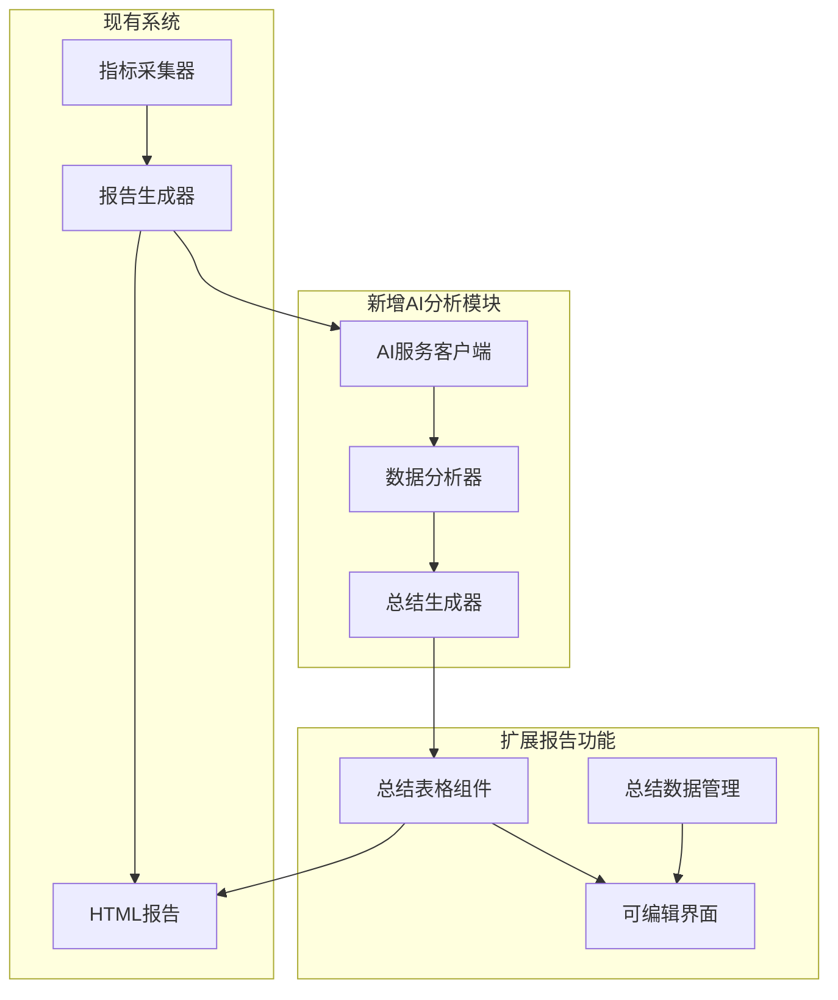
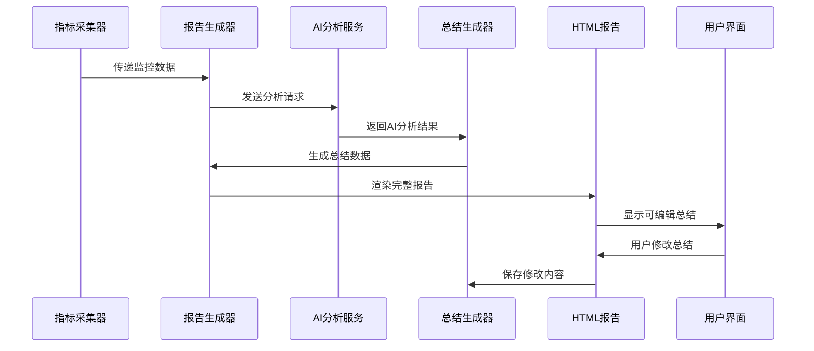
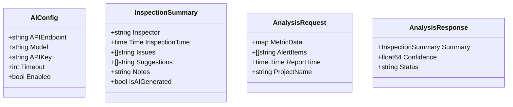
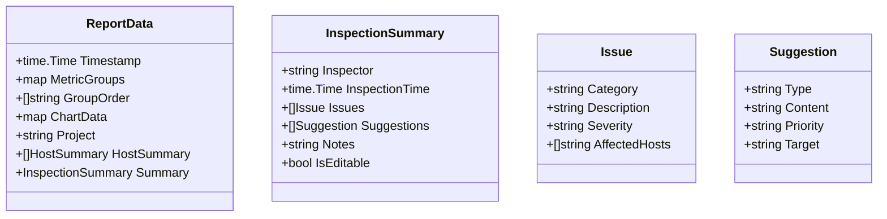
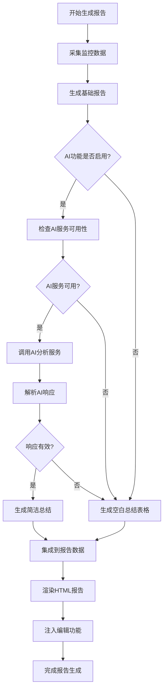
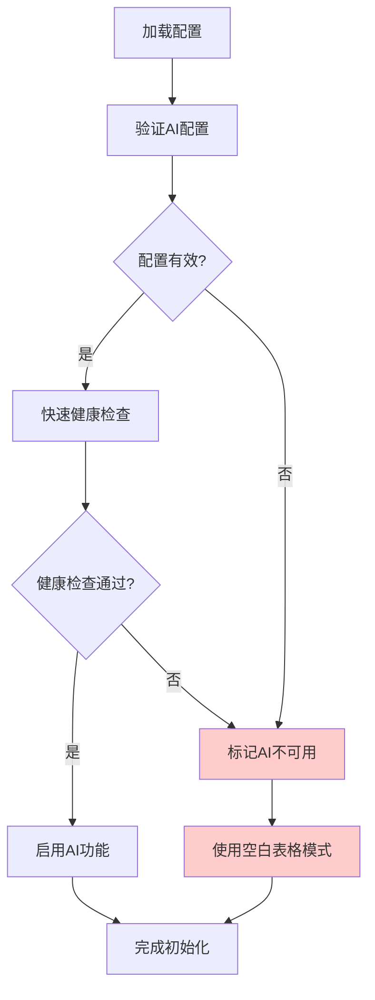
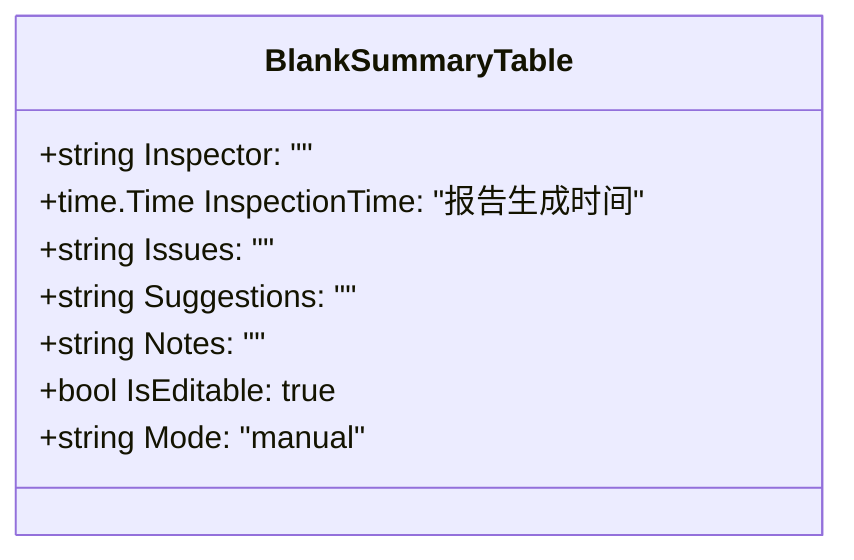

# 项目巡检报告总结功能设计文档

## 概述

本设计文档描述了为PromAI项目新增巡检报告总结功能的系统设计。该功能将在现有监控报告基础上，新增AI智能分析能力，生成结构化的巡检总结表格，并支持用户在报告页面直接编辑修改总结内容。

## 功能目标

1. **巡检总结生成**：在报告末尾新增包含巡检人、巡检时间、存在问题、巡检建议、备注等信息的表格
2. **AI智能分析**：集成AI服务，自动分析巡检结果并生成智能化的总结内容
3. **可编辑界面**：在HTML报告中实现总结表格的在线编辑功能
4. **配置管理**：通过config.yml管理AI服务的相关配置参数

## 架构设计

### 系统组件架构



### 数据流程设计



## 详细设计

### AI服务包设计

#### 包结构
```
pkg/
└── ai/
    ├── client.go      # AI客户端实现
    ├── analyzer.go    # 数据分析器
    ├── summary.go     # 总结生成器
    └── types.go       # 数据类型定义
```

#### 核心数据类型

**AI配置结构**


#### AI客户端接口设计

**核心接口定义**
- `AnalyzeMetrics(data *AnalysisRequest) (*AnalysisResponse, error)` - 分析监控数据
- `GenerateSummary(data *ReportData) (*InspectionSummary, error)` - 生成巡检总结
- `ValidateConfig() error` - 验证AI配置
- `GetHealthStatus() (bool, error)` - 检查AI服务状态

**AI分析输出规范**
- **简洁性原则**：AI生成的总结内容应简明扼要，避免冗长描述
- **结构化输出**：问题描述控制在50字以内，建议内容控制在100字以内
- **关键信息优先**：重点突出严重告警和关键性能指标异常
- **可操作性**：提供具体可执行的建议，避免泛泛而谈

### 报告生成器扩展

#### 总结数据集成

**ReportData结构扩展**


#### 总结生成流程



### HTML报告模板扩展

#### 总结表格设计

**表格结构规范**
- **巡检人**：可编辑文本输入框，AI可用时显示"AI智能分析"，不可用时为空白
- **巡检时间**：自动填充报告生成时间，可编辑
- **存在问题**：多行文本域，AI生成时内容简洁（每个问题不超过50字），不可用时为空白
- **巡检建议**：多行文本域，AI生成时提供具体可操作建议（每条不超过100字），不可用时为空白
- **备注**：自由文本输入区域，始终为空白供用户填写

**AI内容生成规范**
- 问题描述采用"类别-具体问题"格式，如"CPU-使用率超过85%"
- 建议内容采用"建议-具体措施"格式，如"性能优化-检查高CPU进程并优化"
- 避免使用技术术语，使用通俗易懂的语言
- 每个字段内容不超过3-5个要点

#### 可编辑界面实现

**前端功能组件**


**交互设计规范**
- 双击单元格进入编辑模式
- 实时保存编辑内容到浏览器localStorage
- 提供"重置为AI建议"按钮
- 支持表格内容导出为文本格式

### 配置管理扩展

#### config.yml配置项

```yaml
# AI分析配置
ai:
  enabled: true
  api_endpoint: "https://api.siliconflow.cn"
  model: "deepseek-ai/DeepSeek-V3.1"
  api_key: "sk-zhxsbtoajdrpezsnrptxbcqfjthmyyujfswwjxqkanxtwdgqu"
  timeout: 30
  retry_count: 3
  
# 总结配置
inspection_summary:
  enabled: true
  default_inspector: "系统自动巡检"
  auto_generate: true
  editable: true
```

#### 配置验证机制



## 技术实现规范

### AI服务集成

#### API调用规范

**请求格式**
- 使用HTTP POST方法
- Content-Type: application/json
- 包含认证header：Authorization: Bearer {api_key}

**数据处理规范**
- 监控数据预处理：过滤敏感信息，格式化数值
- 响应解析：结构化解析AI返回内容
- 错误处理：网络超时、API限制、解析错误的处理机制

#### 安全考虑

**数据安全**
- API密钥加密存储
- 传输数据脱敏处理
- 请求频率限制

**容错机制**
- AI服务不可用时直接渲染空白表格，供人工填写
- 网络异常或连接超时时跳过AI分析，生成空白模板
- AI响应解析失败时回退到空白表格模式
- 不使用缓存数据，确保每次都是最新的分析结果或空白状态

### 前端实现技术

#### 编辑功能实现

**JavaScript组件设计**
- 使用ContentEditable实现就地编辑
- 实现表格数据的JSON序列化
- 提供数据验证和格式化功能

**用户体验优化**
- 编辑状态的视觉反馈
- 自动保存进度提示
- 键盘快捷键支持

#### 数据持久化

**本地存储策略**
- 使用localStorage保存编辑状态
- 实现增量保存机制
- 提供数据恢复功能

### 性能优化

#### 简化缓存策略

**简化缓存策略**
- AI服务可用时，实时调用生成分析结果，不使用缓存
- AI服务不可用时，直接生成空白表格，不依赖任何历史数据
- 避免复杂的缓存逻辑，确保系统行为清晰可预测

#### 前端性能

**加载优化**
- 分离总结功能的JavaScript代码
- 懒加载编辑相关组件
- 优化表格渲染性能

## 测试策略

### 单元测试

**AI服务测试**
- Mock AI API响应进行单元测试
- 测试不同数据输入的处理结果
- 验证错误场景的处理逻辑

**数据处理测试**
- 总结数据的序列化和反序列化
- 配置解析和验证逻辑
- HTML模板渲染测试

### 集成测试

**端到端测试**
- 完整的报告生成流程测试
- AI服务集成测试
- 前端编辑功能测试

**容错测试**
- AI服务不可用场景
- 网络异常处理
- 数据格式异常处理

## 监控和运维

### 功能监控

**关键指标**
- AI API调用成功率和响应时间
- 总结生成成功率
- 用户编辑操作频率

**日志记录**
- AI API调用详细日志
- 总结生成过程日志
- 用户编辑操作审计日志

### 运维考虑

**配置管理**
- 支持配置热更新
- 提供配置验证工具
- 配置变更的影响评估

**故障恢复**
- AI服务不可用时自动切换到空白表格模式
- 提供AI服务状态指示器
- 支持手动重试AI分析功能

## 扩展性设计

### 降级和空白表格策略

#### 降级触发条件

**自动降级场景**
- AI服务配置不正确或缺失API密钥
- AI API端点无法访问（连接超时、DNS解析失败）
- API调用返回错误状态码（4xx、5xx）
- AI响应格式无法解析或内容为空
- AI服务健康检查失败

#### 空白表格实现

**表格结构**


**渲染规范**
- 所有输入字段默认为空白，便于人工填写
- 保持与AI模式相同的编辑功能
- 在表格上方显示"AI分析不可用，请手动填写"提示
- 提供"重试AI分析"按钮（仅在AI配置正确时显示）

#### 内容生成规范

**AI分析简洁性要求**
- **问题识别**：每个问题描述控制在30-50字以内
- **建议内容**：每条建议控制在50-100字以内
- **要点数量**：问题不超过5个，建议不超过5条
- **语言风格**：使用简明扼要的表述，避免技术术语堆砌
- **优先级排序**：按严重程度和影响范围排序问题和建议

**空白表格交互**
- 当AI不可用时，表格所有字段为空白状态
- 显示引导性占位符文本，如"请填写发现的问题"
- 提供参考格式说明，帮助用户规范填写
- 支持快速模板插入功能

### 多AI服务支持

**服务抽象层**
- 定义统一的AI服务接口
- 支持多个AI服务提供商
- 实现负载均衡和故障转移

### 个性化配置

**用户定制**
- 总结模板自定义
- 分析维度配置
- 输出格式选择

### 数据分析扩展

**高级分析功能**
- 趋势分析和预测
- 异常检测算法
- 自定义分析规则

## 实施计划

### 开发阶段

**第一阶段：基础框架**
1. AI服务包基础结构
2. 配置管理扩展
3. 数据类型定义

**第二阶段：核心功能**
1. AI客户端实现
2. 总结生成逻辑
3. HTML模板扩展

**第三阶段：前端集成**
1. 可编辑表格实现
2. 数据持久化
3. 用户交互优化

**第四阶段：测试和优化**
1. 全面测试覆盖
2. 性能优化
3. 文档完善

### 部署策略

**环境准备**
- 确保网络访问AI服务
- 配置API密钥和权限
- 更新依赖包管理

**灰度发布**
- 先在测试环境验证
- 小范围用户试用
- 收集反馈后全量发布

**监控和维护**
- 建立功能监控体系
- 定期评估AI服务效果
- 持续优化分析算法