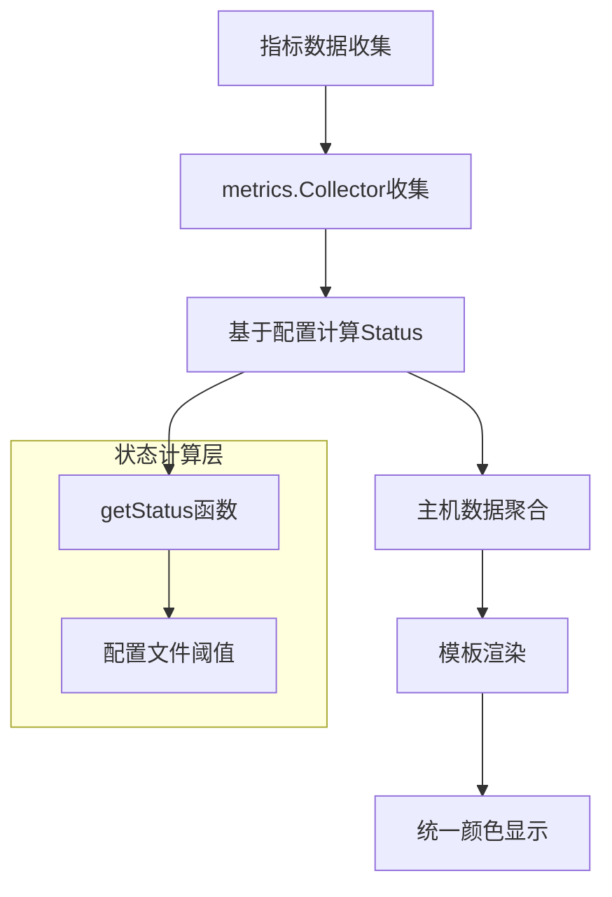

# 报告颜色逻辑调整设计文档

## 概述

当前系统在主机资源综合概览表格中使用硬编码的阈值判断来控制显示颜色，这与其他基础资源使用情况中基于 `MetricData.Status` 的颜色判断方式不一致。本设计旨在统一颜色判断逻辑，确保所有监控指标都基于配置化的阈值和状态进行颜色显示。

## 现状分析

### 当前问题

1. **不一致的颜色判断逻辑**：主机资源综合概览使用硬编码阈值（90%警告，80%严重），而基础资源使用情况基于 `MetricData.Status` 判断
2. **维护困难**：硬编码的阈值无法通过配置文件动态调整，需要修改模板代码
3. **扩展性差**：新增指标类型时需要重复编写硬编码逻辑

### 当前实现方式对比

| 模块 | 颜色判断方式 | 阈值来源 | 可配置性 |
|------|------------|---------|---------|
| 基础资源使用情况 | `MetricData.Status` | 配置文件 | ✅ |
| 主机资源综合概览 | 硬编码阈值判断 | 模板文件 | ❌ |

## 架构设计

### 统一状态判断流程



### 数据结构设计

#### 扩展 HostSummary 结构

为主机汇总数据添加状态信息，使其与单个指标数据保持一致：

| 字段名 | 类型 | 描述 | 状态来源 |
|--------|------|------|---------|
| CPUStatus | string | CPU使用率状态 | 基于CPU使用率指标配置 |
| MemStatus | string | 内存使用率状态 | 基于内存使用率指标配置 |
| DiskStatus | string | 磁盘使用率状态 | 基于磁盘使用率指标配置 |

#### 扩展 DiskInfo 结构

为磁盘信息添加状态字段：

| 字段名 | 类型 | 描述 |
|--------|------|------|
| Status | string | 磁盘使用率状态 |

## 实现方案

### 方案一：数据聚合阶段状态传递

在 `GenerateReport` 函数的主机数据聚合过程中，将原始指标的状态信息传递到主机汇总数据中。

#### 核心逻辑

1. **状态映射**：在聚合主机数据时，查找对应的 `MetricData` 并获取其 `Status`
2. **状态继承**：将指标状态赋值给主机汇总数据的相应字段
3. **模板简化**：模板中使用状态字段而非硬编码阈值

#### 状态匹配规则

| 指标名称 | 主机字段 | 状态字段 |
|----------|---------|---------|
| CPU使用率 | CPUUsage | CPUStatus |
| 内存使用率 | MemUsage | MemStatus |
| 磁盘使用率 | DiskUsage | DiskStatus |

### 方案二：模板函数扩展

通过模板函数的方式，在渲染阶段动态获取状态信息。

#### 模板函数设计

```go
funcMap := template.FuncMap{
    "formatBytes": formatBytes,
    "getResourceStatus": getResourceStatus,
}
```

#### 函数签名

| 函数名 | 参数 | 返回值 | 描述 |
|--------|------|-------|------|
| getResourceStatus | (metricName, instance, value) | string | 根据指标名称和实例获取状态 |

## 推荐方案

**采用方案一：数据聚合阶段状态传递**

### 优势分析

1. **性能优良**：在数据聚合阶段完成状态计算，避免模板渲染时重复计算
2. **逻辑清晰**：状态计算集中在数据层，模板只负责展示
3. **易于维护**：状态逻辑统一管理，修改配置即可调整所有相关显示

### 实现步骤

#### 第一步：扩展数据结构

为 `HostSummary` 和 `DiskInfo` 结构添加状态字段，确保状态信息能够传递到模板层。

#### 第二步：增强数据聚合逻辑

在主机数据聚合过程中，建立指标名称到主机字段的映射关系，将 `MetricData.Status` 传递到相应的状态字段。

#### 第三步：重构模板逻辑

将模板中的硬编码阈值判断替换为基于状态字段的判断，使用统一的状态类名。

### 状态传递映射表

| 源指标名称 | 目标字段 | 状态字段 | 判断逻辑 |
|-----------|---------|---------|---------|
| CPU使用率 | CPUUsage | CPUStatus | 基于 threshold_type: greater |
| 内存使用率 | MemUsage | MemStatus | 基于 threshold_type: greater |
| 磁盘使用率 | DiskUsage | DiskStatus | 基于 threshold_type: greater |

## 配置一致性保证

### 指标配置验证

确保主机资源相关指标在配置文件中正确定义：

| 指标类型 | 必需指标 | 配置要求 |
|----------|---------|---------|
| 基础资源使用情况 | CPU使用率、内存使用率 | 必须配置 threshold 和 threshold_type |
| 存储资源监控 | 磁盘使用率 | 必须配置 threshold 和 threshold_type |

### 状态枚举标准

| 状态值 | CSS类名 | 颜色表现 | 触发条件 |
|--------|---------|---------|---------|
| normal | - | 默认颜色 | 值在正常范围内 |
| warning | warning | 黄色背景 | 值接近阈值 |
| critical | critical | 红色背景 | 值超出阈值 |

## 模板重构设计

### 状态驱动的颜色显示

```html
<td class="{{$host.CPUStatus}}">
    {{printf "%.2f%%" $host.CPUUsage}}
</td>
```

### 行级状态判断

基于多个状态字段的组合判断：

```html
<tr class="{{if or (eq $host.CPUStatus "critical") (eq $host.MemStatus "critical") (eq $disk.Status "critical")}}critical{{else if or (eq $host.CPUStatus "warning") (eq $host.MemStatus "warning") (eq $disk.Status "warning")}}warning{{end}}">
```

## 向后兼容性

### 数据结构兼容

新增的状态字段为可选字段，确保现有数据结构不受影响。

### 配置文件兼容

利用现有的指标配置，无需修改配置文件结构。

### 模板回退机制

当状态字段为空时，保持当前显示逻辑不变，确保系统稳定运行。

## 测试策略

### 功能测试用例

| 测试场景 | 输入条件 | 期望结果 |
|----------|---------|---------|
| 正常状态显示 | CPU使用率 < 阈值*0.8 | 显示默认颜色 |
| 警告状态显示 | 阈值*0.8 ≤ CPU使用率 < 阈值 | 显示黄色背景 |
| 严重状态显示 | CPU使用率 ≥ 阈值 | 显示红色背景 |
| 配置变更响应 | 修改阈值配置 | 颜色显示相应调整 |

### 集成测试验证

1. **数据一致性**：验证主机概览与基础资源指标的状态一致性
2. **配置响应性**：验证配置文件修改后的色彩变化
3. **性能影响**：确保状态传递不影响报告生成性能