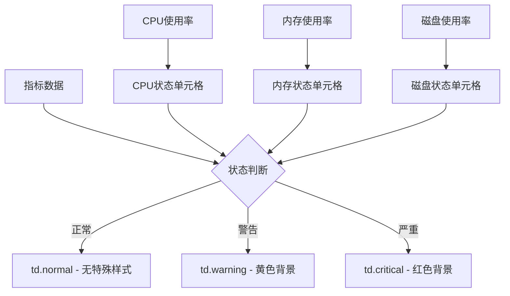
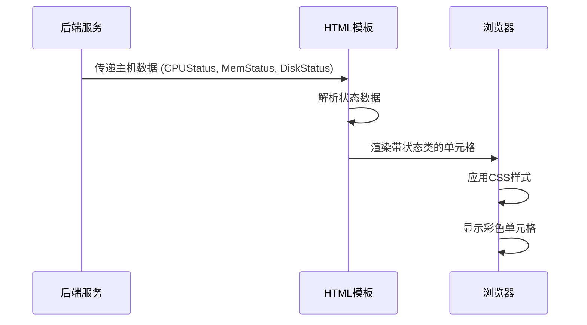

# 表格颜色逻辑优化设计

## 概述

当前 PromAI 监控系统的主机资源综合表格使用整行颜色高亮来显示告警状态，但这种显示方式存在逻辑不合理的问题。例如，当只有内存使用率达到告警阈值时，整行都会显示告警颜色，包括正常的 CPU 使用率和磁盘使用率，造成视觉混淆。

本设计文档旨在优化表格颜色逻辑，改为针对具体的指标单元格进行颜色标识，使告警状态展示更加精准和直观。

## 当前状态分析

### 现有颜色逻辑问题

1. **整行颜色渲染**：当前实现通过 `<tr>` 标签的 `class` 属性设置整行背景色
2. **状态混淆**：单个指标异常导致整行标红，误导用户对其他正常指标的判断
3. **信息精度低**：无法快速定位具体的问题指标

### 技术现状

基于附件文件 `report.html` 的分析，当前实现包含：

- CSS 样式：定义了 `tr.critical` 和 `tr.warning` 的整行背景色
- HTML 模板：在 `<tr>` 标签上应用状态类名
- 状态判断：基于 CPU、内存、磁盘状态的组合逻辑

## 设计目标

### 核心目标

1. **精准告警展示**：只对异常的指标单元格进行颜色标识
2. **保持视觉一致性**：维持现有的颜色方案和视觉风格
3. **提升用户体验**：让用户能够快速识别具体的问题指标
4. **向后兼容**：确保改动不影响其他功能模块

### 设计原则

- **单元格级别控制**：颜色标识精确到具体的数据单元格
- **渐进式增强**：在现有基础上优化，避免大规模重构
- **响应式兼容**：确保在不同屏幕尺寸下都能正常显示

## 架构设计

### 颜色状态映射



### 样式层次结构

| 层级 | 元素 | 作用 | 优先级 |
|------|------|------|--------|
| 1 | `table` | 基础表格样式 | 低 |
| 2 | `tr` | 行级别样式（移除状态类） | 中 |
| 3 | `td` | 单元格基础样式 | 中 |
| 4 | `td.status` | 状态相关单元格样式 | 高 |

### 模板结构调整

针对主机资源综合表格的模板调整策略：

1. **移除行级状态**：删除 `<tr>` 标签上的状态类名
2. **添加单元格状态**：在相应的 `<td>` 标签上应用状态类名
3. **保持数据完整性**：确保所有数据字段正常显示

## 实现策略

### CSS 样式优化

#### 新增单元格状态样式

```css
/* 单元格级别的状态样式 */
td.critical {
    background-color: #ffe6e6 !important;
    color: #e60e24;
    font-weight: bold;
}

td.warning {
    background-color: #fff3cd !important;
    color: #f3a807;
    font-weight: bold;
}

td.normal {
    /* 保持默认样式 */
}
```

#### 移除行级状态样式

将现有的 `tr.critical` 和 `tr.warning` 样式转换为单元格级别应用。

### HTML 模板重构

#### 主机资源表格优化

调整模板逻辑，将状态类从 `<tr>` 移动到具体的指标 `<td>`：

- CPU 使用率单元格：应用 `{{$host.CPUStatus}}` 类名
- 内存使用率单元格：应用 `{{$host.MemStatus}}` 类名  
- 磁盘使用率单元格：应用 `{{$disk.Status}}` 类名

#### 状态判断逻辑

保持后端状态判断逻辑不变，仅调整前端展示方式：

| 状态值 | 显示文本 | CSS 类名 | 背景色 |
|--------|----------|----------|--------|
| normal | 正常 | `normal` | 默认 |
| warning | 警告 | `warning` | 黄色 (#fff3cd) |
| critical | 严重 | `critical` | 红色 (#ffe6e6) |

### 兼容性考虑

#### 响应式设计

确保单元格级别的颜色标识在移动端和小屏幕设备上仍然清晰可见：

- 保持现有的响应式布局
- 确保颜色对比度满足可访问性要求
- 在横向滚动时保持状态颜色显示

#### 浏览器兼容性

使用标准 CSS 属性，确保在主流浏览器中正常显示：

- 使用 `!important` 确保样式优先级
- 避免使用实验性 CSS 特性
- 提供合理的降级方案

## 数据流程

### 状态数据处理



### 模板数据结构

主机资源数据结构保持不变，仅调整模板中的状态应用方式：

```go
type HostSummary struct {
    IP           string
    CPUCount     float64
    CPUUsage     float64
    CPUStatus    string    // "normal", "warning", "critical"
    MemTotal     int64
    MemUsed      int64
    MemUsage     float64
    MemStatus    string    // "normal", "warning", "critical"
    DiskData     []DiskInfo
    Timestamp    time.Time
}

type DiskInfo struct {
    MountPoint   string
    DiskTotal    int64
    DiskUsed     int64
    DiskUsage    float64
    Status       string    // "normal", "warning", "critical"
}
```

## 用户体验改进

### 视觉效果增强

1. **清晰的状态区分**：用户可以立即识别哪个具体指标存在问题
2. **减少认知负荷**：避免整行标红造成的信息噪音
3. **提高扫描效率**：快速定位问题区域

### 交互设计

虽然本次设计主要关注静态展示，但为未来交互增强预留空间：

- 单元格悬停效果
- 点击单元格查看详细信息
- 状态变化动画效果

## 测试策略

### 视觉验证

1. **正常场景**：所有指标正常时，表格应无特殊颜色标识
2. **单一告警**：仅 CPU 异常时，只有 CPU 使用率单元格标红
3. **多重告警**：CPU 和内存同时异常时，对应单元格分别标色
4. **混合状态**：不同主机不同状态的混合场景

### 兼容性测试

1. **浏览器测试**：Chrome、Firefox、Safari、Edge
2. **设备测试**：桌面端、平板、手机
3. **分辨率测试**：不同屏幕分辨率下的显示效果

### 性能影响

颜色逻辑调整不会影响系统性能：

- 无额外的数据查询
- 无复杂的计算逻辑
- 仅涉及前端样式调整

## 维护考虑

### 代码维护性

1. **样式集中管理**：将状态相关样式集中定义
2. **命名规范**：使用语义化的 CSS 类名
3. **文档更新**：更新相关技术文档

### 扩展性

设计支持未来可能的需求扩展：

- 新增状态类型（如"未知"状态）
- 自定义颜色主题
- 更细粒度的状态分级

## 实施影响

### 影响范围

- **主要影响**：主机资源综合表格的显示逻辑
- **次要影响**：相关的 CSS 样式文件
- **无影响**：后端数据处理逻辑、其他模板文件

### 风险评估

| 风险类型 | 风险等级 | 缓解措施 |
|----------|----------|----------|
| 样式冲突 | 低 | 使用 `!important` 确保优先级 |
| 兼容性问题 | 低 | 充分的浏览器测试 |
| 用户适应 | 低 | 更直观的展示方式 |

### 回滚方案

如果新的颜色逻辑出现问题，可以快速回滚到原有实现：

1. 恢复 `<tr>` 标签上的状态类
2. 移除单元格级别的状态类
3. 恢复原有的 CSS 样式定义