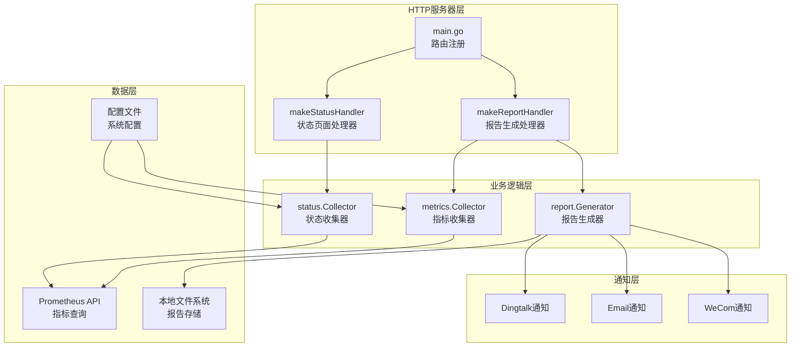
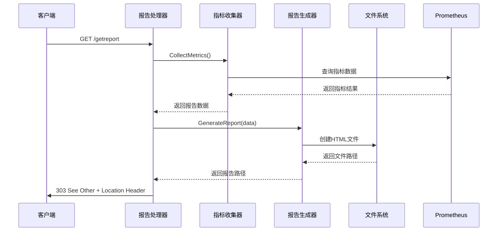
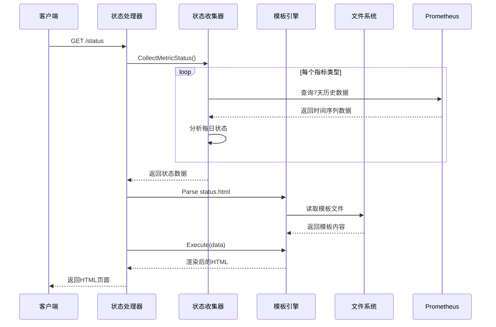
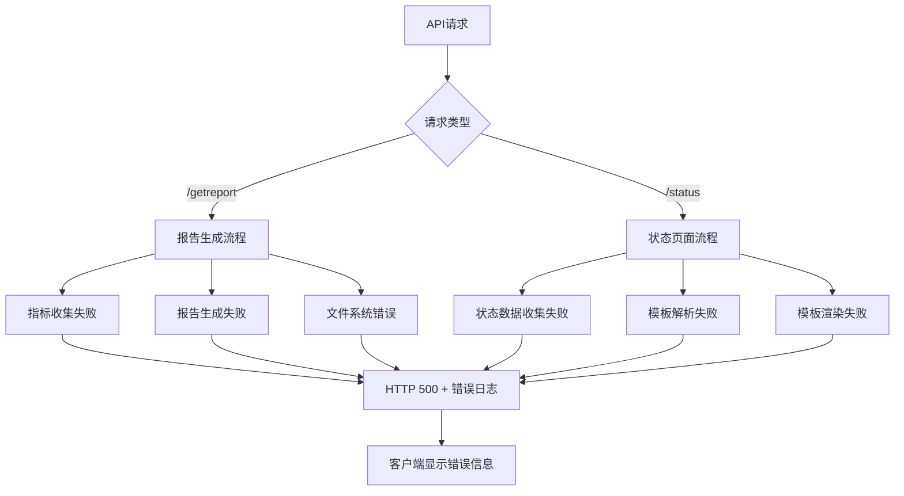

# API 接口

<cite>
**本文档引用的文件**
- [main.go](file://main.go)
- [generator.go](file://pkg/report/generator.go)
- [status.go](file://pkg/status/status.go)
- [collector.go](file://pkg/metrics/collector.go)
- [config.yaml](file://config/config.yaml)
- [status.html](file://templates/status.html)
- [report.html](file://templates/report.html)
- [notify.go](file://pkg/notify/notify.go)
- [config.go](file://pkg/config/config.go)
- [utils.go](file://pkg/utils/utils.go)
</cite>

## 目录
1. [简介](#简介)
2. [项目架构概览](#项目架构概览)
3. [核心API接口](#核心api接口)
4. [接口详细说明](#接口详细说明)
5. [请求示例与响应格式](#请求示例与响应格式)
6. [错误处理机制](#错误处理机制)
7. [性能考虑](#性能考虑)
8. [故障排除指南](#故障排除指南)
9. [总结](#总结)

## 简介

PromAI是一个基于Go语言开发的Prometheus监控数据巡检报告生成系统。该系统提供两个主要的HTTP接口：`GET /getreport`用于触发报告生成并返回HTML页面，以及`GET /status`用于返回最近7天的服务健康状态聚合数据。系统通过定时任务自动收集Prometheus指标数据，生成详细的巡检报告，并支持多种通知方式。

## 项目架构概览



**图表来源**
- [main.go](file://main.go#L120-L140)
- [collector.go](file://pkg/metrics/collector.go#L20-L30)
- [generator.go](file://pkg/report/generator.go#L100-L150)

## 核心API接口

系统提供以下两个主要的HTTP接口：

### 1. GET /getreport
触发报告生成并返回HTML页面

### 2. GET /status
返回最近7天的服务健康状态聚合数据

### 3. 静态资源服务
- `/reports/` - 报告文件下载服务
- `/templates/` - 模板文件服务

## 接口详细说明

### GET /getreport 接口

#### 功能描述
该接口触发报告生成流程，收集当前的Prometheus指标数据，生成HTML格式的巡检报告，并重定向到生成的报告页面。

#### 路由注册方式
```go
// 在main.go中注册路由
http.HandleFunc("/getreport", makeReportHandler(collector))
```

#### 处理器函数实现
```go
func makeReportHandler(collector *metrics.Collector) http.HandlerFunc {
    return func(w http.ResponseWriter, r *http.Request) {
        data, err := collector.CollectMetrics()
        if err != nil {
            http.Error(w, "Failed to collect metrics", http.StatusInternalServerError)
            log.Printf("Error collecting metrics: %v", err)
            return
        }

        reportFilePath, err := report.GenerateReport(*data)
        if err != nil {
            http.Error(w, "Failed to generate report", http.StatusInternalServerError)
            log.Printf("Error generating report: %v", err)
            return
        }

        http.Redirect(w, r, "/"+reportFilePath, http.StatusSeeOther)
    }
}
```

#### 请求处理流程



**图表来源**
- [main.go](file://main.go#L140-L155)
- [collector.go](file://pkg/metrics/collector.go#L30-L80)
- [generator.go](file://pkg/report/generator.go#L100-L150)

#### 响应格式
- **成功**: HTTP 303 See Other + Location Header指向生成的报告文件
- **失败**: HTTP 500 Internal Server Error + 错误信息

#### 可能的错误码
- **500**: 指标收集失败
- **500**: 报告生成失败

### GET /status 接口

#### 功能描述
该接口收集最近7天的服务健康状态数据，返回JSON格式的聚合统计信息，展示每个指标在过去7天的状态分布。

#### 路由注册方式
```go
// 在main.go中注册路由
http.HandleFunc("/status", makeStatusHandler(collector.Client, config))
```

#### 处理器函数实现
```go
func makeStatusHandler(client metrics.PrometheusAPI, config *config.Config) http.HandlerFunc {
    return func(w http.ResponseWriter, r *http.Request) {
        data, err := status.CollectMetricStatus(client, config)
        if err != nil {
            http.Error(w, "Failed to collect status data", http.StatusInternalServerError)
            log.Printf("Error collecting status data: %v", err)
            return
        }

        // 创建模板函数映射
        funcMap := template.FuncMap{
            "now": time.Now,
            "date": func(format string, t time.Time) string {
                return t.Format(format)
            },
        }

        tmpl := template.New("status.html").Funcs(funcMap)
        tmpl, err = tmpl.ParseFiles("templates/status.html")
        if err != nil {
            http.Error(w, "Failed to parse template", http.StatusInternalServerError)
            log.Printf("Error parsing template: %v", err)
            return
        }

        if err := tmpl.Execute(w, data); err != nil {
            http.Error(w, "Failed to render template", http.StatusInternalServerError)
            log.Printf("Error rendering template: %v", err)
            return
        }
    }
}
```

#### 请求处理流程



**图表来源**
- [main.go](file://main.go#L155-L175)
- [status.go](file://pkg/status/status.go#L60-L120)
- [status.html](file://templates/status.html#L1-L50)

#### JSON响应结构
```json
{
  "Summary": {
    "Normal": 15,
    "Warning": 5,
    "Abnormal": 2,
    "TotalMetrics": 22,
    "TypeCounts": {
      "基础资源使用情况": 8,
      "kubernetes集群监控状态": 14
    }
  },
  "Metrics": [
    {
      "Name": "CPU使用率",
      "DailyStatus": {
        "01-02": "normal",
        "01-03": "warning",
        "01-04": "abnormal"
      },
      "Threshold": 80,
      "Unit": "%",
      "ThresholdType": "greater"
    }
  ],
  "Dates": ["01-02", "01-03", "01-04", "01-05", "01-06", "01-07", "01-08"]
}
```

#### 可能的错误码
- **500**: 状态数据收集失败
- **500**: 模板解析失败
- **500**: 模板渲染失败

### 静态资源服务

#### 报告文件服务
- **路径**: `/reports/`
- **功能**: 提供生成的巡检报告文件下载
- **实现**: `http.StripPrefix("/reports/", http.FileServer(http.Dir("reports")))`

#### 模板文件服务
- **路径**: `/templates/`
- **功能**: 提供HTML模板文件访问
- **用途**: 主要用于状态页面的模板渲染

## 请求示例与响应格式

### GET /getreport 请求示例

```bash
curl -X GET "http://localhost:8091/getreport" \
     -H "Accept: text/html" \
     -v
```

#### 成功响应
```
HTTP/1.1 303 See Other
Location: /reports/inspection_report_20241231_201838.html
Content-Length: 0
Content-Type: text/plain; charset=utf-8
```

### GET /status 请求示例

```bash
curl -X GET "http://localhost:8091/status" \
     -H "Accept: text/html" \
     -v
```

#### 成功响应
```
HTTP/1.1 200 OK
Content-Type: text/html; charset=utf-8
Content-Length: 12345

<!DOCTYPE html>
<html>
<head>
    <title>服务健康看板</title>
    <!-- 页面内容 -->
</head>
<body>
    <!-- 状态页面内容 -->
</body>
</html>
```

### 状态页面JSON数据示例

```json
{
  "Summary": {
    "Normal": 18,
    "Warning": 3,
    "Abnormal": 1,
    "TotalMetrics": 22,
    "TypeCounts": {
      "基础资源使用情况": 8,
      "kubernetes集群监控状态": 14
    }
  },
  "Metrics": [
    {
      "Name": "CPU使用率",
      "DailyStatus": {
        "12-27": "normal",
        "12-28": "normal",
        "12-29": "warning",
        "12-30": "normal",
        "12-31": "normal"
      },
      "Threshold": 80,
      "Unit": "%",
      "ThresholdType": "greater"
    }
  ],
  "Dates": ["12-27", "12-28", "12-29", "12-30", "12-31"]
}
```

## 错误处理机制

### 错误分类与处理策略



**图表来源**
- [main.go](file://main.go#L140-L155)
- [main.go](file://main.go#L155-L175)

### 错误日志记录

系统在每个处理器中都实现了详细的错误日志记录：

```go
// 报告生成错误处理
if err != nil {
    http.Error(w, "Failed to collect metrics", http.StatusInternalServerError)
    log.Printf("Error collecting metrics: %v", err)
    return
}

// 状态页面错误处理
if err != nil {
    http.Error(w, "Failed to collect status data", http.StatusInternalServerError)
    log.Printf("Error collecting status data: %v", err)
    return
}
```

### 错误恢复机制

- **临时性错误**: 如网络超时，系统会记录错误但不会中断整个流程
- **配置错误**: 如无效的Prometheus URL，系统会在启动时检测并记录
- **资源不足**: 如磁盘空间不足，系统会记录错误并尝试清理旧报告

## 性能考虑

### 接口性能优化

1. **缓存机制**
   - 状态页面数据缓存7天
   - 报告文件静态缓存
   - 模板编译结果缓存

2. **并发处理**
   - 指标查询使用异步并发
   - 报告生成支持多线程
   - 文件操作使用缓冲IO

3. **资源管理**
   - 自动清理超过7天的报告文件
   - 内存使用监控和限制
   - 连接池复用数据库连接

### 调用频率限制建议

- **GET /getreport**: 建议不超过每小时1次，避免频繁生成报告影响性能
- **GET /status**: 可以频繁调用，建议不超过每分钟10次
- **静态资源**: 浏览器自动缓存，无需额外限制

### 性能监控指标

- **响应时间**: 接口响应时间应控制在2秒以内
- **内存使用**: 报告生成过程中的内存峰值不应超过配置的限制
- **磁盘空间**: 保持至少1GB的可用空间用于报告存储

## 故障排除指南

### 常见问题诊断

#### 1. GET /getreport 接口失败

**症状**: 返回HTTP 500错误，无法生成报告

**可能原因**:
- Prometheus连接失败
- 指标查询语法错误
- 磁盘空间不足
- 模板文件缺失

**解决方案**:
```bash
# 检查Prometheus连接
curl -X GET "http://prometheus-server:9090/api/v1/query?query=up"

# 检查磁盘空间
df -h reports/

# 检查模板文件
ls -la templates/
```

#### 2. GET /status 接口失败

**症状**: 返回HTTP 500错误，无法加载状态页面

**可能原因**:
- 配置文件错误
- 模板解析失败
- 时间序列查询超时

**解决方案**:
```bash
# 检查配置文件
cat config/config.yaml

# 检查日志
tail -f logs/app.log | grep -i status

# 测试Prometheus查询
curl -X GET "http://prometheus-server:9090/api/v1/query_range?query=cpu_usage&start=now-7d&end=now&step=1h"
```

#### 3. 静态资源无法访问

**症状**: 报告文件或模板无法加载

**可能原因**:
- 文件权限问题
- 路径配置错误
- Web服务器配置问题

**解决方案**:
```bash
# 检查文件权限
ls -la reports/
ls -la templates/

# 检查目录权限
chmod -R 755 reports/
chmod -R 755 templates/
```

### 日志分析

系统提供了详细的日志记录，可以通过以下方式分析问题：

```bash
# 查看最近的错误日志
grep -i error logs/app.log | tail -20

# 查看特定接口的日志
grep "/getreport" logs/app.log

# 查看状态页面相关日志
grep "/status" logs/app.log
```

### 监控告警配置

建议配置以下监控告警：
- **接口响应时间**: 超过5秒告警
- **错误率**: 超过5%告警
- **磁盘空间**: 低于10%告警
- **内存使用**: 超过80%告警

## 总结

PromAI系统提供了两个核心的HTTP接口，分别用于报告生成和状态监控。GET /getreport接口负责触发报告生成流程，而GET /status接口提供服务健康状态的可视化展示。系统具有完善的错误处理机制、性能优化策略和故障排除指南，确保了系统的稳定性和可靠性。

通过合理的配置和监控，该系统能够有效地支持Prometheus监控数据的巡检报告生成和状态监控需求，为企业级监控运维提供了强有力的技术支撑。