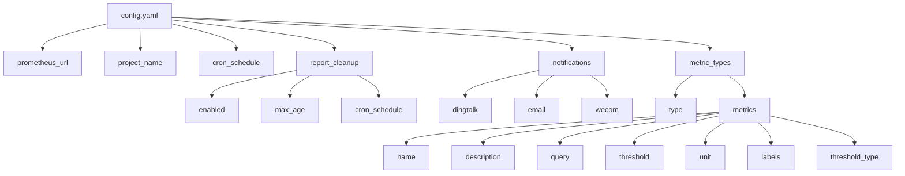
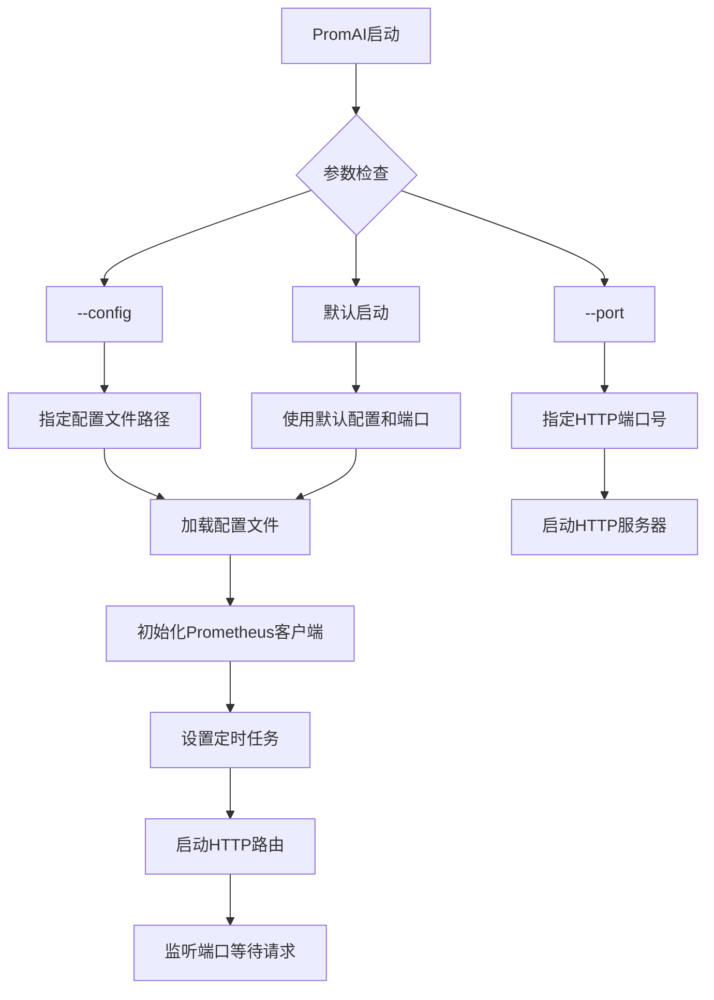

# 快速开始

<cite>
**本文档中引用的文件**
- [README.md](file://README.md)
- [main.go](file://main.go)
- [config/config.yaml](file://config/config.yaml)
- [pkg/config/config.go](file://pkg/config/config.go)
- [deploy/deployment.yaml](file://deploy/deployment.yaml)
- [Dockerfile](file://Dockerfile)
- [pkg/prometheus/client.go](file://pkg/prometheus/client.go)
- [pkg/metrics/collector.go](file://pkg/metrics/collector.go)
- [pkg/report/generator.go](file://pkg/report/generator.go)
</cite>

## 目录
1. [项目简介](#项目简介)
2. [系统环境要求](#系统环境要求)
3. [快速部署指南](#快速部署指南)
4. [配置文件详解](#配置文件详解)
5. [启动服务与访问](#启动服务与访问)
6. [常见问题解决](#常见问题解决)
7. [总结](#总结)

## 项目简介

PromAI是一个基于Prometheus的监控报告自动生成工具，能够自动收集、分析指标数据并生成可视化的HTML报告。该工具旨在简化监控数据的收集和展示过程，帮助运维人员快速了解系统状态。

### 主要功能特性

- 支持多种指标类型的监控（基础资源、Kubernetes、应用服务等）
- 自动计算指标状态和告警级别（正常、警告、严重）
- 生成包含数据表格和图表的HTML报告
- 支持自定义指标阈值和标签别名
- 灵活的配置文件系统
- 支持多维度数据分析和展示
- 自动计算关键统计指标（最大值、最小值、平均值等）
- 美观的可视化界面，支持响应式布局

## 系统环境要求

### 基础环境

- **Go版本**: 1.22 或更高版本
- **操作系统**: 支持Linux、Windows、macOS
- **内存要求**: 至少512MB可用内存
- **磁盘空间**: 50MB可用磁盘空间
- **网络要求**: 可访问的Prometheus服务器

### 依赖组件

- **Prometheus服务器**: 需要预先部署并配置好监控指标
- **现代浏览器**: 支持HTML5和JavaScript的浏览器（Chrome、Firefox、Edge等）

## 快速部署指南

### 方法一：源码编译部署

#### 1. 克隆代码仓库

```bash
git clone https://github.com/kubehan/PromAI.git
cd PromAI
```

#### 2. 安装Go模块依赖

```bash
go mod download
```

#### 3. 编译应用程序

```bash
go build -o PromAI main.go
```

#### 4. 启动服务

```bash
./PromAI -config config/config.yaml
```

### 方法二：Docker容器部署

#### 1. 拉取镜像

```bash
docker pull kubehan/promai:latest
```

#### 2. 运行容器

```bash
docker run -d \
  --name PromAI \
  -p 8091:8091 \
  -v $(pwd)/config:/app/config \
  -v $(pwd)/reports:/app/reports \
  kubehan/promai:latest
```

#### 3. 验证容器运行

```bash
docker ps | grep PromAI
```

### 方法三：Kubernetes部署

#### 1. 应用部署清单

```bash
kubectl apply -f deploy/deployment.yaml
```

#### 2. 查看部署状态

```bash
kubectl get pods -n promai
kubectl get svc -n promai
```

#### 3. 访问服务

```bash
# 获取服务端口
kubectl get svc -n promai promai -o jsonpath='{.spec.ports[0].nodePort}'
```

## 配置文件详解

### 配置文件位置

默认配置文件路径：`config/config.yaml`

### 配置结构说明



**图表来源**
- [config/config.yaml](file://config/config.yaml#L1-L196)
- [pkg/config/config.go](file://pkg/config/config.go#L1-L37)

### Prometheus配置

```yaml
prometheus_url: "http://prometheus.k8s.kubehan.cn"
```

**修改步骤**：
1. 打开`config/config.yaml`文件
2. 将`prometheus_url`修改为您自己的Prometheus服务器地址
3. 保存文件

### 定时任务配置

```yaml
cron_schedule: "30 9,17 * * *"
```

**说明**：
- 每天9点半和17点半执行报告生成任务
- 支持标准Cron表达式格式

### 报告清理配置

```yaml
report_cleanup:
  enabled: true
  max_age: 7
  cron_schedule: "0 0 * * *"
```

**参数说明**：
- `enabled`: 是否启用报告自动清理
- `max_age`: 保留最近多少天的报告
- `cron_schedule`: 清理任务执行时间

### 通知配置

#### 钉钉通知

```yaml
notifications:
  dingtalk:
    enabled: false
    webhook: "https://oapi.dingtalk.com/robot/send?access_token=xxxxxxxxxxxxxxxxxxxxxxxxxxxx"
    secret: "xxxxxxxxxxxxxxxxxxxxxxxxxxxxxxxxxxxx"
    report_url: "http://10.1.114.49:8091"
```

#### 企业微信通知

```yaml
  wecom:
    enabled: true
    webhook: "https://qyapi.weixin.qq.com/cgi-bin/webhook/send?key=1df4d960-b7a7-43d6-9793-59f9e460c1d8"
    report_url: "http://10.1.114.66:8091"
    project_title: "测试项目"
```

#### 邮件通知

```yaml
  email:
    enabled: false
    smtp_host: "smtp.exmail.qq.com"
    smtp_port: 465
    username: "demo@demo.cn"
    password: "xxxxxxxxxxxxxxxxxxxx"
    from: "demo@demo.cn"
    to:
      - "demo@demo.cn"
    report_url: "https://promai.lichengjun.top"
```

### 指标配置

#### 基础资源使用情况

```yaml
metric_types:
- type: "基础资源使用情况"
  metrics:
  - name: "CPU使用率"
    description: "节点CPU使用率统计"
    query: "100 - (avg by(instance) (irate(node_cpu_seconds_total{mode='idle'}[5m])) * 100)"
    threshold: 80
    threshold_type: "greater"
    unit: "%"
    labels:
      instance: "节点"
```

**指标字段说明**：
- `name`: 指标名称
- `description`: 指标描述
- `query`: Prometheus查询语句
- `threshold`: 阈值
- `threshold_type`: 阈值比较方式
- `unit`: 单位
- `labels`: 标签别名映射

**阈值类型说明**：
- `greater`: 值必须大于阈值才被视为"critical"状态
- `greater_equal`: 值必须大于或等于阈值才被视为"critical"状态
- `less`: 值必须小于阈值才被视为"normal"状态
- `less_equal`: 值必须小于或等于阈值才被视为"normal"状态
- `equal`: 值必须等于阈值才被视为"normal"状态

**章节来源**
- [config/config.yaml](file://config/config.yaml#L1-L196)
- [pkg/config/config.go](file://pkg/config/config.go#L1-L37)

## 启动服务与访问

### 启动服务

#### 使用默认配置启动

```bash
./PromAI
```

#### 使用自定义配置文件启动

```bash
./PromAI -config /path/to/custom-config.yaml
```

#### 指定端口启动

```bash
./PromAI -port 8091
```

### 服务状态检查

启动后，您会看到类似以下的日志输出：

```
2024/01/01 12:00:00 Starting server on port: 8091 with config: config/config.yaml
2024/01/01 12:00:00 Prometheus URL: http://10.1.114.50:8390
2024/01/01 12:00:00 获取报告地址: http://localhost:8091/getreport
2024/01/01 12:00:00 健康看板地址: http://localhost:8091/status
```

### 访问报告

#### 1. 获取报告

打开浏览器访问：
```
http://localhost:8091/getreport
```

#### 2. 查看健康看板

打开浏览器访问：
```
http://localhost:8091/status
```

#### 3. 查看报告目录

报告文件将保存在`reports`目录下，例如：
```
reports/inspection_report_20241227_123648.html
```

### 命令行参数



**图表来源**
- [main.go](file://main.go#L1-L230)

**章节来源**
- [main.go](file://main.go#L1-L230)

## 常见问题解决

### 问题1：端口占用

**症状**：启动时出现"address already in use"错误

**解决方案**：
```bash
# 查找占用端口的进程
lsof -i :8091
# 杀死进程
kill -9 PID
# 或者使用其他端口启动
./PromAI -port 8092
```

### 问题2：配置文件格式错误

**症状**：启动时出现"parsing config file"错误

**解决方案**：
1. 检查YAML语法是否正确
2. 确保缩进使用空格而非制表符
3. 验证必需字段是否存在

```bash
# 使用YAML验证工具
python -c "import yaml; print(yaml.safe_load(open('config/config.yaml')))"
```

### 问题3：Prometheus连接失败

**症状**：日志中显示"initializing Prometheus client"错误

**解决方案**：
1. 确认Prometheus服务器地址正确
2. 检查网络连通性
3. 验证Prometheus服务是否正常运行

```bash
# 测试Prometheus连接
curl http://prometheus-server:9090/api/v1/query?query=up
```

### 问题4：报告生成失败

**症状**：访问/getreport时返回错误

**解决方案**：
1. 检查Prometheus查询语句是否正确
2. 确认指标数据存在
3. 查看日志获取详细错误信息

```bash
# 查看详细日志
./PromAI -config config/config.yaml 2>&1 | tee startup.log
```

### 问题5：定时任务不执行

**症状**：配置了定时任务但没有自动生成报告

**解决方案**：
1. 检查Cron表达式格式
2. 确认系统时间正确
3. 验证日志中是否有定时任务启动信息

```bash
# 检查系统时间
date
# 验证Cron表达式
echo "30 9,17 * * *" | crontab -l
```

### 问题6：Docker部署问题

**症状**：Docker容器启动失败或无法访问

**解决方案**：
```bash
# 查看容器日志
docker logs PromAI

# 检查容器状态
docker inspect PromAI

# 重新构建镜像
docker build -t promai .
```

### 问题7：Kubernetes部署问题

**症状**：Pod启动失败或服务不可访问

**解决方案**：
```bash
# 查看Pod状态
kubectl describe pod -n promai promai-pod-name

# 检查服务配置
kubectl get svc -n promai

# 查看事件
kubectl get events -n promai --sort-by=.metadata.creationTimestamp
```

## 总结

通过本快速入门指南，您已经完成了PromAI服务的部署和基本配置。以下是关键步骤回顾：

1. **环境准备**：确保满足系统要求
2. **部署方式选择**：根据需求选择源码编译、Docker或Kubernetes部署
3. **配置文件修改**：更新Prometheus地址和其他必要配置
4. **服务启动**：使用正确的参数启动服务
5. **访问验证**：通过浏览器访问报告和健康看板

### 下一步建议

- **自定义指标**：根据您的监控需求添加或修改指标配置
- **通知集成**：配置钉钉、企业微信或邮件通知
- **定时任务优化**：调整定时任务时间和清理策略
- **监控扩展**：添加更多类型的监控指标

### 资源链接

- **项目主页**: https://github.com/kubehan/PromAI
- **问题反馈**: GitHub Issues
- **社区支持**: 相关技术论坛和群组

祝您使用愉快！