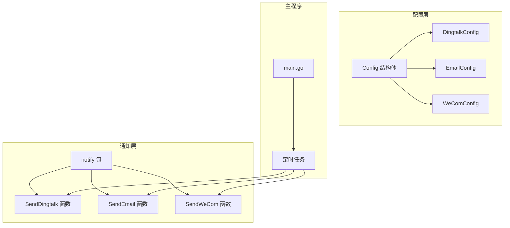

# 新增通知渠道指南

<cite>
**本文档引用的文件**
- [notify.go](file://pkg/notify/notify.go)
- [config.go](file://pkg/config/config.go)
- [config.yaml](file://config/config.yaml)
- [main.go](file://main.go)
- [utils.go](file://pkg/utils/utils.go)
</cite>

## 目录
1. [简介](#简介)
2. [现有通知系统架构](#现有通知系统架构)
3. [通知渠道实现模式分析](#通知渠道实现模式分析)
4. [创建新的通知渠道](#创建新的通知渠道)
5. [配置文件更新](#配置文件更新)
6. [主程序集成](#主程序集成)
7. [最佳实践](#最佳实践)
8. [故障排除](#故障排除)
9. [总结](#总结)

## 简介

PromAI项目目前支持三种通知渠道：钉钉(Dingtalk)、邮件(Email)和企业微信(WeCom)。本文档提供了详细的指南，帮助开发者在`notify.go`中实现新的通知渠道，如飞书或Webhook。

通过分析现有通知函数的实现模式，我们将展示如何创建统一的通知接口，确保新渠道能够无缝集成到现有的通知系统中。

## 现有通知系统架构



**图表来源**
- [config.go](file://pkg/config/config.go#L1-L37)
- [notify.go](file://pkg/notify/notify.go#L1-L286)
- [main.go](file://main.go#L1-L230)

**章节来源**
- [config.go](file://pkg/config/config.go#L1-L37)
- [notify.go](file://pkg/notify/notify.go#L1-L286)

## 通知渠道实现模式分析

### 结构体设计模式

所有通知渠道都遵循相同的结构体设计模式：

```go
type ChannelConfig struct {
    Enabled   bool   `yaml:"enabled"`
    Webhook   string `yaml:"webhook"`
    ReportURL string `yaml:"report_url"`
    // 特定字段...
}
```

### 共同特征分析

1. **启用控制**: 每个配置都有`Enabled`字段用于控制是否启用该通知渠道
2. **Webhook URL**: 所有渠道都需要一个Webhook URL来发送通知
3. **报告URL**: 提供报告访问链接的基础URL
4. **错误处理**: 统一的错误处理和日志记录机制
5. **文件处理**: 支持报告文件的上传和链接生成

### 实现函数模式

每个通知函数都遵循相同的实现模式：

```go
func SendChannel(config ChannelConfig, reportPath string) error {
    if !config.Enabled {
        log.Printf("通知未启用")
        return nil
    }
    
    // 日志记录
    log.Printf("开始发送通知...")
    
    // 构建消息内容
    messageContent := buildMessageContent(config, reportPath)
    
    // 发送HTTP请求
    response, err := sendHTTPRequest(config.Webhook, messageContent)
    
    // 处理响应和错误
    if err != nil {
        return fmt.Errorf("发送失败: %v", err)
    }
    
    log.Printf("通知发送成功")
    return nil
}
```

**章节来源**
- [notify.go](file://pkg/notify/notify.go#L20-L286)

## 创建新的通知渠道

### 示例：实现飞书通知渠道

让我们以实现飞书通知渠道为例，展示如何创建新的通知函数。

#### 1. 定义飞书配置结构体

```go
type FeishuConfig struct {
    Enabled   bool   `yaml:"enabled"`
    Webhook   string `yaml:"webhook"`
    Secret    string `yaml:"secret"`  // 可选：飞书机器人密钥
    ReportURL string `yaml:"report_url"`
}
```

#### 2. 实现飞书发送函数

```go
// SendFeishu 发送飞书通知
func SendFeishu(config FeishuConfig, reportPath string) error {
    if !config.Enabled {
        log.Printf("飞书通知未启用")
        return nil
    }
    
    log.Printf("开始发送飞书通知...")
    
    // 正确生成报告的访问链接
    reportFileName := filepath.Base(reportPath)
    reportLink := fmt.Sprintf("%s/reports/%s", config.ReportURL, reportFileName)
    
    // 构建飞书支持的消息内容
    messageContent := map[string]interface{}{
        "msg_type": "post",
        "content": map[string]interface{}{
            "post": map[string]interface{}{
                "zh_cn": map[string]interface{}{
                    "title": "巡检报告已生成",
                    "content": [][]interface{}{
                        {
                            map[string]interface{}{
                                "tag": "text",
                                "text": "🔍 巡检报告已生成\n\n",
                            },
                        },
                        {
                            map[string]interface{}{
                                "tag": "text",
                                "text": fmt.Sprintf("⏰ 生成时间：%s\n\n", 
                                    time.Now().Format("2006-01-02 15:04:05")),
                            },
                        },
                        {
                            map[string]interface{}{
                                "tag": "text",
                                "text": fmt.Sprintf("📄 报告详情：\n"),
                            },
                        },
                        {
                            map[string]interface{}{
                                "tag": "text",
                                "text": fmt.Sprintf("- 文件名：`%s`\n", reportFileName),
                            },
                        },
                        {
                            map[string]interface{}{
                                "tag": "text",
                                "text": fmt.Sprintf("- 访问链接：[点击查看报告](%s)\n\n", reportLink),
                            },
                        },
                        {
                            map[string]interface{}{
                                "tag": "text",
                                "text": "---\n💡 请登录环境查看完整报告内容",
                            },
                        },
                    },
                },
            },
        },
    }
    
    jsonData, err := json.Marshal(messageContent)
    if err != nil {
        log.Printf("飞书 JSON 编码失败: %v", err)
        return fmt.Errorf("JSON编码失败: %v", err)
    }
    
    log.Printf("准备发送请求到飞书 webhook: %s", config.Webhook)
    
    // 发送 POST 请求
    req, err := http.NewRequest("POST", config.Webhook, bytes.NewBuffer(jsonData))
    if err != nil {
        log.Printf("创建飞书请求失败: %v", err)
        return fmt.Errorf("创建请求失败: %v", err)
    }
    req.Header.Set("Content-Type", "application/json")
    
    // 如果有密钥，添加签名
    if config.Secret != "" {
        timestamp := time.Now().Unix()
        sign := calculateFeishuSign(timestamp, config.Secret)
        req.Header.Set("X-Timestamp", fmt.Sprintf("%d", timestamp))
        req.Header.Set("X-Signature", sign)
    }
    
    client := &http.Client{}
    resp, err := client.Do(req)
    if err != nil {
        log.Printf("发送飞书请求失败: %v", err)
        return fmt.Errorf("发送请求失败: %v", err)
    }
    defer resp.Body.Close()
    
    respBody, _ := io.ReadAll(resp.Body)
    log.Printf("飞书响应状态码: %d, 响应内容: %s", resp.StatusCode, string(respBody))
    
    if resp.StatusCode != http.StatusOK {
        return fmt.Errorf("飞书发送失败，状态码: %d", resp.StatusCode)
    }
    
    log.Printf("飞书通知发送成功")
    return nil
}

// calculateFeishuSign 计算飞书签名
func calculateFeishuSign(timestamp int64, secret string) string {
    stringToSign := fmt.Sprintf("%d\n%s", timestamp, secret)
    h := hmac.New(sha256.New, []byte(secret))
    h.Write([]byte(stringToSign))
    return base64.StdEncoding.EncodeToString(h.Sum(nil))
}
```

#### 3. 添加Webhook通知函数

对于简单的Webhook通知，可以实现一个通用的函数：

```go
// SendWebhook 发送通用Webhook通知
func SendWebhook(url string, payload interface{}) error {
    if url == "" {
        log.Printf("Webhook URL为空，跳过发送")
        return nil
    }
    
    log.Printf("开始发送Webhook通知到: %s", url)
    
    jsonData, err := json.Marshal(payload)
    if err != nil {
        log.Printf("Webhook JSON编码失败: %v", err)
        return fmt.Errorf("JSON编码失败: %v", err)
    }
    
    req, err := http.NewRequest("POST", url, bytes.NewBuffer(jsonData))
    if err != nil {
        log.Printf("创建Webhook请求失败: %v", err)
        return fmt.Errorf("创建请求失败: %v", err)
    }
    req.Header.Set("Content-Type", "application/json")
    
    client := &http.Client{}
    resp, err := client.Do(req)
    if err != nil {
        log.Printf("发送Webhook请求失败: %v", err)
        return fmt.Errorf("发送请求失败: %v", err)
    }
    defer resp.Body.Close()
    
    respBody, _ := io.ReadAll(resp.Body)
    log.Printf("Webhook响应状态码: %d, 响应内容: %s", resp.StatusCode, string(respBody))
    
    if resp.StatusCode != http.StatusOK {
        return fmt.Errorf("Webhook发送失败，状态码: %d", resp.StatusCode)
    }
    
    log.Printf("Webhook通知发送成功")
    return nil
}
```

**章节来源**
- [notify.go](file://pkg/notify/notify.go#L20-L286)

## 配置文件更新

### 更新配置结构

需要在`config.go`中添加飞书配置：

```go
type Config struct {
    // ... 其他字段 ...
    Notifications struct {
        Dingtalk notify.DingtalkConfig `yaml:"dingtalk"`
        Email    notify.EmailConfig    `yaml:"email"`
        Wecom    notify.WeComConfig    `yaml:"wecom"`
        Feishu   notify.FeishuConfig   `yaml:"feishu"`  // 新增飞书配置
    } `yaml:"notifications"`
    // ... 其他字段 ...
}
```

### 更新配置示例

在`config.yaml`中添加飞书配置：

```yaml
notifications:
  feishu:
    enabled: true
    webhook: "https://open.feishu.cn/open-apis/bot/v2/hook/your_webhook_key"
    secret: "your_secret_key"  # 可选，用于签名验证
    report_url: "http://10.1.114.66:8091"
  # 其他通知渠道配置...
```

**章节来源**
- [config.go](file://pkg/config/config.go#L1-L37)
- [config.yaml](file://config/config.yaml#L1-L196)

## 主程序集成

### 在主程序中添加飞书通知调用

在`main.go`的定时任务部分添加飞书通知逻辑：

```go
// 定时任务函数
if config.CronSchedule != "" {
    c := cron.New()
    _, err := c.AddFunc(config.CronSchedule, func() {
        // ... 收集指标和生成报告的代码 ...
        
        // 钉钉通知
        if config.Notifications.Dingtalk.Enabled {
            log.Printf("发送钉钉消息")
            if err := notify.SendDingtalk(config.Notifications.Dingtalk, reportFilePath); err != nil {
                log.Printf("发送钉钉消息失败: %v", err)
            }
        }
        
        // 邮件通知
        if config.Notifications.Email.Enabled {
            log.Printf("发送邮件")
            if err := notify.SendEmail(config.Notifications.Email, reportFilePath); err != nil {
                log.Printf("发送邮件失败: %v", err)
            }
        }
        
        // 企业微信通知
        if config.Notifications.Wecom.Enabled {
            log.Printf("发送企业微信消息")
            if err := notify.SendWeCom(config.Notifications.Wecom, reportFilePath); err != nil {
                log.Printf("发送企业微信消息失败: %v", err)
            }
        }
        
        // ✅ 新增：飞书通知
        if config.Notifications.Feishu.Enabled {
            log.Printf("发送飞书消息")
            if err := notify.SendFeishu(config.Notifications.Feishu, reportFilePath); err != nil {
                log.Printf("发送飞书消息失败: %v", err)
            }
        }
        
    })
    // ... 其他代码 ...
}
```

**章节来源**
- [main.go](file://main.go#L60-L120)

## 最佳实践

### 1. 错误处理

- **统一错误返回**: 使用`fmt.Errorf`包装错误信息
- **详细日志记录**: 记录关键操作步骤和错误详情
- **状态码检查**: 验证HTTP响应状态码
- **资源清理**: 使用`defer`确保资源正确释放

### 2. 配置管理

- **默认值**: 为可选字段提供合理的默认值
- **验证**: 在发送前验证配置的有效性
- **敏感信息**: 对密码等敏感信息进行适当的保护

### 3. 性能优化

- **连接复用**: 使用HTTP客户端连接池
- **超时设置**: 为网络请求设置合理的超时时间
- **并发控制**: 考虑在多个通知渠道间实现并发发送

### 4. 安全考虑

- **HTTPS**: 确保所有通信使用HTTPS
- **凭据保护**: 不要将凭据硬编码在代码中
- **输入验证**: 验证所有外部输入

## 故障排除

### 常见问题及解决方案

#### 1. Webhook连接失败

**症状**: HTTP请求返回连接错误
**解决方案**:
- 检查Webhook URL是否正确
- 验证网络连通性
- 确认防火墙设置

#### 2. 认证失败

**症状**: HTTP 401或403错误
**解决方案**:
- 验证认证凭据
- 检查权限设置
- 确认API密钥有效性

#### 3. 消息格式错误

**症状**: HTTP 400错误
**解决方案**:
- 验证JSON格式
- 检查必需字段
- 确认API版本兼容性

#### 4. 日志调试

启用详细日志记录：
```go
log.SetFlags(log.LstdFlags | log.Lshortfile)
log.Printf("Debug信息: %+v", debugInfo)
```

**章节来源**
- [notify.go](file://pkg/notify/notify.go#L100-L200)

## 总结

通过本指南，我们展示了如何在PromAI项目中添加新的通知渠道。主要要点包括：

1. **统一的结构体设计**: 所有通知渠道都遵循相同的配置结构
2. **一致的实现模式**: 每个通知函数都包含启用检查、错误处理和日志记录
3. **灵活的配置系统**: 支持多种通知渠道的配置和切换
4. **完善的集成**: 新渠道可以无缝集成到现有的定时任务系统中

这种设计模式确保了新通知渠道的稳定性、可维护性和扩展性。开发者可以根据具体需求，参考现有实现创建新的通知渠道，如飞书、Slack或其他自定义Webhook。