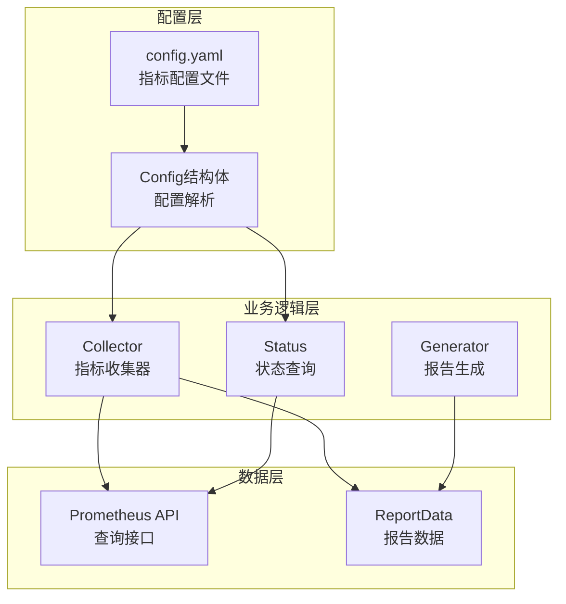
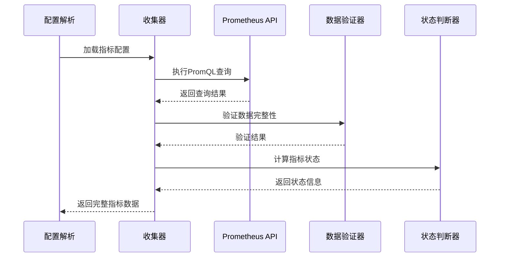
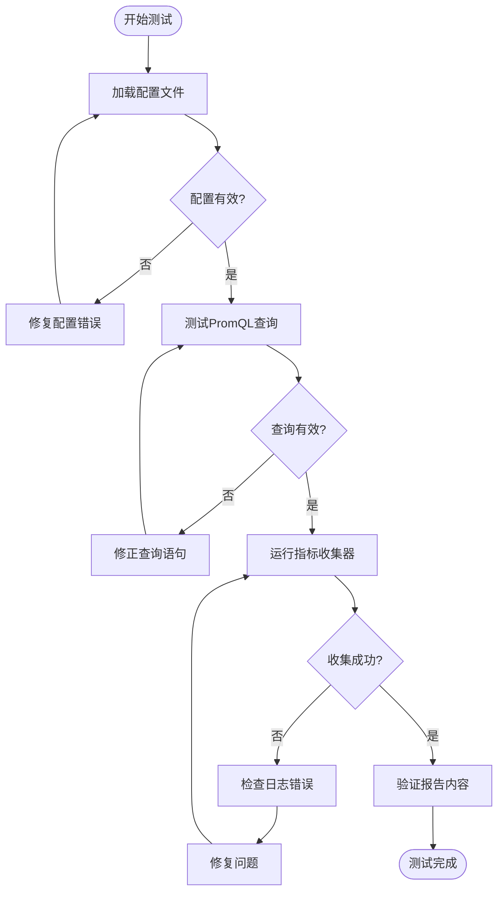

# 向PromAI系统添加新监控指标详细指南

<cite>
**本文档引用的文件**
- [config.yaml](file://config/config.yaml)
- [collector.go](file://pkg/metrics/collector.go)
- [config.go](file://pkg/config/config.go)
- [generator.go](file://pkg/report/generator.go)
- [status.go](file://pkg/status/status.go)
</cite>

## 目录
1. [简介](#简介)
2. [项目架构概览](#项目架构概览)
3. [指标配置结构](#指标配置结构)
4. [添加新指标的完整流程](#添加新指标的完整流程)
5. [代码实现详解](#代码实现详解)
6. [具体示例：添加磁盘IO使用率指标](#具体示例添加磁盘io使用率指标)
7. [验证和测试](#验证和测试)
8. [最佳实践](#最佳实践)
9. [故障排除](#故障排除)
10. [总结](#总结)

## 简介

PromAI是一个基于Prometheus的监控指标收集和报告系统。本指南详细说明如何向系统添加新的监控指标，包括在config.yaml中配置指标参数、在collector.go中实现指标收集逻辑，以及如何验证新指标的正确性。

系统通过配置驱动的方式管理监控指标，所有指标配置都集中存储在config.yaml文件中。每个指标都有明确的配置要求，包括名称、描述、PromQL查询语句、阈值设置等关键参数。

## 项目架构概览



**图表来源**
- [config.go](file://pkg/config/config.go#L1-L37)
- [collector.go](file://pkg/metrics/collector.go#L1-L50)

## 指标配置结构

### config.yaml中的metric_types配置

在config.yaml文件中，指标配置位于`metric_types`字段下，采用分组结构：

```yaml
metric_types:
- type: "基础资源使用情况"
  metrics:
  - name: "CPU使用率"
    description: "节点CPU使用率统计"
    query: "100 - (avg by(instance) (irate(node_cpu_seconds_total{mode='idle'}[5m])) * 100)"
    threshold: 80
    threshold_type: "greater"
    unit: "%"
    labels:
      instance: "节点"
      
- type: "kubernetes集群监控状态"
  metrics:
  - name: "节点就绪状态"
    description: "K8s节点就绪状态检查"
    query: "kube_node_status_condition{condition='Ready',status!='true'}"
    threshold: 0
    threshold_type: "equal"
    unit: ""
    labels:
      node: "节点"
      condition: "状态类型"
```

### 指标配置字段详解

每个指标配置包含以下核心字段：

| 字段名 | 类型 | 必需 | 描述 |
|--------|------|------|------|
| `name` | string | 是 | 指标显示名称 |
| `description` | string | 是 | 指标的详细描述 |
| `query` | string | 是 | PromQL查询语句 |
| `threshold` | float | 是 | 阈值数值 |
| `threshold_type` | string | 是 | 阈值比较类型 |
| `unit` | string | 是 | 单位标识符 |
| `labels` | map[string]string | 是 | 标签映射关系 |

**章节来源**
- [config.yaml](file://config/config.yaml#L30-L150)
- [config.go](file://pkg/config/config.go#L25-L37)

## 添加新指标的完整流程

### 第一步：修改config.yaml配置

1. **定位指标类型组**  
   在`metric_types`数组中找到合适的指标类型组，或者创建新的类型组。

2. **添加指标配置**  
   在目标类型组的`metrics`数组中添加新的指标对象。

3. **配置必需字段**  
   确保所有必需字段都正确设置：
   ```yaml
   - name: "新指标名称"
     description: "指标的详细描述"
     query: "PromQL查询语句"
     threshold: 80.0
     threshold_type: "greater"
     unit: "%"
     labels:
       instance: "节点"
   ```

### 第二步：验证PromQL查询

1. **在Prometheus UI测试查询**  
   打开Prometheus Web界面，测试查询语句是否能正确返回数据。

2. **检查查询结果格式**  
   确保查询返回的是单值向量（Vector），而不是矩阵（Matrix）或其他格式。

3. **优化查询性能**  
   使用适当的采样间隔和过滤条件，避免查询过于复杂导致性能问题。

### 第三步：理解collector.go中的处理逻辑



**图表来源**
- [collector.go](file://pkg/metrics/collector.go#L40-L120)

**章节来源**
- [collector.go](file://pkg/metrics/collector.go#L40-L120)

## 代码实现详解

### Collector结构体和CollectMetrics方法

```go
type Collector struct {
    Client PrometheusAPI
    config *config.Config
}

func (c *Collector) CollectMetrics() (*report.ReportData, error) {
    // 遍历所有指标类型
    for _, metricType := range c.config.MetricTypes {
        // 遍历该类型下的所有指标
        for _, metric := range metricType.Metrics {
            // 执行PromQL查询
            result, _, err := c.Client.Query(ctx, metric.Query, time.Now())
            
            // 处理查询结果
            switch v := result.(type) {
            case model.Vector:
                // 解析向量数据
                for _, sample := range v {
                    // 构建标签映射
                    availableLabels := make(map[string]string)
                    for labelName, labelValue := range sample.Metric {
                        availableLabels[string(labelName)] = string(labelValue)
                    }
                    
                    // 应用标签映射
                    labels := make([]report.LabelData, 0, len(metric.Labels))
                    for configLabel, configAlias := range metric.Labels {
                        labelValue := "-"
                        if rawValue, exists := availableLabels[configLabel]; exists && rawValue != "" {
                            labelValue = rawValue
                        }
                        
                        labels = append(labels, report.LabelData{
                            Name:  configLabel,
                            Alias: configAlias,
                            Value: labelValue,
                        })
                    }
                    
                    // 计算指标状态
                    status := getStatus(float64(sample.Value), metric.Threshold, metric.ThresholdType)
                    
                    // 构建指标数据
                    metricData := report.MetricData{
                        Name:        metric.Name,
                        Description: metric.Description,
                        Value:       float64(sample.Value),
                        Threshold:   metric.Threshold,
                        Unit:        metric.Unit,
                        Status:      status,
                        Timestamp:   time.Now(),
                        Labels:      labels,
                    }
                }
            }
        }
    }
    return data, nil
}
```

### getStatus函数实现

```go
func getStatus(value, threshold float64, thresholdType string) string {
    if thresholdType == "" {
        thresholdType = "greater"
    }
    
    switch thresholdType {
    case "greater":
        if value > threshold {
            return "critical"
        } else if value >= threshold*0.8 {
            return "warning"
        }
    case "greater_equal":
        if value >= threshold {
            return "critical"
        } else if value >= threshold*0.8 {
            return "warning"
        }
    case "less":
        if value < threshold {
            return "normal"
        } else if value <= threshold*1.2 {
            return "warning"
        }
    case "less_equal":
        if value <= threshold {
            return "normal"
        } else if value <= threshold*1.2 {
            return "warning"
        }
    case "equal":
        if value == threshold {
            return "normal"
        } else if value > threshold {
            return "critical"
        }
        return "critical"
    }
    return "normal"
}
```

**章节来源**
- [collector.go](file://pkg/metrics/collector.go#L40-L150)

## 具体示例：添加磁盘IO使用率指标

### 步骤1：修改config.yaml配置

在`metric_types`中添加新的指标配置：

```yaml
- type: "存储性能监控"
  metrics:
  - name: "磁盘IO使用率"
    description: "节点磁盘IO使用率统计"
    query: "rate(node_disk_io_time_seconds_total[5m]) * 100"
    threshold: 85
    threshold_type: "greater"
    unit: "%"
    labels:
      instance: "节点"
      device: "磁盘设备"
```

### 步骤2：验证PromQL查询

在Prometheus UI中测试以下查询：

```promql
rate(node_disk_io_time_seconds_total[5m]) * 100
```

确保查询返回：
- 单值向量（Vector）
- 数值范围合理（0-100%）
- 包含正确的标签信息

### 步骤3：理解查询结果处理

系统会自动处理查询结果：

1. **查询执行**：通过Prometheus API执行`rate(node_disk_io_time_seconds_total[5m]) * 100`
2. **结果解析**：将查询结果转换为Go的model.Vector类型
3. **标签映射**：根据配置的labels字段映射原始标签
4. **状态计算**：使用getStatus函数根据阈值判断状态
5. **数据验证**：确保标签数据完整性和有效性

### 步骤4：查看报告中的指标

添加完成后，生成的报告将包含：
- 指标名称：磁盘IO使用率
- 当前值：具体的百分比数值
- 状态：正常/警告/严重
- 单位：%
- 标签信息：节点、磁盘设备等

**章节来源**
- [config.yaml](file://config/config.yaml#L150-L170)
- [collector.go](file://pkg/metrics/collector.go#L70-L120)

## 验证和测试

### 测试指标配置的有效性

1. **语法验证**  
   使用YAML验证工具检查config.yaml的语法正确性。

2. **配置加载测试**  
   启动应用程序，验证配置文件能够正确加载。

3. **查询测试**  
   在Prometheus UI中手动执行配置的PromQL查询，确保返回预期结果。

4. **功能测试**  
   运行应用程序，检查新指标是否出现在报告中。

### 常见问题排查



**图表来源**
- [collector.go](file://pkg/metrics/collector.go#L40-L100)

### 日志分析

系统会在日志中记录指标收集过程：

```bash
# 成功日志示例
INFO: 指标 [磁盘IO使用率] 查询结果: vector([sample: {__name__="rate_node_disk_io_time_seconds_total", instance="192.168.1.100:9100", device="sda"} value: 75.5])

# 错误日志示例
WARN: 查询指标 磁盘IO使用率 失败: server_error: invalid query
WARN: 指标 [磁盘IO使用率] 标签 [device] 缺失或为空
```

**章节来源**
- [collector.go](file://pkg/metrics/collector.go#L50-L80)

## 最佳实践

### 1. PromQL查询优化

- **使用适当的采样间隔**：避免过于频繁的查询
- **添加必要的过滤条件**：减少不必要的数据传输
- **考虑查询性能**：避免复杂的聚合操作
- **测试查询响应时间**：确保查询不会影响Prometheus性能

### 2. 阈值设置策略

- **合理设置阈值**：避免误报和漏报
- **考虑历史数据**：参考过去的数据分布
- **设置警告阈值**：提前发现问题
- **定期调整阈值**：根据实际情况优化

### 3. 标签设计原则

- **保持标签简洁**：只包含必要的标签
- **使用有意义的别名**：提高报告可读性
- **统一标签命名**：保持一致性
- **考虑标签数量**：避免过多的标签组合

### 4. 指标命名规范

- **使用清晰的名称**：准确描述指标含义
- **避免歧义**：确保名称不会引起误解
- **保持一致性**：遵循项目的命名约定
- **考虑国际化**：如果需要支持多语言

## 故障排除

### 常见错误及解决方案

| 错误类型 | 症状 | 原因 | 解决方案 |
|----------|------|------|----------|
| 配置加载失败 | 应用程序启动失败 | YAML语法错误 | 检查YAML格式，使用在线验证工具 |
| 查询执行失败 | 指标数据缺失 | PromQL语法错误 | 在Prometheus UI中测试查询 |
| 标签映射失败 | 报告中缺少标签信息 | 标签名称不匹配 | 检查labels配置与实际标签名称 |
| 阈值判断错误 | 状态显示不正确 | 阈值类型设置错误 | 检查threshold_type配置 |
| 性能问题 | 查询超时 | 查询过于复杂 | 优化PromQL查询，添加过滤条件 |

### 调试技巧

1. **启用详细日志**  
   在开发环境中增加日志级别，获取更多调试信息。

2. **单独测试查询**  
   在Prometheus UI中单独测试每个指标的PromQL查询。

3. **检查数据格式**  
   确保查询返回的是单值向量，而不是其他格式。

4. **验证标签映射**  
   检查配置的labels字段与实际查询结果的标签名称是否匹配。

**章节来源**
- [collector.go](file://pkg/metrics/collector.go#L120-L150)

## 总结

本指南详细介绍了如何向PromAI系统添加新的监控指标，涵盖了从配置修改到代码实现的完整流程。关键要点包括：

1. **配置驱动**：所有指标配置都集中在config.yaml文件中
2. **标准化流程**：添加新指标需要经过配置、验证、测试等多个步骤
3. **代码实现**：collector.go负责解析配置并执行Prometheus查询
4. **状态判断**：getStatus函数根据阈值类型计算指标状态
5. **验证机制**：系统提供了多层次的验证和错误处理机制

通过遵循本指南的最佳实践，开发者可以高效地扩展PromAI系统的监控能力，为运维团队提供更全面的系统监控视图。