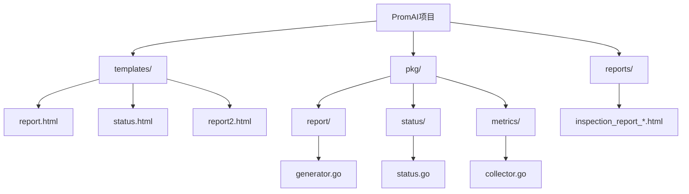
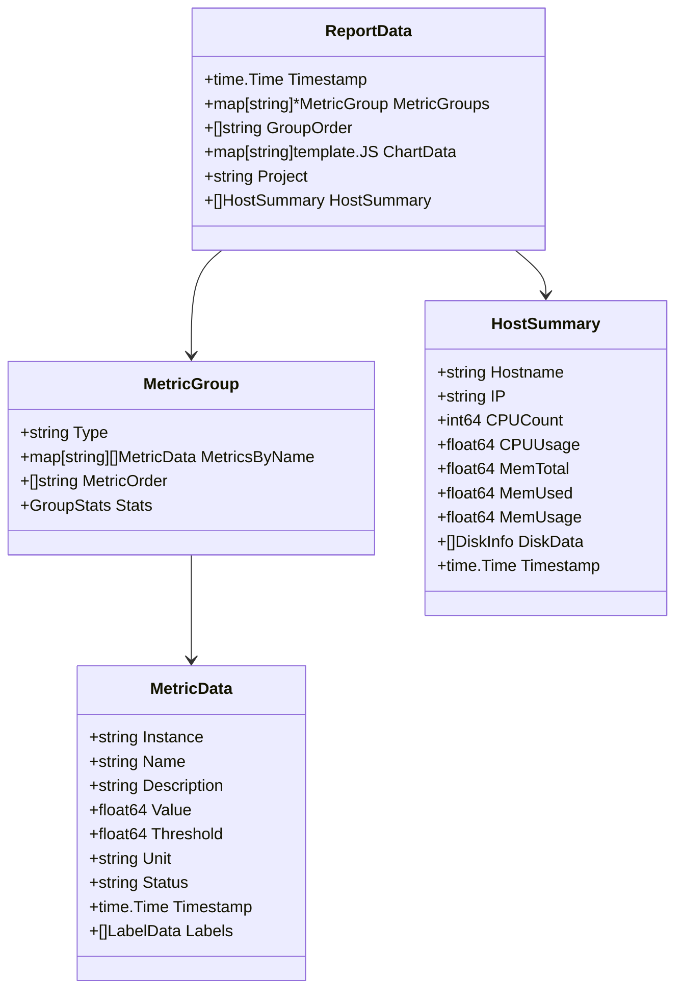
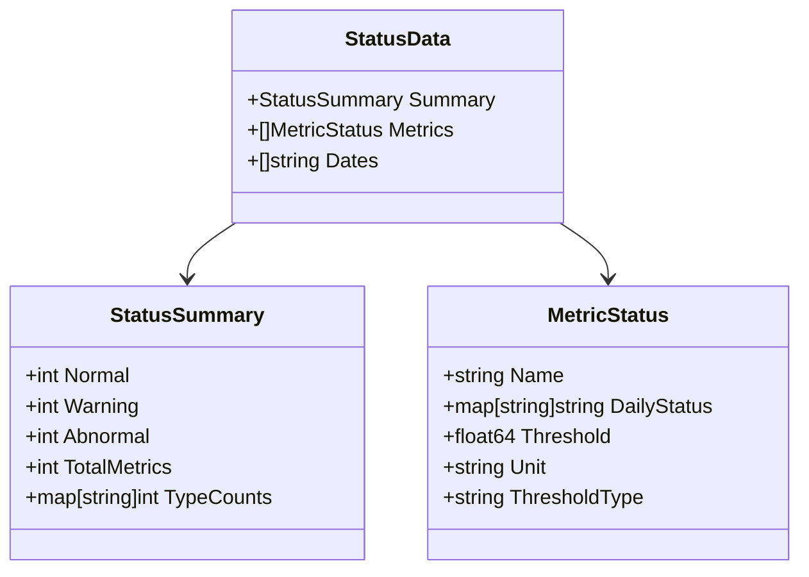
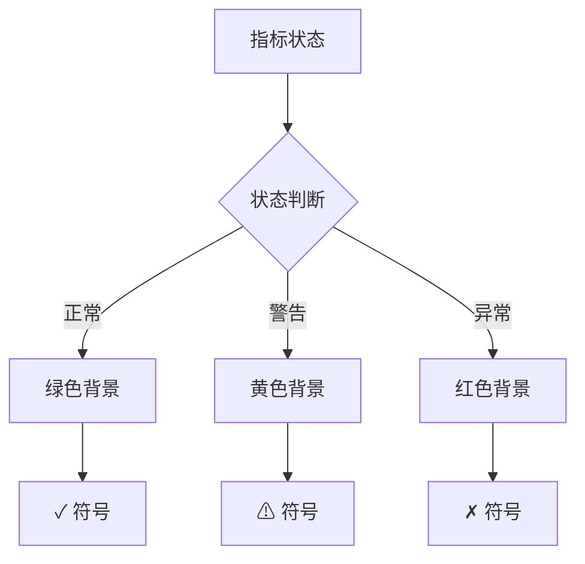

# 自定义模板

<cite>
**本文档引用的文件**
- [templates/report.html](file://templates/report.html)
- [templates/status.html](file://templates/status.html)
- [templates/report2.html](file://templates/report2.html)
- [pkg/report/generator.go](file://pkg/report/generator.go)
- [pkg/status/status.go](file://pkg/status/status.go)
- [main.go](file://main.go)
</cite>

## 目录
1. [简介](#简介)
2. [项目结构概览](#项目结构概览)
3. [Go Template语法基础](#go-template语法基础)
4. [核心数据模型](#核心数据模型)
5. [报告模板详解](#报告模板详解)
6. [状态看板模板详解](#状态看板模板详解)
7. [Chart.js集成](#chartjs集成)
8. [CSS样式定制](#css样式定制)
9. [实践示例：添加网络流量图表](#实践示例添加网络流量图表)
10. [最佳实践指南](#最佳实践指南)
11. [故障排除](#故障排除)

## 简介

PromAI项目提供了强大的HTML模板系统，允许开发者通过修改模板文件来自定义报告的外观和内容。该系统基于Go语言的标准模板引擎，结合Chart.js图表库和自定义CSS样式，为用户提供灵活的报告定制能力。

本文档将详细介绍如何理解和修改模板文件，包括Go Template语法、数据模型访问、Chart.js集成以及CSS样式调整等关键方面。

## 项目结构概览



**图表来源**
- [templates/report.html](file://templates/report.html#L1-L50)
- [templates/status.html](file://templates/status.html#L1-L50)
- [pkg/report/generator.go](file://pkg/report/generator.go#L1-L50)

**章节来源**
- [templates/report.html](file://templates/report.html#L1-L100)
- [templates/status.html](file://templates/status.html#L1-L100)

## Go Template语法基础

Go Template是Go语言内置的模板引擎，提供了强大的文本替换和条件控制功能。以下是常用的语法元素：

### 变量访问
```html
<!-- 访问基本字段 -->
<title>{{.Project}}</title>
<div>最后更新时间: {{now | date "2006-01-02 15:04:05"}}</div>

<!-- 访问嵌套字段 -->
<div>主机名: {{.Hostname}}</div>
<div>CPU使用率: {{.CPUUsage}}%</div>
```

### 条件判断
```html
{{if eq $metric.Status "critical"}}
    <span class="status-critical">严重</span>
{{else if eq $metric.Status "warning"}}
    <span class="status-warning">警告</span>
{{else}}
    <span class="status-normal">正常</span>
{{end}}
```

### 循环遍历
```html
{{range $groupType := .GroupOrder}}
    <h2>{{$groupType}} 监控指标</h2>
    {{$group := index $.MetricGroups $groupType}}
    
    {{range $metricName := $group.MetricOrder}}
        {{$metrics := index $group.MetricsByName $metricName}}
        
        {{if eq (len $metrics) 0 }}
            <p>未查询到数据</p>
        {{else}}
            <table>
                <!-- 表格内容 -->
            </table>
        {{end}}
    {{end}}
{{end}}
```

### 函数调用
```html
<!-- 内置函数 -->
<div>格式化时间: {{now | date "2006-01-02"}}</div>

<!-- 自定义函数 -->
<div>格式化字节: {{formatBytes $host.MemTotal}}</div>
```

**章节来源**
- [templates/report.html](file://templates/report.html#L1-L200)
- [templates/status.html](file://templates/status.html#L1-L200)

## 核心数据模型

### 报告数据结构



**图表来源**
- [pkg/report/generator.go](file://pkg/report/generator.go#L15-L60)

### 状态数据结构



**图表来源**
- [pkg/status/status.go](file://pkg/status/status.go#L30-L60)

**章节来源**
- [pkg/report/generator.go](file://pkg/report/generator.go#L15-L100)
- [pkg/status/status.go](file://pkg/status/status.go#L30-L80)

## 报告模板详解

### 模板结构分析

report.html模板采用模块化设计，包含以下主要部分：

1. **头部信息** - 包含项目标题和Chart.js库
2. **主机资源概览** - 展示CPU、内存、磁盘使用情况
3. **指标分组展示** - 按类型组织的监控指标
4. **图表区域** - 动态生成的可视化图表

### 主机资源表格

```html
<table class="host-table">
    <thead>
        <tr>
            <th>主机名</th>
            <th>IP地址</th>
            <th>CPU核心数</th>
            <th>CPU使用率</th>
            <th>内存总量</th>
            <th>内存使用量</th>
            <th>内存使用率</th>
            <th>磁盘信息</th>
            <th>最后更新时间</th>
        </tr>
    </thead>
    <tbody>
        {{range $host := .HostSummary}}
        <tr>
            <td>{{$host.Hostname}}</td>
            <td>{{$host.IP}}</td>
            <td>{{$host.CPUCount}}</td>
            <td 
                {{if ge $host.CPUUsage 90}}class="critical"
                {{else if ge $host.CPUUsage 80}}class="warning"
                {{end}}>
                {{printf "%.2f%%" $host.CPUUsage}}
            </td>
            <!-- 其他列 -->
        </tr>
        {{end}}
    </tbody>
</table>
```

### 指标分组展示

```html
{{range $groupType := .GroupOrder}}
<div class="section">
  <h2>{{$groupType}} 监控指标</h2>

  {{range $metricName := $group.MetricOrder}}
    {{$metrics := index $group.MetricsByName $metricName}}

    <h3><li>{{$metricName}}</li></h3>

    {{if eq (len $metrics) 0 }}
      <p>未查询到数据</p>
    {{else}}
      <table>
        <tr>
          <th>实例</th>
          <th>值</th>
          <th>阈值</th>
          <th>状态</th>
          <th>描述</th>
        </tr>
        {{range $metric := $metrics}}
        <tr>
          <td>{{$metric.Instance}}</td>
          <td>{{$metric.Value}} {{$metric.Unit}}</td>
          <td>{{$metric.Threshold}} {{$metric.Unit}}</td>
          <td>{{GetStatusText $metric.Status}}</td>
          <td>{{$metric.Description}}</td>
        </tr>
        {{end}}
      </table>
    {{end}}
  {{end}}
</div>
{{end}}
```

**章节来源**
- [templates/report.html](file://templates/report.html#L400-L500)
- [pkg/report/generator.go](file://pkg/report/generator.go#L200-L300)

## 状态看板模板详解

### 模板架构

status.html模板采用简洁的设计风格，专注于实时状态监控：

```html
<div class="container">
    <div class="header">
        <h1>服务健康看板</h1>
        <div class="refresh-time">
            最后更新时间: {{now | date "2006-01-02 15:04:05"}}
        </div>
    </div>

    <div class="summary-cards">
        <div class="summary-card total">
            <h3>总指标数</h3>
            <div class="number">{{.Summary.TotalMetrics}}</div>
        </div>
        <div class="summary-card normal">
            <h3>正常服务</h3>
            <div class="number">{{.Summary.Normal}}</div>
        </div>
        <div class="summary-card abnormal">
            <h3>异常服务</h3>
            <div class="number">{{.Summary.Abnormal}}</div>
        </div>
        <div class="summary-card warning">
            <h3>警告服务</h3>
            <div class="number">{{.Summary.Warning}}</div>
        </div>
    </div>

    <div class="status-table-container">
        <table class="status-table">
            <thead>
                <tr>
                    <th>指标信息</th>
                    {{range $date := .Dates}}
                    <th class="date-header">{{$date}}</th>
                    {{end}}
                </tr>
            </thead>
            <tbody>
                {{range $metric := .Metrics}}
                <tr>
                    <td class="metric-info">
                        <div class="metric-name">{{$metric.Name}}</div>
                        <div class="metric-threshold">
                            阈值: {{$metric.Threshold}}{{$metric.Unit}}
                            {{if eq $metric.ThresholdType "greater"}}
                                (>报警)
                            {{else if eq $metric.ThresholdType "greater_equal"}}
                                (>=报警)
                            {{end}}
                        </div>
                    </td>
                    {{range $date := $.Dates}}
                    <td class="{{if eq (index $metric.DailyStatus $date) "normal"}}status-normal{{else if eq (index $metric.DailyStatus $date) "warning"}}status-warning{{else}}status-abnormal{{end}}">
                        <span class="check-icon">
                            {{if eq (index $metric.DailyStatus $date) "normal"}}
                            ✓
                            {{else if eq (index $metric.DailyStatus $date) "warning"}}
                            ⚠
                            {{else}}
                            ✗
                            {{end}}
                        </span>
                    </td>
                    {{end}}
                </tr>
                {{end}}
            </tbody>
        </table>
    </div>
</div>
```

### 状态颜色系统



**图表来源**
- [templates/status.html](file://templates/status.html#L150-L200)

**章节来源**
- [templates/status.html](file://templates/status.html#L50-L250)

## Chart.js集成

### 图表初始化

模板中包含了完整的Chart.js库，可以直接在模板中使用：

```javascript
<script>
    // 获取图表数据
    const labels = {{.ChartData.labels}};
    
    // CPU使用率图表
    const cpuData = {{.ChartData.cpu_usage}};
    new Chart(document.getElementById('cpu-chart'), {
        type: 'line',
        data: {
            labels: labels,
            datasets: [{
                label: 'CPU使用率',
                data: cpuData,
                borderColor: 'rgb(75, 192, 192)',
                tension: 0.1
            }]
        },
        options: {
            responsive: true,
            scales: {
                y: {
                    beginAtZero: true,
                    max: 100
                }
            }
        }
    });
</script>
```

### 动态图表生成

```html
<div class="chart-container">
    <canvas id="network-chart"></canvas>
</div>

<script>
    // 网络流量图表
    function createNetworkChart() {
        const ctx = document.getElementById('network-chart').getContext('2d');
        new Chart(ctx, {
            type: 'bar',
            data: {
                labels: ['入站', '出站'],
                datasets: [{
                    label: '网络流量 (MB)',
                    data: [
                        parseFloat('{{index .ChartData.network_in}}'),
                        parseFloat('{{index .ChartData.network_out}}')
                    ],
                    backgroundColor: [
                        'rgba(54, 162, 235, 0.6)',
                        'rgba(255, 99, 132, 0.6)'
                    ]
                }]
            },
            options: {
                responsive: true,
                plugins: {
                    legend: {
                        position: 'top',
                    },
                    tooltip: {
                        callbacks: {
                            label: function(context) {
                                return `${context.dataset.label}: ${context.parsed.y.toFixed(2)} MB`;
                            }
                        }
                    }
                }
            }
        });
    }
    
    // 页面加载完成后创建图表
    document.addEventListener('DOMContentLoaded', createNetworkChart);
</script>
```

**章节来源**
- [templates/report.html](file://templates/report.html#L1-L100)

## CSS样式定制

### 主题变量系统

模板使用CSS自定义属性实现主题化：

```css
:root {
    --primary-color: #1890ff;
    --success-color: #52c41a;
    --warning-color: #faad14;
    --error-color: #ff4d4f;
    --bg-color: #f0f2f5;
    --header-bg: #fff;
    --border-color: #f0f0f0;
}
```

### 响应式布局

```css
.container {
    max-width: 1200px;
    margin: 0 auto;
    padding: 20px;
}

.summary-cards {
    display: flex;
    gap: 16px;
    margin-bottom: 24px;
}

@media (max-width: 768px) {
    .summary-cards {
        flex-direction: column;
    }
    
    .summary-card {
        flex: 1;
    }
}
```

### 状态指示器样式

```css
.status-normal .check-icon {
    background: rgba(82, 196, 26, 0.1);
    color: var(--success-color);
}

.status-abnormal .check-icon {
    background: rgba(255, 77, 79, 0.1);
    color: var(--error-color);
}

.status-warning .check-icon {
    background: rgba(255, 173, 20, 0.1);
    color: var(--warning-color);
}
```

**章节来源**
- [templates/status.html](file://templates/status.html#L10-L50)

## 实践示例：添加网络流量图表

### 步骤1：修改模板文件

在report.html中添加新的图表区域：

```html
<div class="section">
    <h2>网络流量监控</h2>
    
    <div class="chart-container">
        <canvas id="network-chart"></canvas>
    </div>
    
    <div class="network-summary">
        <div class="summary-card">
            <h3>今日入站流量</h3>
            <div class="number">{{index .ChartData.network_in | printf "%.2f"}} MB</div>
        </div>
        <div class="summary-card">
            <h3>今日出站流量</h3>
            <div class="number">{{index .ChartData.network_out | printf "%.2f"}} MB</div>
        </div>
    </div>
</div>
```

### 步骤2：添加JavaScript代码

在模板底部添加图表初始化代码：

```html
<script>
    function createNetworkChart() {
        const ctx = document.getElementById('network-chart').getContext('2d');
        
        // 获取网络流量数据
        const networkLabels = {{.ChartData.network_labels}};
        const networkInData = {{.ChartData.network_in_data}};
        const networkOutData = {{.ChartData.network_out_data}};
        
        new Chart(ctx, {
            type: 'line',
            data: {
                labels: networkLabels,
                datasets: [
                    {
                        label: '入站流量 (MB)',
                        data: networkInData,
                        borderColor: 'rgb(75, 192, 192)',
                        backgroundColor: 'rgba(75, 192, 192, 0.2)',
                        tension: 0.1
                    },
                    {
                        label: '出站流量 (MB)',
                        data: networkOutData,
                        borderColor: 'rgb(255, 99, 132)',
                        backgroundColor: 'rgba(255, 99, 132, 0.2)',
                        tension: 0.1
                    }
                ]
            },
            options: {
                responsive: true,
                plugins: {
                    legend: {
                        position: 'top',
                    },
                    tooltip: {
                        mode: 'index',
                        intersect: false,
                    }
                },
                hover: {
                    mode: 'nearest',
                    intersect: true
                },
                scales: {
                    x: {
                        display: true,
                        title: {
                            display: true,
                            text: '时间'
                        }
                    },
                    y: {
                        display: true,
                        title: {
                            display: true,
                            text: '流量 (MB)'
                        },
                        beginAtZero: true
                    }
                }
            }
        });
    }
    
    // 页面加载完成后创建图表
    document.addEventListener('DOMContentLoaded', createNetworkChart);
</script>
```

### 步骤3：修改Go代码生成数据

在generator.go中添加网络流量数据处理：

```go
// 处理网络流量数据
func processNetworkData(data ReportData) {
    // 假设我们有网络流量数据
    networkLabels := []string{"00:00", "01:00", "02:00", "03:00", "04:00"}
    networkInData := []float64{10.5, 12.3, 9.8, 11.2, 13.1}
    networkOutData := []float64{8.7, 9.5, 7.2, 10.1, 11.8}
    
    // 转换为JSON
    labelsJSON, _ := json.Marshal(networkLabels)
    data.ChartData["network_labels"] = template.JS(labelsJSON)
    
    inDataJSON, _ := json.Marshal(networkInData)
    data.ChartData["network_in_data"] = template.JS(inDataJSON)
    
    outDataJSON, _ := json.Marshal(networkOutData)
    data.ChartData["network_out_data"] = template.JS(outDataJSON)
    
    // 计算今日总流量
    var totalIn, totalOut float64
    for _, v := range networkInData {
        totalIn += v
    }
    for _, v := range networkOutData {
        totalOut += v
    }
    
    data.ChartData["network_in"] = template.JS(fmt.Sprintf("%.2f", totalIn))
    data.ChartData["network_out"] = template.JS(fmt.Sprintf("%.2f", totalOut))
}
```

### 步骤4：注册模板函数

在main.go中注册新的模板函数：

```go
func makeReportHandler(collector *metrics.Collector) http.HandlerFunc {
    return func(w http.ResponseWriter, r *http.Request) {
        data, err := collector.CollectMetrics()
        if err != nil {
            http.Error(w, "Failed to collect metrics", http.StatusInternalServerError)
            log.Printf("Error collecting metrics: %v", err)
            return
        }

        // 处理网络流量数据
        processNetworkData(data)
        
        reportFilePath, err := report.GenerateReport(*data)
        if err != nil {
            http.Error(w, "Failed to generate report", http.StatusInternalServerError)
            log.Printf("Error generating report: %v", err)
            return
        }

        http.Redirect(w, r, "/"+reportFilePath, http.StatusSeeOther)
    }
}
```

**章节来源**
- [templates/report.html](file://templates/report.html#L500-L600)
- [pkg/report/generator.go](file://pkg/report/generator.go#L300-L355)

## 最佳实践指南

### 1. 模板维护原则

- **保持简洁性**：避免过度复杂的模板逻辑
- **模块化设计**：将相似的组件抽象成可重用的部分
- **性能优化**：减少不必要的循环和条件判断
- **错误处理**：为可能的空值提供默认值

### 2. 数据访问最佳实践

```html
<!-- 推荐：安全访问嵌套字段 -->
{{with .HostSummary}}
    {{range .}}
        {{if .CPUUsage}}
            CPU使用率: {{.CPUUsage}}%
        {{else}}
            CPU使用率: 未知
        {{end}}
    {{end}}
{{else}}
    <p>暂无主机数据</p>
{{end}}

<!-- 不推荐：直接访问可能导致panic -->
<p>CPU使用率: {{.HostSummary.0.CPUUsage}}%</p>
```

### 3. 图表设计原则

- **清晰度优先**：确保图表易于理解
- **颜色对比**：使用高对比度的颜色方案
- **响应式设计**：适配不同屏幕尺寸
- **交互性**：提供必要的用户交互功能

### 4. CSS样式管理

- **变量统一**：使用CSS自定义属性管理主题色
- **类名规范**：采用BEM命名约定
- **媒体查询**：合理使用响应式断点
- **性能考虑**：避免过度复杂的CSS选择器

## 故障排除

### 常见问题及解决方案

#### 1. 模板解析错误

**问题**：模板无法正确解析
```
Error parsing template: template: status.html:15: unexpected EOF
```

**解决方案**：
- 检查模板文件是否有未闭合的标签
- 确保所有Go Template语法正确
- 验证JSON数据格式是否正确

#### 2. 数据访问失败

**问题**：无法访问预期的数据字段
```
Error rendering template: template: report.html:123:24: executing "report.html" at <.NonExistentField>: can't evaluate field NonExistentField in type report.ReportData
```

**解决方案**：
- 检查数据结构定义
- 使用`with`语句安全访问嵌套字段
- 添加默认值处理

#### 3. 图表显示异常

**问题**：Chart.js图表无法正常显示

**解决方案**：
- 确认Chart.js库已正确加载
- 检查数据格式是否符合Chart.js要求
- 验证canvas元素ID是否正确

#### 4. 样式不生效

**问题**：自定义CSS样式没有应用

**解决方案**：
- 检查CSS文件路径是否正确
- 确认CSS选择器优先级
- 使用浏览器开发者工具检查样式覆盖

### 调试技巧

1. **启用详细日志**：在Go代码中添加详细的日志输出
2. **模板测试**：使用简单的数据结构测试模板
3. **逐步验证**：逐个添加功能验证模板行为
4. **浏览器工具**：使用浏览器开发者工具检查DOM和样式

**章节来源**
- [main.go](file://main.go#L170-L230)
- [pkg/report/generator.go](file://pkg/report/generator.go#L300-L355)