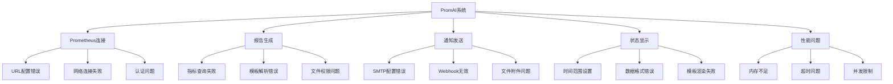
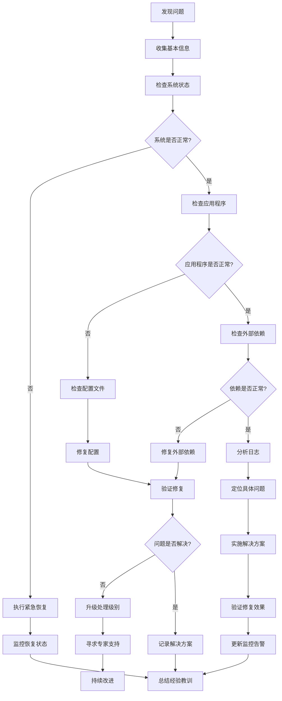
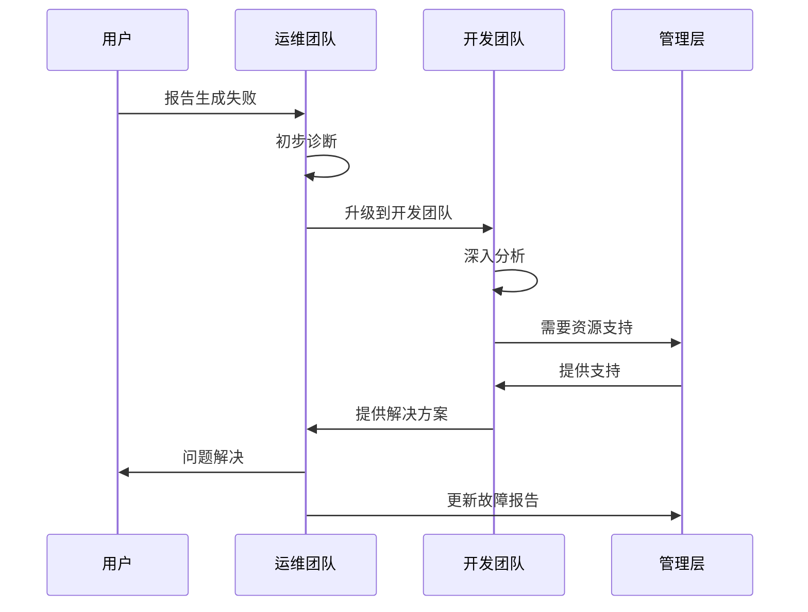

# 故障排查指南

<cite>
**本文档引用的文件**
- [main.go](file://main.go)
- [pkg/utils/utils.go](file://pkg/utils/utils.go)
- [pkg/prometheus/client.go](file://pkg/prometheus/client.go)
- [pkg/prometheus/prometheus.go](file://pkg/prometheus/prometheus.go)
- [pkg/metrics/collector.go](file://pkg/metrics/collector.go)
- [pkg/report/generator.go](file://pkg/report/generator.go)
- [pkg/notify/notify.go](file://pkg/notify/notify.go)
- [pkg/status/status.go](file://pkg/status/status.go)
- [pkg/report/cleanup.go](file://pkg/report/cleanup.go)
- [config/config.yaml](file://config/config.yaml)
</cite>

## 目录
1. [概述](#概述)
2. [常见问题分类](#常见问题分类)
3. [Prometheus连接问题](#prometheus连接问题)
4. [报告生成问题](#报告生成问题)
5. [通知发送问题](#通知发送问题)
6. [状态数据显示问题](#状态数据显示问题)
7. [性能问题诊断](#性能问题诊断)
8. [日志分析与调试](#日志分析与调试)
9. [诊断工具与检查清单](#诊断工具与检查清单)
10. [故障排除流程](#故障排除流程)

## 概述

PromAI是一个基于Prometheus的监控报告自动生成工具，它能够自动收集、分析指标数据并生成可视化的HTML报告。本指南提供了针对该系统常见问题的全面故障排查方法，帮助运维人员快速定位和解决问题。

## 常见问题分类

### 按功能模块分类



## Prometheus连接问题

### 问题症状

- 报告生成失败，提示"Failed to collect metrics"
- 状态页面显示异常
- 指标数据为空或显示错误

### 常见原因及解决方案

#### 1. Prometheus URL配置错误

**症状表现：**
```
Error collecting metrics: creating prometheus client: creating prometheus client: Get "http://wrong-url:9090/api/v1/query": dial tcp: lookup wrong-url: no such host
```

**排查步骤：**
1. 检查配置文件中的`prometheus_url`设置
2. 验证DNS解析是否正常
3. 确认Prometheus服务是否运行

**解决方案：**
```bash
# 检查配置文件
cat config/config.yaml | grep prometheus_url

# 测试网络连通性
ping prometheus-server-host

# 测试HTTP连接
curl -I http://prometheus-server:9090
```

#### 2. 网络连接问题

**症状表现：**
```
Error collecting metrics: creating prometheus client: creating prometheus client: Get "http://prometheus-server:9090/api/v1/query": dial tcp: i/o timeout
```

**排查步骤：**
1. 检查防火墙设置
2. 验证端口是否开放
3. 测试代理配置

**解决方案：**
```bash
# 检查端口连通性
telnet prometheus-server 9090

# 检查防火墙规则
iptables -L | grep 9090

# 测试代理配置
export http_proxy=http://proxy:8080
curl -I http://prometheus-server:9090
```

#### 3. 认证和权限问题

**症状表现：**
```
Error collecting metrics: creating prometheus client: creating prometheus client: Get "http://prometheus-server:9090/api/v1/query": 401 Unauthorized
```

**排查步骤：**
1. 检查认证配置
2. 验证凭据有效性
3. 确认用户权限

**解决方案：**
```bash
# 检查认证配置
grep -E "(username|password)" config/config.yaml

# 测试基本认证
curl -u username:password http://prometheus-server:9090/api/v1/query

# 检查RBAC配置
kubectl get roles,rolebindings -n monitoring
```

## 报告生成问题

### 问题症状

- 报告生成失败，提示"Failed to generate report"
- 生成的报告为空或内容不完整
- 图表数据缺失

### 常见原因及解决方案

#### 1. 指标查询语法错误

**症状表现：**
```
指标 [CPU使用率] 查询失败: Parse error at char 10: unexpected character: >
指标 [内存使用率] 查询失败: Parse error at char 25: unexpected token "node_memory_MemAvailable_bytes"
```

**排查步骤：**
1. 验证PromQL语法
2. 在Prometheus UI中测试查询
3. 检查标签选择器

**解决方案：**
```bash
# 在Prometheus UI中测试查询
# http://prometheus-server:9090/graph
# 输入查询语句进行测试

# 使用curl测试查询
curl -G \
  --data-urlencode 'query=100 - (avg by(instance) (irate(node_cpu_seconds_total{mode="idle"}[5m])) * 100)' \
  http://prometheus-server:9090/api/v1/query

# 检查查询语法
promtool query instant '100 - (avg by(instance) (irate(node_cpu_seconds_total{mode="idle"}[5m])) * 100)'
```

#### 2. 模板解析错误

**症状表现：**
```
Error parsing template: template: report.html:15: unexpected unclosed action in command
Error rendering template: template: report.html:25: executing "report.html" at <index $data.ChartData $key>: map has no entry for key "CPU使用率_CPUTotal"
```

**排查步骤：**
1. 检查HTML模板语法
2. 验证模板变量是否存在
3. 确认模板文件完整性

**解决方案：**
```bash
# 检查模板文件
ls -la templates/
cat templates/report.html | wc -l

# 验证模板语法
go run main.go -config config/config.yaml

# 检查模板变量
grep -r "\$data\." templates/
```

#### 3. 文件权限问题

**症状表现：**
```
Error creating output file: open reports/inspection_report_20241227_123648.html: permission denied
```

**排查步骤：**
1. 检查reports目录权限
2. 验证磁盘空间
3. 确认文件系统状态

**解决方案：**
```bash
# 检查目录权限
ls -la reports/

# 修复权限
chmod 755 reports/
chown promai:promai reports/

# 检查磁盘空间
df -h reports/

# 清理临时文件
rm -rf /tmp/*
```

## 通知发送问题

### 问题症状

- 钉钉通知发送失败
- 邮件发送失败
- 企业微信通知异常

### 常见原因及解决方案

#### 1. SMTP配置错误

**症状表现：**
```
SendEmail failed: send mail: 535 Authentication failed
SendEmail failed: TLS handshake timeout
```

**排查步骤：**
1. 验证SMTP服务器配置
2. 检查认证凭据
3. 测试TLS连接

**解决方案：**
```bash
# 检查SMTP配置
grep -E "(smtp_host|smtp_port|username|password)" config/config.yaml

# 测试SMTP连接
openssl s_client -connect smtp.exmail.qq.com:465 -crlf

# 验证认证凭据
echo "AUTH LOGIN" | nc smtp.exmail.qq.com 25
echo "BASE64_ENCODED_USERNAME" | nc smtp.exmail.qq.com 25
echo "BASE64_ENCODED_PASSWORD" | nc smtp.exmail.qq.com 25

# 检查防火墙规则
iptables -L | grep 465
```

#### 2. Webhook配置问题

**症状表现：**
```
SendDingtalk failed: Post "https://oapi.dingtalk.com/robot/send?access_token=xxx": dial tcp: lookup oapi.dingtalk.com: no such host
SendWeCom failed: Post "https://qyapi.weixin.qq.com/cgi-bin/webhook/send?key=xxx": context deadline exceeded
```

**排查步骤：**
1. 验证Webhook URL
2. 检查网络连通性
3. 确认API密钥有效性

**解决方案：**
```bash
# 测试Webhook连通性
curl -X POST https://oapi.dingtalk.com/robot/send?access_token=your_token

# 检查DNS解析
nslookup oapi.dingtalk.com

# 验证API密钥
curl -X POST https://qyapi.weixin.qq.com/cgi-bin/webhook/send?key=your_key \
  -H 'Content-Type: application/json' \
  -d '{"msgtype": "text", "text": {"content": "测试消息"}}'

# 检查SSL证书
openssl s_client -connect qyapi.weixin.qq.com:443 -servername qyapi.weixin.qq.com
```

#### 3. 文件附件问题

**症状表现：**
```
SendEmail failed: attach file: open /path/to/report.html: no such file or directory
SendDingtalk failed: create form file: no such file or directory
```

**排查步骤：**
1. 验证文件路径
2. 检查文件存在性
3. 确认文件权限

**解决方案：**
```bash
# 检查文件路径
find / -name "*.html" 2>/dev/null | grep report

# 验证文件存在性
ls -la reports/inspection_report_*.html

# 检查文件权限
stat reports/inspection_report_*.html
chmod 644 reports/inspection_report_*.html
```

## 状态数据显示问题

### 问题症状

- 状态页面空白或显示错误
- 时间范围设置不当
- 数据格式不正确

### 常见原因及解决方案

#### 1. 时间范围设置问题

**症状表现：**
```
指标 [CPU使用率] 在 01-02 状态异常
查询指标: [CPU使用率]
时间范围: 2024-01-02 00:00:00 到 2024-01-02 23:59:59
PromQL: 100 - (avg by(instance) (irate(node_cpu_seconds_total{mode='idle'}[5m])) * 100)
```

**排查步骤：**
1. 检查时间格式
2. 验证时间范围
3. 确认时区设置

**解决方案：**
```bash
# 检查系统时间
date

# 验证PromQL时间范围
curl -G \
  --data-urlencode 'query=100 - (avg by(instance) (irate(node_cpu_seconds_total{mode="idle"}[5m])) * 100)' \
  --data-urlencode 'start=2024-01-02T00:00:00Z' \
  --data-urlencode 'end=2024-01-02T23:59:59Z' \
  --data-urlencode 'step=3600' \
  http://prometheus-server:9090/api/v1/query_range

# 检查时区配置
timedatectl status
```

#### 2. 数据格式验证失败

**症状表现：**
```
validateMetricData failed: 标签数量不匹配: 期望 1, 实际 0
validateLabels failed: 标签数据不完整，跳过该条记录
```

**排查步骤：**
1. 检查标签配置
2. 验证数据完整性
3. 确认标签映射

**解决方案：**
```bash
# 检查标签配置
grep -A 10 "labels:" config/config.yaml

# 验证标签数据
curl -G \
  --data-urlencode 'query=node_uname_info' \
  http://prometheus-server:9090/api/v1/query

# 检查标签映射
grep -r "extractIP" pkg/
```

#### 3. 模板渲染失败

**症状表现：**
```
Error rendering template: template: status.html:35: executing "status.html" at <.DailyStatus>: can't evaluate field DailyStatus in type *status.MetricStatus
```

**排查步骤：**
1. 检查模板变量
2. 验证数据结构
3. 确认模板语法

**解决方案：**
```bash
# 检查模板变量
grep -r "\.DailyStatus" templates/

# 验证数据结构
go run main.go -config config/config.yaml -dry-run

# 检查模板语法
python -m py_compile templates/status.html
```

## 性能问题诊断

### 问题症状

- 系统响应缓慢
- 内存使用过高
- 查询超时

### 常见原因及解决方案

#### 1. 内存泄漏

**症状表现：**
```
内存使用持续增长
系统响应变慢
最终导致OOM Killed
```

**排查步骤：**
1. 监控内存使用
2. 分析内存分配
3. 检查垃圾回收

**解决方案：**
```bash
# 监控内存使用
top -p $(pgrep PromAI)

# 使用pprof分析内存
go tool pprof http://localhost:8091/debug/pprof/heap

# 检查GC配置
export GOGC=100
export GOMEMLIMIT=512MiB

# 重启服务
systemctl restart promai
```

#### 2. 查询超时

**症状表现：**
```
Query timeout: context deadline exceeded
Prometheus query taking too long
```

**排查步骤：**
1. 优化查询语句
2. 调整超时设置
3. 检查Prometheus性能

**解决方案：**
```bash
# 优化查询语句
# 减少时间范围
# 使用更精确的标签选择器
# 避免复杂的聚合操作

# 调整超时设置
export PROMETHEUS_TIMEOUT=30s

# 检查Prometheus性能
curl http://prometheus-server:9090/api/v1/status/tsdb

# 监控查询性能
curl http://prometheus-server:9090/api/v1/query_exemplars?query=rate(prometheus_tsdb_compaction_duration_seconds[5m])
```

#### 3. 并发限制

**症状表现：**
```
Too many open files
Connection refused
Rate limiting errors
```

**排查步骤：**
1. 检查文件描述符限制
2. 调整并发设置
3. 优化连接池

**解决方案：**
```bash
# 检查文件描述符限制
ulimit -n

# 增加文件描述符限制
ulimit -n 65536

# 调整并发设置
export MAX_CONCURRENT_QUERIES=10

# 优化连接池
export HTTP_MAX_IDLE_CONNS=100
export HTTP_IDLE_CONN_TIMEOUT=90s
```

## 日志分析与调试

### 日志级别配置

PromAI使用标准Go日志包，可以通过以下方式启用调试模式：

```bash
# 启用详细日志
export LOG_LEVEL=DEBUG

# 查看实时日志
tail -f /var/log/promai.log

# 过滤特定错误
journalctl -u promai --since "1 hour ago" | grep -i error
```

### 关键日志位置

```bash
# 应用程序日志
/var/log/promai/application.log

# 错误日志
/var/log/promai/error.log

# 访问日志
/var/log/promai/access.log

# 系统日志
/var/log/syslog | grep promai
```

### 日志分析技巧

```bash
# 统计错误频率
grep -c "ERROR" /var/log/promai/application.log

# 分析错误类型
grep "ERROR" /var/log/promai/application.log | cut -d' ' -f4 | sort | uniq -c

# 查找特定时间段的错误
grep "2024-01-02" /var/log/promai/application.log | grep ERROR

# 监控实时错误
tail -f /var/log/promai/application.log | grep -i error
```

## 诊断工具与检查清单

### 系统健康检查

```bash
#!/bin/bash
# promai_health_check.sh

echo "=== PromAI Health Check ==="
echo "Timestamp: $(date)"
echo

# 1. 检查进程状态
echo "1. 检查PromAI进程:"
ps aux | grep PromAI | grep -v grep
echo

# 2. 检查端口监听
echo "2. 检查端口监听:"
netstat -tlnp | grep :8091
echo

# 3. 检查磁盘空间
echo "3. 检查磁盘空间:"
df -h reports/
echo

# 4. 检查内存使用
echo "4. 检查内存使用:"
free -h
echo

# 5. 检查网络连接
echo "5. 检查Prometheus连接:"
curl -s -o /dev/null -w "%{http_code}" http://prometheus-server:9090/api/v1/status/buildinfo
echo

# 6. 检查配置文件
echo "6. 检查配置文件:"
if [ -f config/config.yaml ]; then
    echo "✓ 配置文件存在"
    grep -E "(prometheus_url|enabled)" config/config.yaml
else
    echo "✗ 配置文件不存在"
fi
echo

# 7. 检查报告目录
echo "7. 检查报告目录:"
ls -la reports/ 2>/dev/null || echo "✗ 报告目录不存在"
echo

# 8. 检查日志文件
echo "8. 检查最近的日志:"
ls -lt /var/log/promai/ 2>/dev/null || echo "✗ 日志目录不存在"
echo

echo "=== Health Check Complete ==="
```

### 性能监控脚本

```bash
#!/bin/bash
# promai_performance_monitor.sh

echo "=== PromAI Performance Monitor ==="
echo "Monitoring started at: $(date)"
echo

while true; do
    echo "$(date): Checking metrics collection..."
    
    # 测试指标收集
    curl -s http://localhost:8091/getreport > /dev/null
    if [ $? -eq 0 ]; then
        echo "✓ Metrics collection successful"
    else
        echo "✗ Metrics collection failed"
    fi
    
    # 检查报告生成
    REPORT_FILE=$(ls -t reports/inspection_report_*.html | head -1 2>/dev/null)
    if [ -n "$REPORT_FILE" ]; then
        SIZE=$(stat -c%s "$REPORT_FILE")
        echo "✓ Latest report: $REPORT_FILE ($SIZE bytes)"
    else
        echo "✗ No recent reports found"
    fi
    
    # 检查系统资源
    MEMORY=$(free | awk '/Mem:/ {printf "%.0f", $3/$2 * 100.0}')
    CPU=$(top -bn1 | grep "Cpu(s)" | awk '{print $2}' | sed 's/%us,//')
    echo "System: CPU ${CPU}%, Memory ${MEMORY}%"
    
    echo "---"
    sleep 60
done
```

### 故障恢复脚本

```bash
#!/bin/bash
# promai_recovery.sh

echo "=== PromAI Recovery Script ==="
echo "Starting recovery procedures..."

# 1. 停止服务
echo "Stopping PromAI service..."
systemctl stop promai
sleep 5

# 2. 清理临时文件
echo "Cleaning temporary files..."
rm -f /tmp/promai_*
rm -f /var/tmp/promai_*

# 3. 清理过期报告
echo "Cleaning expired reports..."
find reports/ -name "inspection_report_*.html" -mtime +7 -delete

# 4. 重启服务
echo "Restarting PromAI service..."
systemctl start promai
sleep 10

# 5. 验证服务状态
echo "Verifying service status..."
systemctl status promai --no-pager

# 6. 测试基本功能
echo "Testing basic functionality..."
curl -s http://localhost:8091/status > /dev/null
if [ $? -eq 0 ]; then
    echo "✓ Basic functionality verified"
else
    echo "✗ Basic functionality test failed"
fi

echo "Recovery procedures completed."
```

## 故障排除流程

### 标准故障排除步骤



### 优先级分类

#### 高优先级（P0） - 系统完全不可用
- **症状**: 服务完全停止，无法访问
- **影响**: 影响所有用户，业务中断
- **响应时间**: 立即响应
- **解决目标**: 2小时内恢复服务

#### 中优先级（P1） - 部分功能失效
- **症状**: 报告生成失败，通知发送异常
- **影响**: 部分用户受影响
- **响应时间**: 4小时内响应
- **解决目标**: 24小时内解决

#### 低优先级（P2） - 性能问题
- **症状**: 响应缓慢，偶尔错误
- **影响**: 用户体验下降
- **响应时间**: 24小时内响应
- **解决目标**: 一周内优化

### 故障升级流程



### 沟通与记录

#### 故障沟通模板

**初始通知:**
```
主题: PromAI服务异常 - [时间戳]
内容:
尊敬的团队，

我们检测到PromAI服务出现异常：
- 服务状态: [DOWN/UNHEALTHY]
- 影响范围: [受影响的服务/用户]
- 初步诊断: [已知问题]
- 预计恢复时间: [预估时间]

我们将持续监控并及时更新进展。
```

**进度更新:**
```
主题: PromAI服务异常 - 进度更新
内容:
各位同事，

关于之前报告生成失败的问题，我们已经采取以下措施：
1. [已执行的操作]
2. [当前状态]
3. [预计完成时间]

如有任何疑问，请随时联系。
```

**最终报告:**
```
主题: PromAI服务异常 - 问题解决
内容:
各位同事，

PromAI服务异常问题已经得到解决，现将具体情况汇报如下：

根本原因: [详细分析]
解决方案: [具体措施]
预防措施: [改进建议]
后续计划: [监控安排]

感谢大家的支持与配合。
```

通过遵循这些故障排查指南和流程，运维团队可以系统性地识别、诊断和解决PromAI系统中的各种问题，确保系统的稳定性和可靠性。定期回顾和更新故障排除流程，结合实际案例不断优化处理策略，将有助于提高整体运维效率和服务质量。