# PromAI 系统架构设计文档

<cite>
**本文档引用的文件**
- [main.go](file://main.go)
- [pkg/config/config.go](file://pkg/config/config.go)
- [pkg/prometheus/client.go](file://pkg/prometheus/client.go)
- [pkg/prometheus/prometheus.go](file://pkg/prometheus/prometheus.go)
- [pkg/metrics/collector.go](file://pkg/metrics/collector.go)
- [pkg/notify/notify.go](file://pkg/notify/notify.go)
- [pkg/report/generator.go](file://pkg/report/generator.go)
- [pkg/report/cleanup.go](file://pkg/report/cleanup.go)
- [pkg/status/status.go](file://pkg/status/status.go)
- [README.md](file://README.md)
</cite>

## 目录
1. [项目概述](#项目概述)
2. [系统架构](#系统架构)
3. [核心组件分析](#核心组件分析)
4. [依赖注入与接口抽象](#依赖注入与接口抽象)
5. [数据流分析](#数据流分析)
6. [包结构设计](#包结构设计)
7. [可扩展性设计](#可扩展性设计)
8. [性能考虑](#性能考虑)
9. [总结](#总结)

## 项目概述

PromAI 是一个基于 Prometheus 的自动化监控报告生成工具，能够自动收集、分析指标数据并生成可视化的 HTML 报告。该系统采用模块化设计，支持多种通知渠道和灵活的配置机制。

### 主要功能特性
- **指标自动收集**：从 Prometheus 服务器自动收集各种监控指标
- **智能状态评估**：根据预设阈值自动判断指标状态（正常、警告、严重）
- **可视化报告生成**：生成包含数据表格和趋势图表的 HTML 报告
- **多通知渠道**：支持钉钉、邮件、企业微信等多种通知方式
- **定时任务调度**：支持 Cron 表达式配置的定时任务
- **报告生命周期管理**：自动清理过期报告文件

## 系统架构

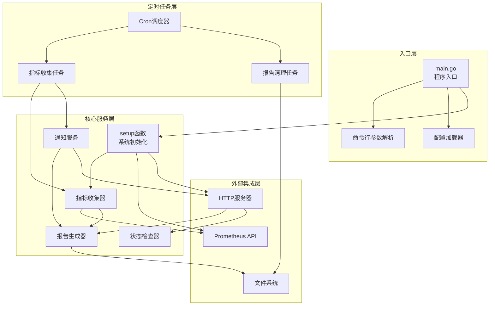

**图表来源**
- [main.go](file://main.go#L1-L230)
- [pkg/metrics/collector.go](file://pkg/metrics/collector.go#L1-L195)
- [pkg/report/generator.go](file://pkg/report/generator.go#L1-L355)

## 核心组件分析

### 1. 主程序入口 (main.go)

主程序负责整个系统的初始化和协调工作，采用分阶段的初始化策略：

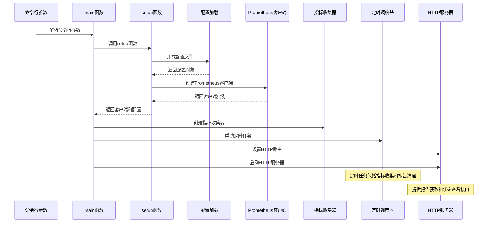

**图表来源**
- [main.go](file://main.go#L40-L80)
- [main.go](file://main.go#L150-L200)

### 2. 配置管理系统

配置系统采用 YAML 格式，支持灵活的配置选项：

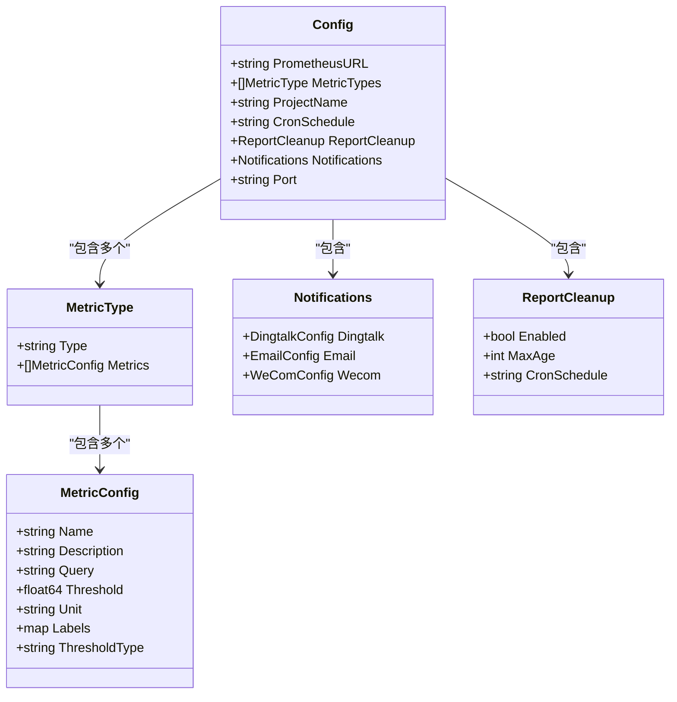

**图表来源**
- [pkg/config/config.go](file://pkg/config/config.go#L1-L37)

### 3. Prometheus 客户端封装

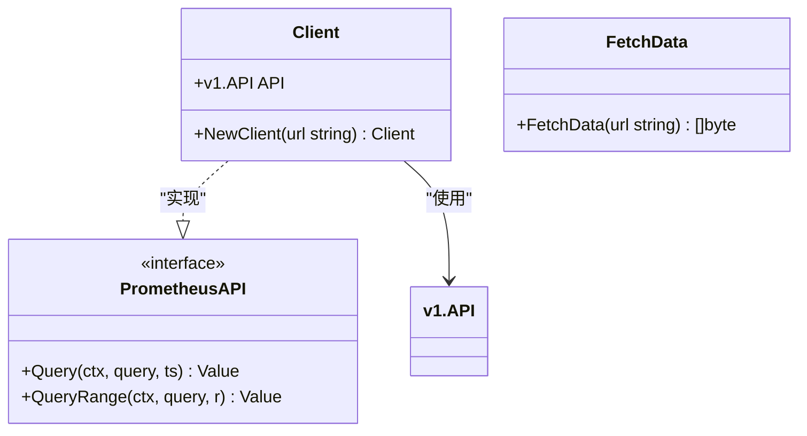

**图表来源**
- [pkg/prometheus/client.go](file://pkg/prometheus/client.go#L1-L28)
- [pkg/prometheus/prometheus.go](file://pkg/prometheus/prometheus.go#L1-L16)

**章节来源**
- [main.go](file://main.go#L1-L230)
- [pkg/config/config.go](file://pkg/config/config.go#L1-L37)
- [pkg/prometheus/client.go](file://pkg/prometheus/client.go#L1-L28)

## 依赖注入与接口抽象

### 依赖注入模式

系统广泛采用依赖注入模式，通过构造函数传递依赖项，提高代码的可测试性和灵活性：

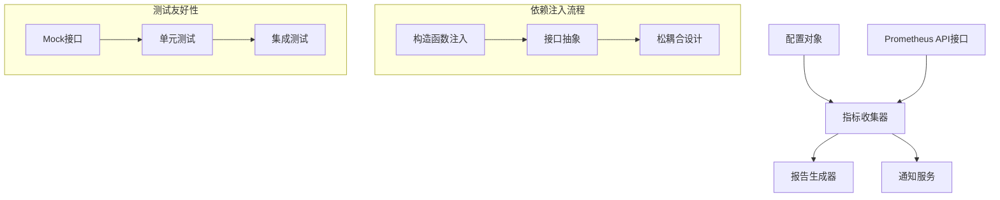

### 接口抽象设计

系统通过接口抽象实现了高度的可扩展性：

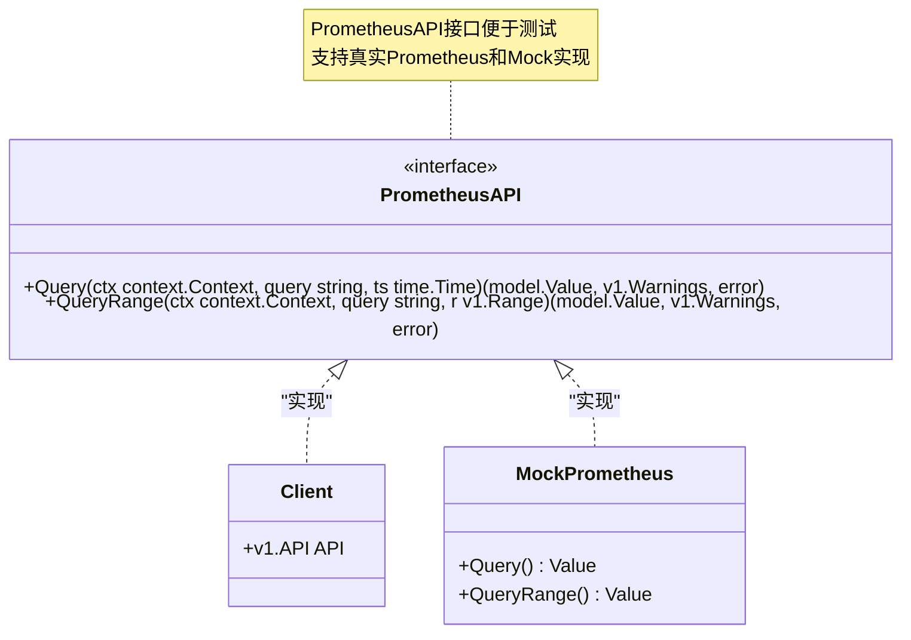

**图表来源**
- [pkg/metrics/collector.go](file://pkg/metrics/collector.go#L20-L25)

**章节来源**
- [pkg/metrics/collector.go](file://pkg/metrics/collector.go#L1-L195)

## 数据流分析

### 指标收集与处理流程

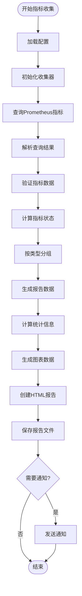

**图表来源**
- [pkg/metrics/collector.go](file://pkg/metrics/collector.go#L30-L120)
- [pkg/report/generator.go](file://pkg/report/generator.go#L100-L200)

### 报告生成与通知流程

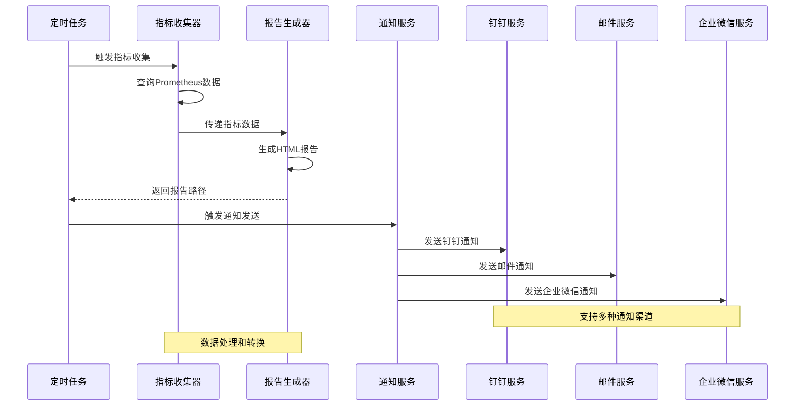

**图表来源**
- [main.go](file://main.go#L60-L100)
- [pkg/notify/notify.go](file://pkg/notify/notify.go#L1-L286)

**章节来源**
- [pkg/metrics/collector.go](file://pkg/metrics/collector.go#L30-L195)
- [pkg/report/generator.go](file://pkg/report/generator.go#L100-L355)

## 包结构设计

### 当前包结构分析

系统采用清晰的包结构组织，每个包负责特定的功能领域：

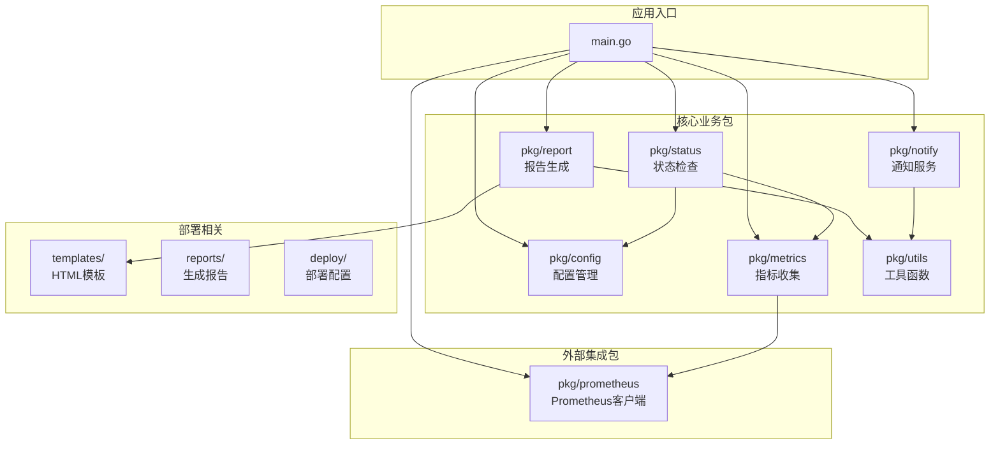

**图表来源**
- [main.go](file://main.go#L1-L30)

### 包结构设计原则

1. **单一职责原则**：每个包只负责一个明确的功能领域
2. **低耦合高内聚**：包之间通过接口通信，减少直接依赖
3. **可测试性**：每个包都可以独立测试，支持单元测试和集成测试
4. **可维护性**：清晰的包边界使得代码易于理解和维护

**章节来源**
- [main.go](file://main.go#L1-L30)

## 可扩展性设计

### 通知渠道扩展机制

系统设计了统一的通知接口，支持轻松添加新的通知渠道：

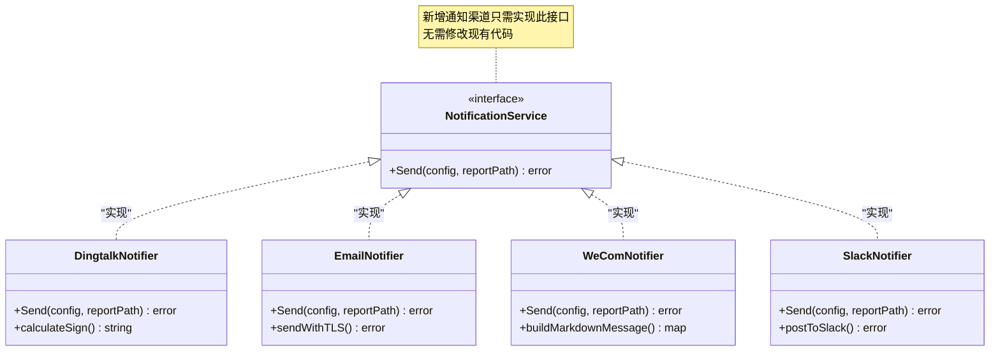

### 配置扩展机制

配置系统支持动态扩展，新的指标类型和通知渠道可以通过配置文件添加：

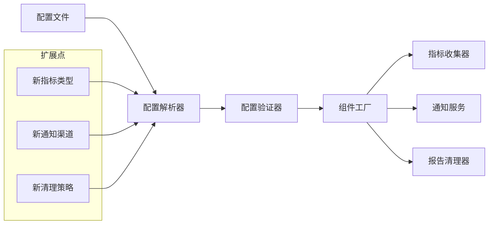

**章节来源**
- [pkg/notify/notify.go](file://pkg/notify/notify.go#L1-L286)
- [pkg/config/config.go](file://pkg/config/config.go#L1-L37)

## 性能考虑

### 并发处理能力

系统在多个层面考虑了并发处理能力：
- **HTTP服务器**：支持并发请求处理
- **定时任务**：独立的Cron调度器避免阻塞
- **指标查询**：Prometheus API支持并发查询

### 内存管理

- **报告生成**：采用流式处理，避免大量内存占用
- **数据缓存**：合理使用缓存机制，减少重复计算
- **资源清理**：定期清理过期报告文件，控制磁盘空间使用

### 网络优化

- **连接复用**：Prometheus客户端支持HTTP连接复用
- **超时控制**：合理的查询超时设置，避免长时间等待
- **错误重试**：网络异常时的自动重试机制

## 总结

PromAI 系统采用了现代化的软件架构设计，具有以下特点：

### 设计优势

1. **模块化设计**：清晰的包结构和职责分离
2. **接口抽象**：高度的可测试性和可扩展性
3. **依赖注入**：松耦合的设计提高了代码质量
4. **配置驱动**：灵活的配置系统支持动态调整
5. **多渠道通知**：统一的通知接口支持多种通知方式

### 架构亮点

- **Prometheus 集成**：充分利用 Prometheus 的强大查询能力
- **定时任务调度**：Cron 表达式支持灵活的任务调度
- **报告生成**：HTML 报告提供直观的可视化展示
- **状态监控**：健康看板提供实时状态监控

### 扩展潜力

系统设计充分考虑了未来的扩展需求，新的功能模块可以通过标准接口轻松集成，无需修改核心代码。这种设计使得系统能够适应不断变化的业务需求和技术发展。

通过这种架构设计，PromAI 不仅能够满足当前的监控报告需求，还具备了良好的扩展性和维护性，为未来的功能增强奠定了坚实的基础。