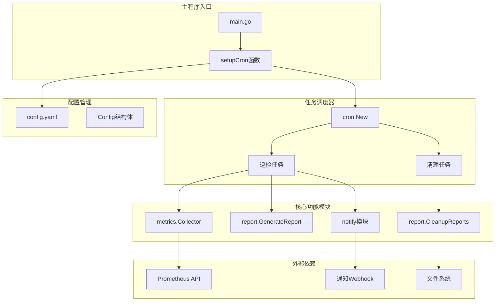
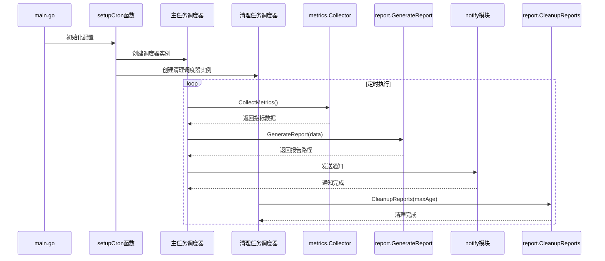
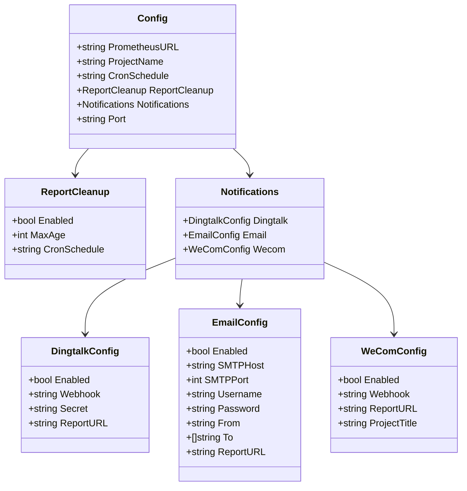
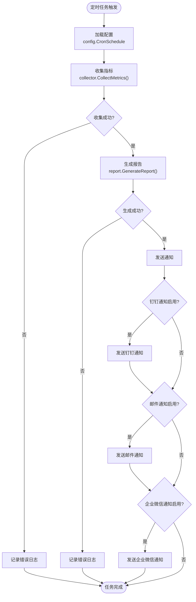
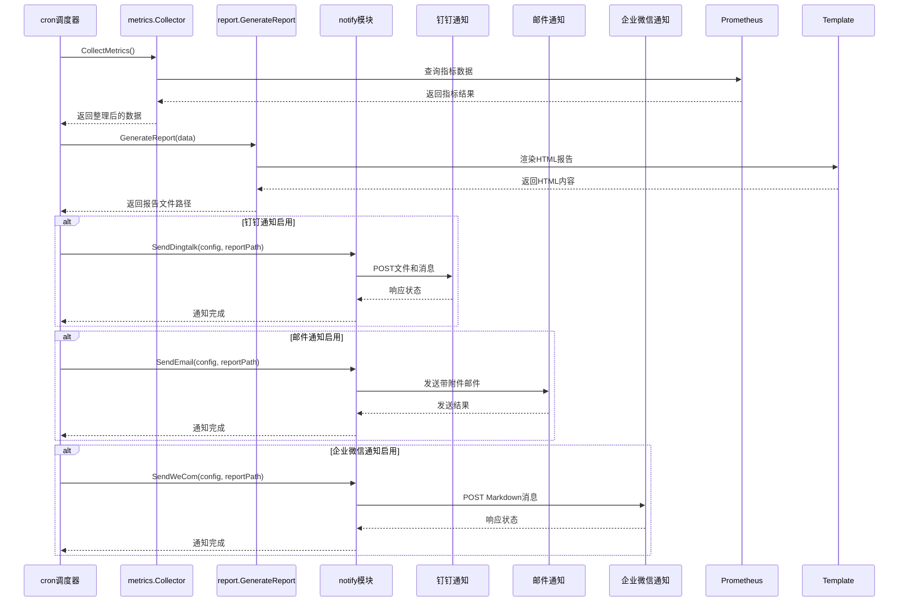
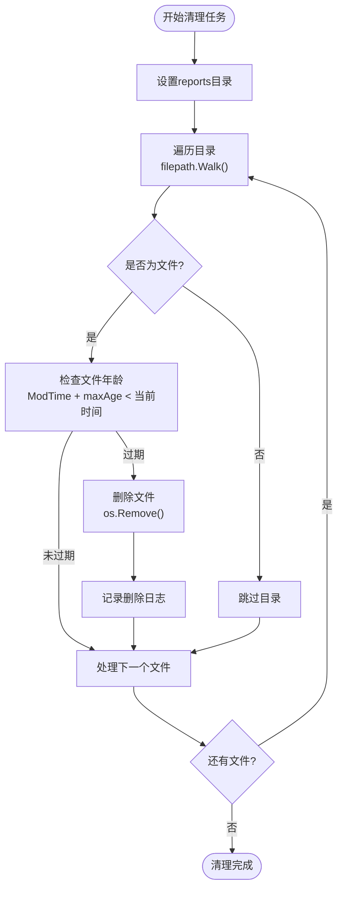
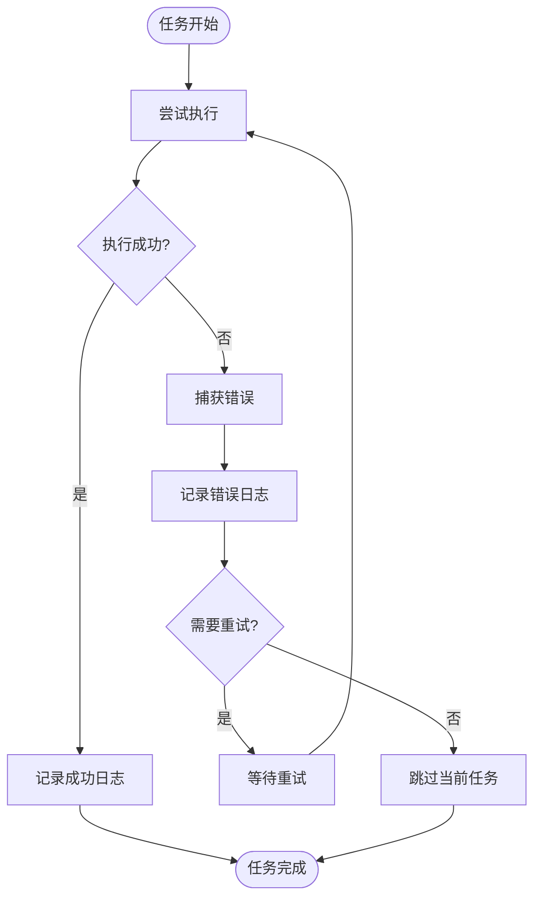

# 任务调度机制

<cite>
**本文档引用的文件**
- [main.go](file://main.go)
- [config/config.yaml](file://config/config.yaml)
- [pkg/config/config.go](file://pkg/config/config.go)
- [pkg/report/cleanup.go](file://pkg/report/cleanup.go)
- [pkg/report/generator.go](file://pkg/report/generator.go)
- [pkg/notify/notify.go](file://pkg/notify/notify.go)
- [pkg/utils/utils.go](file://pkg/utils/utils.go)
</cite>

## 目录
1. [简介](#简介)
2. [项目架构概览](#项目架构概览)
3. [核心任务调度组件](#核心任务调度组件)
4. [定时任务配置详解](#定时任务配置详解)
5. [巡检任务工作流程](#巡检任务工作流程)
6. [报告清理任务](#报告清理任务)
7. [Cron表达式配置指南](#cron表达式配置指南)
8. [性能考虑与最佳实践](#性能考虑与最佳实践)
9. [故障排除指南](#故障排除指南)
10. [总结](#总结)

## 简介

PromAI项目采用基于github.com/robfig/cron/v3的定时任务调度系统，实现了自动化的巡检任务和报告清理功能。该系统通过两个核心任务：定期收集指标、生成报告并发送通知，以及定期清理过期报告，确保系统的自动化运维能力。

## 项目架构概览



**图表来源**
- [main.go](file://main.go#L50-L120)
- [pkg/config/config.go](file://pkg/config/config.go#L1-L37)

## 核心任务调度组件

### 主要调度器初始化

系统在`main.go`的`setupCron`函数中初始化两个独立的cron调度器实例：

1. **主任务调度器**：负责收集指标、生成报告和发送通知
2. **清理任务调度器**：负责定期清理过期报告文件



**图表来源**
- [main.go](file://main.go#L50-L120)
- [pkg/report/generator.go](file://pkg/report/generator.go#L1-L50)

**章节来源**
- [main.go](file://main.go#L50-L120)

## 定时任务配置详解

### 配置结构分析

系统通过`config.yaml`文件定义定时任务配置，主要包含以下关键字段：

```yaml
# 主任务调度配置
cron_schedule: "30 9,17 * * *"  # 每天9点半和17点半执行

# 报告清理配置
report_cleanup:
  enabled: true                  # 启用清理功能
  max_age: 7                     # 保留最近7天的报告
  cron_schedule: "0 0 * * *"     # 每日凌晨执行清理
```

### 配置结构体定义



**图表来源**
- [pkg/config/config.go](file://pkg/config/config.go#L1-L37)

**章节来源**
- [config/config.yaml](file://config/config.yaml#L1-L20)
- [pkg/config/config.go](file://pkg/config/config.go#L1-L37)

## 巡检任务工作流程

### 任务执行序列

巡检任务是一个完整的自动化工作流程，包含以下步骤：



**图表来源**
- [main.go](file://main.go#L50-L120)

### 核心功能模块交互



**图表来源**
- [main.go](file://main.go#L50-L120)
- [pkg/notify/notify.go](file://pkg/notify/notify.go#L1-L100)

**章节来源**
- [main.go](file://main.go#L50-L120)
- [pkg/report/generator.go](file://pkg/report/generator.go#L1-L50)

## 报告清理任务

### 清理逻辑实现

报告清理功能通过`pkg/report/cleanup.go`中的`CleanupReports`函数实现，采用以下策略：



**图表来源**
- [pkg/report/cleanup.go](file://pkg/report/cleanup.go#L1-L37)

### 文件匹配与删除机制

清理任务使用以下技术实现文件管理：

1. **路径遍历**：使用`filepath.Walk`递归遍历reports目录
2. **时间比较**：通过`os.Stat().ModTime()`获取文件修改时间
3. **条件判断**：基于配置的`maxAge`天数进行过期判断
4. **安全删除**：使用`os.Remove`安全删除过期文件

```go
// 关键清理逻辑示例
if info.ModTime().Add(time.Duration(maxAge) * 24 * time.Hour).Before(now) {
    if err := os.Remove(path); err != nil {
        log.Printf("删除报告文件失败 %s: %v", path, err)
        return err
    }
    log.Printf("已删除过期报告: %s", path)
}
```

**章节来源**
- [pkg/report/cleanup.go](file://pkg/report/cleanup.go#L1-L37)

## Cron表达式配置指南

### 默认调度配置

系统提供了灵活的Cron表达式配置选项：

| 配置项 | 默认值 | 描述 |
|--------|--------|------|
| `cron_schedule` | `"30 9,17 * * *"` | 主任务调度：每天9点半和17点半执行 |
| `report_cleanup.cron_schedule` | `"0 0 * * *"` | 清理任务调度：每日凌晨执行 |

### Cron表达式语法

Cron表达式由5个字段组成：
```
秒 分 时 日 月 周
```

常用表达式示例：

```yaml
# 每小时执行
hourly: "0 * * * *"

# 每30分钟执行
half_hourly: "*/30 * * * *"

# 每天凌晨2点执行
daily_morning: "0 2 * * *"

# 工作日执行（周一到周五）
workdays: "0 9 * * 1-5"

# 每周日执行
weekly_sunday: "0 9 * * 0"
```

### 修改调度周期操作指南

#### 将每日任务改为每小时执行

1. **修改配置文件**：
```yaml
# 将每天9点半和17点半改为每小时执行
cron_schedule: "0 * * * *"

# 清理任务保持默认
report_cleanup:
  cron_schedule: "0 0 * * *"
```

2. **验证配置**：
```bash
# 使用crontab.guru验证表达式
# https://crontab.guru/#0_*_*_*_*
```

#### 修改清理频率

```yaml
# 每6小时清理一次
report_cleanup:
  cron_schedule: "0 */6 * * *"

# 或者每天下午3点清理
report_cleanup:
  cron_schedule: "0 15 * * *"
```

### 风险警告

**不当配置可能导致的资源争用风险**：

1. **频繁执行导致系统负载增加**
   - 过短的调度间隔会增加CPU和内存使用
   - 可能影响Prometheus查询性能

2. **并发任务冲突**
   - 多个任务同时执行可能造成文件锁定问题
   - 建议至少间隔1小时以上

3. **网络连接限制**
   - 频繁发送通知可能触发目标服务的速率限制
   - 注意钉钉、邮件服务器等的API限制

**建议配置策略**：
- 生产环境：建议至少1小时以上的间隔
- 开发测试：可适当缩短间隔以提高调试效率
- 资源受限环境：延长执行间隔减少系统负担

## 性能考虑与最佳实践

### 资源使用优化

1. **指标查询优化**
   - 合理设置Prometheus查询范围
   - 避免一次性查询过多指标
   - 使用适当的采样频率

2. **报告生成优化**
   - 异步处理大文件生成
   - 实现报告缓存机制
   - 优化HTML模板渲染

3. **通知发送优化**
   - 批量发送通知而非逐个发送
   - 实现通知队列机制
   - 设置合理的超时时间

### 监控与日志

系统提供了完善的日志记录机制：

```go
// 关键操作的日志记录
log.Printf("定时任务成功生成报告: %s", reportFilePath)
log.Printf("已启动定时任务，执行计划: %s", config.CronSchedule)
log.Printf("报告清理成功")
```

### 错误处理策略



## 故障排除指南

### 常见问题诊断

#### 1. 任务未执行

**症状**：定时任务没有按照预期执行
**排查步骤**：
1. 检查配置文件语法
2. 验证Cron表达式格式
3. 查看应用启动日志
4. 检查系统时间和时区设置

#### 2. 报告生成失败

**症状**：巡检任务执行但报告未生成
**排查步骤**：
1. 检查Prometheus连接状态
2. 验证指标查询语句
3. 查看报告生成日志
4. 检查磁盘空间和权限

#### 3. 通知发送失败

**症状**：报告生成成功但通知未发送
**排查步骤**：
1. 验证Webhook配置
2. 检查网络连接
3. 查看通知发送日志
4. 测试目标服务可用性

### 调试工具和技巧

1. **日志级别调整**
```yaml
# 在开发环境中启用详细日志
log_level: debug
```

2. **手动触发测试**
```bash
# 手动执行报告生成
curl http://localhost:8091/getreport

# 手动触发清理
./promai --config=config/config.yaml --cleanup
```

3. **配置验证**
```bash
# 验证Cron表达式语法
echo "30 9,17 * * *" | crontab -l -u user
```

**章节来源**
- [main.go](file://main.go#L50-L120)
- [pkg/notify/notify.go](file://pkg/notify/notify.go#L1-L100)

## 总结

PromAI项目的任务调度机制通过robfig/cron/v3库实现了高度可靠和灵活的自动化运维功能。系统设计遵循以下核心原则：

1. **模块化设计**：将巡检任务和清理任务分离为独立的调度器实例
2. **配置驱动**：通过YAML配置文件实现灵活的任务调度配置
3. **容错机制**：完善的错误处理和日志记录系统
4. **扩展性**：支持多种通知方式和自定义调度策略

通过合理配置Cron表达式和监控系统性能，可以构建一个稳定高效的自动化运维平台。建议根据实际业务需求调整调度频率，并建立相应的监控和告警机制，确保系统的长期稳定运行。