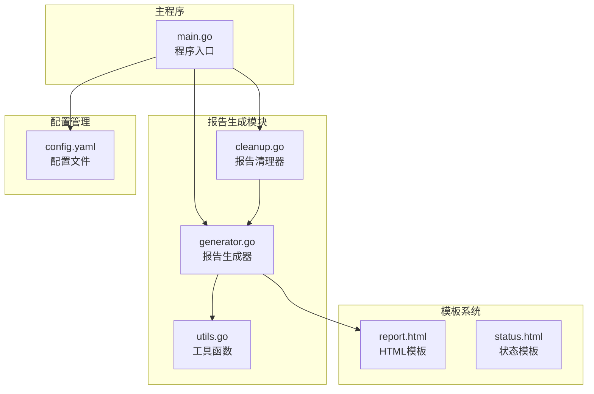
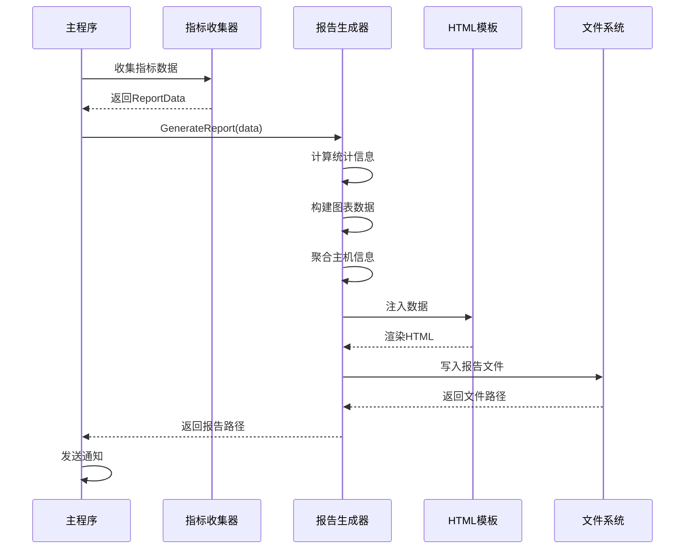
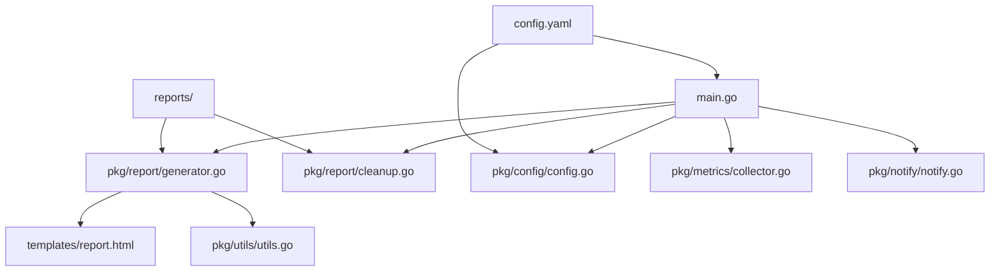

# 报告生成功能详细文档

<cite>
**本文档引用的文件**
- [generator.go](file://pkg/report/generator.go)
- [cleanup.go](file://pkg/report/cleanup.go)
- [main.go](file://main.go)
- [config.yaml](file://config/config.yaml)
- [utils.go](file://pkg/utils/utils.go)
- [report.html](file://templates/report.html)
</cite>

## 目录
1. [概述](#概述)
2. [项目结构](#项目结构)
3. [核心组件](#核心组件)
4. [架构概览](#架构概览)
5. [详细组件分析](#详细组件分析)
6. [依赖关系分析](#依赖关系分析)
7. [性能考虑](#性能考虑)
8. [故障排除指南](#故障排除指南)
9. [结论](#结论)

## 概述

PromAI项目的报告生成功能是一个完整的监控报告生成系统，负责从Prometheus收集指标数据，处理统计信息，生成HTML报告，并提供清理机制。该系统支持多种通知方式，包括钉钉、邮件和企业微信，能够自动化地定期生成巡检报告。

## 项目结构



**图表来源**
- [generator.go](file://pkg/report/generator.go#L1-L355)
- [cleanup.go](file://pkg/report/cleanup.go#L1-L37)
- [main.go](file://main.go#L1-L230)

## 核心组件

### ReportData 数据结构

ReportData是报告生成的核心数据结构，包含了所有必要的信息：

```go
type ReportData struct {
    Timestamp    time.Time
    MetricGroups map[string]*MetricGroup
    GroupOrder   []string
    ChartData    map[string]template.JS
    Project      string
    HostSummary  []HostSummary
}
```

### MetricGroup 统计分组

```go
type MetricGroup struct {
    Type          string
    MetricsByName map[string][]MetricData
    MetricOrder   []string
    Stats         GroupStats
}

type GroupStats struct {
    MaxValue      float64
    MinValue      float64
    Average       float64
    AlertCount    int
    CriticalCount int
    WarningCount  int
    TotalCount    int
}
```

### HostSummary 主机摘要

```go
type HostSummary struct {
    Hostname  string
    IP        string
    CPUCount  int64
    CPUUsage  float64
    MemTotal  float64
    MemUsed   float64
    MemUsage  float64
    DiskData  []DiskInfo
    Timestamp time.Time
}
```

**章节来源**
- [generator.go](file://pkg/report/generator.go#L15-L60)

## 架构概览



**图表来源**
- [main.go](file://main.go#L60-L120)
- [generator.go](file://pkg/report/generator.go#L80-L355)

## 详细组件分析

### GenerateReport 函数详解

GenerateReport函数是整个报告生成流程的核心，它接收ReportData数据结构并完成以下主要步骤：

#### 1. 统计信息计算

```go
// 计算每个组的统计信息
for _, group := range data.MetricGroups {
    stats := GroupStats{
        MinValue: math.MaxFloat64,
    }

    for _, metrics := range group.MetricsByName {
        for _, metric := range metrics {
            // 更新最大最小值
            stats.MaxValue = math.Max(stats.MaxValue, metric.Value)
            stats.MinValue = math.Min(stats.MinValue, metric.Value)
            stats.TotalCount++

            // 统计告警数量
            switch metric.Status {
            case "warning":
                stats.WarningCount++
                stats.AlertCount++
            case "critical":
                stats.CriticalCount++
                stats.AlertCount++
            }
        }
    }
    group.Stats = stats
}
```

#### 2. 图表数据构建

图表数据的构建过程分为两个阶段：

**第一阶段：收集唯一标签值**
```go
// 收集所有唯一的标签值和准备图表数据
labelValuesByMetric := make(map[string]map[string]bool)

for _, group := range data.MetricGroups {
    for metricName, metrics := range group.MetricsByName {
        metricKey := fmt.Sprintf("%s_%s", group.Type, metricName)
        labelValuesByMetric[metricKey] = make(map[string]bool)
        
        for _, metric := range metrics {
            for _, label := range metric.Labels {
                labelValuesByMetric[metricKey][label.Value] = true
                allLabels[label.Value] = true
            }
        }
    }
}
```

**第二阶段：生成图表数据**
```go
// 第二次遍历按标签值顺序生成图表数据
for _, group := range data.MetricGroups {
    for metricName, metrics := range group.MetricsByName {
        metricKey := fmt.Sprintf("%s_%s", group.Type, metricName)
        metricValues := make(map[string]float64)

        // 初始化所有标签值对应的指标值为0
        for labelValue := range labelValuesByMetric[metricKey] {
            metricValues[labelValue] = 0
        }

        // 填充实际的指标值
        for _, metric := range metrics {
            if len(metric.Labels) > 0 {
                metricValues[metric.Labels[0].Value] = metric.Value
            }
        }

        // 按标签值顺序添加到图表数据
        chartData[metricKey] = make([]float64, 0)
        for labelValue := range labelValuesByMetric[metricKey] {
            chartData[metricKey] = append(chartData[metricKey], metricValues[labelValue])
        }
    }
}
```

#### 3. 主机资源聚合

```go
// 按主机聚合数据
hostMap := make(map[string]*HostSummary)
for _, group := range data.MetricGroups {
    for metricName, metrics := range group.MetricsByName {
        for _, m := range metrics {
            var instance string
            for _, label := range m.Labels {
                if label.Name == "instance" {
                    instance = label.Value
                    break
                }
            }
            
            if _, exists := hostMap[instance]; !exists {
                hostMap[instance] = &HostSummary{
                    Hostname:  instance,
                    IP:        extractIP(instance),
                    DiskData:  make([]DiskInfo, 0),
                    Timestamp: m.Timestamp,
                }
            }

            host := hostMap[instance]
            
            // 根据指标名填充数据
            switch metricName {
            case "CPU使用率":
                host.CPUUsage = m.Value
            case "CPU核心数":
                host.CPUCount = int64(m.Value)
            case "内存总量":
                host.MemTotal = m.Value
            case "内存使用量":
                host.MemUsed = m.Value
                if host.MemTotal > 0 {
                    host.MemUsage = (host.MemUsed / host.MemTotal) * 100
                }
            // ... 其他指标处理
            }
        }
    }
}
```

#### 4. 模板渲染

```go
// 注册模板函数
funcMap := template.FuncMap{
    "formatBytes": formatBytes,
}

tmpl, err := template.New("report.html").Funcs(funcMap).ParseFiles("templates/report.html")
if err != nil {
    return "", fmt.Errorf("parsing template: %w", err)
}

// 创建输出文件
filename := fmt.Sprintf("reports/inspection_report_%s.html", time.Now().Format("20060102_150405"))
file, err := os.Create(filename)
if err != nil {
    return "", fmt.Errorf("creating output file: %w", err)
}
defer file.Close()

// 执行模板
if err := tmpl.Execute(file, data); err != nil {
    return "", fmt.Errorf("executing template: %w", err)
}
```

**章节来源**
- [generator.go](file://pkg/report/generator.go#L80-L355)

### 自定义模板函数

#### formatBytes 字节格式化函数

```go
func formatBytes(bytes float64) string {
    if bytes == 0 {
        return "0 B"
    }

    unitPrefixes := []string{"B", "KB", "MB", "GB", "TB"}
    const unitSize = 1024

    unitIndex := 0
    floatBytes := float64(bytes)

    for floatBytes >= unitSize && unitIndex < len(unitPrefixes)-1 {
        floatBytes /= unitSize
        unitIndex++
    }

    return fmt.Sprintf("%.2f %s", floatBytes, unitPrefixes[unitIndex])
}
```

#### extractIP IP地址提取函数

```go
func extractIP(instance string) string {
    if idx := strings.LastIndex(instance, ":"); idx != -1 {
        return instance[:idx]
    }
    return instance
}
```

**章节来源**
- [generator.go](file://pkg/report/generator.go#L65-L80)

### 报告清理功能

CleanupReports函数负责清理过期的报告文件：

```go
func CleanupReports(maxAge int) error {
    reportsDir := "reports"
    now := time.Now()

    return filepath.Walk(reportsDir, func(path string, info os.FileInfo, err error) error {
        if err != nil {
            return err
        }

        // 跳过目录本身
        if path == reportsDir {
            return nil
        }

        // 检查文件年龄
        if info.ModTime().Add(time.Duration(maxAge) * 24 * time.Hour).Before(now) {
            if err := os.Remove(path); err != nil {
                log.Printf("删除报告文件失败 %s: %v", path, err)
                return err
            }
            log.Printf("已删除过期报告: %s", path)
        }

        return nil
    })
}
```

**章节来源**
- [cleanup.go](file://pkg/report/cleanup.go#L10-L36)

### 配置系统

配置文件支持丰富的监控指标定义：

```yaml
metric_types:
- type: "基础资源使用情况"
  metrics:
  - name: "CPU使用率"
    description: "节点CPU使用率统计"
    query: "100 - (avg by(instance) (irate(node_cpu_seconds_total{mode='idle'}[5m])) * 100)"
    threshold: 80
    threshold_type: "greater"
    unit: "%"
    labels:
      instance: "节点"
```

**章节来源**
- [config.yaml](file://config/config.yaml#L40-L80)

## 依赖关系分析



**图表来源**
- [main.go](file://main.go#L1-L20)
- [generator.go](file://pkg/report/generator.go#L1-L15)

**章节来源**
- [main.go](file://main.go#L1-L230)
- [generator.go](file://pkg/report/generator.go#L1-L355)

## 性能考虑

1. **内存优化**：使用map进行数据去重和快速查找
2. **批量处理**：一次性处理所有指标数据，避免多次遍历
3. **缓存机制**：模板解析结果会被缓存
4. **异步通知**：发送通知不会阻塞报告生成流程

## 故障排除指南

### 常见问题及解决方案

1. **报告生成失败**
   - 检查Prometheus连接是否正常
   - 验证配置文件语法正确性
   - 确认模板文件存在且可读

2. **图表数据异常**
   - 检查指标查询语句是否正确
   - 验证标签值是否正确解析
   - 确认数据类型转换无误

3. **文件权限问题**
   - 确保reports目录可写
   - 检查操作系统权限设置

**章节来源**
- [generator.go](file://pkg/report/generator.go#L80-L120)

## 结论

PromAI的报告生成功能是一个设计精良、功能完整的监控报告系统。它通过清晰的数据结构设计、高效的算法实现和灵活的配置系统，为用户提供了一个可靠的自动化报告生成解决方案。系统的模块化设计使得各个组件职责明确，便于维护和扩展。

通过深入理解这些核心组件的工作原理，开发者可以根据具体需求对报告样式进行定制化修改，或者扩展新的通知方式和数据源支持。