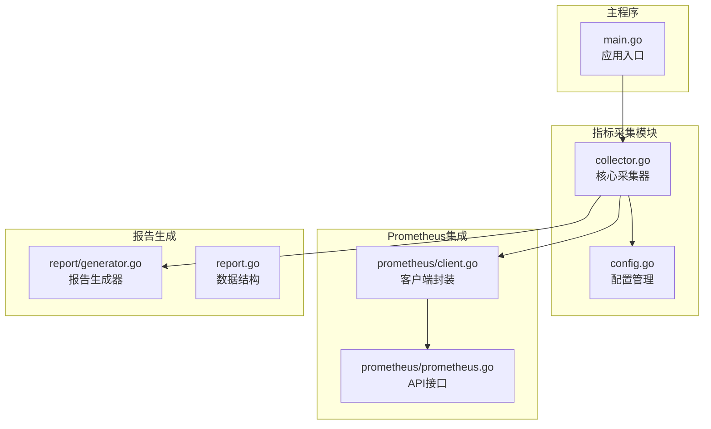
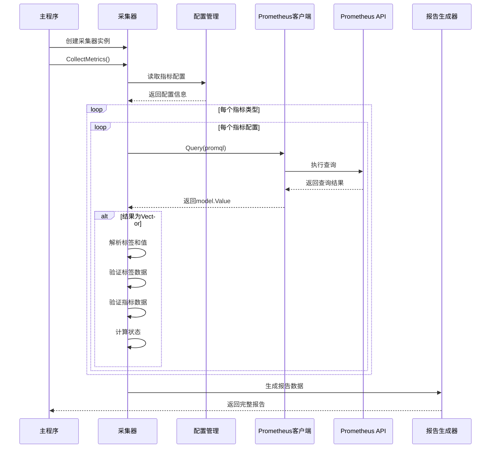
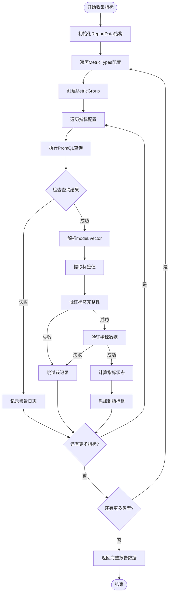
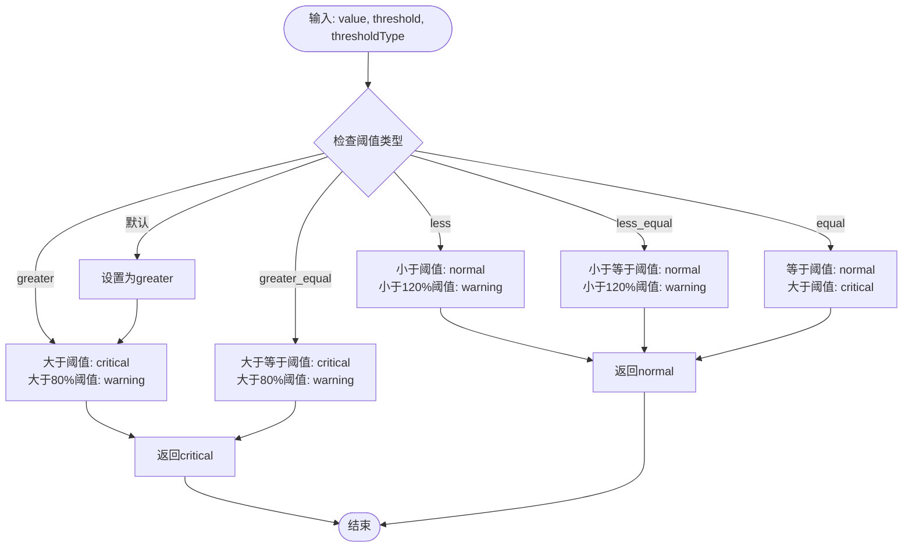
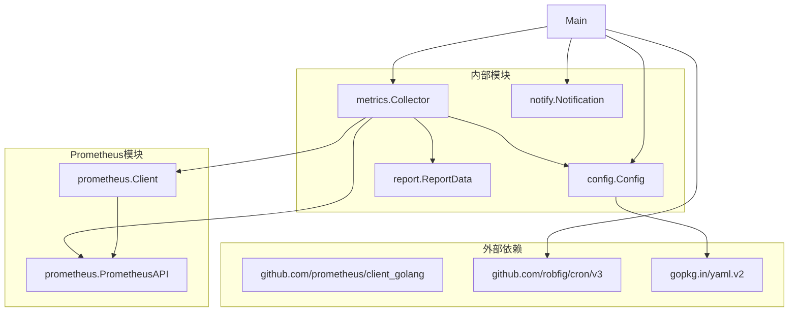

# 指标采集模块详细说明

<cite>
**本文档引用的文件**
- [pkg/metrics/collector.go](file://pkg/metrics/collector.go)
- [pkg/config/config.go](file://pkg/config/config.go)
- [pkg/prometheus/client.go](file://pkg/prometheus/client.go)
- [pkg/prometheus/prometheus.go](file://pkg/prometheus/prometheus.go)
- [pkg/report/generator.go](file://pkg/report/generator.go)
- [main.go](file://main.go)
</cite>

## 目录
1. [简介](#简介)
2. [项目结构概览](#项目结构概览)
3. [核心组件分析](#核心组件分析)
4. [架构概览](#架构概览)
5. [详细组件分析](#详细组件分析)
6. [依赖关系分析](#依赖关系分析)
7. [性能考虑](#性能考虑)
8. [故障排除指南](#故障排除指南)
9. [结论](#结论)

## 简介

PromAI项目中的指标采集模块是一个核心组件，负责从Prometheus监控系统中收集各种业务指标数据。该模块通过PrometheusAPI接口执行PromQL查询，处理查询结果，并根据配置的阈值判断指标状态。模块设计遵循分层架构原则，具有良好的可扩展性和可维护性。

## 项目结构概览

指标采集模块位于`pkg/metrics`目录下，主要包含以下核心文件：



**图表来源**
- [pkg/metrics/collector.go](file://pkg/metrics/collector.go#L1-L195)
- [pkg/prometheus/client.go](file://pkg/prometheus/client.go#L1-L28)
- [pkg/config/config.go](file://pkg/config/config.go#L1-L37)

**章节来源**
- [pkg/metrics/collector.go](file://pkg/metrics/collector.go#L1-L195)
- [pkg/config/config.go](file://pkg/config/config.go#L1-L37)

## 核心组件分析

### Collector结构体

Collector是指标采集模块的核心结构体，负责协调整个指标收集过程：

```go
type Collector struct {
    Client PrometheusAPI
    config *config.Config
}
```

该结构体包含两个关键字段：
- **Client**: 实现PrometheusAPI接口的Prometheus客户端
- **config**: 应用配置对象，包含指标类型和查询配置

### PrometheusAPI接口

PrometheusAPI接口定义了与Prometheus交互的标准方法：

```go
type PrometheusAPI interface {
    Query(ctx context.Context, query string, ts time.Time, opts ...v1.Option) (model.Value, v1.Warnings, error)
    QueryRange(ctx context.Context, query string, r v1.Range, opts ...v1.Option) (model.Value, v1.Warnings, error)
}
```

该接口提供了两种查询方式：
- **Query**: 单点查询，获取指定时间点的指标值
- **QueryRange**: 范围查询，获取一段时间内的指标序列

**章节来源**
- [pkg/metrics/collector.go](file://pkg/metrics/collector.go#L15-L25)

## 架构概览

指标采集模块采用分层架构设计，各层职责明确：



**图表来源**
- [pkg/metrics/collector.go](file://pkg/metrics/collector.go#L32-L120)
- [main.go](file://main.go#L60-L85)

## 详细组件分析

### CollectMetrics方法详解

CollectMetrics方法是指标采集的核心流程，实现了完整的数据收集、处理和验证过程：



**图表来源**
- [pkg/metrics/collector.go](file://pkg/metrics/collector.go#L32-L120)

#### 关键处理步骤

1. **配置读取与初始化**
   ```go
   for _, metricType := range c.config.MetricTypes {
       group := &report.MetricGroup{
           Type:          metricType.Type,
           MetricsByName: make(map[string][]report.MetricData),
           MetricOrder:   make([]string, 0, len(metricType.Metrics)),
       }
   ```

2. **PromQL查询执行**
   ```go
   result, _, err := c.Client.Query(ctx, metric.Query, time.Now())
   ```

3. **结果解析与标签提取**
   ```go
   switch v := result.(type) {
   case model.Vector:
       for _, sample := range v {
           availableLabels := make(map[string]string)
           for labelName, labelValue := range sample.Metric {
               availableLabels[string(labelName)] = string(labelValue)
           }
   ```

4. **标签映射与验证**
   ```go
   labels := make([]report.LabelData, 0, len(metric.Labels))
   for configLabel, configAlias := range metric.Labels {
       labelValue := "-"
       if rawValue, exists := availableLabels[configLabel]; exists && rawValue != "" {
           labelValue = rawValue
       }
       labels = append(labels, report.LabelData{
           Name:  configLabel,
           Alias: configAlias,
           Value: labelValue,
       })
   }
   ```

**章节来源**
- [pkg/metrics/collector.go](file://pkg/metrics/collector.go#L32-L120)

### 状态计算机制

getStatus函数实现了基于阈值类型的智能状态判断逻辑：



**图表来源**
- [pkg/metrics/collector.go](file://pkg/metrics/collector.go#L122-L158)

#### 状态判断规则

不同阈值类型的状态判断逻辑：

| 阈值类型 | 正常条件 | 警告条件 | 严重条件 |
|---------|----------|----------|----------|
| greater | value ≤ threshold | threshold < value ≤ 0.8×threshold | value > threshold |
| greater_equal | value < threshold | threshold ≤ value ≤ 0.8×threshold | value ≥ threshold |
| less | value ≥ threshold | threshold > value ≥ 1.2×threshold | value < threshold |
| less_equal | value > threshold | threshold ≥ value ≥ 1.2×threshold | value ≤ threshold |
| equal | value ≠ threshold | value > threshold | value = threshold |

**章节来源**
- [pkg/metrics/collector.go](file://pkg/metrics/collector.go#L122-L158)

### 数据验证机制

#### validateLabels函数

validateLabels函数确保所有标签都有有效值：

```go
func validateLabels(labels []report.LabelData) bool {
    for _, label := range labels {
        if label.Value == "" || label.Value == "-" {
            return false
        }
    }
    return true
}
```

#### validateMetricData函数

validateMetricData函数执行更全面的数据完整性验证：

```go
func validateMetricData(data report.MetricData, configLabels map[string]string) error {
    if len(data.Labels) != len(configLabels) {
        return fmt.Errorf("标签数量不匹配: 期望 %d, 实际 %d",
            len(configLabels), len(data.Labels))
    }

    labelMap := make(map[string]bool)
    for _, label := range data.Labels {
        if _, exists := configLabels[label.Name]; !exists {
            return fmt.Errorf("发现未配置的标签: %s", label.Name)
        }
        if label.Value == "" || label.Value == "-" {
            return fmt.Errorf("标签 %s 值为空", label.Name)
        }
        labelMap[label.Name] = true
    }

    return nil
}
```

**章节来源**
- [pkg/metrics/collector.go](file://pkg/metrics/collector.go#L160-L185)

### Prometheus客户端集成

#### Client结构体

Prometheus客户端封装了与Prometheus API的交互：

```go
type Client struct {
    API v1.API
}

func NewClient(url string) (*Client, error) {
    client, err := api.NewClient(api.Config{
        Address: url,
    })
    if err != nil {
        return nil, fmt.Errorf("creating prometheus client: %w", err)
    }

    return &Client{
        API: v1.NewAPI(client),
    }, nil
}
```

**章节来源**
- [pkg/prometheus/client.go](file://pkg/prometheus/client.go#L8-L27)

## 依赖关系分析

指标采集模块的依赖关系清晰明确：



**图表来源**
- [pkg/metrics/collector.go](file://pkg/metrics/collector.go#L1-L15)
- [main.go](file://main.go#L1-L25)

**章节来源**
- [pkg/metrics/collector.go](file://pkg/metrics/collector.go#L1-L15)
- [main.go](file://main.go#L1-L25)

## 性能考虑

### 查询优化策略

1. **并发查询**: 当前实现采用串行查询，可以考虑使用Go协程实现并发查询以提高性能
2. **缓存机制**: 可以引入本地缓存减少重复查询
3. **批量处理**: 对于大量指标，可以考虑批量查询优化

### 内存管理

1. **数据结构优化**: 使用适当的容量预分配避免频繁扩容
2. **垃圾回收**: 及时释放不再使用的临时对象
3. **大对象处理**: 对于大型查询结果，考虑流式处理

### 错误处理策略

1. **优雅降级**: 单个指标查询失败不影响整体流程
2. **重试机制**: 对于网络错误可以实现指数退避重试
3. **超时控制**: 合理设置查询超时时间避免长时间阻塞

## 故障排除指南

### 常见问题及解决方案

#### 1. 查询失败问题

**症状**: 日志显示"查询指标失败"警告
**可能原因**:
- Prometheus服务器不可达
- PromQL语法错误
- 查询超时

**解决方案**:
```go
// 在main.go中添加重试机制
result, _, err := c.Client.Query(ctx, metric.Query, time.Now())
if err != nil {
    log.Printf("警告: 查询指标 %s 失败: %v", metric.Name, err)
    // 可以在这里添加重试逻辑
    continue
}
```

#### 2. 标签数据不完整

**症状**: 日志显示"标签数据不完整"警告
**可能原因**:
- Prometheus中缺少预期标签
- 标签映射配置错误
- 时间窗口内没有数据

**解决方案**:
```go
// 在validateLabels中添加调试信息
func validateLabels(labels []report.LabelData) bool {
    for _, label := range labels {
        if label.Value == "" || label.Value == "-" {
            log.Printf("标签缺失: 名称=%s, 别名=%s", label.Name, label.Alias)
            return false
        }
    }
    return true
}
```

#### 3. 配置解析错误

**症状**: 应用启动时配置加载失败
**可能原因**:
- config.yaml格式错误
- 必需字段缺失
- 类型转换失败

**解决方案**:
```go
// 在loadConfig中添加详细错误信息
var config config.Config
if err := yaml.Unmarshal(data, &config); err != nil {
    return nil, fmt.Errorf("解析配置文件失败: %w, 错误位置: %v", err, err.(*yaml.TypeError).Errors)
}
```

**章节来源**
- [pkg/metrics/collector.go](file://pkg/metrics/collector.go#L50-L60)
- [main.go](file://main.go#L25-L45)

## 结论

PromAI项目的指标采集模块展现了优秀的软件架构设计，具有以下特点：

### 设计优势

1. **模块化设计**: 清晰的职责分离，便于维护和扩展
2. **接口抽象**: 通过PrometheusAPI接口实现松耦合
3. **数据验证**: 完善的数据完整性检查机制
4. **状态管理**: 智能的状态计算算法
5. **错误处理**: 健壮的错误处理和日志记录

### 扩展建议

1. **性能优化**: 实现查询缓存和并发处理
2. **监控增强**: 添加模块级别的性能指标
3. **配置热更新**: 支持运行时配置修改
4. **插件机制**: 允许自定义指标处理器
5. **测试覆盖**: 增加单元测试和集成测试

### 自定义新指标开发指导

要添加新的指标类型，需要按照以下步骤操作：

1. **更新配置结构**:
```go
type MetricType struct {
    Type    string         `yaml:"type"`
    Metrics []MetricConfig `yaml:"metrics"`
}

type MetricConfig struct {
    Name          string            `yaml:"name"`
    Description   string            `yaml:"description"`
    Query         string            `yaml:"query"`
    Threshold     float64           `yaml:"threshold"`
    Unit          string            `yaml:"unit"`
    Labels        map[string]string `yaml:"labels"`
    ThresholdType string            `yaml:"threshold_type"`
}
```

2. **在config.yaml中添加配置**:
```yaml
metric_types:
  - type: "系统资源"
    metrics:
      - name: "CPU使用率"
        description: "系统CPU使用百分比"
        query: "100 - (avg(rate(node_cpu_seconds_total{mode='idle'}[5m])) * 100)"
        threshold: 80
        unit: "%"
        labels:
          instance: "主机实例"
          cpu: "CPU编号"
        threshold_type: "greater"
```

3. **确保PromQL查询正确**: 查询应返回model.Vector类型的结果
4. **配置标签映射**: 确保labels配置与Prometheus返回的标签一致
5. **测试验证**: 使用测试工具验证查询结果和数据处理逻辑

通过遵循这些指导原则，开发者可以轻松地扩展指标采集模块，满足不同的业务需求。