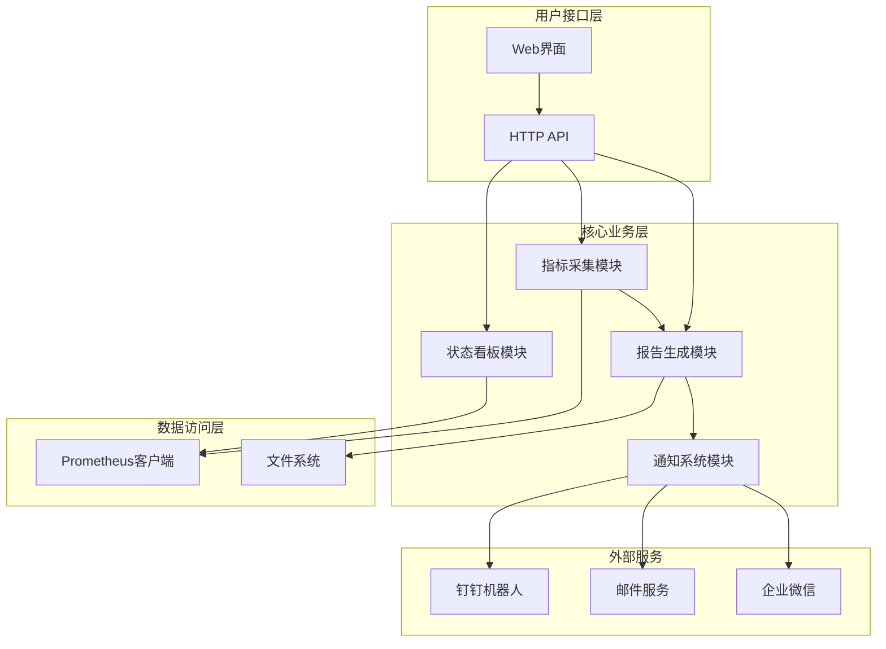
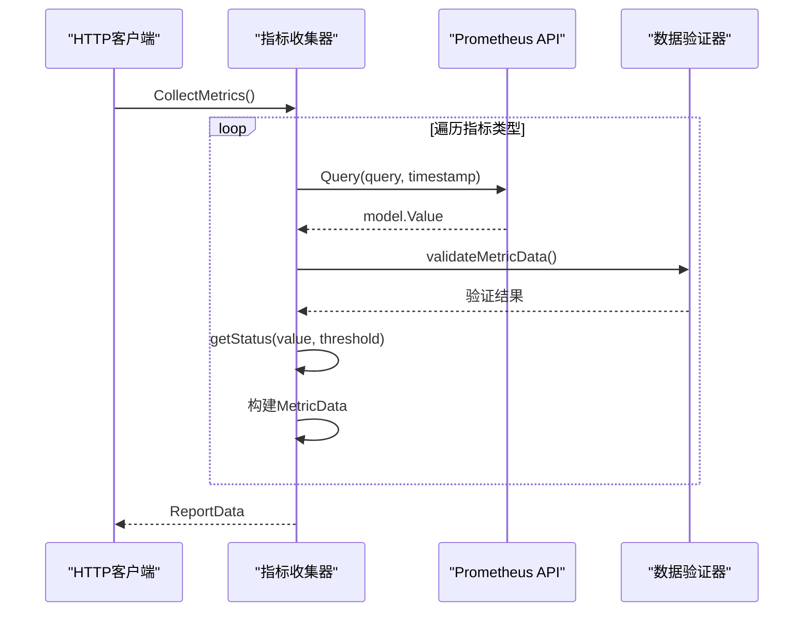
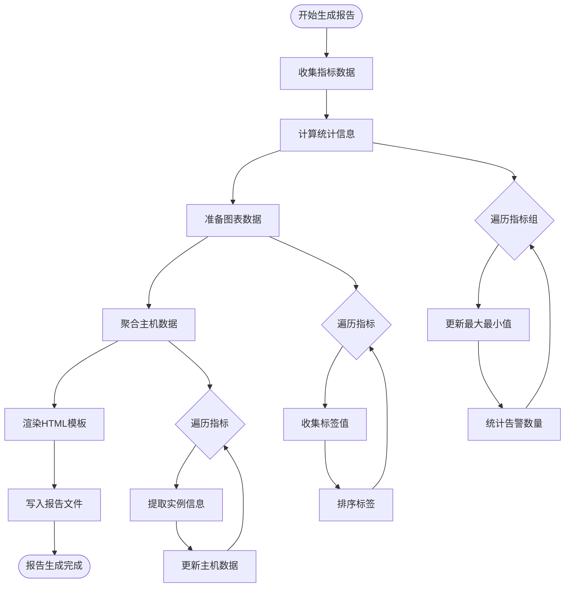
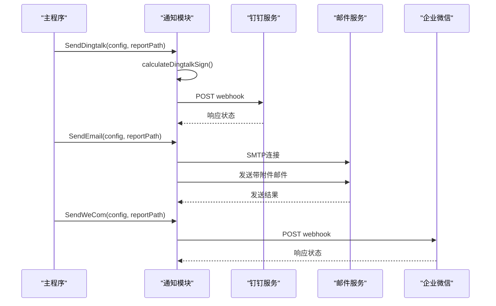
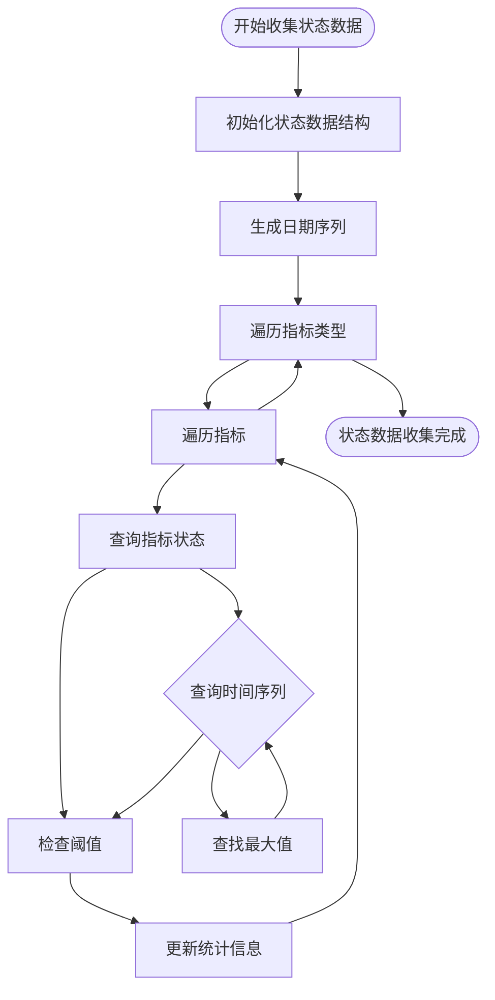
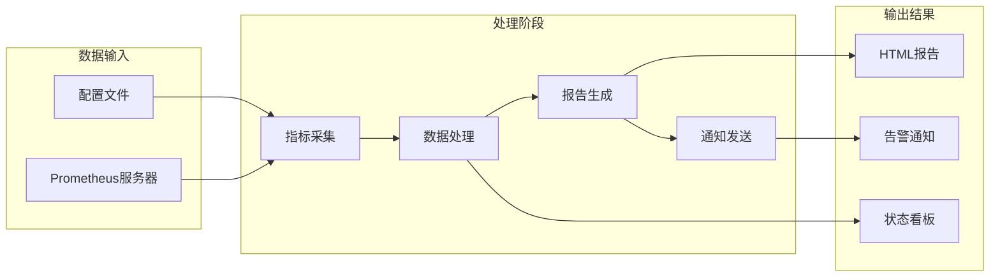

# PromAI 核心功能模块文档

<cite>
**本文档引用的文件**
- [main.go](file://main.go)
- [pkg/metrics/collector.go](file://pkg/metrics/collector.go)
- [pkg/report/generator.go](file://pkg/report/generator.go)
- [pkg/notify/notify.go](file://pkg/notify/notify.go)
- [pkg/status/status.go](file://pkg/status/status.go)
- [pkg/prometheus/client.go](file://pkg/prometheus/client.go)
- [pkg/config/config.go](file://pkg/config/config.go)
- [README.md](file://README.md)
</cite>

## 目录
1. [项目概述](#项目概述)
2. [核心架构设计](#核心架构设计)
3. [指标采集模块](#指标采集模块)
4. [报告生成模块](#报告生成模块)
5. [通知系统模块](#通知系统模块)
6. [状态看板模块](#状态看板模块)
7. [数据流分析](#数据流分析)
8. [性能考虑](#性能考虑)
9. [故障排除指南](#故障排除指南)
10. [总结](#总结)

## 项目概述

PromAI是一个基于Prometheus的监控报告自动生成工具，旨在简化监控数据的收集和展示过程。该工具通过四个核心功能模块实现完整的巡检闭环：指标采集、报告生成、通知系统和状态看板。

### 主要特性

- **多指标类型支持**：支持基础资源、Kubernetes、应用服务等多种监控指标
- **智能状态判断**：自动计算指标状态和告警级别（正常、警告、严重）
- **可视化报告**：生成包含数据表格和图表的HTML报告
- **灵活配置**：支持自定义指标阈值和标签别名
- **多渠道通知**：集成钉钉、邮件、企业微信发送通知
- **历史趋势分析**：提供7天历史数据的状态趋势展示

## 核心架构设计

PromAI采用模块化架构设计，各功能模块职责明确，通过清晰的接口进行交互。



**图表来源**
- [main.go](file://main.go#L1-L50)
- [pkg/metrics/collector.go](file://pkg/metrics/collector.go#L1-L30)
- [pkg/report/generator.go](file://pkg/report/generator.go#L1-L30)

## 指标采集模块

指标采集模块是整个系统的核心，负责从Prometheus服务器获取实时监控数据并进行预处理。

### 核心功能

指标采集模块的主要职责包括：
- 执行PromQL查询获取实时指标数据
- 处理查询结果并转换为标准化格式
- 应用阈值规则判断指标状态
- 验证数据完整性和有效性

### 实现原理



**图表来源**
- [pkg/metrics/collector.go](file://pkg/metrics/collector.go#L35-L120)
- [pkg/metrics/collector.go](file://pkg/metrics/collector.go#L140-L194)

### 关键算法

#### 状态判断算法

指标采集模块实现了智能的状态判断算法，根据不同的阈值类型和比较规则确定指标状态：

```go
func getStatus(value, threshold float64, thresholdType string) string {
    if thresholdType == "" {
        thresholdType = "greater"
    }
    switch thresholdType {
    case "greater":
        if value > threshold {
            return "critical"
        } else if value >= threshold*0.8 {
            return "warning"
        }
    case "greater_equal":
        if value >= threshold {
            return "critical"
        } else if value >= threshold*0.8 {
            return "warning"
        }
    case "less":
        if value < threshold {
            return "normal"
        } else if value <= threshold*1.2 {
            return "warning"
        }
    case "less_equal":
        if value <= threshold {
            return "normal"
        } else if value <= threshold*1.2 {
            return "warning"
        }
    case "equal":
        if value == threshold {
            return "normal"
        } else if value > threshold {
            return "critical"
        }
        return "critical"
    }
    return "normal"
}
```

#### 数据验证机制

为了确保数据质量，模块实现了多层次的数据验证：

1. **标签数量验证**：确保指标的标签数量与配置一致
2. **标签值完整性检查**：验证所有必需标签都有有效值
3. **数值有效性检查**：验证指标值是否在合理范围内

**章节来源**
- [pkg/metrics/collector.go](file://pkg/metrics/collector.go#L140-L194)

## 报告生成模块

报告生成模块负责将采集到的指标数据转换为美观的HTML报告，提供直观的数据展示和分析功能。

### 核心功能

- **模板渲染**：使用Go模板引擎生成HTML报告
- **数据聚合**：对指标数据进行统计和聚合分析
- **图表生成**：动态生成可视化图表数据
- **主机资源聚合**：按主机维度汇总资源使用情况

### 实现原理



**图表来源**
- [pkg/report/generator.go](file://pkg/report/generator.go#L100-L200)
- [pkg/report/generator.go](file://pkg/report/generator.go#L250-L354)

### 数据处理流程

报告生成模块的数据处理遵循以下流程：

1. **统计信息计算**：为每个指标组计算最大值、最小值、平均值和告警统计
2. **图表数据准备**：收集所有唯一的标签值并准备图表数据
3. **主机资源聚合**：按主机维度汇总CPU、内存、磁盘使用情况
4. **模板渲染**：使用HTML模板和JavaScript图表库生成最终报告

### 报告模板系统

报告生成模块使用Go的模板引擎，支持自定义函数和复杂的HTML结构：

```go
funcMap := template.FuncMap{
    "formatBytes": formatBytes,
}

tmpl, err := template.New("report.html").Funcs(funcMap).ParseFiles("templates/report.html")
if err != nil {
    return "", fmt.Errorf("parsing template: %w", err)
}
```

**章节来源**
- [pkg/report/generator.go](file://pkg/report/generator.go#L100-L200)
- [pkg/report/generator.go](file://pkg/report/generator.go#L300-L354)

## 通知系统模块

通知系统模块提供了多种通知渠道，确保监控告警能够及时传达给相关人员。

### 支持的通知渠道

- **钉钉机器人**：支持文件上传和Markdown消息格式
- **邮件通知**：支持SMTP协议发送带附件的HTML邮件
- **企业微信**：支持企业微信机器人推送消息

### 实现原理



**图表来源**
- [pkg/notify/notify.go](file://pkg/notify/notify.go#L40-L120)
- [pkg/notify/notify.go](file://pkg/notify/notify.go#L140-L200)
- [pkg/notify/notify.go](file://pkg/notify/notify.go#L220-L285)

### 钉钉通知实现

钉钉通知模块实现了安全的签名认证机制：

```go
func calculateDingtalkSign(timestamp int64, secret string) string {
    stringToSign := fmt.Sprintf("%d\n%s", timestamp, secret)
    h := hmac.New(sha256.New, []byte(secret))
    h.Write([]byte(stringToSign))
    return url.QueryEscape(base64.StdEncoding.EncodeToString(h.Sum(nil)))
}
```

### 邮件通知配置

邮件通知支持丰富的配置选项：

```go
type EmailConfig struct {
    Enabled   bool     `yaml:"enabled"`
    SMTPHost  string   `yaml:"smtp_host"`
    SMTPPort  int      `yaml:"smtp_port"`
    Username  string   `yaml:"username"`
    Password  string   `yaml:"password"`
    From      string   `yaml:"from"`
    To        []string `yaml:"to"`
    ReportURL string   `yaml:"report_url"`
}
```

**章节来源**
- [pkg/notify/notify.go](file://pkg/notify/notify.go#L40-L120)
- [pkg/notify/notify.go](file://pkg/notify/notify.go#L140-L200)
- [pkg/notify/notify.go](file://pkg/notify/notify.go#L220-L285)

## 状态看板模块

状态看板模块提供历史数据的可视化展示，帮助用户了解系统状态的变化趋势。

### 核心功能

- **历史数据查询**：查询过去7天的指标状态数据
- **状态趋势分析**：展示每日指标状态变化趋势
- **统计信息汇总**：提供总体状态统计和分类统计
- **可视化展示**：使用图表展示状态趋势

### 实现原理



**图表来源**
- [pkg/status/status.go](file://pkg/status/status.go#L50-L120)
- [pkg/status/status.go](file://pkg/status/status.go#L140-L200)

### 状态查询算法

状态看板模块实现了高效的历史数据查询算法：

```go
func queryMetricStatus(client metrics.PrometheusAPI, metric config.MetricConfig, date string) (string, error) {
    ctx := context.Background()
    
    // 设置查询时间范围为那一天的0点到23:59:59
    startTime := time.Date(time.Now().Year(), dateTime.Month(), dateTime.Day(), 0, 0, 0, 0, time.Local)
    endTime := startTime.Add(24 * time.Hour).Add(-time.Second)
    
    // 查询当天的所有数据点
    result, _, err := client.QueryRange(ctx, metric.Query, v1.Range{
        Start: startTime,
        End:   endTime,
        Step:  time.Hour, // 每小时一个采样点
    })
    
    // 分析最大值并判断状态
    switch v := result.(type) {
    case model.Matrix:
        maxValue := float64(0)
        for _, series := range v {
            for _, sample := range series.Values {
                value := float64(sample.Value)
                if value > maxValue {
                    maxValue = value
                }
            }
        }
        return checkThreshold(maxValue, metric.Threshold, metric.ThresholdType), nil
    }
}
```

### 状态统计结构

状态看板模块维护了详细的状态统计信息：

```go
type StatusSummary struct {
    Normal       int              // 正常状态计数
    Warning      int              // 警告状态计数
    Abnormal     int              // 异常状态计数
    TotalMetrics int              // 总指标数
    TypeCounts   map[string]int   // 每种类型的指标数量
}

type MetricStatus struct {
    Name          string           // 指标名称
    DailyStatus   map[string]string // 每日状态(key: 日期, value: normal/warning/abnormal)
    Threshold     float64          // 阈值
    Unit          string           // 单位
    ThresholdType string           // 阈值类型
}
```

**章节来源**
- [pkg/status/status.go](file://pkg/status/status.go#L50-L120)
- [pkg/status/status.go](file://pkg/status/status.go#L140-L200)
- [pkg/status/status.go](file://pkg/status/status.go#L220-L294)

## 数据流分析

PromAI系统的数据流遵循清晰的处理链路，从指标采集到最终报告生成形成完整的闭环。

### 整体数据流



**图表来源**
- [main.go](file://main.go#L60-L120)
- [pkg/metrics/collector.go](file://pkg/metrics/collector.go#L35-L80)

### 模块间协作关系

各功能模块之间通过标准化的数据结构进行协作：

1. **指标采集 → 报告生成**：传递ReportData结构
2. **报告生成 → 通知系统**：传递报告文件路径
3. **状态看板 → 报告生成**：共享配置和数据结构
4. **通知系统 → 外部服务**：独立处理不同通知渠道

### 数据格式标准化

所有模块都使用统一的数据格式确保兼容性：

```go
type ReportData struct {
    Timestamp    time.Time
    MetricGroups map[string]*MetricGroup
    GroupOrder   []string
    ChartData    map[string]template.JS
    Project      string
    HostSummary  []HostSummary
}

type MetricGroup struct {
    Type          string
    MetricsByName map[string][]MetricData
    MetricOrder   []string
    Stats         GroupStats
}
```

## 性能考虑

### 并发处理

系统采用goroutine并发处理多个指标的查询，提高整体效率：

```go
// 在定时任务中并发处理
go func() {
    data, err := collector.CollectMetrics()
    if err != nil {
        log.Printf("定时任务收集指标失败: %v", err)
        return
    }
    // 处理报告生成和通知
}()
```

### 缓存策略

- **查询结果缓存**：避免重复查询相同的时间段
- **模板缓存**：预编译HTML模板减少解析开销
- **文件系统缓存**：利用操作系统缓存加速文件读写

### 内存优化

- **流式处理**：大文件生成时采用流式写入
- **对象池**：复用频繁创建的对象减少GC压力
- **延迟加载**：按需加载非关键数据

## 故障排除指南

### 常见问题诊断

#### 指标采集失败

**症状**：指标查询返回空结果或错误
**排查步骤**：
1. 检查Prometheus服务器连接状态
2. 验证PromQL查询语法正确性
3. 确认时间范围设置合理
4. 检查标签匹配条件

#### 报告生成异常

**症状**：HTML报告无法正常显示或内容缺失
**排查步骤**：
1. 检查模板文件是否存在且格式正确
2. 验证数据结构完整性
3. 确认文件写入权限
4. 检查JavaScript依赖是否加载

#### 通知发送失败

**症状**：告警通知未送达或发送失败
**排查步骤**：
1. 验证通知配置参数正确性
2. 检查网络连接和防火墙设置
3. 确认第三方服务API可用性
4. 查看详细错误日志

### 日志分析

系统提供详细的日志记录，便于问题定位：

```go
log.Printf("指标 [%s] 查询结果: %+v", metric.Name, result)
log.Printf("指标 [%s] 状态: %s", metric.Name, status)
log.Printf("报告生成成功: %s", filename)
```

**章节来源**
- [pkg/metrics/collector.go](file://pkg/metrics/collector.go#L50-L80)
- [pkg/report/generator.go](file://pkg/report/generator.go#L340-L354)

## 总结

PromAI通过四个核心功能模块构建了一个完整的监控报告自动化系统：

1. **指标采集模块**：负责从Prometheus获取实时监控数据，实现智能状态判断和数据验证
2. **报告生成模块**：将采集的数据转换为美观的HTML报告，提供直观的可视化展示
3. **通知系统模块**：集成多种通知渠道，确保告警信息及时传达
4. **状态看板模块**：展示历史状态趋势，帮助用户了解系统变化规律

这些模块通过清晰的接口和标准化的数据格式紧密协作，形成了一个高效、可靠的监控报告自动化系统。系统具有良好的扩展性，支持自定义指标配置和通知渠道，能够满足不同场景下的监控需求。

通过合理的架构设计和性能优化，PromAI能够在保证功能完整性的同时，提供良好的用户体验和系统稳定性。无论是日常监控还是紧急告警，都能够快速响应并提供准确的信息支持。