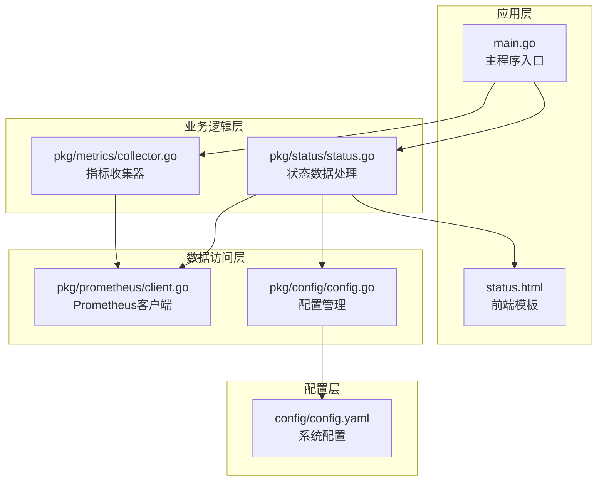
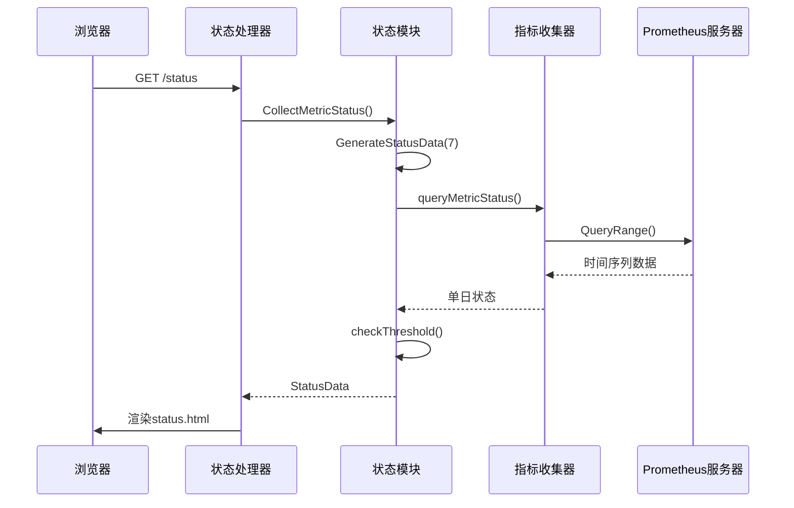
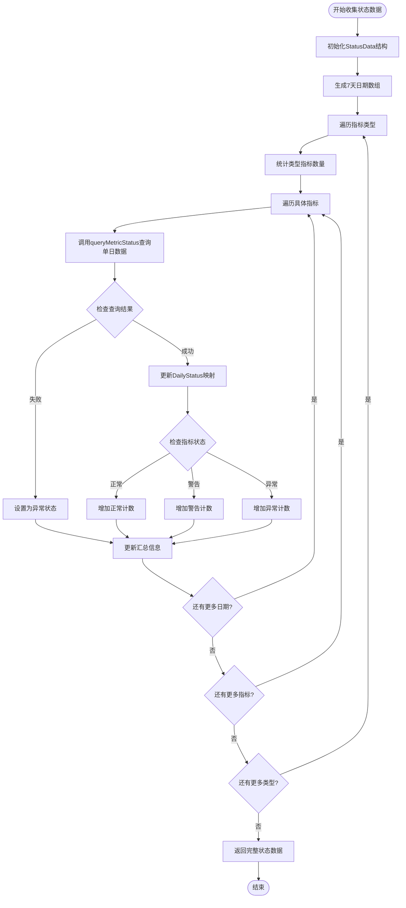
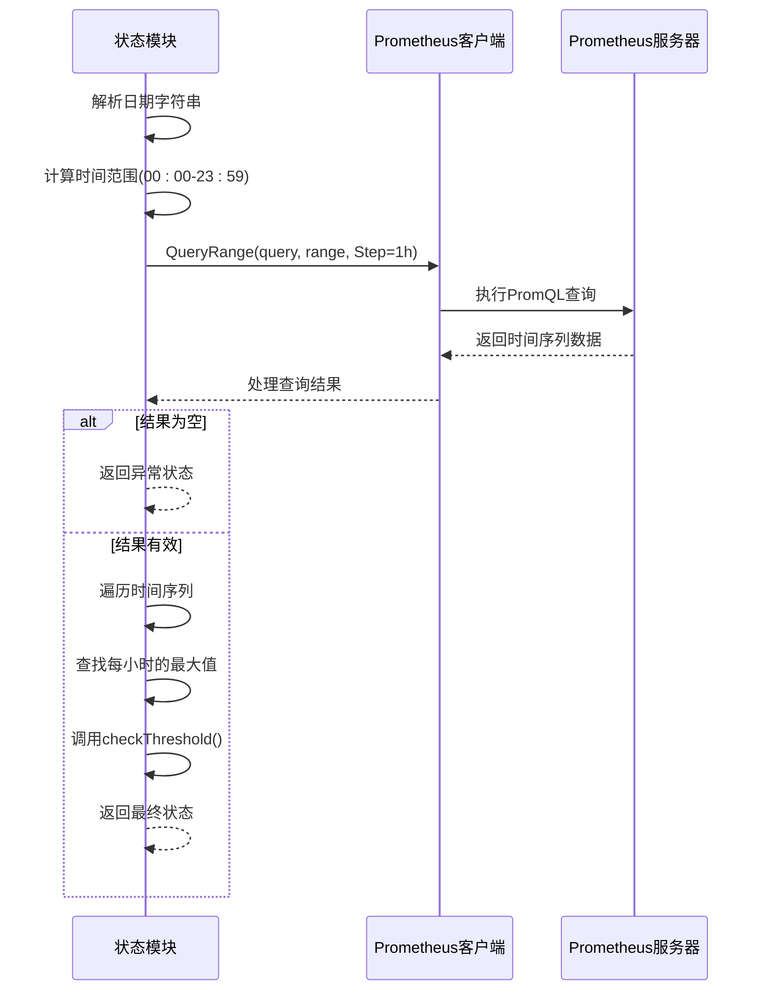
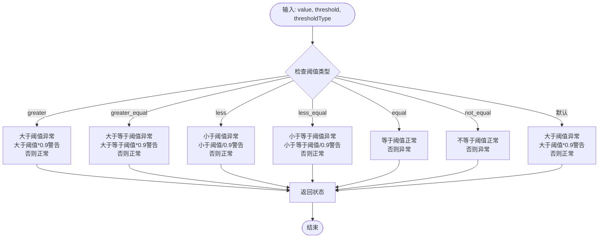
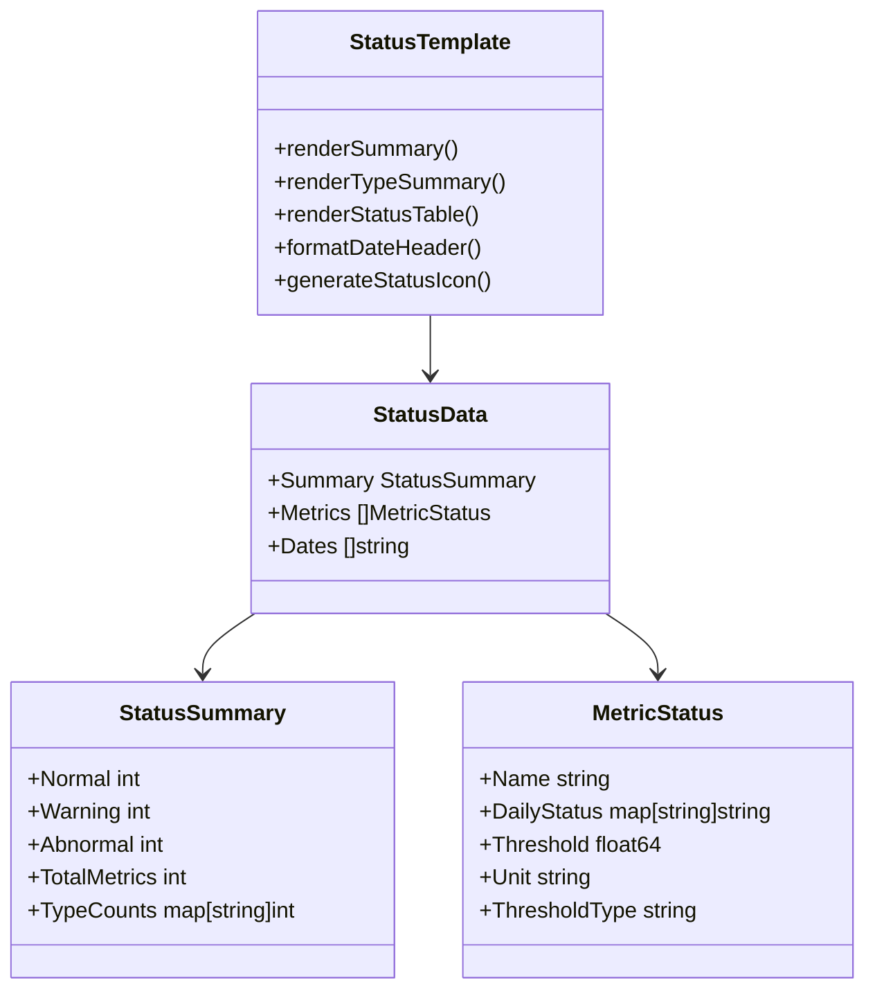
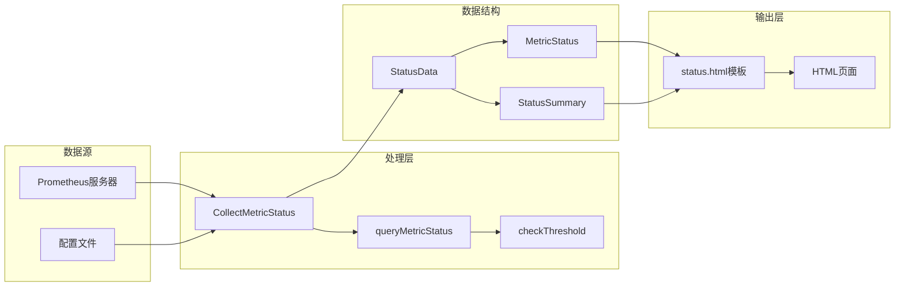

# 状态看板系统文档

<cite>
**本文档引用的文件**
- [status.go](file://pkg/status/status.go)
- [client.go](file://pkg/prometheus/client.go)
- [prometheus.go](file://pkg/prometheus/prometheus.go)
- [config.yaml](file://config/config.yaml)
- [status.html](file://templates/status.html)
- [main.go](file://main.go)
- [config.go](file://pkg/config/config.go)
- [collector.go](file://pkg/metrics/collector.go)
</cite>

## 目录
1. [简介](#简介)
2. [项目结构](#项目结构)
3. [核心组件](#核心组件)
4. [架构概览](#架构概览)
5. [详细组件分析](#详细组件分析)
6. [数据流分析](#数据流分析)
7. [性能优化建议](#性能优化建议)
8. [故障排除指南](#故障排除指南)
9. [结论](#结论)

## 简介

状态看板是PromAI项目的核心功能模块，负责实时监控和展示系统指标的健康状态。该系统通过收集过去7天的历史数据，为运维人员提供直观的趋势视图，帮助快速识别系统异常和潜在问题。

主要功能包括：
- 基于Prometheus查询历史指标数据
- 实时计算指标状态（正常/警告/异常）
- 生成可视化的时间轴图表
- 支持多种阈值类型比较
- 提供灵活的配置管理

## 项目结构

状态看板系统的文件组织结构清晰，遵循分层架构设计：



**图表来源**
- [main.go](file://main.go#L1-L50)
- [status.go](file://pkg/status/status.go#L1-L30)

**章节来源**
- [main.go](file://main.go#L1-L230)
- [status.go](file://pkg/status/status.go#L1-L295)

## 核心组件

### 状态数据结构

状态看板系统的核心数据结构定义了完整的状态信息模型：

```go
type StatusData struct {
    Summary StatusSummary
    Metrics []MetricStatus
    Dates   []string
}

type StatusSummary struct {
    Normal       int
    Warning      int
    Abnormal     int
    TotalMetrics int
    TypeCounts   map[string]int
}

type MetricStatus struct {
    Name          string
    DailyStatus   map[string]string
    Threshold     float64
    Unit          string
    ThresholdType string
}
```

### 配置结构

系统支持灵活的指标配置，允许用户定义不同类型的监控指标：

```go
type MetricConfig struct {
    Name          string            `yaml:"name"`
    Description   string            `yaml:"description"`
    Query         string            `yaml:"query"`
    Threshold     float64           `yaml:"threshold"`
    Unit          string            `yaml:"unit"`
    Labels        map[string]string `yaml:"labels"`
    ThresholdType string            `yaml:"threshold_type"`
}
```

**章节来源**
- [status.go](file://pkg/status/status.go#L25-L50)
- [config.go](file://pkg/config/config.go#L15-L35)

## 架构概览

状态看板系统采用经典的三层架构模式，确保了良好的可维护性和扩展性：



**图表来源**
- [status.go](file://pkg/status/status.go#L60-L130)
- [main.go](file://main.go#L200-L230)

## 详细组件分析

### CollectMetricStatus函数分析

`CollectMetricStatus`函数是状态看板的核心逻辑，负责收集和处理7天的历史数据：



**图表来源**
- [status.go](file://pkg/status/status.go#L60-L130)

该函数的关键特性：

1. **时间范围管理**：生成连续7天的日期数组，按降序排列
2. **状态聚合**：维护全局状态汇总信息
3. **错误处理**：对查询失败的指标设置为异常状态
4. **类型统计**：记录每种指标类型的数量分布

**章节来源**
- [status.go](file://pkg/status/status.go#L60-L130)

### queryMetricStatus函数分析

`queryMetricStatus`函数负责查询单日的指标状态，是整个系统的核心查询逻辑：



**图表来源**
- [status.go](file://pkg/status/status.go#L132-L200)

查询逻辑的关键特点：

1. **时间范围精确控制**：设置为当天的完整24小时
2. **按小时采样**：Step参数设置为1小时，平衡精度与性能
3. **最大值聚合**：从每小时的多个采样点中提取最大值
4. **详细日志记录**：提供完整的查询调试信息

**章节来源**
- [status.go](file://pkg/status/status.go#L132-L200)

### checkThreshold函数分析

`checkThreshold`函数实现了复杂的阈值比较逻辑，支持多种比较类型：



**图表来源**
- [status.go](file://pkg/status/status.go#L202-L294)

阈值比较的智能逻辑：

1. **默认行为**：大于阈值视为异常，大于阈值90%视为警告
2. **反向阈值**：对于"小于"类型的阈值，使用阈值除以0.9作为警告阈值
3. **精确匹配**：支持等于和不等于的精确比较
4. **类型安全**：支持多种比较类型的灵活配置

**章节来源**
- [status.go](file://pkg/status/status.go#L202-L294)

### 前端渲染分析

前端模板`status.html`提供了完整的状态展示界面：



**图表来源**
- [status.html](file://templates/status.html#L1-L50)
- [status.go](file://pkg/status/status.go#L25-L50)

前端渲染的关键特性：

1. **响应式设计**：适配各种屏幕尺寸
2. **状态指示器**：使用不同图标表示正常/警告/异常状态
3. **颜色编码**：通过CSS变量实现统一的颜色主题
4. **动态模板**：使用Go模板语法动态生成表格内容

**章节来源**
- [status.html](file://templates/status.html#L1-L311)

## 数据流分析

状态看板系统的数据流经过多个层次的转换和处理：



**图表来源**
- [status.go](file://pkg/status/status.go#L60-L130)
- [main.go](file://main.go#L200-L230)

数据流的关键节点：

1. **配置加载**：从YAML文件加载指标配置
2. **时间计算**：生成7天的时间范围
3. **并行查询**：对每个指标并行查询7天数据
4. **状态聚合**：将原始数据转换为状态信息
5. **模板渲染**：将结构化数据渲染为HTML页面

**章节来源**
- [status.go](file://pkg/status/status.go#L46-L130)

## 性能优化建议

### 查询优化策略

1. **调整Step参数**：
   - 当前设置为1小时，适合大多数场景
   - 对于高频率指标，可考虑2小时或更长间隔
   - 对于低频率指标，可考虑30分钟间隔

2. **并发控制**：
   - 当前实现是串行查询每个指标
   - 建议改为并行查询，使用goroutine池控制并发度
   - 可参考`collector.go`中的并行查询模式

3. **缓存机制**：
   - 实现短期缓存（如15分钟）
   - 缓存最近7天的查询结果
   - 减少重复查询Prometheus的压力

### 扩展更多时间维度

要支持30天或更长时间的视图，需要以下修改：

```go
// 修改GenerateStatusData函数
func GenerateStatusData(days int) (*StatusData, error) {
    // 当前只支持7天
    // 建议添加配置选项
    if days > 30 {
        log.Printf("警告: 请求的天数超过30天限制")
        days = 30
    }
    // ...
}

// 修改queryMetricStatus函数
func queryMetricStatus(client metrics.PrometheusAPI, metric config.MetricConfig, date string) (string, error) {
    // 当前查询范围为一天
    // 可考虑支持周/月聚合
    // ...
}
```

### 内存优化

1. **减少数据冗余**：避免重复存储相同的时间戳
2. **及时释放资源**：查询完成后立即释放临时对象
3. **批量处理**：将多个指标的查询合并为批量请求

## 故障排除指南

### 常见问题及解决方案

1. **Prometheus连接失败**
   - 检查PrometheusURL配置是否正确
   - 验证网络连通性和防火墙设置
   - 确认Prometheus服务是否正常运行

2. **查询超时**
   - 增加查询超时时间
   - 优化PromQL查询语句
   - 考虑减少Step参数的粒度

3. **数据不准确**
   - 检查时间范围计算是否正确
   - 验证阈值配置是否符合预期
   - 确认标签匹配是否正确

4. **前端显示异常**
   - 检查模板文件是否存在
   - 验证数据结构是否符合模板要求
   - 确认CSS样式是否正确加载

**章节来源**
- [status.go](file://pkg/status/status.go#L132-L200)
- [main.go](file://main.go#L200-L230)

### 调试技巧

1. **启用详细日志**：在`queryMetricStatus`函数中添加更多调试信息
2. **PromQL验证**：在Prometheus UI中直接测试查询语句
3. **数据验证**：打印中间结果验证数据完整性
4. **性能监控**：监控查询时间和内存使用情况

## 结论

状态看板系统是一个设计精良的监控解决方案，具有以下优势：

1. **架构清晰**：采用分层架构，职责分离明确
2. **功能完整**：涵盖数据收集、处理、展示的完整流程
3. **配置灵活**：支持多种指标类型和阈值配置
4. **易于扩展**：模块化设计便于功能扩展

改进建议：

1. **性能优化**：实现查询缓存和并发控制
2. **功能增强**：支持更多时间维度和聚合级别
3. **用户体验**：改进前端交互和响应速度
4. **监控完善**：添加系统自身的监控和告警

该系统为运维团队提供了强大的监控能力，能够有效提升系统的可观测性和运维效率。通过持续的优化和扩展，可以满足更大规模和更复杂场景的需求。