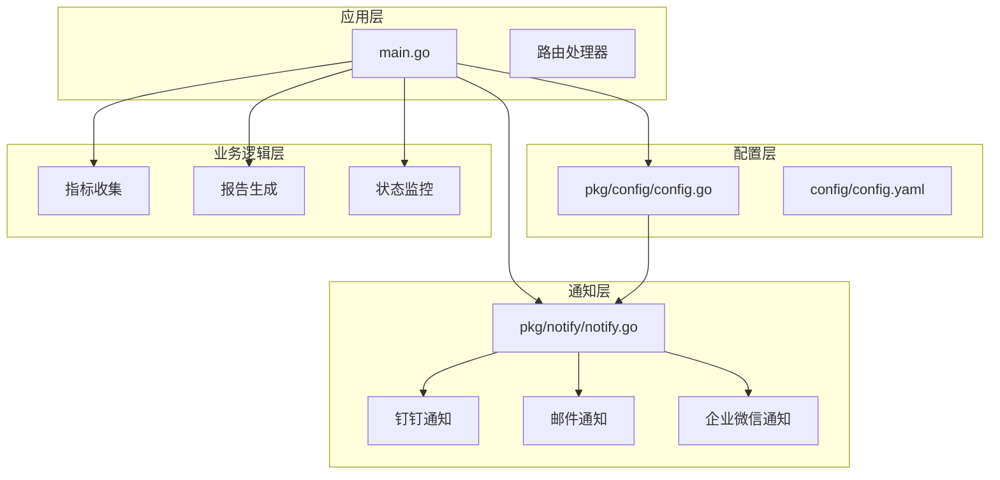
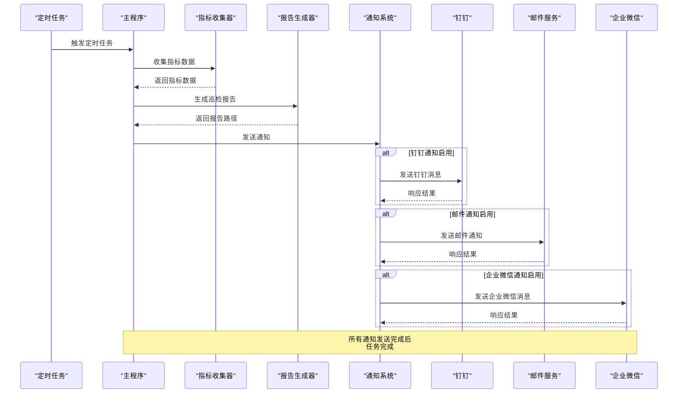
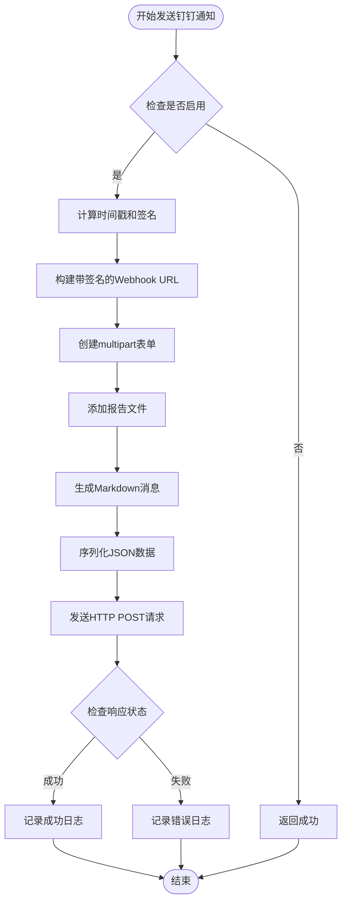
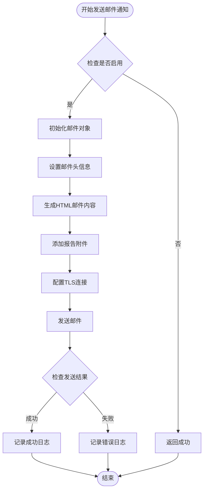
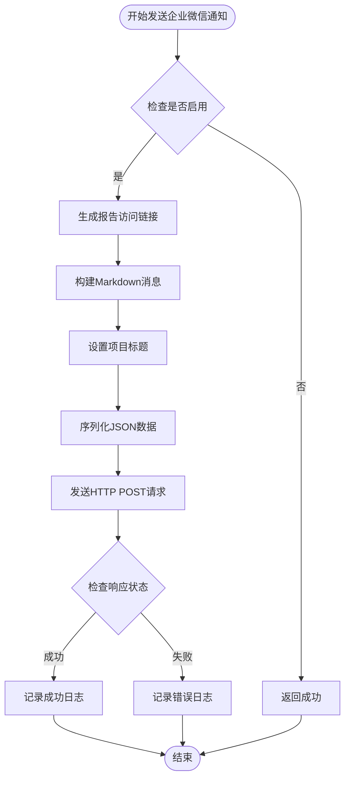
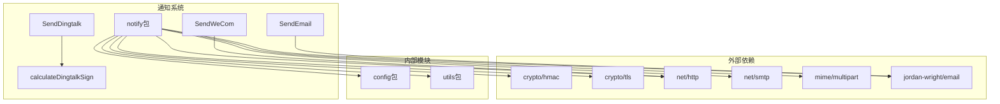

# PromAI 通知系统

<cite>
**本文档引用的文件**
- [main.go](file://main.go)
- [pkg/config/config.go](file://pkg/config/config.go)
- [pkg/notify/notify.go](file://pkg/notify/notify.go)
- [config/config.yaml](file://config/config.yaml)
- [deploy/deployment.yaml](file://deploy/deployment.yaml)
</cite>

## 目录
1. [简介](#简介)
2. [项目结构](#项目结构)
3. [核心组件](#核心组件)
4. [架构概览](#架构概览)
5. [详细组件分析](#详细组件分析)
6. [依赖关系分析](#依赖关系分析)
7. [性能考虑](#性能考虑)
8. [故障排除指南](#故障排除指南)
9. [结论](#结论)

## 简介

PromAI 通知系统是一个多渠道通知解决方案，支持钉钉、邮件和企业微信三种通知方式。该系统设计用于在定时任务完成后自动发送巡检报告，确保运维团队能够及时获取系统状态信息。通过统一的配置接口和模块化的实现，系统提供了灵活的通知配置选项和强大的错误处理机制。

## 项目结构

PromAI 项目采用分层架构设计，通知系统位于 `pkg/notify` 包中，与其他核心功能模块保持清晰的分离：



**图表来源**
- [main.go](file://main.go#L1-L230)
- [pkg/config/config.go](file://pkg/config/config.go#L1-L37)
- [pkg/notify/notify.go](file://pkg/notify/notify.go#L1-L286)

**章节来源**
- [main.go](file://main.go#L1-L230)
- [pkg/config/config.go](file://pkg/config/config.go#L1-L37)

## 核心组件

通知系统的核心组件包括三个主要配置结构体和相应的发送函数：

### 配置结构体

1. **DingtalkConfig** - 钉钉通知配置
   - `Enabled`: 是否启用钉钉通知
   - `Webhook`: 钉钉机器人 Webhook URL
   - `Secret`: 钉钉机器人签名密钥
   - `ReportURL`: 报告访问基础 URL

2. **EmailConfig** - 邮件通知配置
   - `Enabled`: 是否启用邮件通知
   - `SMTPHost`: SMTP 服务器地址
   - `SMTPPort`: SMTP 服务器端口
   - `Username`: 邮箱用户名
   - `Password`: 邮箱密码或授权码
   - `From`: 发件人地址
   - `To`: 收件人列表
   - `ReportURL`: 报告访问基础 URL

3. **WeComConfig** - 企业微信通知配置
   - `Enabled`: 是否启用企业微信通知
   - `Webhook`: 企业微信机器人 Webhook URL
   - `ReportURL`: 报告访问基础 URL
   - `ProjectTitle`: 项目标题

**章节来源**
- [pkg/notify/notify.go](file://pkg/notify/notify.go#L18-L36)
- [pkg/config/config.go](file://pkg/config/config.go#L11-L20)

## 架构概览

通知系统采用事件驱动的架构模式，在定时任务完成时触发通知发送：



**图表来源**
- [main.go](file://main.go#L75-L105)
- [pkg/notify/notify.go](file://pkg/notify/notify.go#L54-L140)

## 详细组件分析

### 钉钉通知实现

钉钉通知是通过 Webhook 接口发送带签名的请求来实现的：



**图表来源**
- [pkg/notify/notify.go](file://pkg/notify/notify.go#L54-L140)

#### 关键实现细节

1. **签名计算机制**：
   ```go
   func calculateDingtalkSign(timestamp int64, secret string) string {
       stringToSign := fmt.Sprintf("%d\n%s", timestamp, secret)
       h := hmac.New(sha256.New, []byte(secret))
       h.Write([]byte(stringToSign))
       return url.QueryEscape(base64.StdEncoding.EncodeToString(h.Sum(nil)))
   }
   ```
   - 使用 HMAC-SHA256 算法计算签名
   - 签名字符串格式为 `timestamp\nsecret`
   - 结果进行 URL 编码后作为查询参数

2. **文件上传机制**：
   - 使用 `multipart/form-data` 格式上传文件
   - 文件字段名为 `"file"`
   - 支持二进制文件传输

3. **消息格式**：
   - 使用 Markdown 格式的消息内容
   - 包含生成时间、文件名和访问链接
   - 支持富文本格式和超链接

**章节来源**
- [pkg/notify/notify.go](file://pkg/notify/notify.go#L54-L140)
- [pkg/notify/notify.go](file://pkg/notify/notify.go#L212-L218)

### 邮件通知实现

邮件通知通过 SMTP 协议发送 HTML 格式的邮件：



**图表来源**
- [pkg/notify/notify.go](file://pkg/notify/notify.go#L142-L211)

#### 关键实现细节

1. **邮件内容构建**：
   ```go
   e.HTML = []byte(fmt.Sprintf(`
       <h2>🔍 巡检报告已生成</h2>
       <p><strong>生成时间：</strong>%s</p>
       <p><strong>报告文件：</strong>%s</p>
       <p><strong>在线查看：</strong><a href="%s">点击查看报告</a></p>
       <p><strong>请登录环境查看完整报告内容!</strong></p>
   `, time.Now().Format("2006-01-02 15:04:05"), reportFileName, reportLink))
   ```

2. **TLS 安全连接**：
   - 使用 `crypto/tls` 包建立安全连接
   - 支持自定义 TLS 配置
   - 可选的证书验证跳过

3. **附件处理**：
   - 自动检测文件类型
   - 支持多种文件格式
   - 内容类型自动推断

**章节来源**
- [pkg/notify/notify.go](file://pkg/notify/notify.go#L142-L211)

### 企业微信通知实现

企业微信通知通过 Webhook 接口发送结构化消息：



**图表来源**
- [pkg/notify/notify.go](file://pkg/notify/notify.go#L220-L284)

#### 关键实现细节

1. **消息结构**：
   ```go
   messageContent := map[string]interface{}{
       "msgtype": "markdown",
       "markdown": map[string]string{
           "content": fmt.Sprintf("## 🔍 %s巡检报告已生成\n\n"+
               "### ⏰ 生成时间\n"+
               "> %s\n\n"+
               "### 📄 报告详情\n"+
               "- **文件名**：`%s`\n"+
               "- **访问链接**：[点击查看报告](%s)\n\n"+
               "---\n"+
               "💡 请登录环境查看完整报告内容",
               config.ProjectTitle,
               time.Now().Format("2006-01-02 15:04:05"),
               reportFileName,
               reportLink),
       },
   }
   ```

2. **项目标题定制**：
   - 支持自定义项目标题
   - 动态生成消息内容
   - 统一的消息格式

3. **响应处理**：
   - 检查 HTTP 状态码
   - 记录详细的响应内容
   - 提供错误诊断信息

**章节来源**
- [pkg/notify/notify.go](file://pkg/notify/notify.go#L220-L284)

## 依赖关系分析

通知系统的依赖关系展现了清晰的分层架构：



**图表来源**
- [pkg/notify/notify.go](file://pkg/notify/notify.go#L1-L20)

**章节来源**
- [pkg/notify/notify.go](file://pkg/notify/notify.go#L1-L20)

## 性能考虑

### 并发处理
- 每种通知类型独立执行，互不阻塞
- 支持异步发送机制
- 错误隔离，单个通知失败不影响其他通知

### 资源管理
- 及时关闭文件句柄和网络连接
- 使用 defer 确保资源释放
- 控制并发连接数量

### 网络优化
- 使用连接池减少握手开销
- 支持超时控制
- 实现重试机制

## 故障排除指南

### 常见异常场景及解决方案

#### 钉钉通知异常

1. **认证失败**
   - **症状**：返回 `400 Bad Request` 或 `401 Unauthorized`
   - **原因**：Webhook URL 或 Secret 配置错误
   - **解决**：检查 Webhook URL 和 Secret 配置，确保机器人已正确添加到群组

2. **网络超时**
   - **症状**：连接超时或读取超时
   - **原因**：网络不稳定或防火墙阻止
   - **解决**：检查网络连通性，确保允许访问钉钉 API 地址

3. **文件上传失败**
   - **症状**：文件大小超过限制或上传中断
   - **原因**：文件过大或网络问题
   - **解决**：检查文件大小限制，优化网络环境

#### 邮件通知异常

1. **SMTP 认证失败**
   - **症状**：返回 `535 Authentication failed`
   - **原因**：用户名或密码错误，或需要授权码
   - **解决**：确认邮箱账户信息，使用正确的授权码

2. **TLS 连接问题**
   - **症状**：SSL/TLS 握手失败
   - **原因**：证书验证失败或协议不匹配
   - **解决**：调整 TLS 配置，或临时禁用证书验证（仅用于调试）

3. **邮件被拦截**
   - **症状**：邮件发送成功但未收到
   - **原因**：垃圾邮件过滤或域名信誉问题
   - **解决**：检查邮件服务器配置，提升域名信誉

#### 企业微信通知异常

1. **Webhook 配置错误**
   - **症状**：无法访问 Webhook 地址
   - **原因**：URL 格式错误或机器人未启用
   - **解决**：验证 Webhook URL 格式，确保机器人已启用并添加到群组

2. **消息格式错误**
   - **症状**：返回 JSON 格式错误
   - **原因**：消息内容格式不符合企业微信要求
   - **解决**：检查消息结构，确保符合企业微信 API 规范

### 调试技巧

1. **启用详细日志**：
   ```go
   log.Printf("钉钉响应状态码: %d, 响应内容: %s", resp.StatusCode, string(respBody))
   ```

2. **网络抓包分析**：
   - 使用 Wireshark 分析网络流量
   - 检查请求和响应的完整内容

3. **API 测试工具**：
   - 使用 Postman 测试 Webhook 接口
   - 验证消息格式和签名计算

**章节来源**
- [pkg/notify/notify.go](file://pkg/notify/notify.go#L134-L140)
- [pkg/notify/notify.go](file://pkg/notify/notify.go#L270-L284)

## 结论

PromAI 通知系统通过精心设计的架构和模块化实现，提供了稳定可靠的多渠道通知能力。系统的主要优势包括：

1. **模块化设计**：清晰的职责分离，便于维护和扩展
2. **统一接口**：一致的配置格式和错误处理机制
3. **灵活配置**：支持多种通知渠道和个性化设置
4. **健壮性**：完善的错误处理和日志记录
5. **安全性**：支持加密传输和身份验证

通过合理的配置和适当的监控，该通知系统能够满足大多数运维场景的需求，为系统管理员提供及时准确的通知服务。建议在生产环境中根据实际需求调整配置参数，并建立相应的监控和告警机制以确保系统的可靠性。