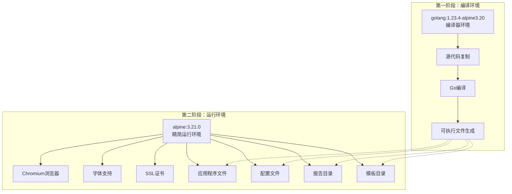
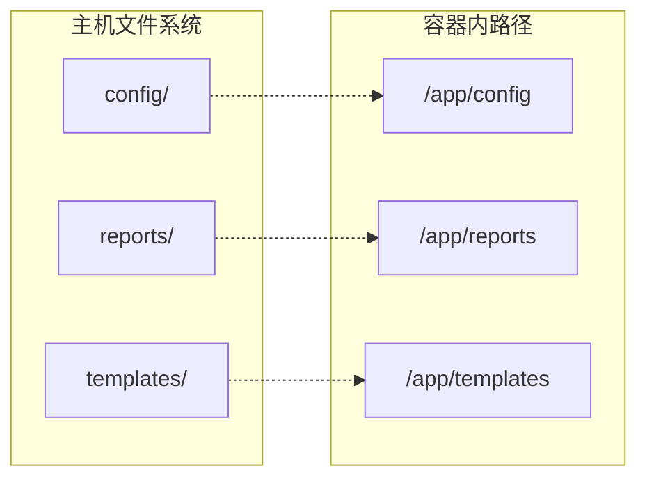

# Docker容器化部署指南

<cite>
**本文档引用的文件**
- [Dockerfile](file://Dockerfile)
- [README.md](file://README.md)
- [main.go](file://main.go)
- [pkg/config/config.go](file://pkg/config/config.go)
</cite>

## 目录
1. [项目概述](#项目概述)
2. [Docker镜像架构](#docker镜像架构)
3. [多阶段构建详解](#多阶段构建详解)
4. [基础镜像选择分析](#基础镜像选择分析)
5. [依赖包安装配置](#依赖包安装配置)
6. [环境变量与时区配置](#环境变量与时区配置)
7. [文件复制与目录结构](#文件复制与目录结构)
8. [端口暴露与服务配置](#端口暴露与服务配置)
9. [构建与运行命令](#构建与运行命令)
10. [配置卷挂载方案](#配置卷挂载方案)
11. [环境变量覆盖配置](#环境变量覆盖配置)
12. [常见问题排查](#常见问题排查)
13. [最佳实践建议](#最佳实践建议)

## 项目概述

PromAI是一个基于Prometheus的监控报告自动生成工具，能够自动收集、分析指标数据并生成可视化的HTML报告。该项目提供了完整的Docker容器化部署方案，支持多阶段构建和灵活的配置管理。

**章节来源**
- [README.md](file://README.md#L1-L50)
- [main.go](file://main.go#L1-L30)

## Docker镜像架构

PromAI采用多阶段Docker构建策略，将编译和运行环境分离，实现最小化镜像体积和最佳安全性。



**图表来源**
- [Dockerfile](file://Dockerfile#L1-L33)

**章节来源**
- [Dockerfile](file://Dockerfile#L1-L33)

## 多阶段构建详解

### 第一阶段：编译环境

```dockerfile
FROM docker.io/library/golang:1.23.4-alpine3.20 AS builder
WORKDIR /build
COPY . .
RUN go env -w GO111MODULE=on && go env -w GOPROXY=https://goproxy.cn,direct && go mod download && go build && ls -la /build
```

第一阶段使用golang:1.23.4-alpine3.20镜像作为编译环境，具有以下特点：

- **Go版本**：1.23.4 - 最新的稳定Go版本，提供更好的性能和安全性
- **Alpine Linux**：3.20版本 - 轻量级Linux发行版，基础镜像小
- **模块代理**：配置国内代理加速依赖下载
- **依赖管理**：启用Go Modules，确保依赖一致性
- **编译优化**：直接编译生成可执行文件

### 第二阶段：运行环境

```dockerfile
FROM docker.io/alpine:3.21.0
RUN apk --no-cache add \
    chromium \
    nss \
    freetype \
    harfbuzz \
    ca-certificates \
    ttf-freefont
```

第二阶段使用alpine:3.21.0作为运行环境，专注于最小化和安全性：

- **Alpine Linux**：3.21.0版本 - 最新的轻量级Linux发行版
- **Chromium**：提供PDF生成和网页渲染能力
- **字体支持**：FreeType和HarfBuzz确保文本正确显示
- **网络安全**：NSS和CA证书确保HTTPS连接安全

**章节来源**
- [Dockerfile](file://Dockerfile#L1-L15)

## 基础镜像选择分析

### Go编译镜像选择

**golang:1.23.4-alpine3.20** 作为编译环境的优势：

1. **性能优化**：Go 1.23.4版本包含多项性能改进
2. **体积控制**：Alpine Linux基础镜像仅约50MB
3. **安全性**：定期更新的安全补丁
4. **兼容性**：支持交叉编译和多平台部署

### 运行时镜像选择

**alpine:3.21.0** 作为运行环境的优势：

1. **极小体积**：基础镜像仅约5MB
2. **安全加固**：内置安全特性
3. **包管理**：APK包管理系统
4. **长期支持**：Alpine Linux的长期支持版本

**章节来源**
- [Dockerfile](file://Dockerfile#L1-L10)

## 依赖包安装配置

### Chromium及相关依赖

```dockerfile
RUN apk --no-cache add \
    chromium \
    nss \
    freetype \
    harfbuzz \
    ca-certificates \
    ttf-freefont
```

关键依赖包的作用：

1. **chromium**：Headless Chrome浏览器，用于PDF生成和网页渲染
2. **nss**：网络安全服务，提供加密和认证功能
3. **freetype**：高质量字体渲染引擎
4. **harfbuzz**：高级文本布局引擎
5. **ca-certificates**：SSL/TLS证书验证
6. **ttf-freefont**：免费字体支持

### Puppeteer配置

```dockerfile
ENV PUPPETEER_SKIP_CHROMIUM_DOWNLOAD=true
ENV CHROMEDP_CHROME_PATH=/usr/bin/chromium-browser
```

这些环境变量确保：
- 跳过Puppeteer自带的Chromium下载，避免重复安装
- 正确指向系统安装的Chromium路径
- 提高容器启动速度和减少镜像大小

**章节来源**
- [Dockerfile](file://Dockerfile#L11-L18)

## 环境变量与时区配置

### 时区设置

```dockerfile
ENV TZ=Asia/Shanghai
RUN apk add --no-cache tzdata && ln -snf /usr/share/zoneinfo/$TZ /etc/localtime && echo $TZ > /etc/timezone
```

时区配置的重要性：
- **Asia/Shanghai**：中国标准时间，适合国内用户
- **tzdata包**：提供完整的时区数据库
- **符号链接**：正确设置系统时钟
- **持久化**：将时区信息写入配置文件

### 应用程序环境变量

```dockerfile
ENV PROMETHEUS_URL=http://prometheus:9090
```

虽然在Dockerfile中没有显式设置，但应用程序支持通过环境变量覆盖配置：
- **PROMETHEUS_URL**：Prometheus服务器地址
- **PORT**：应用程序监听端口（默认8091）

**章节来源**
- [Dockerfile](file://Dockerfile#L19-L22)
- [main.go](file://main.go#L35-L45)

## 文件复制与目录结构

### 复制策略

```dockerfile
COPY --from=builder /build/PromAI /app/
COPY --from=builder /build/config /app/config/
COPY --from=builder /build/outputs /app/outputs/
COPY --from=builder /build/reports /app/reports/
COPY --from=builder /build/templates /app/templates/
```

文件复制策略说明：

1. **主程序文件**：复制编译后的可执行文件到/app目录
2. **配置文件**：保留原始配置文件结构
3. **输出目录**：包括reports和templates目录
4. **工作目录**：设置为/app，便于管理和访问

### 目录结构映射

```
/app/
├── PromAI                    # 主程序可执行文件
├── config/                   # 配置文件目录
│   └── config.yaml          # Prometheus配置
├── reports/                 # 生成的报告目录
├── templates/               # HTML模板目录
└── outputs/                 # 输出文件目录（可能来自构建）
```

**章节来源**
- [Dockerfile](file://Dockerfile#L23-L28)

## 端口暴露与服务配置

### 端口配置

```dockerfile
EXPOSE 8091
CMD ["./PromAI", "-port", "8091"]
```

端口配置细节：

1. **EXPOSE指令**：声明容器对外暴露的端口
2. **默认端口**：8091 - 应用程序的HTTP服务端口
3. **CMD指令**：容器启动时的默认命令
4. **参数传递**：通过命令行参数指定端口

### 服务功能

应用程序在8091端口提供以下服务：

1. **报告生成接口**：`GET /getreport`
2. **静态文件服务**：`/reports/`目录下的HTML报告
3. **状态监控接口**：`GET /status`
4. **健康检查端点**：内部服务状态检查

**章节来源**
- [Dockerfile](file://Dockerfile#L29-L31)
- [main.go](file://main.go#L180-L190)

## 构建与运行命令

### 镜像构建命令

```bash
# 基本构建命令
docker build -t promai .

# 带标签的构建命令
docker build -t promai:v1.0 .

# 指定构建上下文
docker build -t promai . -f Dockerfile

# 多平台构建
docker buildx build --platform linux/amd64,linux/arm64 -t promai:multi .
```

### 容器运行命令

```bash
# 基本运行命令
docker run -d --name promai -p 8091:8091 promai

# 带卷挂载的运行命令
docker run -d \
  --name promai \
  -p 8091:8091 \
  -v $(pwd)/config:/app/config \
  -v $(pwd)/reports:/app/reports \
  -v $(pwd)/templates:/app/templates \
  promai

# 带环境变量的运行命令
docker run -d \
  --name promai \
  -p 8091:8091 \
  -e PROMETHEUS_URL=http://custom-prometheus:9090 \
  -e PORT=8091 \
  promai

# 生产环境运行命令
docker run -d \
  --name promai \
  -p 8091:8091 \
  --restart=unless-stopped \
  --memory=512m \
  --cpus=1.0 \
  -v promai-config:/app/config \
  -v promai-reports:/app/reports \
  -v promai-templates:/app/templates \
  promai
```

### Kubernetes部署配置

```yaml
apiVersion: apps/v1
kind: Deployment
metadata:
  name: promai
spec:
  replicas: 1
  selector:
    matchLabels:
      app: promai
  template:
    metadata:
      labels:
        app: promai
    spec:
      containers:
      - name: promai
        image: promai:latest
        ports:
        - containerPort: 8091
        env:
        - name: PROMETHEUS_URL
          value: "http://prometheus:9090"
        volumeMounts:
        - name: config-volume
          mountPath: /app/config
        - name: reports-volume
          mountPath: /app/reports
        - name: templates-volume
          mountPath: /app/templates
        resources:
          requests:
            memory: "256Mi"
            cpu: "250m"
          limits:
            memory: "512Mi"
            cpu: "500m"
      volumes:
      - name: config-volume
        configMap:
          name: promai-config
      - name: reports-volume
        persistentVolumeClaim:
          claimName: promai-reports-pvc
      - name: templates-volume
        configMap:
          name: promai-templates
```

**章节来源**
- [README.md](file://README.md#L100-L120)

## 配置卷挂载方案

### 卷挂载设计原则

为了实现配置的灵活性和数据持久化，推荐使用以下卷挂载方案：



### 卷类型选择

1. **本地目录挂载**（开发环境）
```bash
docker run -v $(pwd)/config:/app/config \
           -v $(pwd)/reports:/app/reports \
           -v $(pwd)/templates:/app/templates \
           promai
```

2. **Docker命名卷**（生产环境）
```bash
# 创建命名卷
docker volume create promai-config
docker volume create promai-reports
docker volume create promai-templates

# 使用命名卷
docker run --mount type=volume,source=promai-config,target=/app/config \
           --mount type=volume,source=promai-reports,target=/app/reports \
           --mount type=volume,source=promai-templates,target=/app/templates \
           promai
```

3. **Kubernetes持久卷**（集群环境）
```yaml
apiVersion: v1
kind: PersistentVolumeClaim
metadata:
  name: promai-reports-pvc
spec:
  accessModes:
    - ReadWriteOnce
  resources:
    requests:
      storage: 1Gi
---
apiVersion: v1
kind: ConfigMap
metadata:
  name: promai-config
data:
  config.yaml: |
    prometheus_url: "http://prometheus:9090"
    project_name: "PromAI Monitoring"
    # ... 其他配置
```

### 权限配置

确保容器内的应用程序有正确的文件访问权限：

```bash
# 设置容器内目录权限
docker run --user 1000:1000 \
           -v $(pwd)/reports:/app/reports \
           promai

# 或者在Dockerfile中设置
USER 1000
WORKDIR /app
```

**章节来源**
- [README.md](file://README.md#L100-L110)

## 环境变量覆盖配置

### 支持的环境变量

应用程序支持通过环境变量覆盖配置文件中的设置：

```bash
# Prometheus服务器地址
export PROMETHEUS_URL=http://custom-prometheus:9090

# 应用程序端口
export PORT=8091

# 其他可选环境变量
export CONFIG_PATH=/app/config/config.yaml
export LOG_LEVEL=info
```

### 环境变量优先级

1. **命令行参数**（最高优先级）
2. **环境变量**
3. **配置文件**（最低优先级）

### 实际使用示例

```bash
# 完整的环境变量配置
docker run -d \
  --name promai \
  -p 8091:8091 \
  -e PROMETHEUS_URL=http://prometheus.internal:9090 \
  -e PORT=8091 \
  -e CONFIG_PATH=/app/config/custom.yaml \
  -e LOG_LEVEL=debug \
  promai
```

**章节来源**
- [main.go](file://main.go#L35-L45)

## 常见问题排查

### 权限错误

**问题症状**：
```
Permission denied: open reports/inspection_report_20241227_123648.html
```

**解决方案**：
```bash
# 检查容器内文件权限
docker exec -it promai ls -la /app/reports/

# 修改容器内权限
docker exec -it promai chmod -R 755 /app/reports/

# 或者以特定用户运行
docker run --user 1000:1000 --name promai promai
```

### Chromium缺失导致渲染失败

**问题症状**：
```
failed to launch browser: No such file or directory
```

**解决方案**：
```bash
# 检查Chromium是否正确安装
docker exec -it promai which chromium-browser

# 验证Chromium版本
docker exec -it promai chromium-browser --version

# 检查环境变量配置
docker exec -it promai env | grep CHROME
```

### 端口冲突

**问题症状**：
```
Error response from daemon: driver failed programming external connectivity on endpoint promai
```

**解决方案**：
```bash
# 检查端口占用
netstat -tulpn | grep 8091

# 更改容器端口映射
docker run -p 8092:8091 promai

# 或者停止占用端口的进程
sudo systemctl stop prometheus
```

### 内存不足

**问题症状**：
```
fatal error: runtime: out of memory
```

**解决方案**：
```bash
# 限制容器内存使用
docker run --memory=512m --memory-swap=1g promai

# 或者在Docker Compose中配置
services:
  promai:
    image: promai
    mem_limit: 512m
    memswap_limit: 1g
```

### 配置文件加载失败

**问题症状**：
```
failed to load config: reading config file: no such file or directory
```

**解决方案**：
```bash
# 检查配置文件是否存在
docker exec -it promai ls -la /app/config/

# 确保配置文件正确挂载
docker run -v $(pwd)/config:/app/config promai

# 验证配置文件格式
docker exec -it promai cat /app/config/config.yaml | yamllint -
```

### 日志调试

```bash
# 查看容器日志
docker logs promai

# 实时查看日志
docker logs -f promai

# 查看容器资源使用情况
docker stats promai

# 进入容器调试
docker exec -it promai sh
```

## 最佳实践建议

### 镜像优化

1. **多阶段构建**：始终使用多阶段构建减少最终镜像大小
2. **缓存优化**：合理安排Dockerfile指令顺序，利用层缓存
3. **依赖管理**：固定依赖版本，避免不必要的更新

### 安全配置

1. **非root用户**：避免以root用户运行容器
2. **只读文件系统**：对于不需要写入的目录设置为只读
3. **网络安全**：限制不必要的端口暴露

### 监控与维护

1. **健康检查**：添加Docker健康检查指令
2. **日志管理**：配置日志轮转和集中管理
3. **资源监控**：监控容器资源使用情况

### 生产环境部署

```yaml
# docker-compose.yml 示例
version: '3.8'
services:
  promai:
    image: promai:latest
    restart: unless-stopped
    ports:
      - "8091:8091"
    volumes:
      - promai-config:/app/config
      - promai-reports:/app/reports
      - promai-templates:/app/templates
    environment:
      - PROMETHEUS_URL=http://prometheus:9090
      - PORT=8091
    healthcheck:
      test: ["CMD", "curl", "-f", "http://localhost:8091/status"]
      interval: 30s
      timeout: 10s
      retries: 3
      start_period: 40s
    logging:
      driver: "json-file"
      options:
        max-size: "10m"
        max-file: "3"
    deploy:
      resources:
        limits:
          memory: 512M
          cpus: '1.0'
        reservations:
          memory: 256M
          cpus: '0.5'

volumes:
  promai-config:
    driver: local
  promai-reports:
    driver: local
  promai-templates:
    driver: local
```

### 性能调优

1. **CPU限制**：根据实际需求设置CPU配额
2. **内存限制**：避免容器过度消耗系统内存
3. **并发处理**：合理配置应用程序的并发参数
4. **缓存策略**：利用Docker缓存机制提高构建效率

通过遵循这些最佳实践，可以确保PromAI容器化部署的稳定性、安全性和可维护性。定期更新镜像、监控容器性能、及时修复安全漏洞是保持生产环境稳定的关键。