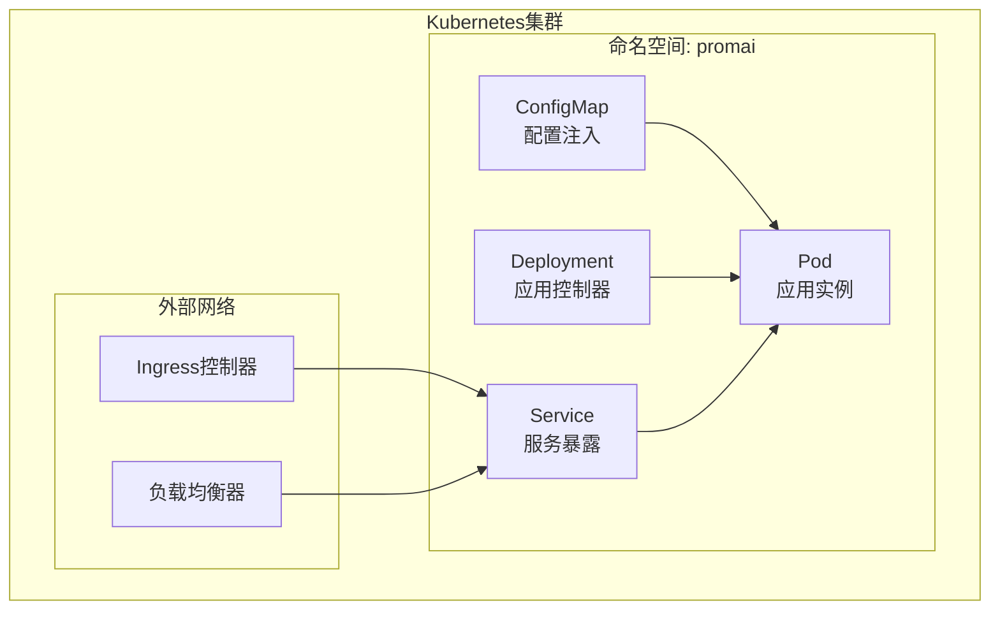
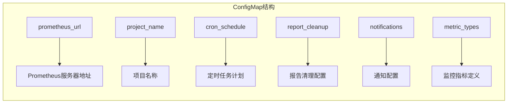
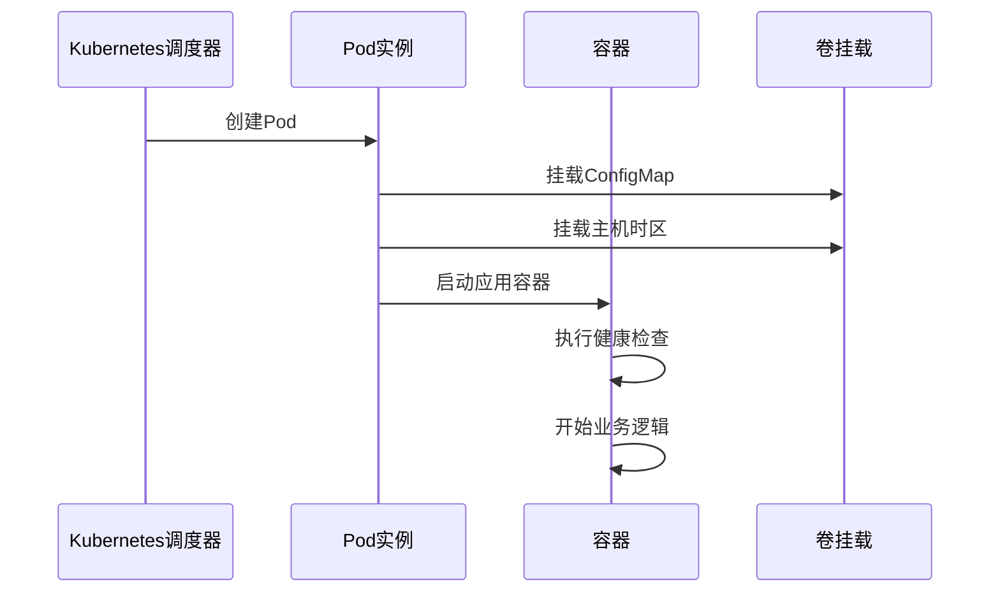
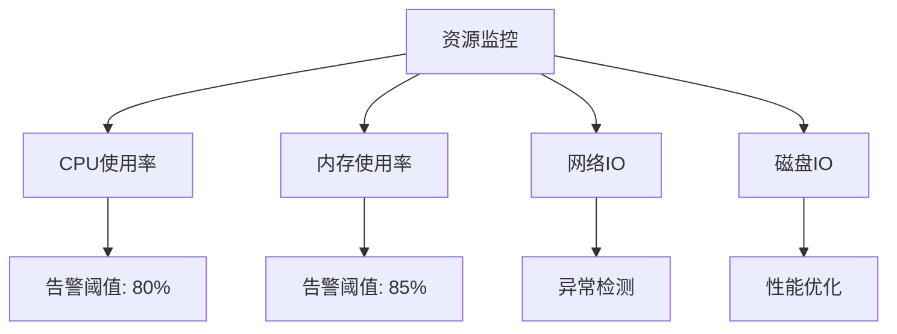
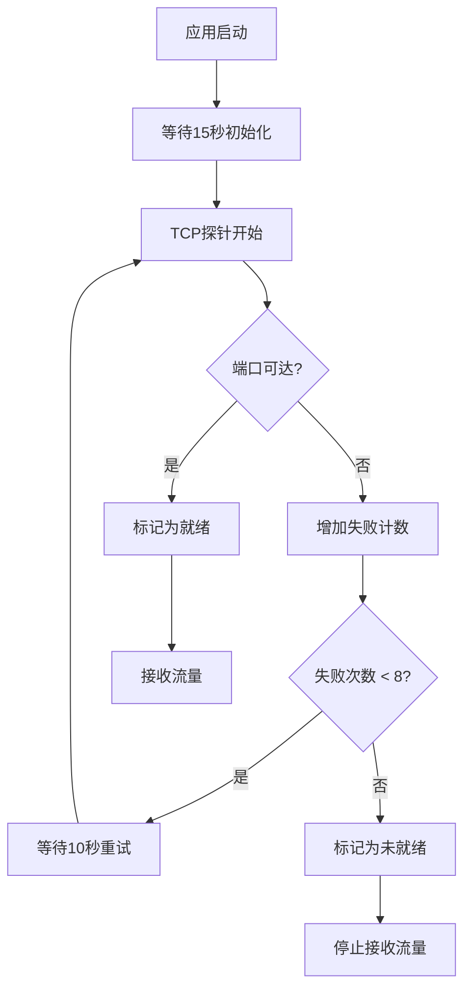
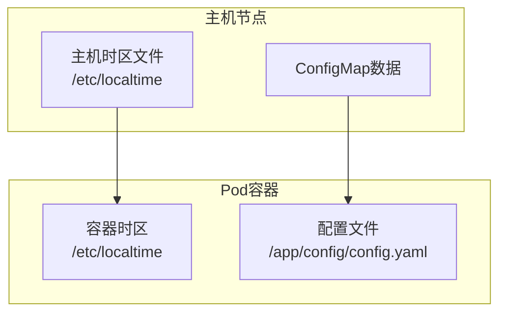
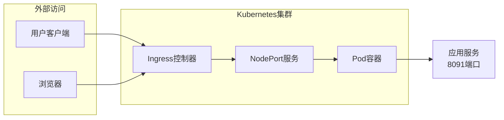
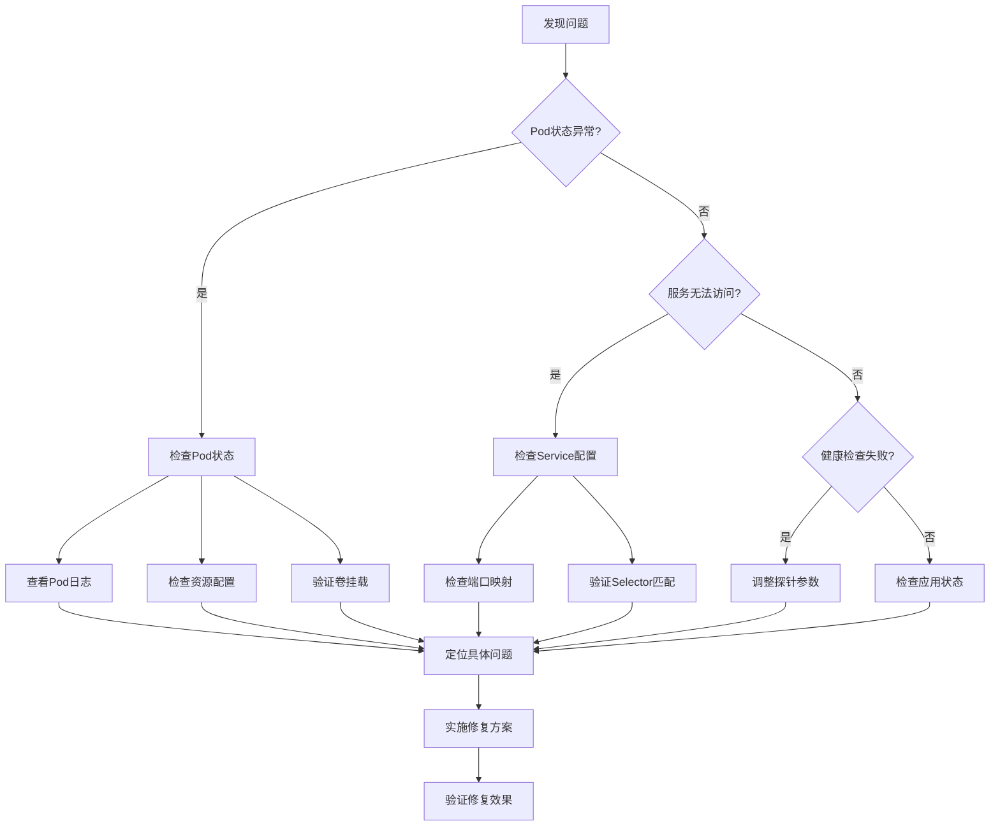

# Kubernetes集群部署手册

<cite>
**本文档引用的文件**
- [deployment.yaml](file://deploy/deployment.yaml)
- [config.yaml](file://config/config.yaml)
- [Dockerfile](file://Dockerfile)
- [main.go](file://main.go)
- [config.go](file://pkg/config/config.go)
- [notify.go](file://pkg/notify/notify.go)
- [README.md](file://README.md)
</cite>

## 目录
1. [项目概述](#项目概述)
2. [部署架构](#部署架构)
3. [命名空间配置](#命名空间配置)
4. [ConfigMap配置注入](#configmap配置注入)
5. [Deployment控制器详解](#deployment控制器详解)
6. [资源限制与请求](#资源限制与请求)
7. [健康检查配置](#健康检查配置)
8. [卷挂载机制](#卷挂载机制)
9. [服务暴露方式](#服务暴露方式)
10. [部署命令与验证](#部署命令与验证)
11. [故障排查指南](#故障排查指南)
12. [最佳实践建议](#最佳实践建议)

## 项目概述

PromAI是一个基于Prometheus的自动化巡检报告生成工具，能够自动收集监控指标数据并生成可视化的HTML报告。该工具支持多种通知方式（钉钉、邮件、企业微信），具备灵活的配置系统和强大的指标分析能力。

### 核心功能特性
- **多维度监控**：支持基础资源使用情况、Kubernetes集群状态、应用服务监控
- **自动化报告**：定时任务自动生成巡检报告，支持多种通知渠道
- **智能阈值检测**：自动计算指标状态和告警级别
- **可视化展示**：生成包含数据表格和图表的HTML报告
- **灵活配置**：支持自定义指标阈值和标签别名

## 部署架构

PromAI在Kubernetes集群中的部署采用了标准的三层架构模式：



**图表来源**
- [deployment.yaml](file://deploy/deployment.yaml#L1-L287)

## 命名空间配置

### 命名空间创建

部署文件首先创建了一个专用的命名空间`promai`，用于隔离PromAI应用的所有资源：

```yaml
apiVersion: v1
kind: Namespace
metadata:
  labels:
    kubernetes.io/metadata.name: promai
  name: promai
```

### 命名空间设计原则

- **资源隔离**：确保PromAI与其他应用的资源完全隔离
- **权限控制**：便于实施细粒度的RBAC权限管理
- **监控独立**：避免与其他应用的监控数据混淆
- **生命周期管理**：便于统一管理整个应用的生命周期

**章节来源**
- [deployment.yaml](file://deploy/deployment.yaml#L1-L8)

## ConfigMap配置注入

### 配置文件结构

ConfigMap包含了PromAI运行所需的所有配置信息，包括Prometheus连接、定时任务、通知配置和监控指标定义：



**图表来源**
- [deployment.yaml](file://deploy/deployment.yaml#L10-L287)

### 配置注入机制

ConfigMap通过volumeMounts机制挂载到容器内部的`/app/config`目录：

```yaml
volumeMounts:
  - name: volume-kv418v
    readOnly: true
    mountPath: /app/config
```

### 配置文件内容详解

#### Prometheus连接配置
```yaml
prometheus_url: "http://prometheus-k8s.kubesphere-monitoring-system.svc.cluster.local:9090"
```

#### 定时任务配置
```yaml
cron_schedule: "30 9,17 * * *"  # 每天9点半和17点半执行
```

#### 报告清理配置
```yaml
report_cleanup:
  enabled: true
  max_age: 7    # 保留最近7天的报告
  cron_schedule: "0 0 * * *"  # 每日凌晨执行清理
```

#### 通知配置
支持钉钉、邮件和企业微信三种通知方式：
- **钉钉通知**：支持文件上传和Markdown格式消息
- **邮件通知**：支持附件和富文本邮件
- **企业微信**：支持Markdown格式消息

**章节来源**
- [deployment.yaml](file://deploy/deployment.yaml#L10-L100)
- [config.yaml](file://config/config.yaml#L1-L50)

## Deployment控制器详解

### 单副本部署策略

```yaml
replicas: 1
selector:
  matchLabels:
    app: promai
template:
  metadata:
    labels:
      app: promai
```

### 滚动更新策略

```yaml
strategy:
  type: RollingUpdate
  rollingUpdate:
    maxUnavailable: 25%
    maxSurge: 25%
```

### 更新策略说明

- **maxUnavailable**: 最大不可用副本数为25%，确保服务连续性
- **maxSurge**: 最大超出期望副本数为25%，允许临时增加资源
- **revisionHistoryLimit**: 保留10个历史版本，便于回滚

### Pod模板配置



**图表来源**
- [deployment.yaml](file://deploy/deployment.yaml#L80-L150)

**章节来源**
- [deployment.yaml](file://deploy/deployment.yaml#L60-L180)

## 资源限制与请求

### 资源配额设计

```yaml
resources:
  limits:
    cpu: 20m
    memory: 50Mi
  requests:
    cpu: 5m
    memory: 15Mi
```

### 资源分配合理性分析

#### CPU资源
- **limit**: 20m (0.02核) - 足够处理定时任务和HTTP请求
- **request**: 5m (0.005核) - 最小保证资源需求
- **优势**: 低资源占用，适合长时间运行的服务

#### 内存资源
- **limit**: 50Mi - 防止内存泄漏导致OOM
- **request**: 15Mi - 最小内存需求
- **优势**: 合理的内存分配，平衡性能和稳定性

### 资源监控与优化



**图表来源**
- [deployment.yaml](file://deploy/deployment.yaml#L110-L120)

**章节来源**
- [deployment.yaml](file://deploy/deployment.yaml#L110-L120)

## 健康检查配置

### TCP探针配置

```yaml
livenessProbe:
  tcpSocket:
    port: 8091
  initialDelaySeconds: 15
  timeoutSeconds: 30
  periodSeconds: 10
  successThreshold: 1
  failureThreshold: 8

readinessProbe:
  tcpSocket:
    port: 8091
  initialDelaySeconds: 15
  timeoutSeconds: 30
  periodSeconds: 10
  successThreshold: 1
  failureThreshold: 8
```

### 健康检查机制详解

#### 探测原理
- **TCP Socket探测**：直接尝试连接到8091端口
- **端口映射**：容器端口8091映射到NodePort服务
- **协议支持**：仅支持TCP协议，不支持HTTP GET

#### 探测参数分析



**图表来源**
- [deployment.yaml](file://deploy/deployment.yaml#L120-L150)

### 探测配置优化

- **initialDelaySeconds**: 15秒 - 给应用足够时间完成启动
- **periodSeconds**: 10秒 - 适中的探测频率
- **timeoutSeconds**: 30秒 - 允许较长时间的响应
- **failureThreshold**: 8次 - 提供足够的容错时间

**章节来源**
- [deployment.yaml](file://deploy/deployment.yaml#L120-L150)

## 卷挂载机制

### 主机时区同步

```yaml
volumes:
  - name: host-time
    hostPath:
      path: /etc/localtime
      type: ''
```

### 卷挂载类型分析

#### ConfigMap卷
```yaml
volumes:
  - name: volume-kv418v
    configMap:
      name: config
      defaultMode: 420
```

#### 主机路径卷
```yaml
volumeMounts:
  - name: host-time
    readOnly: true
    mountPath: /etc/localtime
```

### 卷挂载架构图



**图表来源**
- [deployment.yaml](file://deploy/deployment.yaml#L70-L80)

### 主机时区同步的重要性

- **时间一致性**：确保应用日志和报告的时间戳与主机一致
- **定时任务准确性**：避免因时区差异导致的定时任务错误
- **监控数据准确性**：保证监控指标的时间序列正确性

**章节来源**
- [deployment.yaml](file://deploy/deployment.yaml#L70-L80)

## 服务暴露方式

### NodePort服务配置

```yaml
apiVersion: v1
kind: Service
metadata:
  name: promai
  namespace: promai
spec:
  ports:
    - name: http-80
      protocol: TCP
      port: 80
      targetPort: 8091
  selector:
    app: promai
  type: NodePort
  sessionAffinity: None
```

### 端口映射关系

- **ClusterIP**: 80 (内部服务访问)
- **ContainerPort**: 8091 (应用实际监听端口)
- **NodePort**: 动态分配的主机端口

### 服务暴露架构



**图表来源**
- [deployment.yaml](file://deploy/deployment.yaml#L200-L250)

### 服务类型对比

| 服务类型 | 内部访问 | 外部访问 | 性能 | 适用场景 |
|---------|---------|---------|------|---------|
| ClusterIP | ✓ | ✗ | 高 | 内部微服务通信 |
| NodePort | ✓ | ✓ | 中 | 开发测试环境 |
| LoadBalancer | ✓ | ✓ | 高 | 生产环境 |
| Ingress | ✓ | ✓ | 高 | 多域名管理 |

**章节来源**
- [deployment.yaml](file://deploy/deployment.yaml#L200-L250)

## 部署命令与验证

### 基础部署命令

```bash
# 应用部署文件
kubectl apply -f deploy/deployment.yaml

# 查看命名空间
kubectl get namespaces

# 查看PromAI资源
kubectl -n promai get all

# 查看Pod状态
kubectl -n promai get pods

# 查看服务状态
kubectl -n promai get svc
```

### 部署验证步骤

#### 1. 命名空间验证
```bash
kubectl get namespace promai
```

#### 2. ConfigMap验证
```bash
kubectl -n promai get configmap config -o yaml
kubectl -n promai describe configmap config
```

#### 3. Deployment验证
```bash
kubectl -n promai get deployment promai
kubectl -n promai describe deployment promai
```

#### 4. Pod验证
```bash
kubectl -n promai get pods
kubectl -n promai logs promai-xxx
kubectl -n promai exec -it promai-xxx -- sh
```

#### 5. 服务验证
```bash
kubectl -n promai get svc promai
kubectl -n promai describe svc promai
```

### Ingress配置示例

```yaml
apiVersion: networking.k8s.io/v1
kind: Ingress
metadata:
  name: promai-ingress
  namespace: promai
  annotations:
    nginx.ingress.kubernetes.io/rewrite-target: /
spec:
  rules:
  - host: promai.example.com
    http:
      paths:
      - path: /
        pathType: Prefix
        backend:
          service:
            name: promai
            port:
              number: 80
```

**章节来源**
- [deployment.yaml](file://deploy/deployment.yaml#L1-L287)

## 故障排查指南

### 常见故障类型

#### 1. Pod CrashLoopBackOff

**症状表现**：
- Pod状态持续为CrashLoopBackOff
- 日志显示应用启动失败

**排查步骤**：
```bash
# 查看Pod详细信息
kubectl -n promai describe pod promai-xxx

# 查看Pod日志
kubectl -n promai logs promai-xxx --previous

# 检查资源配置
kubectl -n promai get pod promai-xxx -o yaml | grep -A 10 "resources:"
```

**解决方案**：
- 检查资源配置是否合理
- 验证ConfigMap挂载是否正确
- 确认端口冲突问题

#### 2. ConfigMap未生效

**症状表现**：
- 应用无法读取配置文件
- 配置变更后不生效

**排查步骤**：
```bash
# 检查ConfigMap内容
kubectl -n promai get configmap config -o yaml

# 检查Pod挂载点
kubectl -n promai exec promai-xxx -- ls -la /app/config/

# 检查挂载权限
kubectl -n promai exec promai-xxx -- cat /app/config/config.yaml
```

**解决方案**：
- 确认ConfigMap名称匹配
- 检查挂载路径正确性
- 验证文件权限设置

#### 3. 健康检查失败

**症状表现**：
- Pod频繁重启
- 健康检查探针失败

**排查步骤**：
```bash
# 查看Pod事件
kubectl -n promai get events --sort-by=.metadata.creationTimestamp

# 检查探针配置
kubectl -n promai describe pod promai-xxx | grep -A 10 "Liveness"

# 检查端口监听
kubectl -n promai exec promai-xxx -- netstat -tlnp
```

**解决方案**：
- 调整探针参数
- 检查应用启动时间
- 验证端口配置正确性

### 故障诊断流程



**图表来源**
- [deployment.yaml](file://deploy/deployment.yaml#L120-L150)

### 监控与告警

#### 关键监控指标
- Pod启动时间
- 资源使用率
- 健康检查成功率
- 服务可用性

#### 告警规则示例
```yaml
apiVersion: monitoring.coreos.com/v1
kind: PrometheusRule
metadata:
  name: promai-alerts
spec:
  groups:
  - name: promai
    rules:
    - alert: PromaiPodCrashLoop
      expr: kube_pod_container_status_restarts_total{pod=~"promai-.*"} > 0
      for: 5m
      labels:
        severity: warning
      annotations:
        summary: "PromAI Pod crash loop detected"
```

## 最佳实践建议

### 部署最佳实践

#### 1. 资源规划
- **CPU预留**：根据应用负载合理设置requests和limits
- **内存监控**：定期监控内存使用情况，避免OOM
- **存储规划**：考虑报告文件的存储需求

#### 2. 安全配置
- **镜像安全**：使用官方可信镜像
- **权限最小化**：限制不必要的特权操作
- **网络隔离**：通过NetworkPolicy控制网络访问

#### 3. 高可用设计
- **多副本部署**：生产环境建议至少2个副本
- **滚动更新**：使用滚动更新策略减少停机时间
- **备份策略**：定期备份ConfigMap和重要数据

### 运维建议

#### 1. 监控告警
```bash
# 监控Pod状态
kubectl -n promai get pods -w

# 监控资源使用
kubectl -n promai top pods

# 监控事件
kubectl -n promai get events --sort-by=.metadata.creationTimestamp
```

#### 2. 日志管理
```bash
# 查看实时日志
kubectl -n promai logs -f promai-xxx

# 查看历史日志
kubectl -n promai logs promai-xxx --previous

# 导出日志
kubectl -n promai logs promai-xxx > promai.log
```

#### 3. 配置管理
- **版本控制**：将部署文件纳入版本控制系统
- **配置验证**：部署前验证YAML语法正确性
- **灰度发布**：小范围验证后再全面部署

### 性能优化

#### 1. 启动优化
- **启动时间**：优化应用启动流程，减少启动时间
- **预热机制**：实现应用预热，提高首次访问速度
- **缓存策略**：合理使用缓存，减少重复计算

#### 2. 资源优化
- **镜像大小**：使用精简的基础镜像
- **多阶段构建**：利用Docker多阶段构建减少镜像大小
- **资源池化**：合理设置资源池，提高资源利用率

#### 3. 网络优化
- **连接复用**：优化HTTP连接复用
- **压缩传输**：启用Gzip压缩减少传输时间
- **CDN加速**：对于静态资源考虑使用CDN

### 扩展建议

#### 1. 多环境部署
- **开发环境**：使用较小的资源配置
- **测试环境**：模拟生产环境配置
- **生产环境**：高可用、高性能配置

#### 2. 自动化运维
- **CI/CD集成**：与Jenkins、GitLab CI等工具集成
- **自动化测试**：部署后自动进行功能测试
- **蓝绿部署**：使用蓝绿部署减少风险

#### 3. 监控体系
- **应用监控**：集成APM工具监控应用性能
- **基础设施监控**：监控Kubernetes集群状态
- **业务监控**：监控关键业务指标

通过遵循这些最佳实践，可以确保PromAI在Kubernetes集群中的稳定运行和高效维护。定期回顾和优化部署配置，能够适应不断变化的业务需求和技术发展。