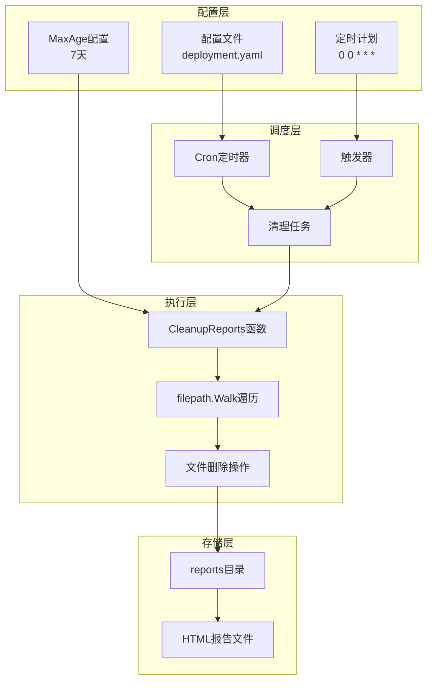
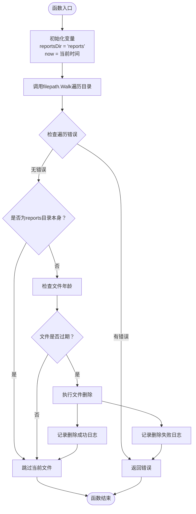
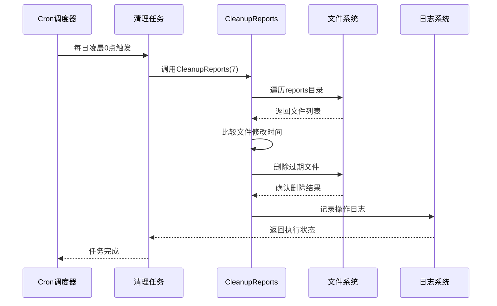
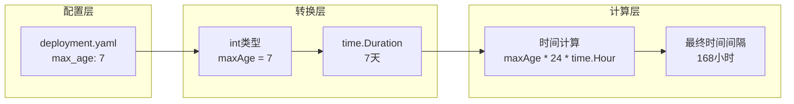
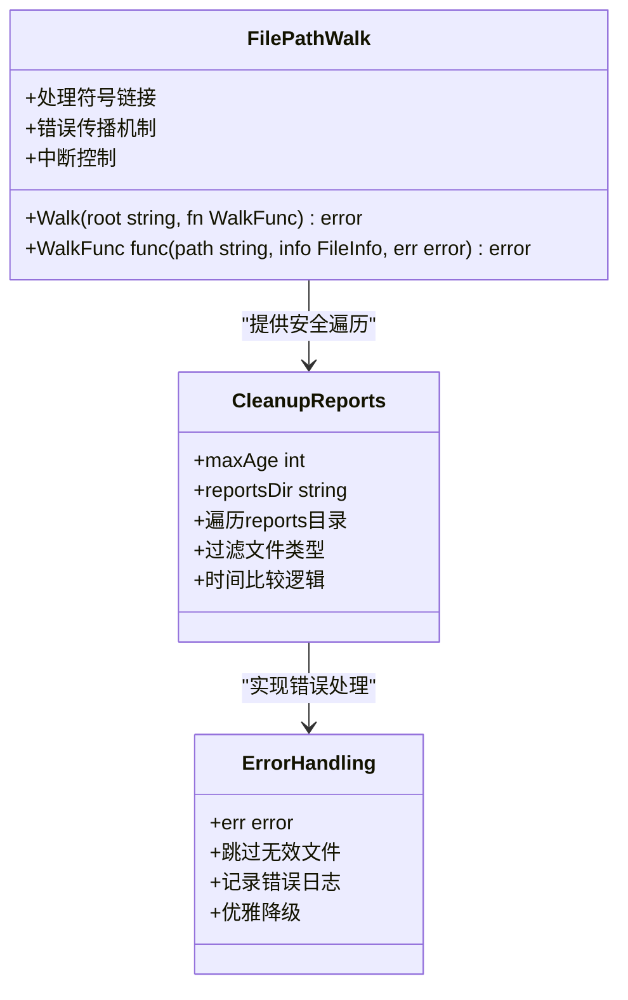
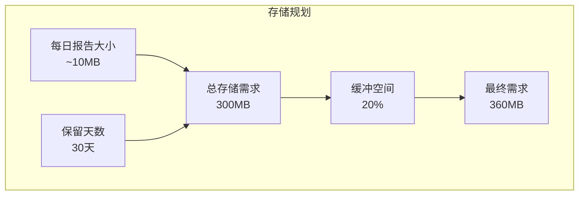

# 报告清理机制

<cite>
**本文档引用的文件**
- [cleanup.go](file://pkg/report/cleanup.go)
- [deployment.yaml](file://deploy/deployment.yaml)
- [main.go](file://main.go)
- [config.go](file://pkg/config/config.go)
- [generator.go](file://pkg/report/generator.go)
</cite>

## 目录
1. [简介](#简介)
2. [清理机制架构概览](#清理机制架构概览)
3. [核心清理组件分析](#核心清理组件分析)
4. [定时任务调度机制](#定时任务调度机制)
5. [配置参数详解](#配置参数详解)
6. [安全遍历机制](#安全遍历机制)
7. [性能考虑](#性能考虑)
8. [故障排除指南](#故障排除指南)
9. [最佳实践建议](#最佳实践建议)
10. [总结](#总结)

## 简介

PromAI项目实现了一套完整的自动化报告生命周期管理机制，其中报告清理功能是确保系统长期稳定运行的关键组件。该机制通过`CleanupReports`函数实现了智能的过期报告自动删除功能，有效控制存储空间占用，避免无限增长的报告文件对系统性能造成影响。

清理机制的核心设计理念是基于文件修改时间的智能判断，结合定时任务调度，形成了一套完整的自动化运维解决方案。通过合理的配置参数和安全的文件操作机制，确保系统在高效清理的同时保持数据完整性。

## 清理机制架构概览

报告清理机制采用了分层架构设计，将清理逻辑、定时调度和配置管理有机结合：



**图表来源**
- [cleanup.go](file://pkg/report/cleanup.go#L1-L37)
- [main.go](file://main.go#L120-L140)
- [deployment.yaml](file://deploy/deployment.yaml#L25-L30)

## 核心清理组件分析

### CleanupReports函数实现原理

`CleanupReports`函数是整个清理机制的核心，其实现体现了简洁而高效的编程理念：



**图表来源**
- [cleanup.go](file://pkg/report/cleanup.go#L10-L35)

该函数的核心算法逻辑如下：

1. **参数验证与初始化**：接收`maxAge`参数（单位天），初始化当前时间和报告目录路径
2. **安全遍历机制**：使用`filepath.Walk`递归遍历reports目录下的所有文件
3. **文件过滤处理**：跳过目录自身，只处理文件类型的条目
4. **时间比较计算**：通过`info.ModTime().Add(time.Duration(maxAge) * 24 * time.Hour).Before(now)`精确计算文件是否过期
5. **原子性删除操作**：使用`os.Remove`执行文件删除，并记录相应的日志信息

**章节来源**
- [cleanup.go](file://pkg/report/cleanup.go#L10-L35)

### 时间计算机制详解

清理机制中的时间计算采用了精确的时间间隔转换：

```go
// 时间计算公式：maxAge天 × 24小时 × 60分钟 × 60秒
time.Duration(maxAge) * 24 * time.Hour
```

这种设计的优势：
- **精确度高**：直接使用Go语言的标准时间单位，避免浮点运算误差
- **可读性强**：清晰表达时间转换的数学关系
- **跨平台兼容**：利用标准库确保在不同操作系统上的一致性表现

## 定时任务调度机制

### Cron表达式解析

清理任务的触发时机完全依赖于Cron表达式的配置，这是整个系统响应性的关键：



**图表来源**
- [main.go](file://main.go#L120-L140)
- [deployment.yaml](file://deploy/deployment.yaml#L28-L29)

### 调度策略配置

系统提供了灵活的调度配置选项：

1. **独立清理计划**：`report_cleanup.cron_schedule: "0 0 * * *"`
   - 独立于主生成任务的专门清理计划
   - 确保清理工作不会影响报告生成的及时性

2. **继承主计划**：当清理计划为空时，继承主生成计划
   ```go
   cleanupSchedule := config.ReportCleanup.CronSchedule
   if cleanupSchedule == "" {
       cleanupSchedule = config.CronSchedule
   }
   ```

3. **禁用清理功能**：`report_cleanup.enabled: false`
   - 完全关闭自动清理功能
   - 适用于需要手动管理报告存储的场景

**章节来源**
- [main.go](file://main.go#L120-L140)
- [deployment.yaml](file://deploy/deployment.yaml#L25-L30)

## 配置参数详解

### MaxAge参数映射关系

清理机制中的`max_age`配置项与代码实现存在明确的映射关系：



**图表来源**
- [cleanup.go](file://pkg/report/cleanup.go#L23-L24)
- [deployment.yaml](file://deploy/deployment.yaml#L27)

### 配置参数说明

| 参数名称 | 类型 | 默认值 | 描述 |
|---------|------|--------|------|
| `report_cleanup.enabled` | boolean | false | 是否启用报告清理功能 |
| `report_cleanup.max_age` | integer | 7 | 保留报告的最大天数 |
| `report_cleanup.cron_schedule` | string | "" | 清理任务的Cron表达式 |

### 配置示例解析

```yaml
report_cleanup:
  enabled: true                    # 启用清理功能
  max_age: 7                       # 保留最近7天的报告
  cron_schedule: "0 0 * * *"       # 每日凌晨0点执行清理
```

这个配置组合体现了最佳实践：
- **7天保留策略**：平衡存储空间和历史数据需求
- **每日清理**：避免累积过多过期文件
- **凌晨执行**：选择系统负载较低的时间段

**章节来源**
- [deployment.yaml](file://deploy/deployment.yaml#L25-L30)
- [config.go](file://pkg/config/config.go#L10-L15)

## 安全遍历机制

### filepath.Walk的安全特性

清理机制采用了Go语言标准库提供的安全文件遍历方法：



**图表来源**
- [cleanup.go](file://pkg/report/cleanup.go#L15-L35)

### 错误处理逻辑

清理机制实现了完善的错误处理策略：

1. **早期错误检测**：在遍历开始阶段就捕获目录访问权限问题
2. **文件级错误隔离**：单个文件的删除失败不影响其他文件的处理
3. **日志记录完整**：无论是成功还是失败的操作都会被记录
4. **优雅降级**：遇到错误时记录并继续处理下一个文件

```go
return filepath.Walk(reportsDir, func(path string, info os.FileInfo, err error) error {
    if err != nil {
        return err  // 早期返回，防止后续操作
    }
    // ... 其他处理逻辑
})
```

**章节来源**
- [cleanup.go](file://pkg/report/cleanup.go#L15-L35)

## 性能考虑

### 时间复杂度分析

清理机制的时间复杂度主要取决于报告文件的数量：

- **时间复杂度**：O(n)，其中n为reports目录下的文件总数
- **空间复杂度**：O(1)，只使用常量级别的额外内存
- **I/O开销**：每次文件访问都会产生一次系统调用

### 性能优化策略

1. **批量处理**：利用Go语言的并发特性，虽然当前实现是串行的，但可以扩展为并行处理
2. **延迟加载**：只在需要时才打开文件进行时间比较
3. **缓存友好**：顺序访问文件系统，有利于磁盘缓存

### 内存使用优化

清理机制采用了内存友好的设计：
- 不会加载整个目录到内存中
- 只在必要时读取文件元数据
- 使用流式处理模式

## 故障排除指南

### 常见问题诊断

#### 1. 清理任务未执行

**症状**：报告文件持续增长，没有定期清理

**排查步骤**：
```bash
# 检查配置文件
cat deploy/deployment.yaml | grep -A 5 "report_cleanup"

# 验证Cron调度器状态
ps aux | grep cron

# 检查日志输出
tail -f /var/log/syslog | grep promai
```

**解决方案**：
- 确认`report_cleanup.enabled: true`
- 验证Cron表达式语法正确性
- 检查系统时间同步

#### 2. 文件删除失败

**症状**：清理任务执行但部分文件未被删除

**排查步骤**：
```bash
# 检查文件权限
ls -la reports/

# 查看具体错误日志
grep "删除报告文件失败" /var/log/syslog
```

**解决方案**：
- 确保程序对reports目录有写入权限
- 检查磁盘空间是否充足
- 验证文件是否被其他进程锁定

#### 3. 时间计算错误

**症状**：新生成的报告也被错误地删除

**排查步骤**：
```go
// 在代码中添加调试输出
log.Printf("文件修改时间: %v, 当前时间: %v, 计算阈值: %v",
    info.ModTime(), now, info.ModTime().Add(time.Duration(maxAge)*24*time.Hour))
```

**解决方案**：
- 验证系统时钟设置
- 检查夏令时设置
- 确认时间单位转换正确性

**章节来源**
- [cleanup.go](file://pkg/report/cleanup.go#L25-L30)

## 最佳实践建议

### 保留策略配置建议

#### 1. 根据业务需求调整maxAge

| 场景类型 | 推荐保留天数 | 理由 |
|---------|-------------|------|
| 开发环境 | 3-7天 | 频繁迭代，短期验证 |
| 测试环境 | 7-14天 | 需要历史对比分析 |
| 生产环境 | 7-30天 | 合规要求和故障排查 |
| 归档环境 | 90-365天 | 长期历史数据保存 |

#### 2. 存储容量评估



#### 3. 清理频率优化

- **高频环境**：每4小时清理一次，保留24小时
- **低频环境**：每天凌晨清理，保留7天
- **混合环境**：主计划生成，副计划清理

### 监控和告警配置

建议实施以下监控指标：

1. **报告文件数量**：监控reports目录下的文件总数
2. **磁盘使用率**：监控存储空间的使用情况
3. **清理成功率**：监控清理任务的成功率
4. **执行时间**：监控清理任务的执行耗时

### 备份策略建议

```yaml
# 增强版配置示例
report_cleanup:
  enabled: true
  max_age: 30
  cron_schedule: "0 2 * * *"  # 凌晨2点执行，避免影响正常业务
  backup_enabled: true        # 启用备份功能
  backup_retention: 7         # 备份保留7天
```

## 总结

PromAI项目的报告清理机制展现了现代软件工程的最佳实践，通过简洁而强大的设计实现了高效的自动化运维。该机制的核心优势包括：

1. **简洁高效**：CleanReports函数仅37行代码，却实现了完整的清理功能
2. **安全可靠**：采用filepath.Walk的安全遍历机制和完善的错误处理
3. **灵活配置**：支持独立的清理计划和多种配置选项
4. **易于维护**：清晰的代码结构和完善的日志记录

通过合理配置`max_age`参数和Cron调度计划，用户可以根据具体的业务需求和系统环境，构建最适合的报告生命周期管理方案。这套机制不仅解决了存储空间的有效管理问题，更为系统的长期稳定运行奠定了坚实的基础。

未来的改进方向可能包括：
- 实现并行清理以提高大目录的处理效率
- 添加清理进度报告功能
- 增强备份和恢复能力
- 提供更细粒度的清理策略配置

这套报告清理机制充分体现了"简单即美"的设计哲学，为同类系统的开发提供了优秀的参考范例。