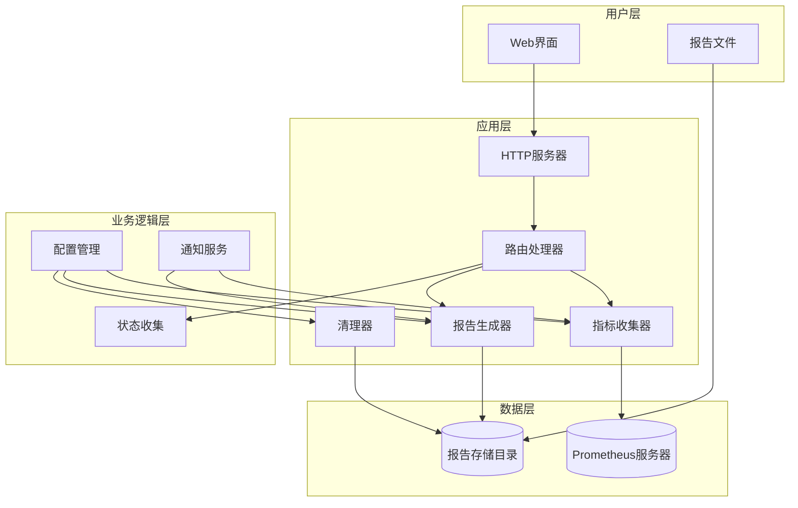
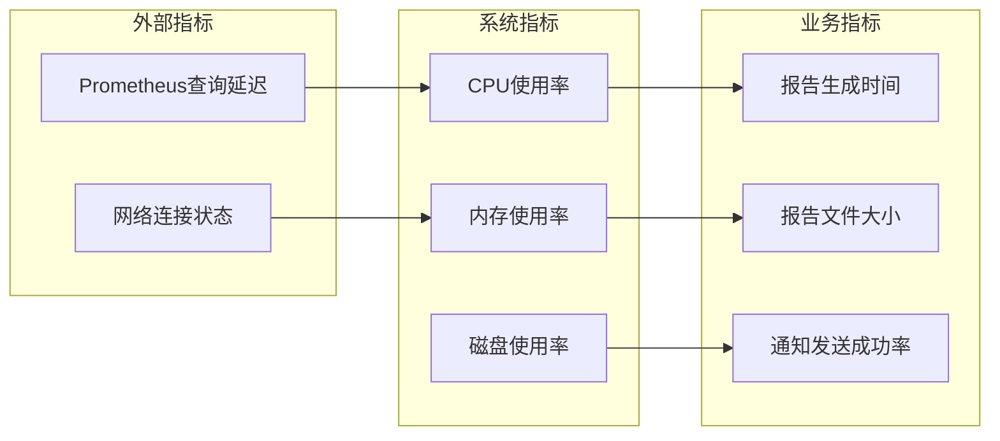
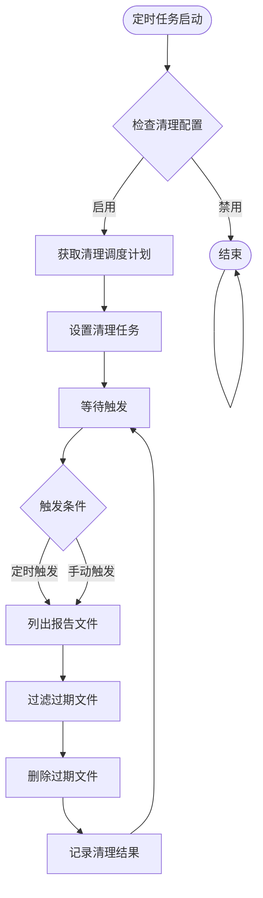
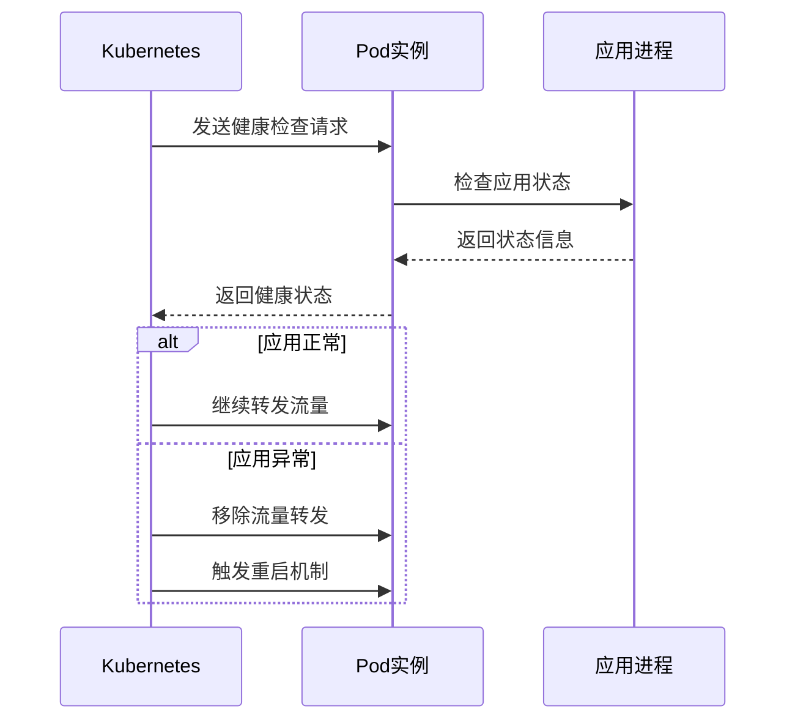

# Prometheus 监控报告生成器 部署与运维操作手册

<cite>
**本文档引用的文件**
- [README.md](file://README.md)
- [main.go](file://main.go)
- [Dockerfile](file://Dockerfile)
- [deploy/deployment.yaml](file://deploy/deployment.yaml)
- [pkg/config/config.go](file://pkg/config/config.go)
- [pkg/report/cleanup.go](file://pkg/report/cleanup.go)
- [pkg/metrics/collector.go](file://pkg/metrics/collector.go)
- [pkg/report/generator.go](file://pkg/report/generator.go)
- [pkg/prometheus/client.go](file://pkg/prometheus/client.go)
- [pkg/notify/notify.go](file://pkg/notify/notify.go)
</cite>

## 目录
1. [概述](#概述)
2. [系统架构](#系统架构)
3. [部署方案](#部署方案)
4. [资源配置建议](#资源配置建议)
5. [日志管理策略](#日志管理策略)
6. [监控接入点](#监控接入点)
7. [自动清理机制](#自动清理机制)
8. [健康检查配置](#健康检查配置)
9. [服务升级流程](#服务升级流程)
10. [故障排除指南](#故障排除指南)
11. [最佳实践建议](#最佳实践建议)

## 概述

Prometheus 监控报告生成器是一个基于 Prometheus 的自动化监控报告工具，能够自动收集、分析指标数据并生成可视化的 HTML 报告。该系统支持多种部署方案，包括本地二进制运行、Docker 容器化部署和 Kubernetes 集群部署，为企业级监控需求提供了灵活的解决方案。

### 主要特性

- **多指标类型支持**：支持基础资源使用情况、Kubernetes 集群监控、应用服务监控等多种指标类型
- **自动化报告生成**：支持定时任务和手动触发两种模式
- **多通知渠道**：集成钉钉、邮件、企业微信等多种通知方式
- **智能告警分级**：根据阈值自动计算指标状态和告警级别
- **可视化展示**：生成包含数据表格和图表的美观 HTML 报告
- **生命周期管理**：内置报告自动清理机制

## 系统架构



**图表来源**
- [main.go](file://main.go#L1-L230)
- [pkg/metrics/collector.go](file://pkg/metrics/collector.go#L1-L195)
- [pkg/report/generator.go](file://pkg/report/generator.go#L1-L355)

### 核心组件说明

1. **HTTP服务器**：提供 Web 服务接口，处理报告生成和状态查询请求
2. **指标收集器**：从 Prometheus 服务器获取监控指标数据
3. **报告生成器**：将原始指标数据转换为美观的 HTML 报告
4. **清理器**：定期清理过期的报告文件
5. **通知服务**：支持多种通知渠道的告警推送
6. **配置管理**：集中管理系统配置参数

**章节来源**
- [main.go](file://main.go#L1-L230)
- [pkg/config/config.go](file://pkg/config/config.go#L1-L37)

## 部署方案

### 本地二进制运行

这是最简单的部署方式，适用于开发测试环境和小型生产环境。

#### 环境要求
- Go 1.22 或更高版本
- 可访问的 Prometheus 服务器
- 至少 512MB 可用内存
- 50MB 可用磁盘空间

#### 部署步骤

1. **克隆代码仓库**
```bash
git clone https://github.com/kubehan/PromAI.git
cd PromAI
```

2. **安装依赖**
```bash
go mod download
```

3. **修改配置文件**
```bash
cp config/config.yaml config/config.yaml
# 编辑 config.yaml 设置 Prometheus 服务器地址和监控指标
```

4. **构建并运行**
```bash
go build -o PromAI main.go
./PromAI -config config/config.yaml
```

5. **访问服务**
   - 获取报告：http://localhost:8091/getreport
   - 健康看板：http://localhost:8091/status

### Docker 容器化部署

Docker 部署提供了更好的环境隔离和一致性。

#### Dockerfile 分析

```dockerfile
FROM docker.io/library/golang:1.23.4-alpine3.20 AS builder
WORKDIR /build
COPY . .
RUN go env -w GO111MODULE=on && go env -w GOPROXY=https://goproxy.cn,direct && go mod download && go build && ls -la /build

FROM docker.io/alpine:3.21.0
RUN apk --no-cache add \
    chromium \
    nss \
    freetype \
    harfbuzz \
    ca-certificates \
    ttf-freefont
ENV PUPPETEER_SKIP_CHROMIUM_DOWNLOAD=true
ENV CHROMEDP_CHROME_PATH=/usr/bin/chromium-browser
ENV TZ=Asia/Shanghai
RUN apk add --no-cache tzdata && ln -snf /usr/share/zoneinfo/$TZ /etc/localtime && echo $TZ > /etc/timezone
WORKDIR /app
COPY --from=builder /build/PromAI /app/
COPY --from=builder /build/config /app/config/
COPY --from=builder /build/reports /app/reports/
COPY --from=builder /build/templates /app/templates/
EXPOSE 8091
CMD ["./PromAI", "-port", "8091"]
```

#### Docker 部署命令

```bash
# 构建镜像
docker build -t promai:latest .

# 运行容器
docker run -d \
  --name promai \
  -p 8091:8091 \
  -v $(pwd)/config:/app/config \
  -v $(pwd)/reports:/app/reports \
  -e PROMETHEUS_URL=http://prometheus.example.com:9090 \
  promai:latest
```

### Kubernetes 集群部署

Kubernetes 部署适合生产环境，提供高可用性和自动扩缩容能力。

#### 部署清单分析

```yaml
apiVersion: v1
kind: Namespace
metadata:
  labels:
    kubernetes.io/metadata.name: promai
  name: promai
---
kind: ConfigMap
apiVersion: v1
metadata:
  name: config
  namespace: promai
data:
  config.yaml: |
    prometheus_url: "http://prometheus-k8s.kubesphere-monitoring-system.svc.cluster.local:9090"
    project_name: "测试项目巡检报告"
    cron_schedule: "30 9,17 * * *"
    report_cleanup:
      enabled: true
      max_age: 7
      cron_schedule: "0 0 * * *"
```

#### 部署命令

```bash
# 应用部署清单
kubectl apply -f deploy/deployment.yaml

# 查看部署状态
kubectl get pods -n promai
kubectl logs -n promai -l app=promai
```

**章节来源**
- [README.md](file://README.md#L1-L213)
- [Dockerfile](file://Dockerfile#L1-L33)
- [deploy/deployment.yaml](file://deploy/deployment.yaml#L1-L287)

## 资源配置建议

### CPU 配置

| 部署环境 | 最小配置 | 推荐配置 | 最大配置 |
|---------|---------|---------|---------|
| 开发环境 | 50m | 100m | 500m |
| 测试环境 | 100m | 200m | 1000m |
| 生产环境 | 200m | 500m | 2000m |

### 内存配置

| 部署环境 | 最小配置 | 推荐配置 | 最大配置 |
|---------|---------|---------|---------|
| 开发环境 | 128Mi | 256Mi | 512Mi |
| 测试环境 | 256Mi | 512Mi | 1Gi |
| 生产环境 | 512Mi | 1Gi | 4Gi |

### 存储卷配置

#### reports 目录挂载

```yaml
volumes:
  - name: reports-volume
    persistentVolumeClaim:
      claimName: promai-reports-pvc
volumeMounts:
  - name: reports-volume
    mountPath: /app/reports
```

#### 配置文件挂载

```yaml
volumes:
  - name: config-volume
    configMap:
      name: promai-config
volumeMounts:
  - name: config-volume
    mountPath: /app/config
    readOnly: true
```

### 环境变量配置

```yaml
env:
  - name: PROMETHEUS_URL
    value: "http://prometheus.example.com:9090"
  - name: TZ
    value: "Asia/Shanghai"
```

**章节来源**
- [deploy/deployment.yaml](file://deploy/deployment.yaml#L150-L170)
- [pkg/config/config.go](file://pkg/config/config.go#L1-L37)

## 日志管理策略

### 日志级别配置

系统支持多种日志级别，可根据环境调整：

```yaml
# 开发环境
log_level: debug

# 测试环境  
log_level: info

# 生产环境
log_level: warn
```

### 日志输出格式

```bash
# 时间戳格式
2024-12-31T20:18:38Z

# 日志格式示例
INFO [main.go:123] "Starting server on port: 8091"
WARN [collector.go:89] "Query failed for metric: CPU usage"
ERROR [generator.go:156] "Template parsing failed: %v"
```

### 日志轮转配置

```bash
# 使用 logrotate 配置
/var/log/promai/*.log {
    daily
    rotate 30
    compress
    delaycompress
    missingok
    notifempty
    create 0644 promai promai
}
```

### 集中日志收集

```yaml
# Fluentd 配置示例
<source>
  @type tail
  path /var/log/promai/*.log
  pos_file /var/log/fluentd/promai.log.pos
  tag promai.*
  format json
</source>

<match promai.**>
  @type elasticsearch
  host elasticsearch.example.com
  port 9200
  index_name promai-logs
</match>
```

## 监控接入点

### 内置监控指标

系统提供多个内置监控指标：



**图表来源**
- [pkg/metrics/collector.go](file://pkg/metrics/collector.go#L40-L80)
- [pkg/report/generator.go](file://pkg/report/generator.go#L100-L150)

### 监控端点配置

```yaml
# Prometheus 监控配置
scrape_configs:
  - job_name: 'promai'
    static_configs:
      - targets: ['promai.example.com:8091']
    metrics_path: '/metrics'
    scrape_interval: 30s
```

### 健康检查端点

```bash
# 健康检查
curl http://promai.example.com:8091/health

# 状态检查
curl http://promai.example.com:8091/status
```

### 告警规则配置

```yaml
groups:
  - name: promai
    rules:
      - alert: PromAIDown
        expr: up{job="promai"} == 0
        for: 5m
        labels:
          severity: critical
        annotations:
          summary: "PromAI 实例不可用"
          
      - alert: PromAIHighMemory
        expr: promai_memory_usage > 80
        for: 10m
        labels:
          severity: warning
        annotations:
          summary: "PromAI 内存使用率过高"
```

**章节来源**
- [main.go](file://main.go#L100-L150)
- [pkg/metrics/collector.go](file://pkg/metrics/collector.go#L1-L50)

## 自动清理机制

### 清理策略配置

系统实现了基于时间的自动清理机制，防止报告文件无限增长。



**图表来源**
- [pkg/report/cleanup.go](file://pkg/report/cleanup.go#L1-L37)

### 清理配置参数

```yaml
report_cleanup:
  enabled: true                    # 是否启用清理功能
  max_age: 7                       # 保留最近7天的报告
  cron_schedule: "0 0 * * *"       # 每日凌晨执行清理
```

### 清理算法实现

```go
func CleanupReports(maxAge int) error {
    reportsDir := "reports"
    now := time.Now()

    return filepath.Walk(reportsDir, func(path string, info os.FileInfo, err error) error {
        if path == reportsDir {
            return nil
        }

        // 检查文件年龄
        if info.ModTime().Add(time.Duration(maxAge) * 24 * time.Hour).Before(now) {
            if err := os.Remove(path); err != nil {
                log.Printf("删除报告文件失败 %s: %v", path, err)
                return err
            }
            log.Printf("已删除过期报告: %s", path)
        }
        return nil
    })
}
```

### 清理监控指标

- **清理任务状态**：监控清理任务是否正常执行
- **文件数量统计**：跟踪报告文件总数变化
- **清理耗时**：监控清理操作的执行时间
- **删除成功率**：统计清理成功的文件比例

**章节来源**
- [pkg/report/cleanup.go](file://pkg/report/cleanup.go#L1-L37)
- [main.go](file://main.go#L120-L140)

## 健康检查配置

### Liveness 探针配置

```yaml
livenessProbe:
  tcpSocket:
    port: 8091
  initialDelaySeconds: 15
  timeoutSeconds: 30
  periodSeconds: 10
  successThreshold: 1
  failureThreshold: 8
```

### Readiness 探针配置

```yaml
readinessProbe:
  tcpSocket:
    port: 8091
  initialDelaySeconds: 15
  timeoutSeconds: 30
  periodSeconds: 10
  successThreshold: 1
  failureThreshold: 8
```

### 健康检查流程



**图表来源**
- [deploy/deployment.yaml](file://deploy/deployment.yaml#L180-L200)

### 健康检查端点

```bash
# 基础健康检查
curl -f http://promai.example.com:8091/health || exit 1

# 状态检查
curl http://promai.example.com:8091/status

# 指标检查
curl http://promai.example.com:8091/metrics
```

### 故障恢复策略

```yaml
# 重启策略
restartPolicy: Always

# 终止宽限期
terminationGracePeriodSeconds: 30

# 滚动更新策略
strategy:
  type: RollingUpdate
  rollingUpdate:
    maxUnavailable: 25%
    maxSurge: 25%
```

**章节来源**
- [deploy/deployment.yaml](file://deploy/deployment.yaml#L180-L220)
- [main.go](file://main.go#L100-L120)

## 服务升级流程

### 滚动更新策略

```yaml
# 滚动更新配置
strategy:
  type: RollingUpdate
  rollingUpdate:
    maxUnavailable: 25%
    maxSurge: 25%
```

### 升级前检查

```bash
#!/bin/bash
# pre-upgrade-check.sh

echo "=== 升级前检查 ==="

# 检查当前版本
VERSION=$(./PromAI --version 2>/dev/null || echo "unknown")
echo "当前版本: $VERSION"

# 检查健康状态
HEALTH_STATUS=$(curl -s http://localhost:8091/health)
if [[ "$HEALTH_STATUS" == "OK" ]]; then
    echo "健康检查: 通过"
else
    echo "健康检查: 失败"
    exit 1
fi

# 检查资源使用
MEMORY_USAGE=$(ps aux | grep PromAI | awk '{sum+=$6} END {print sum/1024}')
echo "内存使用: ${MEMORY_USAGE}MB"

# 检查磁盘空间
DISK_USAGE=$(df /app/reports | tail -1 | awk '{print $5}' | sed 's/%//')
echo "磁盘使用: ${DISK_USAGE}%"
```

### 升级步骤

```bash
#!/bin/bash
# upgrade.sh

set -e

echo "=== 开始升级 PromAI ==="

# 1. 备份当前配置
echo "备份配置文件..."
cp -r config config.backup.$(date +%Y%m%d_%H%M%S)

# 2. 下载新版本
echo "下载新版本..."
wget -O PromAI.new https://github.com/kubehan/PromAI/releases/download/v1.0.0/PromAI

# 3. 停止服务（优雅关闭）
echo "停止服务..."
kill -TERM $(pgrep PromAI)

# 4. 替换二进制文件
echo "替换二进制文件..."
mv PromAI.new PromAI
chmod +x PromAI

# 5. 启动新版本
echo "启动新版本..."
./PromAI -config config/config.yaml &

# 6. 等待服务启动
sleep 10

# 7. 验证新版本
echo "验证新版本..."
NEW_VERSION=$(./PromAI --version)
echo "新版本: $NEW_VERSION"

# 8. 健康检查
HEALTH_STATUS=$(curl -s http://localhost:8091/health)
if [[ "$HEALTH_STATUS" == "OK" ]]; then
    echo "升级成功!"
else
    echo "升级失败，回滚..."
    kill -TERM $(pgrep PromAI)
    mv PromAI.old PromAI
    ./PromAI -config config/config.yaml &
    exit 1
fi
```

### 回滚流程

```bash
#!/bin/bash
# rollback.sh

echo "=== 开始回滚 ==="

# 1. 停止当前服务
kill -TERM $(pgrep PromAI)

# 2. 恢复备份的二进制文件
if [[ -f PromAI.old ]]; then
    mv PromAI.old PromAI
    chmod +x PromAI
    echo "二进制文件已恢复"
else
    echo "错误：找不到备份的二进制文件"
    exit 1
fi

# 3. 恢复配置文件
if [[ -d config.backup ]]; then
    rm -rf config
    mv config.backup config
    echo "配置文件已恢复"
else
    echo "警告：找不到备份的配置文件"
fi

# 4. 启动服务
./PromAI -config config/config.yaml &

# 5. 验证回滚
sleep 10
HEALTH_STATUS=$(curl -s http://localhost:8091/health)
if [[ "$HEALTH_STATUS" == "OK" ]]; then
    echo "回滚成功!"
else
    echo "回滚失败!"
    exit 1
fi
```

### 升级后验证

```bash
#!/bin/bash
# post-upgrade-validation.sh

echo "=== 升级后验证 ==="

# 1. 验证服务状态
SERVICE_STATUS=$(systemctl is-active promai)
echo "服务状态: $SERVICE_STATUS"

# 2. 验证端口监听
PORT_LISTENING=$(netstat -ln | grep :8091 | wc -l)
echo "端口监听: $PORT_LISTENING"

# 3. 验证基本功能
REPORT_GENERATED=$(curl -s http://localhost:8091/getreport | grep "inspection_report_" | wc -l)
echo "报告生成: $REPORT_GENERATED"

# 4. 验证日志输出
LOG_ENTRIES=$(journalctl -u promai --since "1 minute ago" | wc -l)
echo "日志条目: $LOG_ENTRIES"

# 5. 验证监控指标
METRICS_AVAILABLE=$(curl -s http://localhost:8091/metrics | head -10 | grep -c "#")
echo "监控指标: $METRICS_AVAILABLE"
```

## 故障排除指南

### 常见问题诊断

#### 1. 服务无法启动

```bash
# 检查端口占用
netstat -tulpn | grep 8091

# 检查配置文件
./PromAI -config config/config.yaml -dry-run

# 检查Prometheus连接
curl -f http://prometheus.example.com:9090/api/v1/query?query=up
```

#### 2. 报告生成失败

```bash
# 检查报告目录权限
ls -la reports/

# 检查磁盘空间
df -h reports/

# 检查模板文件
ls -la templates/
```

#### 3. 通知发送失败

```bash
# 检查网络连接
ping prometheus.example.com

# 检查DNS解析
nslookup prometheus.example.com

# 检查防火墙规则
iptables -L | grep 8091
```

### 日志分析技巧

```bash
# 查看最近的错误日志
tail -f /var/log/promai/error.log | grep ERROR

# 统计特定时间段的日志
grep "2024-12-31" /var/log/promai/app.log | grep -i error

# 分析报告生成性能
grep "报告生成成功" /var/log/promai/app.log | tail -10
```

### 性能调优

```yaml
# 调整并发查询
prometheus_config:
  query_timeout: 30s
  max_concurrent_queries: 10

# 调整内存限制
resources:
  limits:
    memory: 2Gi
  requests:
    memory: 512Mi
```

### 备份与恢复

```bash
#!/bin/bash
# backup.sh

BACKUP_DIR="/backup/promai/$(date +%Y%m%d)"
mkdir -p $BACKUP_DIR

# 备份配置文件
cp -r config $BACKUP_DIR/

# 备份报告文件
cp -r reports $BACKUP_DIR/

# 备份数据库（如果有）
# mysqldump promai > $BACKUP_DIR/promai.sql

echo "备份完成: $BACKUP_DIR"
```

```bash
#!/bin/bash
# restore.sh

BACKUP_DIR="$1"

if [[ -z "$BACKUP_DIR" ]]; then
    echo "使用方法: $0 <backup_directory>"
    exit 1
fi

# 停止服务
systemctl stop promai

# 恢复配置文件
rm -rf config
cp -r $BACKUP_DIR/config .

# 恢复报告文件
rm -rf reports
cp -r $BACKUP_DIR/reports .

# 启动服务
systemctl start promai

echo "恢复完成"
```

## 最佳实践建议

### 安全配置

1. **网络隔离**
```yaml
# 使用专用网络命名空间
networkPolicy:
  ingress:
    - from:
        - namespaceSelector:
            matchLabels:
              name: monitoring
      ports:
        - protocol: TCP
          port: 8091
```

2. **身份认证**
```yaml
# 配置基本认证
basic_auth:
  username: promai_user
  password: secure_password
```

3. **HTTPS 配置**
```yaml
# 启用 HTTPS
ssl_certificate: /etc/ssl/promai.crt
ssl_certificate_key: /etc/ssl/promai.key
```

### 性能优化

1. **缓存策略**
```yaml
# 启用查询缓存
cache:
  enabled: true
  ttl: 300s
  max_size: 100MB
```

2. **批量处理**
```yaml
# 批量查询优化
batch_size: 50
batch_interval: 10s
```

3. **资源池管理**
```yaml
# 连接池配置
pool:
  min_connections: 5
  max_connections: 20
  connection_timeout: 30s
```

### 监控与告警

1. **关键指标监控**
```yaml
# 关键指标告警规则
- alert: PromAIHighCPU
  expr: promai_cpu_usage > 80
  for: 5m
  labels:
    severity: warning
  
- alert: PromAIHighMemory
  expr: promai_memory_usage > 85
  for: 5m
  labels:
    severity: warning
```

2. **SLA 监控**
```yaml
# SLA 指标
- record: promai_availability
  expr: up * 100
```

### 运维自动化

1. **CI/CD 集成**
```yaml
# Jenkins Pipeline 示例
pipeline {
    agent any
    stages {
        stage('Build') {
            steps {
                sh 'go build -o PromAI main.go'
            }
        }
        stage('Test') {
            steps {
                sh './test.sh'
            }
        }
        stage('Deploy') {
            steps {
                sh './deploy.sh'
            }
        }
    }
}
```

2. **基础设施即代码**
```yaml
# Terraform 配置示例
resource "kubernetes_deployment" "promai" {
  metadata {
    name = "promai"
    namespace = "monitoring"
  }
  
  spec {
    replicas = 3
    
    selector {
      match_labels = {
        app = "promai"
      }
    }
    
    template {
      metadata {
        labels = {
          app = "promai"
        }
      }
      
      spec {
        container {
          image = "promai:latest"
          name = "promai"
          
          port {
            container_port = 8091
          }
          
          liveness_probe {
            tcp_socket {
              port = 8091
            }
          }
        }
      }
    }
  }
}
```

### 文档维护

1. **版本控制**
```bash
# Git hooks 自动更新文档
pre-commit:
  - shellcheck scripts/*.sh
  - markdownlint docs/*.md

post-commit:
  - git tag v$(cat VERSION)
  - git push origin v$(cat VERSION)
```

2. **知识库建设**
```yaml
# Wiki 配置
pages:
  - home: "首页"
  - installation: "安装指南"
  - configuration: "配置说明"
  - troubleshooting: "故障排除"
  - changelog: "更新日志"
```

通过遵循这些最佳实践，您可以确保 Prometheus 监控报告生成器系统的稳定性、安全性和可维护性。定期审查和更新配置，保持系统的持续改进。