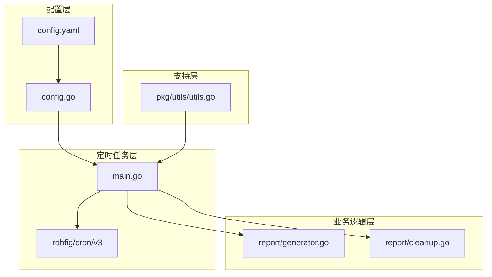
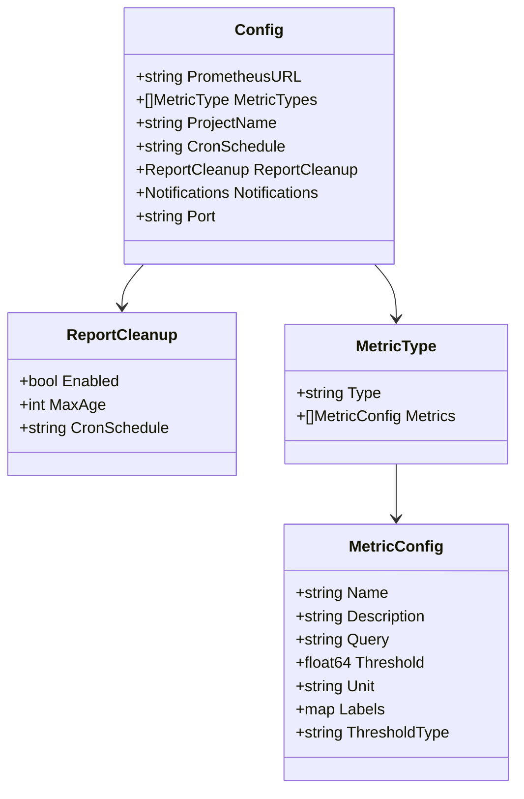
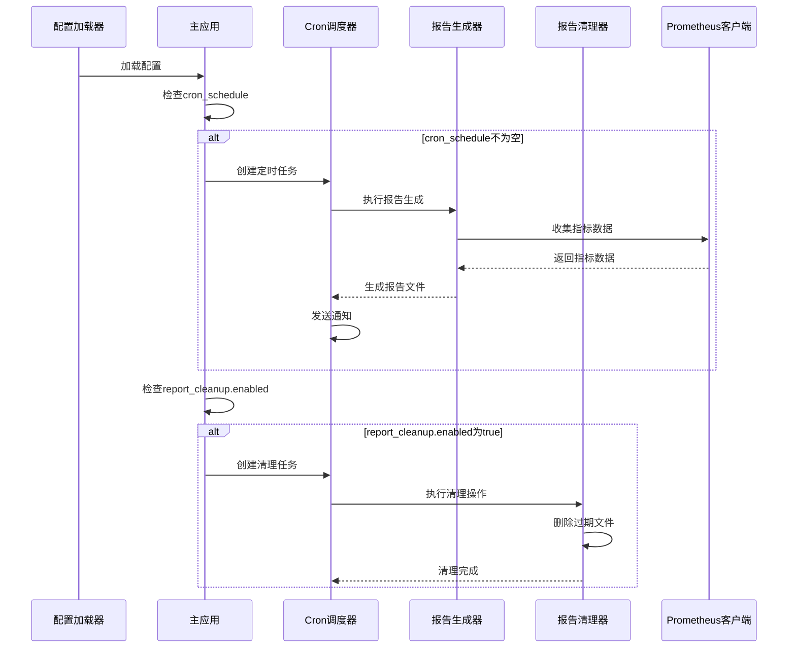
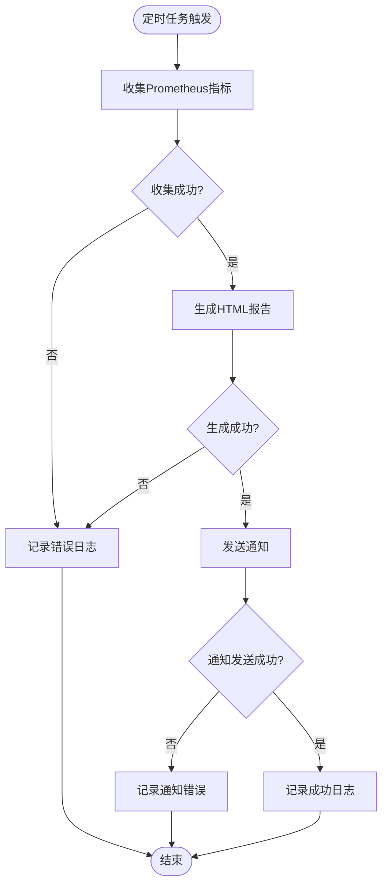
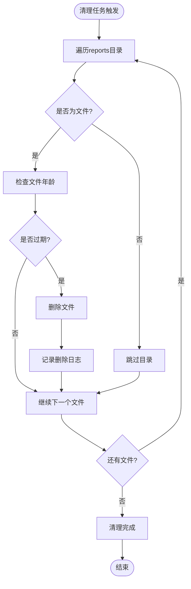
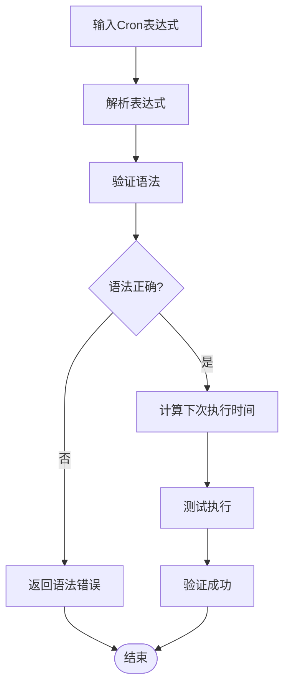
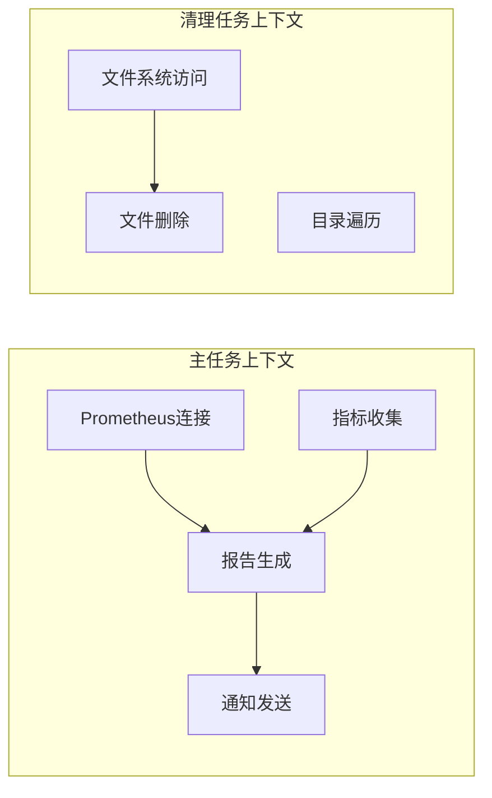

# 定时任务配置技术文档

<cite>
**本文档引用的文件**
- [config.yaml](file://config/config.yaml)
- [config.go](file://pkg/config/config.go)
- [main.go](file://main.go)
- [generator.go](file://pkg/report/generator.go)
- [cleanup.go](file://pkg/report/cleanup.go)
- [utils.go](file://pkg/utils/utils.go)
</cite>

## 目录
1. [简介](#简介)
2. [项目结构概览](#项目结构概览)
3. [核心配置组件](#核心配置组件)
4. [架构概览](#架构概览)
5. [详细组件分析](#详细组件分析)
6. [Cron表达式详解](#cron表达式详解)
7. [定时任务优先级与执行上下文](#定时任务优先级与执行上下文)
8. [性能考虑](#性能考虑)
9. [故障排除指南](#故障排除指南)
10. [结论](#结论)

## 简介

PromAI项目实现了两个独立但相关的定时任务系统，通过robfig/cron库实现精确的时间调度。第一个定时任务负责定期生成巡检报告，第二个定时任务负责清理过期的报告文件。本文档深入解析这两个定时任务的配置机制、Cron表达式语法以及它们在系统中的执行行为。

## 项目结构概览



**图表来源**
- [config.yaml](file://config/config.yaml#L1-L20)
- [config.go](file://pkg/config/config.go#L1-L37)
- [main.go](file://main.go#L1-L50)

**章节来源**
- [config.yaml](file://config/config.yaml#L1-L196)
- [config.go](file://pkg/config/config.go#L1-L37)

## 核心配置组件

### 主要配置结构

系统通过YAML配置文件定义两个主要的定时任务配置：

1. **主报告生成定时任务** (`cron_schedule`)
2. **报告清理定时任务** (`report_cleanup.cron_schedule`)

```yaml
# 定时任务：每天9点半和17半执行
cron_schedule: "30 9,17 * * *"

# 报告清理
report_cleanup:
  enabled: true
  max_age: 7 # 保留最近7天的报告
  cron_schedule: "0 0 * * *" # 如果为空，则执行执行上面定时任务，即生成报告时清理
```

### 配置数据结构



**图表来源**
- [config.go](file://pkg/config/config.go#L5-L37)

**章节来源**
- [config.yaml](file://config/config.yaml#L8-L15)
- [config.go](file://pkg/config/config.go#L5-L37)

## 架构概览



**图表来源**
- [main.go](file://main.go#L58-L134)
- [generator.go](file://pkg/report/generator.go#L1-L50)
- [cleanup.go](file://pkg/report/cleanup.go#L1-L37)

## 详细组件分析

### 主报告生成定时任务

#### 配置解析与初始化

主报告生成定时任务通过以下配置参数控制：
- `cron_schedule`: Cron表达式，定义执行时间
- `project_name`: 项目名称，用于报告标题
- `metric_types`: 监控指标类型列表

#### 执行流程



**图表来源**
- [main.go](file://main.go#L58-L92)

#### 关键实现细节

1. **Cron表达式解析**: 使用robfig/cron库解析配置的Cron表达式
2. **Prometheus集成**: 自动连接到配置的Prometheus实例
3. **报告模板渲染**: 使用HTML模板生成美观的报告
4. **多渠道通知**: 支持钉钉、邮件、企业微信等多种通知方式

### 报告清理定时任务

#### 配置参数

报告清理功能通过以下参数控制：
- `enabled`: 是否启用清理功能
- `max_age`: 最大保留天数
- `cron_schedule`: 清理任务的执行时间

#### 清理算法



**图表来源**
- [cleanup.go](file://pkg/report/cleanup.go#L12-L36)

#### 文件清理逻辑

清理器使用基于文件修改时间的策略：
```go
if info.ModTime().Add(time.Duration(maxAge) * 24 * time.Hour).Before(now) {
    // 文件过期，执行删除
}
```

**章节来源**
- [main.go](file://main.go#L94-L134)
- [cleanup.go](file://pkg/report/cleanup.go#L1-L37)

## Cron表达式详解

### Cron表达式语法结构

Cron表达式由5个字段组成，每个字段代表不同的时间单位：

```
分钟(0-59) 小时(0-23) 日期(1-31) 月份(1-12) 星期(0-7)
```

### 常用Cron表达式参考表

| 表达式 | 含义 | 示例 |
|--------|------|------|
| `0 0 * * *` | 每天午夜执行 | 凌晨0点0分 |
| `30 9,17 * * *` | 每天9:30和17:30执行 | 巡检报告生成 |
| `0 0 */7 * *` | 每7天执行一次 | 周期性维护 |
| `0 0 * * 0` | 每周日执行 | 周报表生成 |
| `*/15 * * * *` | 每15分钟执行一次 | 实时监控 |

### 时区注意事项

系统默认使用UTC时间进行调度。如果需要使用本地时间，建议：
1. 在配置中明确标注时区信息
2. 考虑使用NTP同步系统时间
3. 在Cron表达式中考虑夏令时变化

### Cron表达式验证



## 定时任务优先级与执行上下文

### 执行优先级

系统中的两个定时任务具有不同的优先级：

1. **主报告生成任务** (高优先级)
   - 基于`cron_schedule`配置
   - 包含完整的业务逻辑
   - 可能涉及网络请求和文件操作

2. **报告清理任务** (低优先级)
   - 基于`report_cleanup.cron_schedule`或继承主任务配置
   - 仅包含文件系统操作
   - 不影响主任务的执行

### 执行上下文差异



### 配置继承机制

当`report_cleanup.cron_schedule`为空时，系统会自动继承主任务的调度时间：

```go
cleanupSchedule := config.ReportCleanup.CronSchedule
if cleanupSchedule == "" {
    cleanupSchedule = config.CronSchedule
}
```

这种设计确保了两个任务的执行时间一致性，避免了不同步导致的问题。

**章节来源**
- [main.go](file://main.go#L108-L112)

## 性能考虑

### 内存使用优化

1. **报告生成**: 使用流式处理减少内存占用
2. **文件清理**: 逐个文件处理，避免大量文件同时加载
3. **Cron调度**: 轻量级调度器，单线程执行

### 并发控制

系统采用单线程执行模式，避免并发问题：
- 每个定时任务独立运行
- 任务间无共享状态
- 错误隔离，不影响其他任务

### 资源监控

建议监控以下指标：
- Cron任务执行延迟
- 报告生成耗时
- 文件清理效率
- 系统资源使用情况

## 故障排除指南

### 常见问题诊断

#### 定时任务未执行

**可能原因**:
1. Cron表达式语法错误
2. 系统时间不正确
3. 配置文件权限问题

**解决方案**:
```bash
# 检查系统时间
date

# 验证Cron表达式
echo "30 9,17 * * *" | crontab -l -

# 检查配置文件权限
ls -la config/config.yaml
```

#### 报告生成失败

**可能原因**:
1. Prometheus连接失败
2. 查询超时
3. 模板渲染错误

**解决方案**:
1. 检查Prometheus URL配置
2. 增加查询超时时间
3. 验证HTML模板语法

#### 文件清理异常

**可能原因**:
1. 权限不足
2. 文件被占用
3. 路径不存在

**解决方案**:
```bash
# 检查reports目录权限
ls -la reports/

# 手动清理测试
find reports/ -mtime +7 -delete
```

### 日志分析

系统提供详细的日志输出：
- 定时任务启动/停止信息
- 报告生成进度
- 通知发送状态
- 错误详情

**章节来源**
- [main.go](file://main.go#L65-L92)
- [cleanup.go](file://pkg/report/cleanup.go#L25-L36)

## 结论

PromAI项目的定时任务系统通过robfig/cron库提供了灵活而可靠的调度机制。两个独立的定时任务分别负责报告生成和清理，通过合理的配置继承和优先级管理，确保了系统的稳定性和可维护性。

### 关键特性总结

1. **双任务架构**: 主任务负责业务逻辑，清理任务负责资源管理
2. **配置灵活性**: 支持独立和统一的调度时间配置
3. **错误处理**: 完善的日志记录和错误恢复机制
4. **扩展性**: 易于添加新的定时任务类型

### 最佳实践建议

1. **合理设置调度频率**: 避免过于频繁的任务执行
2. **监控任务状态**: 建立任务执行监控和告警
3. **备份重要配置**: 定期备份配置文件和生成的报告
4. **测试Cron表达式**: 在生产环境前充分测试调度逻辑

通过本文档的详细解析，用户可以深入理解PromAI定时任务的工作原理，并能够根据实际需求进行配置优化和故障排除。