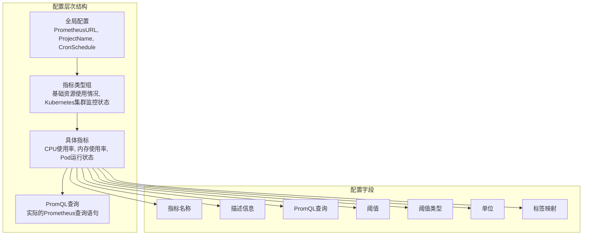
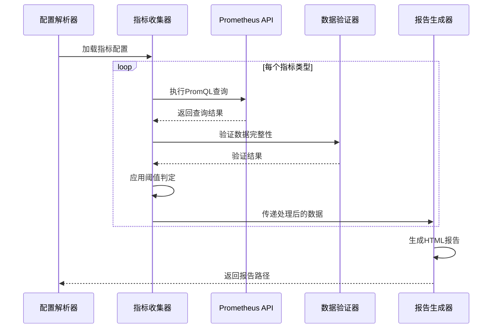
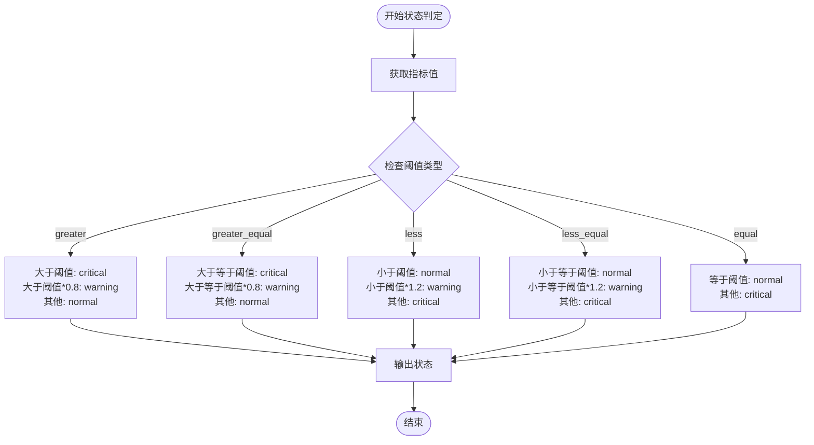
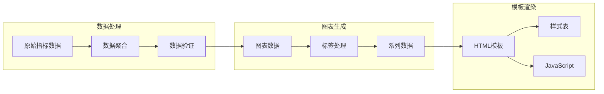

# 指标定义技术文档

<cite>
**本文档引用的文件**
- [config.yaml](file://config/config.yaml)
- [config.go](file://pkg/config/config.go)
- [collector.go](file://pkg/metrics/collector.go)
- [generator.go](file://pkg/report/generator.go)
- [status.go](file://pkg/status/status.go)
- [notify.go](file://pkg/notify/notify.go)
- [main.go](file://main.go)
</cite>

## 目录
1. [简介](#简介)
2. [指标配置结构](#指标配置结构)
3. [核心字段详解](#核心字段详解)
4. [指标采集流程](#指标采集流程)
5. [状态判定机制](#状态判定机制)
6. [报告生成与渲染](#报告生成与渲染)
7. [实际应用案例](#实际应用案例)
8. [PromQL编写指南](#promql编写指南)
9. [故障排除](#故障排除)
10. [总结](#总结)

## 简介

PromAI是一个基于Prometheus的智能巡检系统，通过配置化的指标定义实现自动化监控和报告生成。本文档详细解析metric_types下的每个字段作用，以及如何通过这些配置驱动完整的指标采集流程。

## 指标配置结构

指标配置采用分层结构设计，支持多维度的监控指标管理：



**图表来源**
- [config.yaml](file://config/config.yaml#L40-L195)
- [config.go](file://pkg/config/config.go#L1-L37)

**章节来源**
- [config.yaml](file://config/config.yaml#L1-L196)
- [config.go](file://pkg/config/config.go#L1-L37)

## 核心字段详解

### name - 指标显示名称

`name`字段定义了指标在报告中的显示名称，直接影响用户界面的可读性：

- **作用**：作为指标的友好名称，在报告中直接展示
- **示例**："CPU使用率", "内存使用率", "节点就绪状态"
- **最佳实践**：使用简洁明了的中文名称，避免技术术语

### query - PromQL查询语句

`query`字段包含实际的PromQL查询语句，这是指标数据采集的核心：

- **作用**：定义从Prometheus获取数据的具体查询逻辑
- **复杂度**：支持复杂的PromQL表达式，包括聚合、过滤、数学运算
- **示例**：
  ```promql
  100 - (avg by(instance) (irate(node_cpu_seconds_total{mode='idle'}[5m])) * 100)
  ```
- **特点**：支持多行字符串格式，便于编写复杂的查询

### threshold - 阈值判断基准

`threshold`字段定义了指标的阈值，用于状态判定和告警触发：

- **数据类型**：浮点数，支持小数值
- **作用**：作为比较基准，决定指标是否处于正常、警告或异常状态
- **示例**：CPU使用率80%，内存使用率85%，PVC使用率90%

### threshold_type - 阈值比较方式

`threshold_type`字段定义了阈值比较的逻辑类型：

- **支持类型**：
  - `greater`：大于阈值时触发（默认）
  - `greater_equal`：大于等于阈值时触发
  - `less`：小于阈值时触发
  - `less_equal`：小于等于阈值时触发
  - `equal`：等于阈值时正常
  - `not_equal`：不等于阈值时正常

### unit - 单位标识

`unit`字段提供指标的计量单位，影响报告中的数据显示格式：

- **作用**：用于数据格式化和可视化
- **常见值**：`%`（百分比）、`B`（字节）、`core`（核心数）
- **格式化**：自动转换为合适的显示格式

### labels - 数据标签映射

`labels`字段定义了Prometheus标签与报告中显示名称的映射关系：

- **作用**：将Prometheus的原始标签转换为友好的显示名称
- **格式**：`map[string]string`类型，键为PromQL标签名，值为显示别名
- **示例**：
  ```yaml
  labels:
    instance: "节点"
    mountpoint: "挂载点"
    namespace: "命名空间"
  ```

**章节来源**
- [config.yaml](file://config/config.yaml#L40-L195)
- [config.go](file://pkg/config/config.go#L25-L37)

## 指标采集流程

指标采集流程遵循标准的PromQL查询-数据处理-状态判定-报告生成模式：



**图表来源**
- [collector.go](file://pkg/metrics/collector.go#L30-L100)
- [generator.go](file://pkg/report/generator.go#L100-L150)

### 采集流程详解

1. **配置加载阶段**：从YAML配置文件中解析指标定义
2. **查询执行阶段**：使用Prometheus API执行每个指标的PromQL查询
3. **数据验证阶段**：确保查询结果的完整性和有效性
4. **状态判定阶段**：根据阈值和比较类型确定指标状态
5. **报告生成阶段**：将处理后的数据渲染为HTML报告

**章节来源**
- [collector.go](file://pkg/metrics/collector.go#L30-L195)

## 状态判定机制

状态判定是指标系统的核心功能，通过多种阈值类型实现灵活的状态判断：



**图表来源**
- [collector.go](file://pkg/metrics/collector.go#L130-L170)
- [status.go](file://pkg/status/status.go#L250-L294)

### 状态判定算法

系统实现了多层次的状态判定机制：

1. **严重告警（Critical）**：当指标值超出正常范围时
2. **警告（Warning）**：当指标值接近阈值但未超出时
3. **正常（Normal）**：当指标值在正常范围内时

**章节来源**
- [collector.go](file://pkg/metrics/collector.go#L130-L170)
- [status.go](file://pkg/status/status.go#L250-L294)

## 报告生成与渲染

报告生成过程包含数据聚合、图表生成和HTML模板渲染三个主要阶段：



**图表来源**
- [generator.go](file://pkg/report/generator.go#L100-L200)
- [generator.go](file://pkg/report/generator.go#L250-L354)

### 报告特性

1. **多维度统计**：计算每个指标组的最大值、最小值、平均值和告警数量
2. **主机资源聚合**：按主机汇总CPU、内存、磁盘使用情况
3. **动态图表**：基于指标数据生成交互式图表
4. **状态可视化**：通过颜色编码直观展示指标状态

**章节来源**
- [generator.go](file://pkg/report/generator.go#L100-L354)

## 实际应用案例

### 案例1：CPU使用率监控

```yaml
- name: "CPU使用率"
  description: "节点CPU使用率统计"
  query: "100 - (avg by(instance) (irate(node_cpu_seconds_total{mode='idle'}[5m])) * 100)"
  threshold: 80
  threshold_type: "greater"
  unit: "%"
  labels:
    instance: "节点"
```

**应用场景**：
- 监控节点CPU使用率
- 超过80%时触发警告
- 基于5分钟内核态和用户态CPU使用率计算

### 案例2：内存使用率监控

```yaml
- name: "内存使用率"
  description: "节点内存使用率统计"
  query: "100 - ((node_memory_MemAvailable_bytes * 100) / node_memory_MemTotal_bytes)"
  threshold: 85
  threshold_type: "greater"
  unit: "%"
  labels:
    instance: "节点"
```

**应用场景**：
- 监控节点内存使用情况
- 超过85%时触发警告
- 基于可用内存和总内存计算使用率

### 案例3：PVC使用率监控

```yaml
- name: "PVC使用率"
  description: "持久化存储使用率"
  query: "100 * (1 - kubelet_volume_stats_available_bytes / kubelet_volume_stats_capacity_bytes)"
  threshold: 90
  threshold_type: "greater"
  unit: "%"
  labels:
    namespace: "命名空间"
    persistentvolumeclaim: "PVC名称"
```

**应用场景**：
- 监控Kubernetes PVC存储使用情况
- 超过90%时触发警告
- 支持多命名空间和PVC的监控

### 案例4：节点就绪状态监控

```yaml
- name: "节点就绪状态"
  description: "K8s节点就绪状态检查"
  query: "kube_node_status_condition{condition='Ready',status!='true'}"
  threshold: 0
  threshold_type: "equal"
  unit: ""
  labels:
    node: "节点"
    condition: "状态类型"
```

**应用场景**：
- 监控Kubernetes节点就绪状态
- 状态不为true时触发告警
- 基于节点条件检查实现

**章节来源**
- [config.yaml](file://config/config.yaml#L40-L195)

## PromQL编写指南

### 基础原则

1. **准确性**：确保查询语句准确反映业务需求
2. **性能**：避免过于复杂的查询导致性能问题
3. **可维护性**：使用清晰的注释和格式化

### 常见模式

#### 1. CPU使用率计算
```promql
100 - (avg by(instance) (irate(node_cpu_seconds_total{mode='idle'}[5m])) * 100)
```

#### 2. 内存使用率计算
```promql
100 - ((node_memory_MemAvailable_bytes * 100) / node_memory_MemTotal_bytes)
```

#### 3. 存储使用率计算
```promql
(((100 -((node_filesystem_avail_bytes * 100) / node_filesystem_size_bytes)) and ON (instance, device, mountpoint) node_filesystem_readonly{mountpoint!~"/run.*|/var.*|/boot.*|/tmp.*"}== 0) + on(instance) group_left(node_uname_info) node_uname_info)
```

#### 4. 数量统计
```promql
sum by (namespace, pod) (kube_pod_status_phase{phase='Running'})
```

### 编写技巧

1. **使用聚合函数**：`avg`, `sum`, `count`等
2. **合理使用rate/irate**：计算速率变化
3. **标签过滤**：精确控制查询范围
4. **数学运算**：支持各种数学表达式
5. **字符串操作**：使用正则表达式过滤

## 故障排除

### 常见问题及解决方案

#### 1. 查询失败
**症状**：指标查询返回空结果或错误
**原因**：
- PromQL语法错误
- Prometheus服务不可达
- 标签选择器不匹配

**解决**：
- 检查PromQL语法
- 验证Prometheus连接
- 测试标签选择器

#### 2. 数据不完整
**症状**：某些指标缺少标签值
**原因**：
- Prometheus数据缺失
- 标签映射配置错误
- 数据采集延迟

**解决**：
- 检查Prometheus数据源
- 验证标签映射配置
- 调整数据采集频率

#### 3. 状态判定异常
**症状**：指标状态显示不正确
**原因**：
- 阈值设置不合理
- 阈值类型选择错误
- 数据格式转换问题

**解决**：
- 重新评估阈值设置
- 检查阈值类型配置
- 验证数据格式

### 调试方法

1. **日志分析**：查看程序日志定位问题
2. **Prometheus测试**：直接在Prometheus UI测试查询
3. **数据验证**：检查原始查询结果
4. **配置检查**：验证配置文件语法

**章节来源**
- [collector.go](file://pkg/metrics/collector.go#L50-L100)
- [status.go](file://pkg/status/status.go#L150-L200)

## 总结

PromAI的指标定义系统通过精心设计的配置结构和完善的采集流程，实现了高效、灵活的监控能力。关键特性包括：

1. **配置化管理**：通过YAML配置实现指标定义的集中管理
2. **PromQL驱动**：充分利用Prometheus的强大查询能力
3. **状态智能判定**：多层次的状态判断机制
4. **自动化报告**：完整的报告生成和通知机制
5. **扩展性强**：支持多种通知方式和自定义配置

通过合理的指标配置和PromQL编写，可以构建覆盖基础设施、应用性能和业务指标的全方位监控体系，为运维决策提供有力支撑。