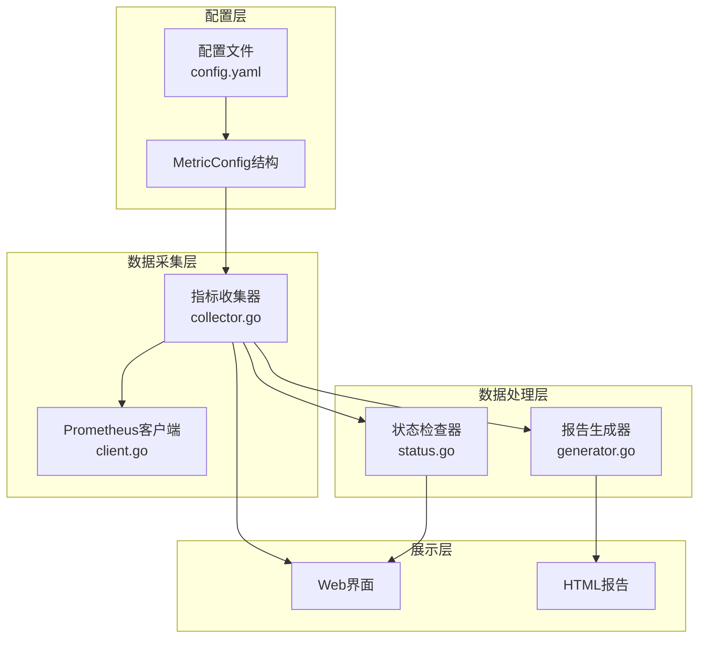
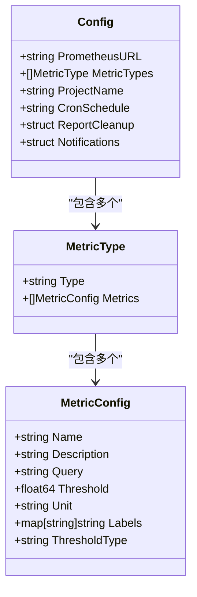
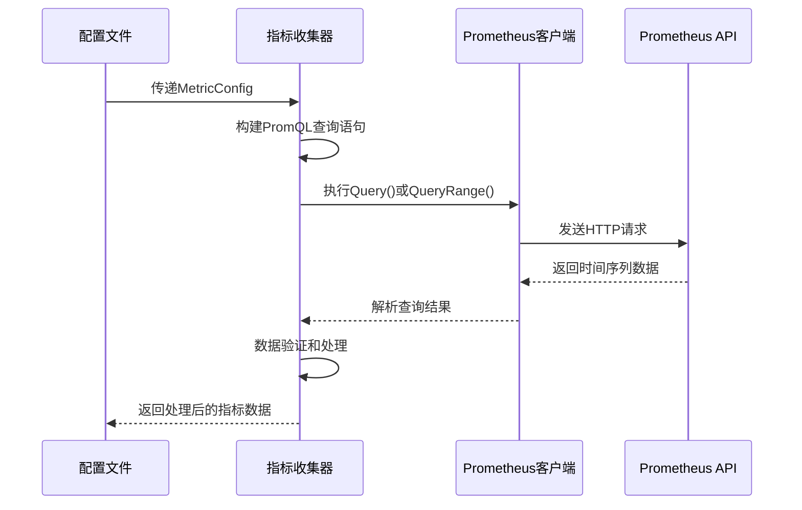
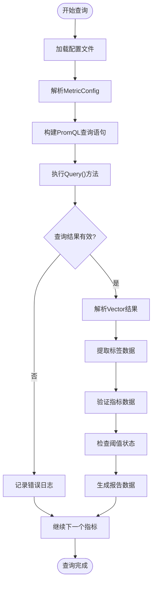
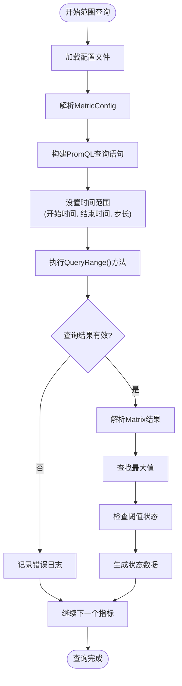

# 指标查询配置技术文档

<cite>
**本文档引用的文件**
- [main.go](file://main.go)
- [config.yaml](file://config/config.yaml)
- [config.go](file://pkg/config/config.go)
- [collector.go](file://pkg/metrics/collector.go)
- [client.go](file://pkg/prometheus/client.go)
- [generator.go](file://pkg/report/generator.go)
- [status.go](file://pkg/status/status.go)
- [utils.go](file://pkg/utils/utils.go)
</cite>

## 目录
1. [简介](#简介)
2. [项目架构概览](#项目架构概览)
3. [MetricConfig配置结构](#metricconfig配置结构)
4. [PromQL查询语句详解](#promql查询语句详解)
5. [查询执行流程](#查询执行流程)
6. [实际案例分析](#实际案例分析)
7. [性能优化建议](#性能优化建议)
8. [故障排除指南](#故障排除指南)
9. [总结](#总结)

## 简介

PromAI是一个基于Prometheus的智能监控指标收集和报告生成系统。本文档专注于解析MetricConfig中query字段的定义与作用，详细说明PromQL查询语句如何从Prometheus获取原始数据，并结合collector.go中的采集逻辑，阐述完整的查询执行流程。

系统通过配置文件定义各种监控指标，每个指标都包含一个PromQL查询语句，用于从Prometheus中提取相应的监控数据。这些查询语句经过精心设计，能够准确反映系统的运行状态，并支持多种数据聚合方式和标签过滤。

## 项目架构概览



**图表来源**
- [main.go](file://main.go#L1-L50)
- [collector.go](file://pkg/metrics/collector.go#L1-L30)
- [config.go](file://pkg/config/config.go#L1-L37)

## MetricConfig配置结构

MetricConfig是系统中定义监控指标的核心结构，其query字段是PromQL查询语句的具体实现位置。



**图表来源**
- [config.go](file://pkg/config/config.go#L20-L37)

### 字段详细说明

**Name**: 指标的显示名称，用于报告生成和用户界面展示。

**Description**: 指标的详细描述，帮助用户理解该指标的含义。

**Query**: 关键的PromQL查询语句，定义了从Prometheus获取数据的具体方式。

**Threshold**: 阈值设置，当指标值超过此值时触发告警。

**Unit**: 指标的单位，如"%", "B", "core"等。

**Labels**: 标签映射，定义了Prometheus标签到报告中显示名称的对应关系。

**ThresholdType**: 阈值比较类型，支持"greater", "greater_equal", "less", "less_equal", "equal"等。

**章节来源**
- [config.go](file://pkg/config/config.go#L20-L37)
- [config.yaml](file://config/config.yaml#L30-L50)

## PromQL查询语句详解

### 基础查询语法

PromQL是Prometheus的查询语言，具有以下基本语法特征：

1. **时间序列选择器**: `metric_name{label="value"}`
2. **聚合操作符**: `sum()`, `avg()`, `min()`, `max()`等
3. **运算符**: `+`, `-`, `*`, `/`, `%`等数学运算
4. **函数调用**: `rate()`, `increase()`, `histogram_quantile()`等

### 查询时间范围

系统支持两种查询模式：

1. **即时查询**: 使用`Query()`方法，获取当前时间点的数据
2. **范围查询**: 使用`QueryRange()`方法，获取指定时间范围内的数据



**图表来源**
- [collector.go](file://pkg/metrics/collector.go#L40-L80)
- [client.go](file://pkg/prometheus/client.go#L15-L27)

### 数据聚合方式

系统支持多种数据聚合方式：

1. **按实例聚合**: `avg by(instance)`
2. **按命名空间聚合**: `sum by(namespace)`
3. **多维度聚合**: `avg by(instance, namespace)`

**章节来源**
- [collector.go](file://pkg/metrics/collector.go#L40-L120)

## 查询执行流程

### 即时查询流程



**图表来源**
- [collector.go](file://pkg/metrics/collector.go#L40-L120)

### 范围查询流程



**图表来源**
- [status.go](file://pkg/status/status.go#L120-L180)

**章节来源**
- [collector.go](file://pkg/metrics/collector.go#L40-L120)
- [status.go](file://pkg/status/status.go#L120-L180)

## 实际案例分析

### CPU使用率查询

```yaml
- name: "CPU使用率"
  description: "节点CPU使用率统计"
  query: "100 - (avg by(instance) (irate(node_cpu_seconds_total{mode='idle'}[5m])) * 100)"
  threshold: 80
  threshold_type: "greater"
  unit: "%"
  labels:
    instance: "节点"
```

**查询解析**:
- `irate(node_cpu_seconds_total{mode='idle'}[5m])`: 计算5分钟内CPU空闲率的变化率
- `avg by(instance)`: 按节点实例聚合
- `100 - (...) * 100`: 转换为空闲率到使用率

### 内存使用率查询

```yaml
- name: "内存使用率"
  description: "节点内存使用率统计"
  query: "100 - ((node_memory_MemAvailable_bytes * 100) / node_memory_MemTotal_bytes)"
  threshold: 85
  threshold_type: "greater"
  unit: "%"
  labels:
    instance: "节点"
```

**查询解析**:
- `node_memory_MemAvailable_bytes`: 可用内存字节数
- `node_memory_MemTotal_bytes`: 总内存字节数
- `(available/total) * 100`: 计算内存使用百分比

### PVC使用率查询

```yaml
- name: "PVC使用率"
  description: "持久化存储使用率"
  query: >
    100 * (1 - kubelet_volume_stats_available_bytes / kubelet_volume_stats_capacity_bytes)
  threshold: 90
  threshold_type: "greater"
  unit: "%"
  labels:
    namespace: "命名空间"
    persistentvolumeclaim: "PVC名称"
```

**查询解析**:
- `kubelet_volume_stats_available_bytes`: PVC可用字节数
- `kubelet_volume_stats_capacity_bytes`: PVC总容量字节数
- `100 * (1 - available/capacity)`: 计算使用百分比

### 磁盘使用率查询

```yaml
- name: "磁盘使用率"
  description: "节点磁盘使用率统计"
  query: >
    (((100 -((node_filesystem_avail_bytes * 100) / node_filesystem_size_bytes)) and ON (instance, device, mountpoint) node_filesystem_readonly{mountpoint!~"/run.*|/var.*|/boot.*|/tmp.*"}== 0) + on(instance) group_left(nodename) node_uname_info) * on(instance) group_left(nodename) node_uname_info
  threshold: 80
  threshold_type: "greater"
  unit: "%"
  labels:
    instance: "节点"
    mountpoint: "挂载点"
    device: "磁盘"
    nodename: "节点名称"
```

**查询解析**:
- 复杂的多条件过滤和连接操作
- 排除特殊挂载点(`/run.*|/var.*|/boot.*|/tmp.*`)
- 处理只读文件系统的情况
- 使用`group_left`进行标签合并

**章节来源**
- [config.yaml](file://config/config.yaml#L30-L150)

## 性能优化建议

### 避免高基数查询

高基数查询会导致Prometheus性能下降，应遵循以下原则：

1. **限制标签数量**: 避免使用动态标签值
2. **使用标签过滤**: 通过`{}`过滤不必要的标签组合
3. **合理设置时间范围**: 避免查询过大的时间范围

### 合理使用聚合操作

```yaml
# 不推荐：高基数查询
query: "node_cpu_usage{job='node-exporter'}"

# 推荐：适当聚合
query: "avg by(instance) (node_cpu_usage{job='node-exporter'})"
```

### 查询优化技巧

1. **使用`rate()`代替直接差值**: 更适合时间序列数据
2. **避免复杂表达式**: 简化查询逻辑
3. **合理设置步长**: 在范围查询中平衡精度和性能

### 标签过滤最佳实践

```yaml
# 推荐的标签过滤
query: "node_memory_MemTotal_bytes{instance=~'worker-.*'}"

# 避免的标签过滤
query: "node_memory_MemTotal_bytes{instance=~'.*'}"
```

## 故障排除指南

### 常见查询错误

1. **语法错误**: 检查PromQL语法是否正确
2. **标签不匹配**: 确认Prometheus中是否存在相应标签
3. **时间范围问题**: 验证查询的时间范围设置

### 调试方法

系统提供了详细的调试信息：

```go
log.Printf(`
查询指标: [%s]
时间范围: %s 到 %s
PromQL: %s
调试步骤:
1. 打开 Prometheus UI
2. 粘贴查询: %s
3. 设置时间范围为: %s 到 %s
-------------------`,
    metric.Name,
    startTime.Format("2006-01-02 15:04:05"),
    endTime.Format("2006-01-02 15:04:05"),
    metric.Query,
    metric.Query,
    startTime.Format("2006-01-02 15:04:05"),
    endTime.Format("2006-01-02 15:04:05"))
```

### 错误处理机制

系统实现了完善的错误处理：

1. **查询失败**: 记录错误日志但继续处理其他指标
2. **数据验证失败**: 跳过无效数据
3. **标签缺失**: 记录警告但不影响整体流程

**章节来源**
- [status.go](file://pkg/status/status.go#L120-L180)
- [collector.go](file://pkg/metrics/collector.go#L120-L150)

## 总结

PromAI系统通过精心设计的MetricConfig配置结构和PromQL查询语句，实现了高效、灵活的监控指标收集功能。系统支持多种查询模式、丰富的数据聚合方式和完善的错误处理机制。

关键特性包括：
- **灵活的配置**: 通过YAML配置文件定义指标
- **强大的查询能力**: 支持复杂的PromQL查询语句
- **自动化的数据处理**: 从原始数据到报告生成的全流程自动化
- **完善的监控**: 支持阈值检查、状态监控和历史数据分析

通过本文档的详细说明，用户可以深入理解指标查询配置的工作原理，并能够根据实际需求定制化查询语句，充分发挥PromAI系统的监控能力。