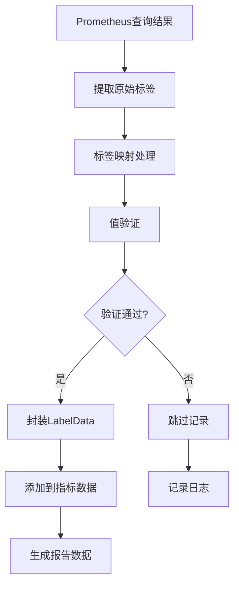
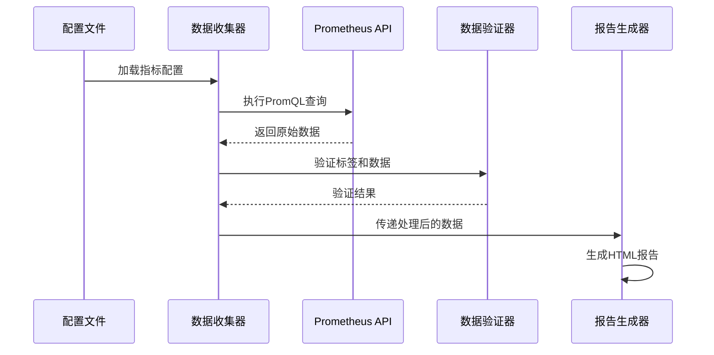
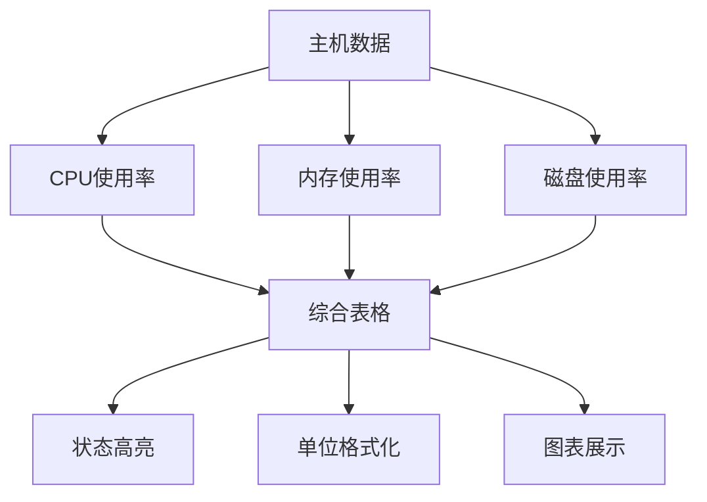
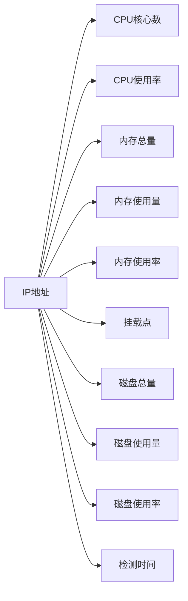

# 标签与单位配置技术文档

<cite>
**本文档引用的文件**
- [README.md](file://README.md)
- [config.yaml](file://config/config.yaml)
- [generator.go](file://pkg/report/generator.go)
- [collector.go](file://pkg/metrics/collector.go)
- [config.go](file://pkg/config/config.go)
- [report.html](file://templates/report.html)
- [utils.go](file://pkg/utils/utils.go)
</cite>

## 目录
1. [概述](#概述)
2. [标签配置机制](#标签配置机制)
3. [单位配置系统](#单位配置系统)
4. [数据处理流程](#数据处理流程)
5. [前端展示架构](#前端展示架构)
6. [实际应用案例](#实际应用案例)
7. [最佳实践指南](#最佳实践指南)
8. [故障排除](#故障排除)

## 概述

PromAI项目实现了完整的标签与单位配置系统，通过配置文件中的labels字段实现Prometheus原始标签到可读性字段的映射，并通过unit字段支持多种单位类型。该系统确保了报告展示的结构化呈现和一致性保障。

## 标签配置机制

### 标签映射原理

标签配置系统通过`labels`字段建立Prometheus原始标签与显示别名之间的映射关系：

```yaml
labels:
  instance: "节点"
  namespace: "命名空间"
  mountpoint: "挂载点"
  device: "磁盘"
```

### 标签数据结构

系统定义了专门的标签数据结构来管理标签信息：

```go
type LabelData struct {
    Name  string // 原始标签名
    Alias string // 显示的别名
    Value string // 标签值
}
```

### 标签处理流程

1. **原始标签提取**：从Prometheus查询结果中提取原始标签
2. **别名映射**：根据配置文件中的labels映射关系转换为显示别名
3. **值验证**：确保标签值的有效性和完整性
4. **数据封装**：将处理后的标签数据封装到MetricData结构中



**图表来源**
- [collector.go](file://pkg/metrics/collector.go#L50-L85)

**章节来源**
- [collector.go](file://pkg/metrics/collector.go#L50-L85)
- [config.yaml](file://config/config.yaml#L25-L35)

## 单位配置系统

### 支持的单位类型

系统支持多种单位类型的配置，包括但不限于：

- **百分比单位**：% - 用于表示使用率指标
- **字节单位**：B, KB, MB, GB, TB - 用于表示存储容量
- **核心单位**：core - 用于表示CPU核心数
- **空单位**："" - 用于布尔型或无量纲指标

### 单位处理逻辑

单位配置通过`unit`字段在配置文件中指定：

```yaml
unit: "%"
unit: "B"
unit: "core"
unit: ""
```

### 前端格式化处理

前端模板通过JavaScript函数实现单位的动态格式化：

```javascript
// 字节格式化函数
function formatBytes(bytes) {
    if (bytes == 0) {
        return "0 B";
    }
    
    const unitPrefixes = ["B", "KB", "MB", "GB", "TB"];
    const unitSize = 1024;
    
    let unitIndex = 0;
    let floatBytes = parseFloat(bytes);
    
    while (floatBytes >= unitSize && unitIndex < unitPrefixes.length - 1) {
        floatBytes /= unitSize;
        unitIndex++;
    }
    
    return `${floatBytes.toFixed(2)} ${unitPrefixes[unitIndex]}`;
}
```

### 单位一致性保障

系统通过以下机制确保单位的一致性：

1. **配置验证**：在数据收集阶段验证单位配置的正确性
2. **模板绑定**：前端模板直接使用配置的单位进行显示
3. **图表集成**：图表数据展示时自动应用相应的单位格式

**章节来源**
- [generator.go](file://pkg/report/generator.go#L80-L90)
- [report.html](file://templates/report.html#L450-L460)

## 数据处理流程

### 后端数据收集流程

数据收集过程遵循严格的处理流程：



**图表来源**
- [collector.go](file://pkg/metrics/collector.go#L30-L120)
- [generator.go](file://pkg/report/generator.go#L100-L150)

### 数据验证机制

系统实现了多层次的数据验证机制：

1. **标签验证**：确保标签数量和值的有效性
2. **指标验证**：验证数值范围和状态计算
3. **配置验证**：检查配置文件的完整性和一致性

```go
func validateLabels(labels []report.LabelData) bool {
    for _, label := range labels {
        if label.Value == "" || label.Value == "-" {
            return false
        }
    }
    return true
}
```

### 状态计算逻辑

系统根据阈值配置自动计算指标状态：

```go
func getStatus(value, threshold float64, thresholdType string) string {
    switch thresholdType {
    case "greater":
        if value > threshold {
            return "critical"
        } else if value >= threshold*0.8 {
            return "warning"
        }
    case "less":
        if value < threshold {
            return "normal"
        } else if value <= threshold*1.2 {
            return "warning"
        }
    }
    return "normal"
}
```

**章节来源**
- [collector.go](file://pkg/metrics/collector.go#L150-L195)

## 前端展示架构

### 模板引擎集成

系统使用Go的html/template包构建动态报告模板：

```go
funcMap := template.FuncMap{
    "formatBytes": formatBytes,
}

tmpl, err := template.New("report.html").Funcs(funcMap).ParseFiles("templates/report.html")
```

### 动态表格生成

前端模板通过循环结构动态生成表格：

```html
{{range $metric := $metrics}}
    <tr class="{{$metric.Status}}">
        <td>{{$metric.Name}}</td>
        
        <!-- 按配置顺序输出标签值 -->
        {{range $headerLabel := $headerLabels}}
            {{$labelName := $headerLabel.Name}}
            {{range $metricLabel := $metric.Labels}}
                {{if eq $metricLabel.Name $labelName}}
                    <td data-label-name="{{$labelName}}">
                        <span class="label-value">{{$metricLabel.Value}}</span>
                    </td>
                {{end}}
            {{end}}
        {{end}}
        
        <td>{{printf "%.2f" $metric.Value}}{{$metric.Unit}}</td>
        <td>{{if eq $metric.Status "normal"}}正常
            {{else if eq $metric.Status "warning"}}警告
            {{else if eq $metric.Status "critical"}}严重
            {{else}}{{$metric.Status}}{{end}}</td>
    </tr>
{{end}}
```

### 主机资源综合展示

系统提供了主机资源的综合展示功能：



**图表来源**
- [report.html](file://templates/report.html#L250-L350)

### 响应式设计

前端模板支持响应式布局，适应不同屏幕尺寸：

```css
@media screen and (max-width: 1200px) {
    .container {
        padding: 10px;
    }
    
    table {
        display: block;
        overflow-x: auto;
        white-space: nowrap;
    }
    
    td, th {
        white-space: nowrap;
    }
}
```

**章节来源**
- [generator.go](file://pkg/report/generator.go#L300-L355)
- [report.html](file://templates/report.html#L200-L400)

## 实际应用案例

### 磁盘使用率多维度展示

磁盘使用率指标展示了多维度标签组合的实际应用：

```yaml
- name: "磁盘使用率"
  description: "节点磁盘使用率统计"
  query: >-
    (((100 -((node_filesystem_avail_bytes * 100) / node_filesystem_size_bytes)) 
    and ON (instance, device, mountpoint) 
    node_filesystem_readonly{mountpoint!~"/run.*|/var.*|/boot.*|/tmp.*"}== 0) 
    + on(instance) group_left(node_uname_info) node_uname_info) 
    * on(instance) group_left(nodename) node_uname_info
  threshold: 80
  threshold_type: "greater"
  unit: "%"
  labels:
    instance: "节点"
    mountpoint: "挂载点"
    device: "磁盘"
    nodename: "节点名称"
```

### 多标签组合展示效果

系统能够同时展示多个标签维度的信息：

1. **节点维度**：显示具体的节点名称
2. **挂载点维度**：展示不同的文件系统挂载点
3. **设备维度**：标识具体的磁盘设备
4. **节点名称维度**：提供主机级别的标识

### 报告生成示例

生成的报告中，磁盘使用率指标会显示如下结构：

| 指标名称 | 节点 | 挂载点 | 磁盘 | 节点名称 | 值 | 状态 | 检测时间 |
|----------|------|--------|------|----------|----|------|----------|
| 磁盘使用率 | node1 | / | sda1 | server1 | 85.50% | 警告 | 2024-12-31 20:18:38 |

### 主机资源综合表格

系统还提供了主机资源的综合表格展示：



**图表来源**
- [report.html](file://templates/report.html#L250-L350)

**章节来源**
- [config.yaml](file://config/config.yaml#L100-L120)
- [report.html](file://templates/report.html#L440-L500)

## 最佳实践指南

### 标签设计原则

1. **语义化命名**：使用具有明确含义的标签别名
2. **一致性原则**：在整个配置文件中保持标签命名风格一致
3. **简洁明了**：避免过长或复杂的标签别名
4. **国际化考虑**：根据目标用户群体选择合适的语言

### 单位配置建议

1. **标准单位**：优先使用行业标准的单位表示
2. **精度控制**：根据指标特性选择合适的数值精度
3. **阈值关联**：单位配置应与阈值设置相匹配
4. **可读性优化**：选择便于用户理解的单位形式

### 配置文件组织

```yaml
metric_types:
- type: "基础资源使用情况"
  metrics:
  - name: "CPU使用率"
    description: "节点CPU使用率统计"
    query: "100 - (avg by(instance) (irate(node_cpu_seconds_total{mode='idle'}[5m])) * 100)"
    threshold: 80
    threshold_type: "greater"
    unit: "%"
    labels:
      instance: "节点"
```

### 性能优化建议

1. **索引优化**：确保Prometheus查询中使用有效的标签索引
2. **查询优化**：避免过于复杂的PromQL查询
3. **缓存策略**：合理设置数据更新频率
4. **资源限制**：控制单次查询返回的数据量

## 故障排除

### 常见问题诊断

1. **标签缺失问题**
   - 检查Prometheus查询是否返回预期标签
   - 验证配置文件中的标签映射是否正确
   - 确认标签值是否为空或无效

2. **单位显示异常**
   - 检查单位配置是否符合预期格式
   - 验证前端模板中的单位处理逻辑
   - 确认数值格式化函数的正确性

3. **数据验证失败**
   - 检查指标数据的完整性
   - 验证阈值配置的合理性
   - 确认状态计算逻辑的准确性

### 调试方法

1. **日志分析**：通过日志输出查看数据处理过程
2. **配置验证**：使用配置文件验证工具检查语法错误
3. **单元测试**：编写针对特定功能的单元测试
4. **性能监控**：监控系统性能指标识别瓶颈

### 错误处理机制

系统实现了完善的错误处理机制：

```go
if err := validateMetricData(metricData, metric.Labels); err != nil {
    log.Printf("警告: 指标 [%s] 数据验证失败: %v", metric.Name, err)
    continue
}
```

**章节来源**
- [collector.go](file://pkg/metrics/collector.go#L100-L120)
- [generator.go](file://pkg/report/generator.go#L100-L150)

## 结论

PromAI项目的标签与单位配置系统通过精心设计的架构实现了Prometheus原始数据到可读性报告的转换。系统不仅支持灵活的标签映射和多样化的单位配置，还通过严格的验证机制和一致性的展示逻辑确保了报告的质量和可靠性。

通过合理的配置和最佳实践的应用，用户可以构建出既美观又实用的监控报告，有效提升系统监控的可操作性和决策支持能力。系统的模块化设计也为未来的功能扩展和定制化需求提供了良好的基础。