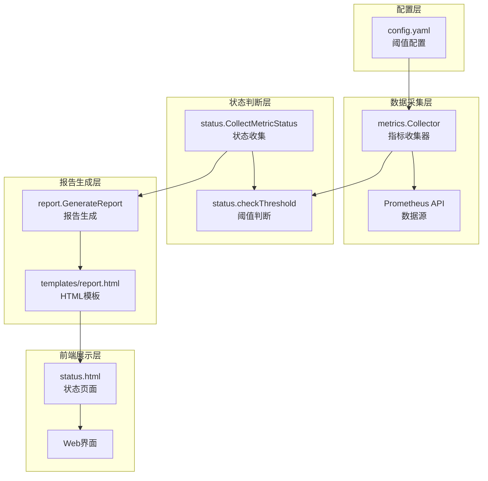
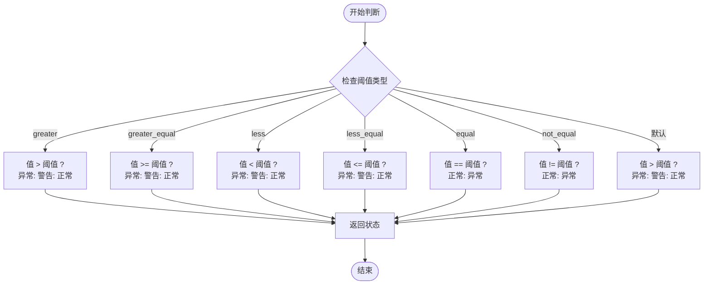
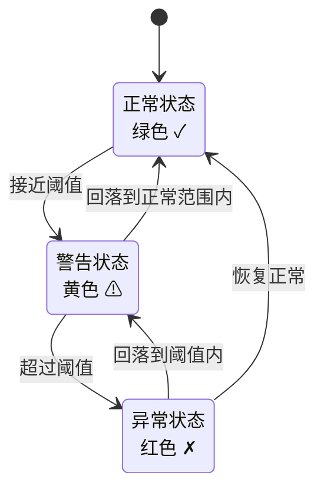
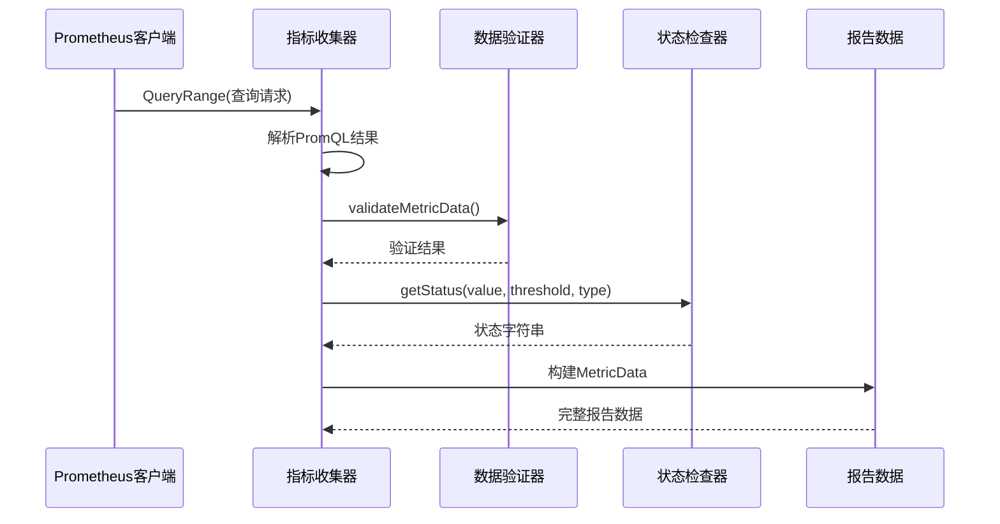
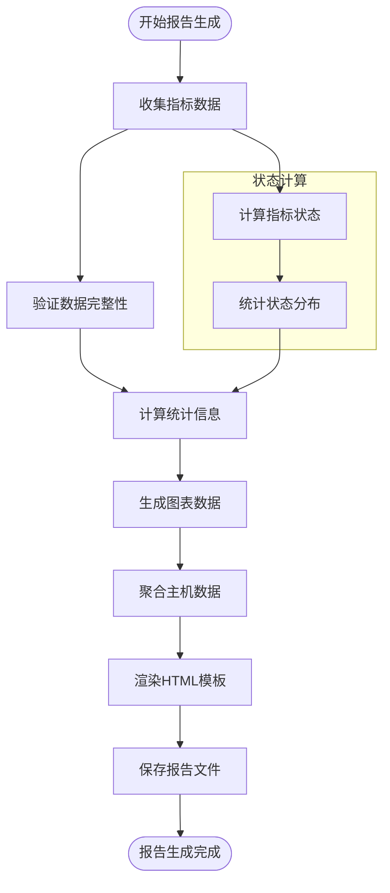
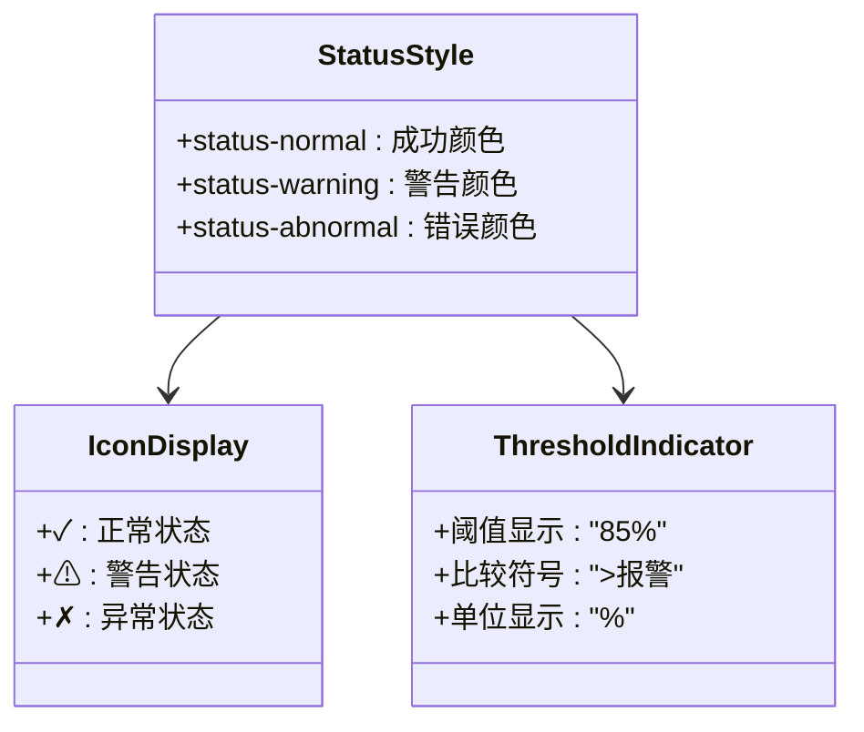
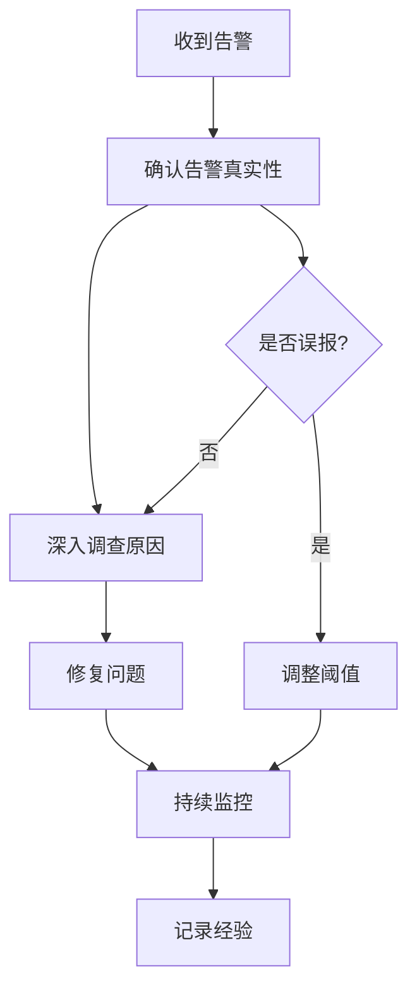

# 阈值判断机制技术文档

<cite>
**本文档引用的文件**
- [status.go](file://pkg/status/status.go)
- [collector.go](file://pkg/metrics/collector.go)
- [config.yaml](file://config/config.yaml)
- [generator.go](file://pkg/report/generator.go)
- [status.html](file://templates/status.html)
- [main.go](file://main.go)
</cite>

## 目录
1. [概述](#概述)
2. [项目架构](#项目架构)
3. [阈值配置系统](#阈值配置系统)
4. [阈值判断算法](#阈值判断算法)
5. [状态流转机制](#状态流转机制)
6. [数据采集与处理](#数据采集与处理)
7. [报告生成流程](#报告生成流程)
8. [前端状态展示](#前端状态展示)
9. [常见问题排查](#常见问题排查)
10. [最佳实践建议](#最佳实践建议)

## 概述

PromAI项目中的阈值判断机制是一个核心功能模块，负责将Prometheus监控数据转换为可理解的健康状态。该机制通过配置化的阈值类型和数值，实现了从原始指标数据到健康/警告/异常状态的智能判断。

### 核心特性

- **多维度阈值类型支持**：支持greater、less、equal、not_equal等六种比较类型
- **分级状态判断**：正常、警告、异常三级状态体系
- **灵活的配置管理**：通过YAML配置文件动态调整阈值参数
- **实时状态监控**：支持7天历史状态追踪和实时状态更新

## 项目架构



**图表来源**
- [main.go](file://main.go#L1-L50)
- [collector.go](file://pkg/metrics/collector.go#L1-L30)
- [status.go](file://pkg/status/status.go#L1-L50)

## 阈值配置系统

### 配置结构设计

阈值配置通过YAML文件进行管理，支持多种指标类型的灵活配置：

```yaml
metric_types:
- type: "基础资源使用情况"
  metrics:
  - name: "内存使用率"
    description: "节点内存使用率统计"
    query: "100 - ((node_memory_MemAvailable_bytes * 100) / node_memory_MemTotal_bytes)"
    threshold: 85
    threshold_type: "greater"
    unit: "%"
    labels:
      instance: "节点"
```

### 配置字段详解

| 字段名 | 类型 | 描述 | 示例 |
|--------|------|------|------|
| `name` | string | 指标名称 | "内存使用率" |
| `description` | string | 指标描述 | "节点内存使用率统计" |
| `query` | string | PromQL查询语句 | "100 - ..." |
| `threshold` | float | 阈值数值 | 85.0 |
| `threshold_type` | string | 阈值类型 | "greater" |
| `unit` | string | 单位 | "%" |
| `labels` | map | 标签映射 | {"instance": "节点"} |

**章节来源**
- [config.yaml](file://config/config.yaml#L40-L60)
- [status.go](file://pkg/status/status.go#L20-L35)

## 阈值判断算法

### 核心判断逻辑

阈值判断的核心函数`checkThreshold`实现了六种不同的比较类型：



**图表来源**
- [status.go](file://pkg/status/status.go#L213-L293)

### 具体实现细节

#### 1. greater类型（默认）
- **含义**：当值大于阈值时触发异常
- **示例**：CPU使用率 > 80% 触发告警
- **逻辑**：
  ```go
  if value > threshold {
      return "abnormal"  // 异常
  } else if value > threshold*0.9 {
      return "warning"   // 警告
  }
  return "normal"        // 正常
  ```

#### 2. less类型
- **含义**：当值小于阈值时触发异常
- **示例**：可用节点数 < 3 触发告警
- **逻辑**：
  ```go
  if value < threshold {
      return "abnormal"  // 异常
  } else if value < threshold/0.9 {
      return "warning"   // 警告
  }
  return "normal"        // 正常
  ```

#### 3. equal类型
- **含义**：只有当值等于阈值时才正常
- **逻辑**：
  ```go
  if value == threshold {
      return "normal"    // 正常
  }
  return "abnormal"      // 异常
  ```

**章节来源**
- [status.go](file://pkg/status/status.go#L213-L293)

## 状态流转机制

### 状态定义与转换



### 状态计算逻辑

状态计算遵循以下优先级规则：

1. **异常状态**：值超过阈值的100%
2. **警告状态**：值超过阈值的90%-100%
3. **正常状态**：值低于阈值的90%

这种设计避免了频繁的状态波动，提供了更稳定的监控体验。

**章节来源**
- [status.go](file://pkg/status/status.go#L213-L266)

## 数据采集与处理

### 指标收集流程



**图表来源**
- [collector.go](file://pkg/metrics/collector.go#L30-L120)

### 数据验证机制

收集到的指标数据需要经过严格的验证：

```go
func validateMetricData(data report.MetricData, configLabels map[string]string) error {
    if len(data.Labels) != len(configLabels) {
        return fmt.Errorf("标签数量不匹配: 期望 %d, 实际 %d",
            len(configLabels), len(data.Labels))
    }
    
    for _, label := range data.Labels {
        if label.Value == "" || label.Value == "-" {
            return fmt.Errorf("标签 %s 值为空", label.Name)
        }
    }
    return nil
}
```

**章节来源**
- [collector.go](file://pkg/metrics/collector.go#L117-L170)

## 报告生成流程

### 整体流程架构



**图表来源**
- [generator.go](file://pkg/report/generator.go#L100-L200)

### 状态统计与聚合

报告生成器会自动统计各类状态的数量：

```go
stats := GroupStats{
    MinValue: math.MaxFloat64,
}

for _, metrics := range group.MetricsByName {
    for _, metric := range metrics {
        stats.TotalCount++
        
        switch metric.Status {
        case "warning":
            stats.WarningCount++
            stats.AlertCount++
        case "critical":
            stats.CriticalCount++
            stats.AlertCount++
        }
    }
}
```

**章节来源**
- [generator.go](file://pkg/report/generator.go#L100-L150)

## 前端状态展示

### HTML模板渲染

前端状态页面通过Go模板引擎渲染，支持动态状态显示：

```html
<td class="{{if eq (index $metric.DailyStatus $date) "normal"}}status-normal{{else if eq (index $metric.DailyStatus $date) "warning"}}status-warning{{else}}status-abnormal{{end}}">
    <span class="check-icon">
        {{if eq (index $metric.DailyStatus $date) "normal"}}
        ✓
        {{else if eq (index $metric.DailyStatus $date) "warning"}}
        ⚠
        {{else}}
        ✗
        {{end}}
    </span>
</td>
```

### 状态样式系统



**图表来源**
- [status.html](file://templates/status.html#L275-L297)

**章节来源**
- [status.html](file://templates/status.html#L275-L310)

## 常见问题排查

### 1. 阈值判断不准确

**症状**：指标值接近阈值时状态频繁切换

**原因分析**：
- 警告阈值因子设置不当
- 数据采集频率过高导致波动

**解决方案**：
```yaml
# 调整阈值配置
threshold: 85
threshold_type: "greater"
# 警告阈值自动计算为85*0.9=76.5
```

### 2. 状态显示异常

**症状**：状态图标显示错误或颜色不正确

**排查步骤**：
1. 检查PromQL查询是否正确
2. 验证阈值配置是否符合预期
3. 确认标签映射是否完整

### 3. 报告生成失败

**症状**：无法生成HTML报告文件

**常见原因**：
- 模板文件缺失或损坏
- 输出目录权限不足
- 内存不足导致处理超时

**解决方法**：
```bash
# 检查模板文件
ls -la templates/
# 检查输出目录权限
chmod 755 reports/
```

### 4. 性能问题

**症状**：大量指标查询导致响应缓慢

**优化策略**：
- 减少查询时间范围
- 优化PromQL查询语句
- 增加缓存机制

## 最佳实践建议

### 1. 阈值配置原则

- **合理设置缓冲区**：避免阈值过于敏感
- **考虑业务场景**：不同指标采用不同的判断类型
- **定期评估调整**：根据实际运行情况优化阈值

### 2. 监控指标选择

- **关键指标优先**：优先监控影响业务的核心指标
- **多维度覆盖**：同时关注绝对值和相对比例
- **历史趋势分析**：结合历史数据制定合理阈值

### 3. 系统维护建议

- **定期检查配置**：确保配置文件及时更新
- **监控系统健康**：建立对监控系统的监控
- **备份重要配置**：定期备份配置文件和历史报告

### 4. 故障处理流程



通过遵循这些最佳实践，可以构建一个稳定可靠的阈值判断系统，为运维决策提供准确可靠的支持。