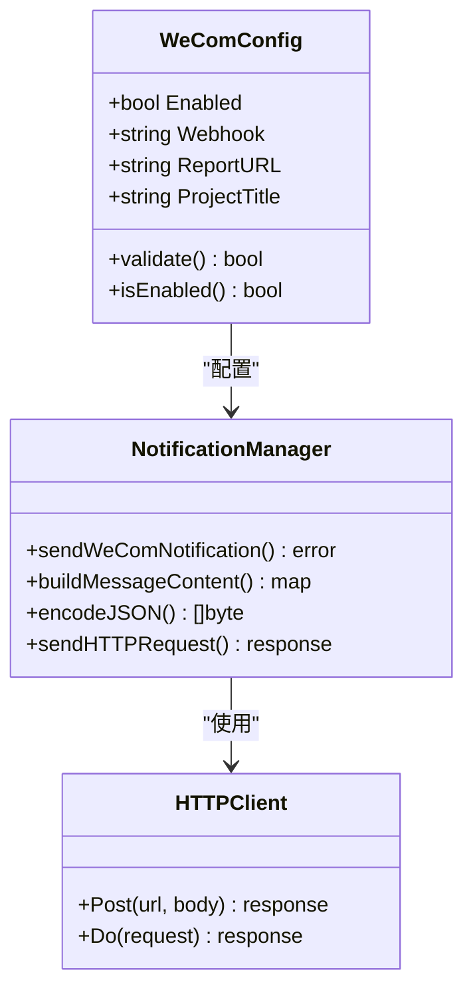
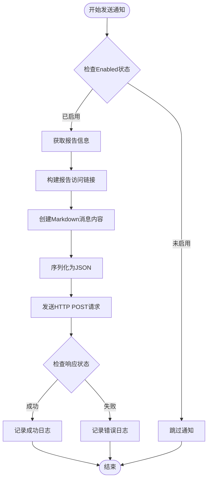

# 企业微信通知配置

<cite>
**本文档中引用的文件**
- [pkg/notify/notify.go](file://pkg/notify/notify.go)
- [config/config.yaml](file://config/config.yaml)
- [pkg/config/config.go](file://pkg/config/config.go)
- [deploy/deployment.yaml](file://deploy/deployment.yaml)
</cite>

## 目录
1. [简介](#简介)
2. [配置参数详解](#配置参数详解)
3. [WeComConfig结构体分析](#wecomconfig结构体分析)
4. [消息构建与发送流程](#消息构建与发送流程)
5. [安全配置建议](#安全配置建议)
6. [配置示例](#配置示例)
7. [消息渲染效果](#消息渲染效果)
8. [故障诊断指南](#故障诊断指南)
9. [最佳实践](#最佳实践)
10. [总结](#总结)

## 简介

PromAI项目提供了完整的企业微信机器人通知功能，通过配置企业微信Webhook接口实现自动化巡检报告的通知推送。该功能支持Markdown格式的消息渲染，能够将生成的巡检报告以富文本形式发送到指定的企业微信群组。

企业微信通知系统的核心特性包括：
- 支持Markdown格式的富文本消息
- 自动化的报告链接生成
- 可配置的项目标题和显示样式
- 完整的错误处理和日志记录
- 灵活的启用/禁用控制机制

## 配置参数详解

### enabled 启用开关

`enabled`参数控制企业微信通知功能的启用状态，是一个布尔值配置项。

- **数据类型**: `bool`
- **默认值**: `false`
- **作用**: 控制整个企业微信通知功能是否激活
- **配置位置**: `notifications.wecom.enabled`

当设置为`true`时，系统会尝试发送企业微信通知；设置为`false`时，所有企业微信通知操作将被跳过，不会产生任何网络请求。

### webhook 地址

`webhook`参数是企业微信机器人API的接入地址，用于接收和转发通知消息。

- **数据类型**: `string`
- **格式要求**: 必须是有效的HTTPS URL
- **示例**: `"https://qyapi.weixin.qq.com/cgi-bin/webhook/send?key=1df4d960-b7a7-43d6-9793-59f9e460c1d8"`
- **作用**: 指定企业微信机器人接收消息的API端点

Webhook地址的正确性直接影响通知功能的正常工作，必须确保：
- 使用HTTPS协议
- 包含有效的访问密钥
- 企业微信机器人已正确配置

### report_url 报告访问路径

`report_url`参数定义了报告文件的访问基础URL，用于生成可点击的报告链接。

- **数据类型**: `string`
- **格式要求**: 有效的HTTP/HTTPS URL
- **示例**: `"http://10.1.114.66:8091"`
- **作用**: 提供报告文件的访问入口

该参数决定了用户点击报告链接后访问的实际地址，需要确保：
- 与报告服务的部署地址一致
- 网络可达性良好
- 支持正确的协议（HTTP/HTTPS）

### project_title 项目标题

`project_title`参数用于设置通知消息中的项目标识，增强消息的可读性和识别度。

- **数据类型**: `string`
- **长度限制**: 通常不超过50字符
- **示例**: `"测试项目"`
- **作用**: 在通知消息中显示项目的名称

项目标题在消息中的应用：
- 作为通知标题的前缀
- 增强消息的专业性和可追溯性
- 帮助接收者快速识别消息来源

## WeComConfig结构体分析



**图表来源**
- [pkg/notify/notify.go](file://pkg/notify/notify.go#L35-L40)

### 结构体字段说明

```go
type WeComConfig struct {
    Enabled      bool   `yaml:"enabled"`
    Webhook      string `yaml:"webhook"`
    ReportURL    string `yaml:"report_url"`
    ProjectTitle string `yaml:"project_title"`
}
```

每个字段的具体作用和验证规则：

1. **Enabled字段**
   - 类型：`bool`
   - YAML标签：`yaml:"enabled"`
   - 功能：控制通知功能的启用状态
   - 默认行为：未启用时跳过所有通知操作

2. **Webhook字段**
   - 类型：`string`
   - YAML标签：`yaml:"webhook"`
   - 格式要求：必须是有效的HTTPS URL
   - 验证逻辑：在发送前进行URL有效性检查

3. **ReportURL字段**
   - 类型：`string`
   - YAML标签：`yaml:"report_url"`
   - 功能：提供报告文件的访问基础URL
   - 使用场景：生成报告下载链接

4. **ProjectTitle字段**
   - 类型：`string`
   - YAML标签：`yaml:"project_title"`
   - 功能：设置通知消息中的项目标识
   - 显示位置：消息标题部分

**章节来源**
- [pkg/notify/notify.go](file://pkg/notify/notify.go#L35-L40)

## 消息构建与发送流程

### 消息内容构建

企业微信通知采用Markdown格式的消息内容，支持丰富的文本样式和交互元素。



**图表来源**
- [pkg/notify/notify.go](file://pkg/notify/notify.go#L212-L284)

### Markdown消息格式

系统生成的Markdown消息包含以下结构：

```markdown
## 🔍 测试项目巡检报告已生成

### ⏰ 生成时间
> 2024-12-31 20:18:38

### 📄 报告详情
- **文件名**：`inspection_report_20241231_201838.html`
- **访问链接**：[点击查看报告](http://10.1.114.66:8091/reports/inspection_report_20241231_201838.html)

---
💡 请登录环境查看完整报告内容
```

### JSON消息体结构

最终发送给企业微信API的JSON消息体结构如下：

```json
{
  "msgtype": "markdown",
  "markdown": {
    "content": "## 🔍 测试项目巡检报告已生成\n\n### ⏰ 生成时间\n> 2024-12-31 20:18:38\n\n### 📄 报告详情\n- **文件名**：`inspection_report_20241231_201838.html`\n- **访问链接**：[点击查看报告](http://10.1.114.66:8091/reports/inspection_report_20241231_201838.html)\n\n---\n💡 请登录环境查看完整报告内容"
  }
}
```

**章节来源**
- [pkg/notify/notify.go](file://pkg/notify/notify.go#L225-L245)

## 安全配置建议

### Webhook地址保护

1. **避免硬编码敏感信息**
   - 不要在代码中直接硬编码Webhook地址
   - 使用环境变量或配置文件管理敏感信息
   - 考虑使用加密存储和解密机制

2. **网络访问控制**
   - 确保Webhook地址只能从内部网络访问
   - 配置防火墙规则限制访问源IP
   - 使用VPN或专线连接提高安全性

3. **证书验证**
   - 强制使用HTTPS协议
   - 验证SSL证书的有效性
   - 定期更新证书

### 权限管理

1. **群组权限设置**
   - 设置合适的群组成员权限
   - 限制非授权用户的发言权限
   - 配置消息通知的接收范围

2. **机器人权限控制**
   - 为不同业务场景创建专用机器人
   - 设置合理的消息发送权限
   - 定期审查和更新权限配置

### 敏感信息处理

1. **报告内容保护**
   - 对敏感数据进行脱敏处理
   - 设置报告文件的访问权限
   - 实施定期的访问审计

2. **日志安全**
   - 避免在日志中记录敏感信息
   - 实施日志轮转和归档策略
   - 设置适当的日志访问权限

## 配置示例

### 基础配置示例

```yaml
# config/config.yaml
notifications:
  wecom:
    enabled: true
    webhook: "https://qyapi.weixin.qq.com/cgi-bin/webhook/send?key=your-access-key-here"
    report_url: "https://your-report-server.example.com"
    project_title: "生产环境监控"
```

### 生产环境配置示例

```yaml
# config/config.yaml
notifications:
  wecom:
    enabled: true
    webhook: "${WECHAT_WEBHOOK_URL}"
    report_url: "${REPORT_SERVER_URL}"
    project_title: "${PROJECT_NAME}"
```

### 多环境配置示例

```yaml
# 开发环境配置
notifications:
  wecom:
    enabled: false
    webhook: "https://qyapi.weixin.qq.com/cgi-bin/webhook/send?key=test-dev"
    report_url: "http://localhost:8091"
    project_title: "开发环境"

# 生产环境配置
notifications:
  wecom:
    enabled: true
    webhook: "${PROD_WECHAT_WEBHOOK}"
    report_url: "https://prod-reports.example.com"
    project_title: "生产环境"
```

**章节来源**
- [config/config.yaml](file://config/config.yaml#L15-L19)

## 消息渲染效果

### 纯文本格式特点

企业微信通知采用Markdown格式，具有以下特点：

1. **标题层次结构**
   - 使用`##`表示二级标题
   - 支持多级标题嵌套
   - 自动生成目录结构

2. **图标增强**
   - 使用Unicode表情符号增加视觉吸引力
   - 统一的图标风格提升专业性
   - 图标与内容语义相匹配

3. **列表组织**
   - 使用有序和无序列表组织信息
   - 支持嵌套列表结构
   - 提高信息的可读性

4. **链接功能**
   - 支持内联链接和参考链接
   - 自动识别URL并转换为可点击链接
   - 提供友好的链接显示文本

### 渲染后的消息样式

```
## 🔍 生产环境监控巡检报告已生成

### ⏰ 生成时间
> 2024-12-31 20:18:38

### 📄 报告详情
- **文件名**：`inspection_report_20241231_201838.html`
- **访问链接**：[点击查看报告](https://prod-reports.example.com/reports/inspection_report_20241231_201838.html)

---
💡 请登录环境查看完整报告内容
```

### 与图文卡片格式对比

相比传统的图文卡片格式，Markdown格式的优势：

1. **内容丰富度**
   - 支持多种文本样式
   - 内置图标和装饰元素
   - 更灵活的布局控制

2. **交互性**
   - 支持可点击链接
   - 内置分隔线和提示信息
   - 更好的用户体验

3. **维护性**
   - 文本格式易于编辑和修改
   - 减少图片资源依赖
   - 更小的传输体积

## 故障诊断指南

### 常见错误类型

#### 1. 无效Webhook地址

**错误表现**：
```
创建企业微信请求失败: Post "https://invalid-url.com": dial tcp: lookup invalid-url.com: no such host
```

**诊断步骤**：
1. 验证Webhook地址格式
2. 检查DNS解析是否正常
3. 确认网络连通性
4. 验证SSL证书有效性

**解决方案**：
```bash
# 测试网络连通性
ping qyapi.weixin.qq.com

# 检查DNS解析
nslookup qyapi.weixin.qq.com

# 验证SSL证书
openssl s_client -connect qyapi.weixin.qq.com:443 -servername qyapi.weixin.qq.com
```

#### 2. 响应400错误

**错误表现**：
```
企业微信发送失败，状态码: 400
企业微信响应内容: {"errcode":40003,"errmsg":"invalid key"}
```

**可能原因**：
- Webhook密钥无效
- 请求格式不符合API规范
- 消息内容超出长度限制

**诊断方法**：
1. 验证Webhook密钥的正确性
2. 检查JSON消息格式
3. 确认消息内容长度

**解决方案**：
```go
// 检查Webhook密钥格式
func validateWebhookKey(key string) bool {
    return len(key) == 36 && strings.Contains(key, "-")
}
```

#### 3. 响应401错误

**错误表现**：
```
企业微信发送失败，状态码: 401
企业微信响应内容: {"errcode":40143,"errmsg":"invalid signature"}
```

**可能原因**：
- 签名计算错误
- 时间戳过期
- 密钥不匹配

**解决方案**：
- 检查签名算法实现
- 确保系统时间同步
- 验证密钥配置

### 调试技巧

#### 1. 启用详细日志

```go
// 修改日志级别以获取更多调试信息
log.SetFlags(log.LstdFlags | log.Lshortfile)
log.Printf("发送请求到: %s", config.Webhook)
```

#### 2. 网络抓包分析

使用工具如Wireshark或tcpdump捕获网络流量：

```bash
# 捕获HTTP流量
sudo tcpdump -i any -s 0 -w wechat_notification.pcap port 443

# 分析SSL握手过程
openssl s_client -connect qyapi.weixin.qq.com:443 -debug -msg
```

#### 3. API调用测试

使用curl手动测试Webhook接口：

```bash
curl -X POST https://qyapi.weixin.qq.com/cgi-bin/webhook/send?key=your-key \
-H "Content-Type: application/json" \
-d '{"msgtype": "text", "text": {"content": "测试消息"}}'
```

**章节来源**
- [pkg/notify/notify.go](file://pkg/notify/notify.go#L248-L284)

## 最佳实践

### 配置管理

1. **环境隔离**
   - 为不同环境配置独立的Webhook地址
   - 使用环境变量管理敏感配置
   - 实施配置版本控制

2. **配置验证**
   - 在启动时验证配置完整性
   - 实施配置热重载机制
   - 建立配置变更审批流程

3. **备份恢复**
   - 定期备份配置文件
   - 建立配置回滚机制
   - 实施配置变更监控

### 性能优化

1. **异步处理**
   - 将通知发送操作异步化
   - 使用消息队列解耦系统组件
   - 实施背压控制机制

2. **缓存策略**
   - 缓存Webhook地址解析结果
   - 实施请求结果缓存
   - 优化重复通知的处理

3. **超时控制**
   - 设置合理的HTTP请求超时
   - 实施重试机制和退避策略
   - 监控通知发送成功率

### 监控告警

1. **健康检查**
   - 定期检查Webhook可用性
   - 监控通知发送延迟
   - 实施端到端通知链路监控

2. **指标收集**
   - 收集通知发送成功率
   - 监控响应时间分布
   - 统计错误类型和频率

3. **告警配置**
   - 设置通知失败告警阈值
   - 实施分级告警机制
   - 建立告警升级流程

## 总结

企业微信通知配置是PromAI项目的重要组成部分，通过合理的配置和优化，可以实现高效、可靠的通知服务。关键要点包括：

1. **配置参数的重要性**
   - 正确配置`enabled`开关确保功能可控
   - 确保`webhook`地址的有效性和安全性
   - 合理设置`report_url`和`project_title`提升用户体验

2. **安全考虑**
   - 保护Webhook密钥等敏感信息
   - 实施适当的网络访问控制
   - 定期审查和更新权限配置

3. **故障处理**
   - 建立完善的错误处理和日志记录机制
   - 制定详细的故障诊断和解决流程
   - 实施监控和告警机制

4. **最佳实践**
   - 采用环境隔离和配置管理
   - 实施性能优化和监控告警
   - 建立完善的运维流程

通过遵循本文档的指导原则和最佳实践，可以确保企业微信通知功能的稳定运行，为企业用户提供及时、准确的巡检报告通知服务。