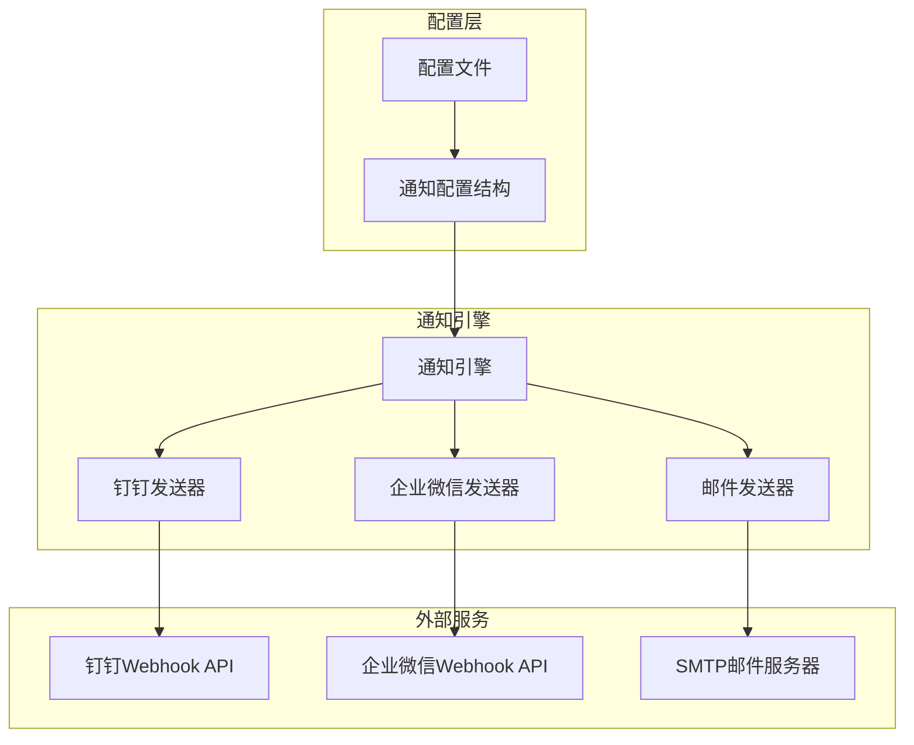
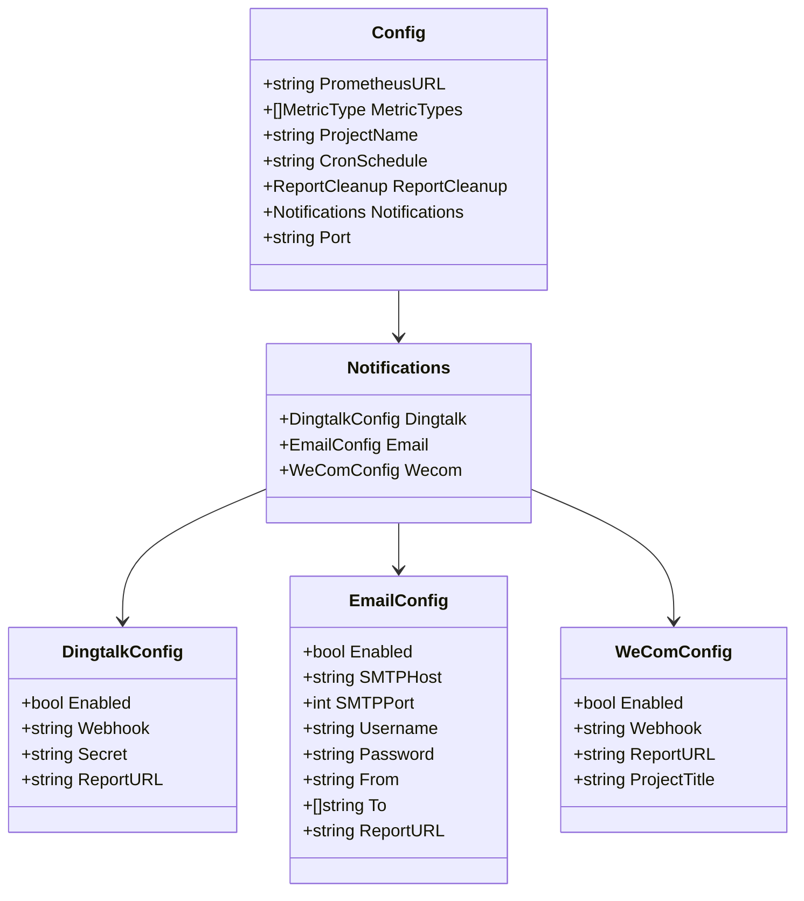
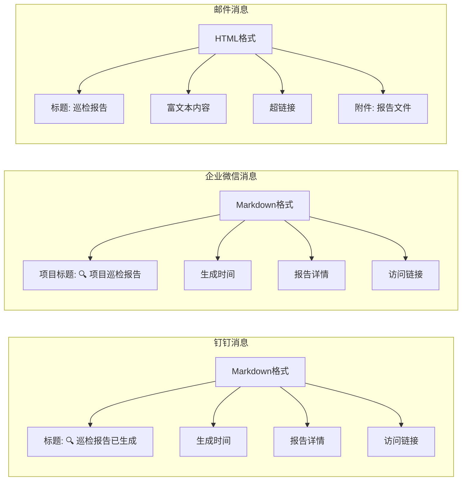

# 通知配置

<cite>
**本文档引用的文件**
- [notify.go](file://pkg/notify/notify.go)
- [config.go](file://pkg/config/config.go)
- [config.yaml](file://config/config.yaml)
- [deployment.yaml](file://deploy/deployment.yaml)
</cite>

## 目录
1. [简介](#简介)
2. [通知系统架构](#通知系统架构)
3. [配置结构详解](#配置结构详解)
4. [钉钉通知配置](#钉钉通知配置)
5. [企业微信通知配置](#企业微信通知配置)
6. [邮件通知配置](#邮件通知配置)
7. [消息格式对比](#消息格式对比)
8. [安全配置建议](#安全配置建议)
9. [配置示例](#配置示例)
10. [故障排除指南](#故障排除指南)
11. [总结](#总结)

## 简介

PromAI通知系统是一个多渠道消息发送框架，支持钉钉（DingTalk）、企业微信（WeCom）和邮件（Email）三种通知方式。该系统通过统一的配置接口管理不同渠道的连接参数、认证信息和消息格式，确保巡检报告能够及时准确地送达相关人员。

通知系统的核心设计原则是：
- **模块化设计**：每个通知渠道独立配置，互不影响
- **安全性优先**：支持密钥加密、SSL/TLS传输等安全机制
- **灵活扩展**：易于添加新的通知渠道
- **错误处理**：完善的日志记录和错误恢复机制

## 通知系统架构



**图表来源**
- [notify.go](file://pkg/notify/notify.go#L1-L55)
- [config.go](file://pkg/config/config.go#L1-L37)

**章节来源**
- [notify.go](file://pkg/notify/notify.go#L1-L286)
- [config.go](file://pkg/config/config.go#L1-L37)

## 配置结构详解

通知系统的配置结构采用嵌套的YAML格式，通过Go语言的结构体标签实现序列化和反序列化。



**图表来源**
- [config.go](file://pkg/config/config.go#L5-L20)
- [notify.go](file://pkg/notify/notify.go#L20-L35)

**章节来源**
- [config.go](file://pkg/config/config.go#L5-L20)
- [notify.go](file://pkg/notify/notify.go#L20-L35)

## 钉钉通知配置

### 配置参数详解

钉钉通知配置包含以下核心参数：

| 参数 | 类型 | 必需 | 描述 |
|------|------|------|------|
| `enabled` | bool | 是 | 启用/禁用钉钉通知功能 |
| `webhook` | string | 是 | 钉钉机器人Webhook URL |
| `secret` | string | 是 | 钉钉机器人加签密钥 |
| `report_url` | string | 是 | 报告文件访问地址 |

### Webhook配置

钉钉Webhook URL格式：
```
https://oapi.dingtalk.com/robot/send?access_token=YOUR_ACCESS_TOKEN
```

### Secret加签机制

钉钉通知需要使用HMAC-SHA256算法进行签名验证：

```go
func calculateDingtalkSign(timestamp int64, secret string) string {
    stringToSign := fmt.Sprintf("%d\n%s", timestamp, secret)
    h := hmac.New(sha256.New, []byte(secret))
    h.Write([]byte(stringToSign))
    return url.QueryEscape(base64.StdEncoding.EncodeToString(h.Sum(nil)))
}
```

### 消息格式

钉钉通知使用Markdown格式，支持以下特性：
- 标题和副标题
- 列表和表格
- 超链接
- 图标和表情符号
- 分隔线

**章节来源**
- [notify.go](file://pkg/notify/notify.go#L20-L25)
- [notify.go](file://pkg/notify/notify.go#L212-L217)

## 企业微信通知配置

### 配置参数详解

企业微信通知配置包含以下核心参数：

| 参数 | 类型 | 必需 | 描述 |
|------|------|------|------|
| `enabled` | bool | 是 | 启用/禁用企业微信通知功能 |
| `webhook` | string | 是 | 企业微信机器人Webhook URL |
| `report_url` | string | 是 | 报告文件访问地址 |
| `project_title` | string | 是 | 项目名称，用于消息标题 |

### Webhook配置

企业微信Webhook URL格式：
```
https://qyapi.weixin.qq.com/cgi-bin/webhook/send?key=YOUR_KEY
```

### 消息格式

企业微信通知同样使用Markdown格式，但具有以下特点：
- 支持更丰富的文本样式
- 更好的列表渲染
- 自动识别链接为可点击链接
- 支持更多特殊字符

**章节来源**
- [notify.go](file://pkg/notify/notify.go#L30-L35)
- [notify.go](file://pkg/notify/notify.go#L220-L240)

## 邮件通知配置

### 配置参数详解

邮件通知配置是最复杂的部分，包含多个网络和认证参数：

| 参数 | 类型 | 必需 | 描述 |
|------|------|------|------|
| `enabled` | bool | 是 | 启用/禁用邮件通知功能 |
| `smtp_host` | string | 是 | SMTP服务器地址 |
| `smtp_port` | int | 是 | SMTP服务器端口 |
| `username` | string | 是 | SMTP认证用户名 |
| `password` | string | 是 | SMTP认证密码/授权码 |
| `from` | string | 是 | 发件人邮箱地址 |
| `to` | []string | 是 | 收件人邮箱列表 |
| `report_url` | string | 是 | 报告文件访问地址 |

### SMTP配置要求

不同的邮件服务商有不同的配置要求：

| 服务商 | SMTP端口 | 加密方式 | 认证方式 |
|--------|----------|----------|----------|
| QQ企业邮箱 | 465 | SSL/TLS | 用户名+授权码 |
| 网易163 | 465 | SSL/TLS | 用户名+授权码 |
| Gmail | 587 | STARTTLS | 用户名+应用密码 |
| Outlook | 587 | STARTTLS | 用户名+应用密码 |

### TLS配置

邮件发送使用严格的TLS配置：

```go
tlsConfig := &tls.Config{
    InsecureSkipVerify: true,
    ServerName:         config.SMTPHost,
}
```

**章节来源**
- [notify.go](file://pkg/notify/notify.go#L37-L46)
- [notify.go](file://pkg/notify/notify.go#L147-L175)

## 消息格式对比

不同通知渠道的消息格式有显著差异：



### 文本格式差异

| 特性 | 钉钉 | 企业微信 | 邮件 |
|------|------|----------|------|
| 格式 | Markdown | Markdown | HTML |
| 标题样式 | 大号标题 | 大号标题 | H2标签 |
| 列表渲染 | 基础列表 | 更好列表 | UL/LI标签 |
| 链接显示 | 可点击链接 | 可点击链接 | 超链接 |
| 附件支持 | 文件上传 | 不支持 | 支持附件 |

**章节来源**
- [notify.go](file://pkg/notify/notify.go#L54-L95)
- [notify.go](file://pkg/notify/notify.go#L220-L240)
- [notify.go](file://pkg/notify/notify.go#L134-L175)

## 安全配置建议

### 密码和密钥管理

1. **使用环境变量**：避免在配置文件中直接存储敏感信息
2. **定期更换密钥**：定期更新Webhook密钥和SMTP授权码
3. **最小权限原则**：为每个通知渠道分配最小必要权限

### 网络安全

1. **HTTPS强制**：所有Webhook URL必须使用HTTPS协议
2. **防火墙配置**：限制对外出站连接的IP和端口
3. **证书验证**：在生产环境中启用证书验证

### 配置示例

```yaml
# 推荐的安全配置方式
notifications:
  dingtalk:
    enabled: true
    webhook: "${DINGTALK_WEBHOOK_URL}"
    secret: "${DINGTALK_SECRET_KEY}"
    report_url: "${REPORT_BASE_URL}"
  
  wecom:
    enabled: true
    webhook: "${WECOM_WEBHOOK_URL}"
    report_url: "${REPORT_BASE_URL}"
    project_title: "${PROJECT_NAME}"
  
  email:
    enabled: true
    smtp_host: "${SMTP_HOST}"
    smtp_port: ${SMTP_PORT}
    username: "${SMTP_USERNAME}"
    password: "${SMTP_PASSWORD}"
    from: "${FROM_EMAIL}"
    to:
      - "${TO_EMAIL_1}"
      - "${TO_EMAIL_2}"
    report_url: "${REPORT_BASE_URL}"
```

## 配置示例

### 完整配置示例

以下是完整的通知系统配置示例：

```yaml
# 生产环境配置示例
notifications:
  # 钉钉通知配置
  dingtalk:
    enabled: true
    webhook: "https://oapi.dingtalk.com/robot/send?access_token=your_access_token_here"
    secret: "SECyour_secret_key_here"
    report_url: "https://your-domain.com"
  
  # 企业微信通知配置
  wecom:
    enabled: true
    webhook: "https://qyapi.weixin.qq.com/cgi-bin/webhook/send?key=your_key_here"
    report_url: "https://your-domain.com"
    project_title: "生产环境巡检"
  
  # 邮件通知配置
  email:
    enabled: true
    smtp_host: "smtp.exmail.qq.com"
    smtp_port: 465
    username: "monitor@company.com"
    password: "your_authorization_code"
    from: "monitor@company.com"
    to:
      - "admin@company.com"
      - "ops-team@company.com"
    report_url: "https://your-domain.com"
```

### 开发环境配置示例

```yaml
# 开发环境配置示例
notifications:
  dingtalk:
    enabled: false  # 开发环境禁用钉钉通知
  
  wecom:
    enabled: false  # 开发环境禁用企业微信通知
  
  email:
    enabled: true
    smtp_host: "localhost"
    smtp_port: 1025
    username: ""
    password: ""
    from: "dev@company.com"
    to:
      - "developer@company.com"
    report_url: "http://localhost:8091"
```

**章节来源**
- [config.yaml](file://config/config.yaml#L15-L32)
- [deployment.yaml](file://deploy/deployment.yaml#L45-L74)

## 故障排除指南

### 常见问题诊断

#### 1. 钉钉通知失败

**症状**：钉钉通知返回错误状态码
**可能原因**：
- Webhook URL错误
- Access Token过期
- Secret密钥不匹配
- 签名计算错误

**解决方案**：
```bash
# 检查Webhook URL是否正确
curl -X POST https://oapi.dingtalk.com/robot/send?access_token=your_token \
  -H 'Content-Type: application/json' \
  -d '{"msgtype": "text", "text": {"content": "测试消息"}}'
```

#### 2. 企业微信通知失败

**症状**：企业微信返回错误响应
**可能原因**：
- Webhook Key错误
- 消息格式不符合要求
- 网络连接问题

**解决方案**：
```bash
# 测试企业微信Webhook
curl -X POST https://qyapi.weixin.qq.com/cgi-bin/webhook/send?key=your_key \
  -H 'Content-Type: application/json' \
  -d '{"msgtype": "text", "text": {"content": "测试消息"}}'
```

#### 3. 邮件发送失败

**症状**：邮件发送超时或认证失败
**可能原因**：
- SMTP服务器配置错误
- 认证凭据无效
- TLS证书验证失败
- 防火墙阻止连接

**解决方案**：
```bash
# 测试SMTP连接
telnet smtp.exmail.qq.com 465
openssl s_client -connect smtp.exmail.qq.com:465 -crlf
```

### 日志分析

通知系统提供了详细的日志记录：

```go
log.Printf("钉钉响应状态码: %d, 响应内容: %s", resp.StatusCode, string(respBody))
log.Printf("邮件发送成功")
log.Printf("企业微信通知发送成功")
```

### 调试技巧

1. **启用详细日志**：增加日志级别获取更多信息
2. **网络抓包**：使用Wireshark分析网络通信
3. **手动测试**：使用curl命令手动测试Webhook
4. **分步验证**：逐一验证每个配置参数

**章节来源**
- [notify.go](file://pkg/notify/notify.go#L134-L175)
- [notify.go](file://pkg/notify/notify.go#L248-L284)

## 总结

PromAI通知系统通过模块化的配置设计，实现了对钉钉、企业微信和邮件三种主流通知渠道的统一管理。系统的主要优势包括：

### 技术优势

1. **统一接口**：通过相同的配置结构管理不同渠道
2. **安全可靠**：支持加密传输和身份验证
3. **灵活配置**：支持多种认证方式和消息格式
4. **错误处理**：完善的日志记录和错误恢复机制

### 最佳实践建议

1. **环境分离**：开发、测试、生产环境使用不同的配置
2. **监控告警**：建立通知系统健康检查机制
3. **定期测试**：定期验证各渠道的连通性和功能
4. **文档维护**：保持配置文档的及时更新

### 扩展性考虑

系统设计支持轻松添加新的通知渠道，只需：
1. 定义新的配置结构
2. 实现相应的发送逻辑
3. 更新配置解析代码

通过合理的配置和维护，PromAI通知系统能够确保巡检报告及时准确地送达相关人员，为运维工作提供强有力的支持。