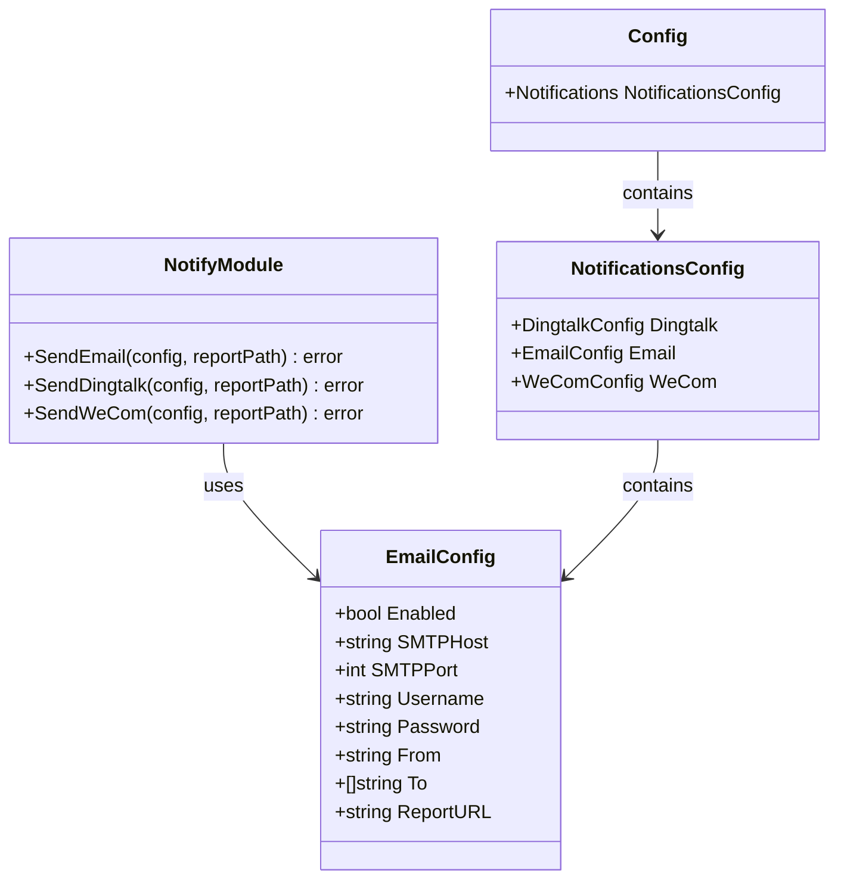
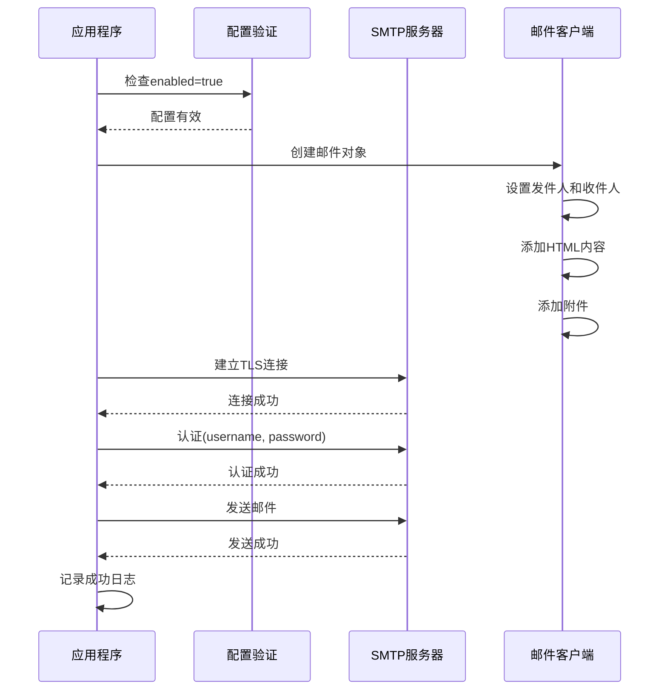
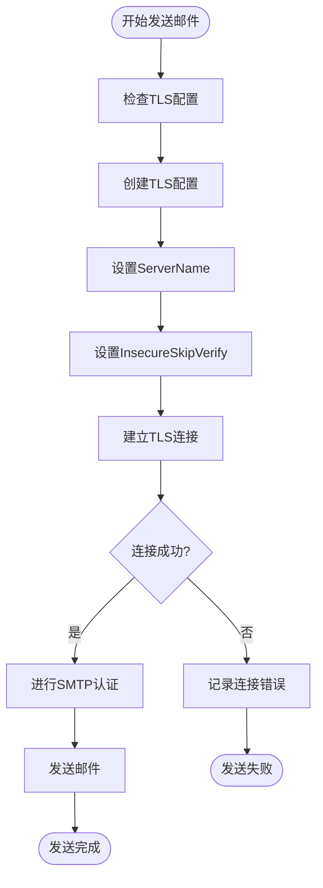

# 邮件通知配置

<cite>
**本文档引用的文件**
- [notify.go](file://pkg/notify/notify.go)
- [config.go](file://pkg/config/config.go)
- [config.yaml](file://config/config.yaml)
- [main.go](file://main.go)
- [generator.go](file://pkg/report/generator.go)
</cite>

## 目录
1. [简介](#简介)
2. [邮件配置结构](#邮件配置结构)
3. [配置参数详解](#配置参数详解)
4. [邮件发送流程](#邮件发送流程)
5. [TLS加密传输](#tls加密传输)
6. [最佳安全实践](#最佳安全实践)
7. [配置示例](#配置示例)
8. [HTML邮件内容](#html邮件内容)
9. [故障排除指南](#故障排除指南)
10. [总结](#总结)

## 简介

PromAI项目提供了完整的邮件通知功能，允许用户通过SMTP协议发送巡检报告邮件。该功能支持TLS加密传输，确保邮件发送的安全性，并提供了灵活的配置选项来适应不同的邮件服务提供商。

邮件通知模块的核心组件包括：
- `EmailConfig`结构体定义配置参数
- `SendEmail`函数实现邮件发送逻辑
- TLS配置确保传输安全
- HTML格式邮件内容
- 错误处理和日志记录

## 邮件配置结构

邮件通知功能通过`EmailConfig`结构体进行配置，该结构体定义了所有必要的邮件发送参数：



**图表来源**
- [notify.go](file://pkg/notify/notify.go#L25-L33)
- [config.go](file://pkg/config/config.go#L15-L22)

**章节来源**
- [notify.go](file://pkg/notify/notify.go#L25-L33)
- [config.go](file://pkg/config/config.go#L15-L22)

## 配置参数详解

### enabled 控制开关

`Enabled`字段控制邮件通知功能的启用状态。当设置为`false`时，邮件发送功能将被禁用，不会尝试连接SMTP服务器或发送邮件。

```yaml
email:
  enabled: false  # 设置为true启用邮件通知
```

### SMTP服务器配置

#### smtp_host 主机地址

`SMTPHost`指定SMTP服务器的主机名或IP地址。这是邮件发送的第一步，系统会尝试连接到这个地址建立SMTP会话。

支持的SMTP服务器：
- 腾讯企业邮箱：`smtp.exmail.qq.com`
- 网易企业邮箱：`smtp.qiye.163.com`
- Gmail：`smtp.gmail.com`
- Outlook：`smtp-mail.outlook.com`

#### smtp_port 端口号

`SMTPPort`指定SMTP服务器的端口号。不同的邮件服务提供商使用不同的默认端口：

- **465**：SSL/TLS加密连接（推荐）
- **587**：STARTTLS加密连接
- **25**：明文连接（不推荐）

### 认证凭据

#### username 用户名

`Username`是SMTP服务器认证所需的用户名。对于大多数邮件服务，这通常是完整的电子邮件地址。

#### password 授权码

`Password`字段存储SMTP认证密码。出于安全考虑，建议使用应用专用密码（授权码）而不是原始账户密码。

**重要提示**：不要直接在配置文件中使用原始密码，应使用授权码或环境变量注入。

### 发件人和收件人

#### from 发件人地址

`From`字段指定邮件的发件人地址。这个地址必须与SMTP认证凭据匹配，否则可能会被邮件服务器拒绝。

#### to 收件人列表

`To`是一个字符串数组，包含所有收件人的电子邮件地址。系统会向列表中的每个地址发送邮件副本。

### report_url 报告链接

`ReportURL`提供了一个可访问的URL前缀，用于生成报告的在线查看链接。这个URL指向PromAI服务的报告目录。

**章节来源**
- [notify.go](file://pkg/notify/notify.go#L25-L33)
- [config.yaml](file://config/config.yaml#L35-L45)

## 邮件发送流程

邮件发送过程遵循标准的SMTP协议流程，包含以下关键步骤：



**图表来源**
- [notify.go](file://pkg/notify/notify.go#L130-L180)

### 关键实现细节

1. **配置验证**：在发送邮件前，系统会检查`enabled`标志是否为`true`
2. **邮件对象创建**：使用`email.NewEmail()`创建新的邮件实例
3. **内容设置**：设置HTML格式的邮件内容和纯文本摘要
4. **附件添加**：自动添加巡检报告文件作为附件
5. **TLS连接**：建立安全的TLS加密连接
6. **认证过程**：使用PLAIN认证方法进行身份验证
7. **错误处理**：捕获并记录所有可能的发送错误

**章节来源**
- [notify.go](file://pkg/notify/notify.go#L130-L180)

## TLS加密传输

为了确保邮件内容的安全传输，系统实现了完整的TLS加密机制：



**图表来源**
- [notify.go](file://pkg/notify/notify.go#L160-L170)

### TLS配置参数

系统使用以下TLS配置参数：

```go
tlsConfig := &tls.Config{
    InsecureSkipVerify: true,
    ServerName:         config.SMTPHost,
}
```

- **InsecureSkipVerify**：设置为`true`允许忽略证书验证，适用于自签名证书或内部邮件服务器
- **ServerName**：指定服务器名称，用于SNI（服务器名称指示）扩展

**章节来源**
- [notify.go](file://pkg/notify/notify.go#L160-L170)

## 最佳安全实践

### 使用授权码替代密码

出于安全考虑，强烈建议使用应用专用密码（授权码）而不是原始账户密码：

#### 腾讯企业邮箱授权码设置
1. 登录腾讯企业邮箱管理后台
2. 进入"账户设置" -> "客户端授权密码"
3. 生成授权码并复制到配置文件

#### Gmail授权码设置
1. 登录Google账户
2. 进入"安全性"设置
3. 启用两步验证
4. 生成应用专用密码

### 环境变量注入

避免在配置文件中直接存储敏感信息，推荐使用环境变量：

```bash
export EMAIL_USERNAME="your-email@example.com"
export EMAIL_PASSWORD="your-app-password"
```

然后在配置文件中引用：

```yaml
email:
  username: "${EMAIL_USERNAME}"
  password: "${EMAIL_PASSWORD}"
```

### 密码轮换策略

定期更新SMTP认证凭据，建议：
- 每3个月更换一次授权码
- 在发现安全事件时立即更新
- 使用强随机密码生成器创建复杂密码

## 配置示例

### 腾讯企业邮箱配置

```yaml
email:
  enabled: true
  smtp_host: "smtp.exmail.qq.com"
  smtp_port: 465
  username: "monitor@company.com"
  password: "your-app-password"
  from: "monitor@company.com"
  to:
    - "admin@company.com"
    - "ops-team@company.com"
  report_url: "https://promai.company.com"
```

### Gmail配置

```yaml
email:
  enabled: true
  smtp_host: "smtp.gmail.com"
  smtp_port: 587
  username: "your-email@gmail.com"
  password: "app-password-generated-by-google"
  from: "Your Name <your-email@gmail.com>"
  to:
    - "recipient@domain.com"
  report_url: "https://your-domain.com"
```

### 自定义SMTP服务器

```yaml
email:
  enabled: true
  smtp_host: "mail.custom-server.com"
  smtp_port: 25
  username: "monitor@custom.com"
  password: "secure-password"
  from: "Monitoring System <monitor@custom.com>"
  to:
    - "alerts@custom.com"
  report_url: "https://monitoring.custom.com"
```

## HTML邮件内容

系统自动生成富文本格式的HTML邮件内容，包含以下元素：

```html
<h2>🔍 巡检报告已生成</h2>
<p><strong>生成时间：</strong>2024-01-01 10:30:00</p>
<p><strong>报告文件：</strong>inspection_report_20240101_103000.html</p>
<p><strong>在线查看：</strong><a href="https://promai.company.com/reports/inspection_report_20240101_103000.html">点击查看报告</a></p>
<p><strong>请登录环境查看完整报告内容!</strong></p>
```

### 邮件内容结构

1. **标题部分**：使用大号字体显示"巡检报告已生成"
2. **时间信息**：显示报告生成的精确时间
3. **文件信息**：显示报告文件名
4. **在线链接**：提供可点击的报告访问链接
5. **说明文字**：提醒用户登录系统查看详细内容

### 邮件样式设计

邮件采用简洁专业的设计风格：
- 使用蓝色主题色表示专业性
- 包含搜索图标增加视觉吸引力
- 提供清晰的操作指引
- 包含版权声明和免责声明

**章节来源**
- [notify.go](file://pkg/notify/notify.go#L140-L150)

## 故障排除指南

### 常见连接问题

#### 连接超时错误

**症状**：邮件发送过程中出现连接超时
**原因**：
- 网络连接不稳定
- SMTP服务器不可达
- 防火墙阻止连接

**解决方案**：
1. 检查网络连接状态
2. 验证SMTP服务器地址和端口
3. 检查防火墙设置
4. 尝试使用不同的端口（465 vs 587）

#### 认证失败错误

**症状**：SMTP认证过程中出现451或535错误
**原因**：
- 用户名或密码错误
- 未启用SMTP服务
- 需要授权码而非密码

**解决方案**：
1. 验证用户名和密码正确性
2. 确认SMTP服务已启用
3. 使用正确的授权码
4. 检查账户安全设置

### 邮件被标记为垃圾邮件

#### 解决方案

1. **SPF记录配置**：确保DNS中配置了正确的SPF记录
2. **DKIM签名**：启用DKIM邮件签名
3. **域名验证**：验证发件人域名
4. **邮件内容优化**：避免使用垃圾邮件关键词

#### 测试邮件发送功能

系统提供了详细的日志记录来帮助调试：

```go
log.Printf("开始发送邮件通知...")
log.Printf("SMTP服务器: %s:%d", config.SMTPHost, config.SMTPPort)
log.Printf("发件人: %s", config.From)
log.Printf("收件人: %v", config.To)
```

**章节来源**
- [notify.go](file://pkg/notify/notify.go#L130-L180)

## 总结

PromAI的邮件通知功能提供了完整的企业级邮件发送解决方案。通过合理的配置和安全实践，可以确保巡检报告能够及时、安全地送达相关人员。

### 主要特性

1. **灵活配置**：支持多种邮件服务提供商
2. **安全传输**：完整的TLS加密支持
3. **自动化流程**：与定时任务集成
4. **错误处理**：完善的日志记录和错误恢复
5. **HTML内容**：专业的邮件格式设计

### 部署建议

1. **生产环境**：使用授权码而非原始密码
2. **监控告警**：设置邮件发送状态监控
3. **备份方案**：考虑与其他通知方式集成
4. **定期测试**：定期验证邮件发送功能

通过遵循本文档的配置指南和最佳实践，您可以成功部署和维护PromAI的邮件通知功能，确保系统巡检报告能够可靠地传递给相关人员。