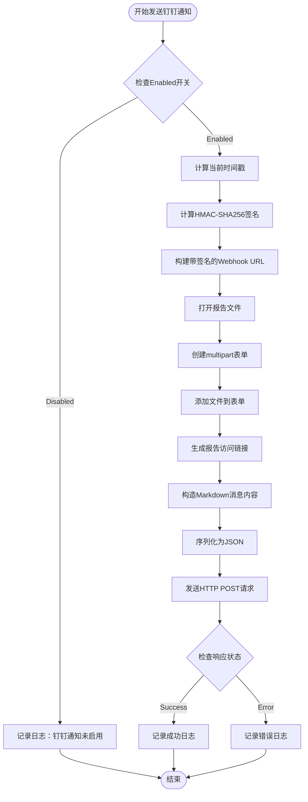

# 钉钉通知配置

<cite>
**本文档引用的文件**
- [notify.go](file://pkg/notify/notify.go)
- [config.go](file://pkg/config/config.go)
- [config.yaml](file://config/config.yaml)
- [main.go](file://main.go)
- [deployment.yaml](file://deploy/deployment.yaml)
</cite>

## 目录
1. [简介](#简介)
2. [配置结构](#配置结构)
3. [核心组件分析](#核心组件分析)
4. [安全机制详解](#安全机制详解)
5. [配置示例与最佳实践](#配置示例与最佳实践)
6. [部署指南](#部署指南)
7. [故障排除](#故障排除)
8. [总结](#总结)

## 简介

PromAI系统提供了完整的钉钉通知功能，通过自定义机器人实现自动化消息推送。该功能支持文件上传和Markdown格式的消息内容，确保巡检报告能够及时通知到相关人员。

钉钉通知的核心特性包括：
- **安全认证**：基于HMAC-SHA256算法的签名验证
- **文件传输**：支持自动上传巡检报告文件
- **富文本消息**：使用Markdown格式提供丰富的消息内容
- **灵活配置**：支持环境变量管理和配置热更新

## 配置结构

### DingtalkConfig 结构体

钉钉通知的配置通过 `DingtalkConfig` 结构体定义，包含四个核心字段：

```go
type DingtalkConfig struct {
    Enabled   bool   `yaml:"enabled"`    // 启用开关
    Webhook   string `yaml:"webhook"`    // Webhook机器人地址
    Secret    string `yaml:"secret"`     // Secret加签密钥
    ReportURL string `yaml:"report_url"` // 报告访问链接
}
```

### 字段详解

#### 1. Enabled 开关
- **类型**：布尔值
- **作用**：控制钉钉通知功能的启用状态
- **默认值**：false
- **使用场景**：生产环境中可临时禁用通知功能进行维护

#### 2. Webhook 地址
- **格式**：`https://oapi.dingtalk.com/robot/send?access_token=ACCESS_TOKEN`
- **作用**：钉钉机器人接收消息的HTTP接口地址
- **来源**：在钉钉群中添加自定义机器人后获得
- **注意事项**：必须包含有效的access_token参数

#### 3. Secret 密钥
- **格式**：字符串类型，通常为SEC开头的长字符串
- **作用**：用于计算消息签名的安全密钥
- **安全性**：必须妥善保管，避免泄露
- **生成方式**：在钉钉机器人设置中启用加签功能时生成

#### 4. ReportURL 报告链接
- **格式**：HTTP或HTTPS协议的完整URL
- **作用**：提供巡检报告的在线访问地址
- **要求**：必须是可从钉钉客户端访问的公网地址
- **推荐**：使用域名而非IP地址，便于DNS解析和负载均衡

**章节来源**
- [notify.go](file://pkg/notify/notify.go#L20-L25)
- [config.yaml](file://config/config.yaml#L25-L30)

## 核心组件分析

### SendDingtalk 函数流程



**图表来源**
- [notify.go](file://pkg/notify/notify.go#L54-L140)

### 签名计算机制

钉钉机器人使用HMAC-SHA256算法进行消息签名验证：

```go
func calculateDingtalkSign(timestamp int64, secret string) string {
    stringToSign := fmt.Sprintf("%d\n%s", timestamp, secret)
    h := hmac.New(sha256.New, []byte(secret))
    h.Write([]byte(stringToSign))
    return url.QueryEscape(base64.StdEncoding.EncodeToString(h.Sum(nil)))
}
```

签名计算过程：
1. **拼接字符串**：`timestamp + "\n" + secret`
2. **HMAC计算**：使用SHA256算法对拼接字符串进行加密
3. **Base64编码**：将加密结果进行Base64编码
4. **URL转义**：对编码结果进行URL查询参数转义

### 消息内容结构

钉钉通知采用Markdown格式的消息内容：

```markdown
## 🔍 巡检报告已生成

### ⏰ 生成时间
> 2024-01-01 12:00:00

### 📄 报告详情
- **文件名**：`inspection_report_20240101_120000.html`
- **访问链接**：[点击查看报告](http://example.com/reports/inspection_report_20240101_120000.html)

---
💡 请登录环境查看完整报告内容
```

**章节来源**
- [notify.go](file://pkg/notify/notify.go#L54-L140)
- [notify.go](file://pkg/notify/notify.go#L212-L218)

## 安全机制详解

### HMAC-SHA256签名验证

钉钉机器人通过以下步骤验证消息合法性：

1. **时间戳验证**：检查消息发送时间是否在允许范围内（通常为2小时）
2. **签名计算**：使用相同的算法重新计算签名
3. **对比验证**：比较计算结果与请求中的签名是否一致

### 安全最佳实践

#### 1. 敏感信息保护
```yaml
# 推荐使用环境变量而非直接配置
notifications:
  dingtalk:
    enabled: true
    webhook: "${DINGTALK_WEBHOOK}"
    secret: "${DINGTALK_SECRET}"
    report_url: "${REPORT_BASE_URL}"
```

#### 2. 网络安全配置
- **HTTPS强制**：确保Webhook地址使用HTTPS协议
- **防火墙规则**：仅允许钉钉服务器IP访问Webhook端点
- **证书验证**：生产环境启用SSL证书验证

#### 3. 权限最小化原则
- **机器人权限**：仅授予必要的消息发送权限
- **网络权限**：限制机器人只能访问特定的内部服务
- **文件权限**：确保报告文件只对授权用户可访问

**章节来源**
- [notify.go](file://pkg/notify/notify.go#L212-L218)

## 配置示例与最佳实践

### 完整YAML配置示例

```yaml
# config/config.yaml
prometheus_url: "http://prometheus.example.com:9090"
project_name: "生产环境巡检报告"
cron_schedule: "30 9,17 * * *"

notifications:
  dingtalk:
    enabled: true
    webhook: "https://oapi.dingtalk.com/robot/send?access_token=your_access_token_here"
    secret: "SEC75fd20834b42064b86c1aa97930738befeb2fe214044649397752212c5894848"
    report_url: "https://promai.example.com:8091"

  email:
    enabled: true
    smtp_host: "smtp.example.com"
    smtp_port: 587
    username: "alerts@example.com"
    password: "${EMAIL_PASSWORD}"
    from: "PromAI <alerts@example.com>"
    to:
      - "admin@example.com"
      - "ops-team@example.com"
    report_url: "https://promai.example.com:8091"

  wecom:
    enabled: true
    webhook: "https://qyapi.weixin.qq.com/cgi-bin/webhook/send?key=your_wecom_key"
    report_url: "https://promai.example.com:8091"
    project_title: "生产环境"
```

### 环境变量配置

```bash
# 生产环境配置
export DINGTALK_WEBHOOK="https://oapi.dingtalk.com/robot/send?access_token=your_token"
export DINGTALK_SECRET="SEC75fd20834b42064b86c1aa97930738befeb2fe214044649397752212c5894848"
export REPORT_BASE_URL="https://promai.example.com:8091"
export EMAIL_PASSWORD="your_email_password"
```

### Kubernetes ConfigMap配置

```yaml
apiVersion: v1
kind: ConfigMap
metadata:
  name: promai-config
  namespace: monitoring
data:
  config.yaml: |
    prometheus_url: "http://prometheus.monitoring.svc.cluster.local:9090"
    project_name: "Kubernetes集群巡检"
    cron_schedule: "30 9,17 * * *"
    
    notifications:
      dingtalk:
        enabled: true
        webhook: "$(DINGTALK_WEBHOOK)"
        secret: "$(DINGTALK_SECRET)"
        report_url: "https://promai.apps.example.com"
```

**章节来源**
- [config.yaml](file://config/config.yaml#L25-L30)
- [deployment.yaml](file://deploy/deployment.yaml#L30-L35)

## 部署指南

### 在钉钉群中添加自定义机器人

#### 步骤1：进入群设置
1. 打开钉钉应用，进入目标群聊
2. 点击右上角群设置图标
3. 选择"智能群助手"选项

#### 步骤2：添加自定义机器人
1. 点击"添加机器人"按钮
2. 选择"自定义机器人"类型
3. 填写机器人名称和头像
4. 保存设置

#### 步骤3：配置机器人权限
1. 复制生成的Webhook地址
2. 启用"加签"功能（推荐）
3. 记录生成的Secret密钥
4. 设置安全验证规则（可选）

#### 步骤4：测试机器人连通性
```bash
# 使用curl测试Webhook连通性
curl -X POST https://oapi.dingtalk.com/robot/send?access_token=your_token \
-H 'Content-Type: application/json' \
-d '{
    "msgtype": "text",
    "text": {
        "content": "测试消息：钉钉机器人连接正常"
    }
}'
```

### 部署到Kubernetes

```yaml
apiVersion: apps/v1
kind: Deployment
metadata:
  name: promai
  namespace: monitoring
spec:
  replicas: 1
  selector:
    matchLabels:
      app: promai
  template:
    metadata:
      labels:
        app: promai
    spec:
      containers:
      - name: promai
        image: promai:latest
        ports:
        - containerPort: 8091
        env:
        - name: DINGTALK_WEBHOOK
          valueFrom:
            secretKeyRef:
              name: dingtalk-secret
              key: webhook-url
        - name: DINGTALK_SECRET
          valueFrom:
            secretKeyRef:
              name: dingtalk-secret
              key: secret-key
        volumeMounts:
        - name: config-volume
          mountPath: /app/config
      volumes:
      - name: config-volume
        configMap:
          name: promai-config
```

**章节来源**
- [deployment.yaml](file://deploy/deployment.yaml#L30-L35)

## 故障排除

### 常见错误及解决方案

#### 1. 签名验证失败 (400)
**错误现象**：钉钉返回"签名不匹配"错误
**可能原因**：
- Secret密钥配置错误
- 时间戳过期（超过2小时）
- 网络延迟导致时间不同步

**解决方法**：
```bash
# 检查时间同步
ntpdate -u pool.ntp.org

# 验证Secret密钥
echo -n "$(date +%s)000\nyour_secret_key" | openssl dgst -sha256 -hmac "your_secret_key" -binary | base64
```

#### 2. 网络超时 (408)
**错误现象**：请求超时，无法发送消息
**可能原因**：
- 钉钉服务器网络问题
- 防火墙阻止出站连接
- DNS解析失败

**解决方法**：
```bash
# 测试网络连通性
ping oapi.dingtalk.com
telnet oapi.dingtalk.com 443

# 检查DNS解析
nslookup oapi.dingtalk.com
```

#### 3. 文件上传失败
**错误现象**：报告文件无法成功上传
**可能原因**：
- 文件路径错误
- 文件权限不足
- 网络带宽限制

**解决方法**：
```bash
# 检查文件权限
ls -la reports/

# 验证文件存在性
test -f reports/inspection_report_20240101_120000.html && echo "文件存在" || echo "文件不存在"
```

#### 4. 报告链接无效
**错误现象**：钉钉消息中的报告链接无法访问
**可能原因**：
- ReportURL配置错误
- 服务未正确启动
- 防火墙阻止访问

**解决方法**：
```bash
# 检查服务状态
curl -I http://localhost:8091/status

# 验证报告文件
curl -I http://promai.example.com:8091/reports/inspection_report_20240101_120000.html
```

### 调试技巧

#### 1. 启用详细日志
```yaml
# 修改日志级别
log_level: debug
```

#### 2. 使用Postman测试
```json
{
  "msgtype": "markdown",
  "markdown": {
    "title": "巡检报告",
    "text": "## 🔍 巡检报告已生成\n\n### ⏰ 生成时间\n> 2024-01-01 12:00:00\n\n### 📄 报告详情\n- **文件名**：`test_report.html`\n- **访问链接**：[点击查看报告](http://example.com/reports/test_report.html)\n\n---\n💡 请登录环境查看完整报告内容"
  }
}
```

#### 3. 监控网络流量
```bash
# 使用tcpdump监控HTTPS流量
sudo tcpdump -i any host oapi.dingtalk.com -w dingtalk.pcap

# 分析抓包结果
tshark -r dingtalk.pcap -Y "http"
```

**章节来源**
- [notify.go](file://pkg/notify/notify.go#L134-L140)

## 总结

钉钉通知功能为PromAI系统提供了强大的消息推送能力。通过合理的配置和安全措施，可以实现高效、可靠的通知服务。

### 关键要点回顾

1. **配置完整性**：确保所有必需字段都正确配置
2. **安全性**：使用加签功能增强消息安全性
3. **可用性**：提供可靠的报告访问链接
4. **监控**：建立完善的日志和监控机制

### 最佳实践建议

- **定期轮换密钥**：定期更新Secret密钥以提高安全性
- **监控告警**：设置通知发送失败的告警机制
- **备份配置**：定期备份配置文件以防意外丢失
- **性能优化**：考虑异步发送以提高系统响应速度

通过遵循本文档的指导，您可以成功部署和维护钉钉通知功能，确保巡检报告能够及时准确地送达相关人员手中。