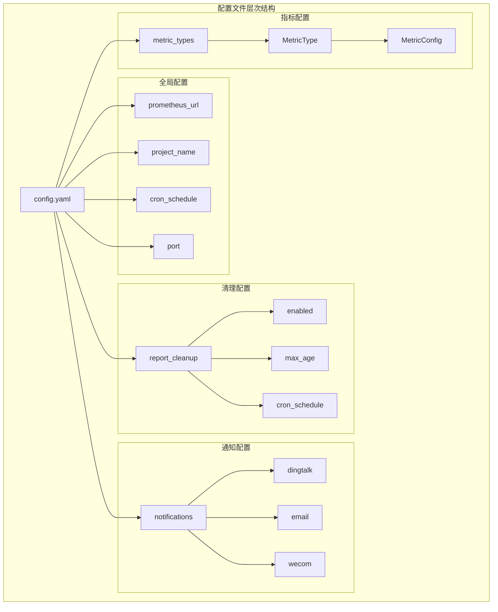
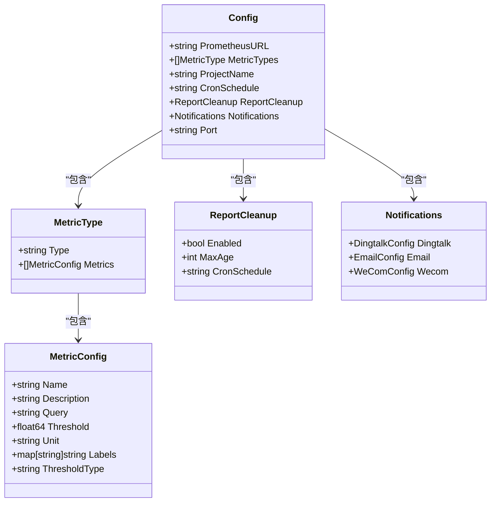
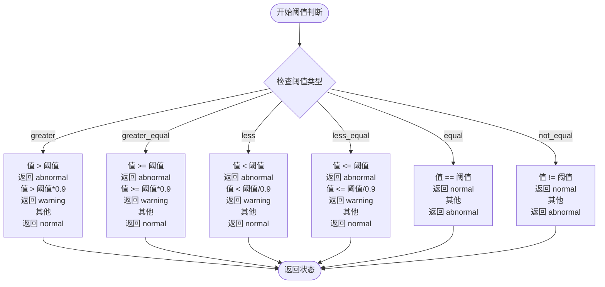

# 配置系统详解

<cite>
**本文档引用的文件**
- [config.yaml](file://config/config.yaml)
- [config.go](file://pkg/config/config.go)
- [main.go](file://main.go)
- [notify.go](file://pkg/notify/notify.go)
- [status.go](file://pkg/status/status.go)
- [collector.go](file://pkg/metrics/collector.go)
</cite>

## 目录
1. [简介](#简介)
2. [配置文件结构](#配置文件结构)
3. [核心配置项详解](#核心配置项详解)
4. [YAML结构映射](#yaml结构映射)
5. [环境变量覆盖机制](#环境变量覆盖机制)
6. [实际配置示例](#实际配置示例)
7. [阈值判断逻辑](#阈值判断逻辑)
8. [PromQL编写指南](#promql编写指南)
9. [最佳实践建议](#最佳实践建议)
10. [故障排除指南](#故障排除指南)

## 简介

PromAI配置系统是一个基于YAML格式的灵活配置框架，用于定义Prometheus监控指标、阈值规则、通知配置和定时任务。该系统通过清晰的层次结构和丰富的配置选项，支持多种监控场景和业务需求。

配置系统的核心功能包括：
- 定义监控指标和查询语句
- 设置阈值和状态判断逻辑
- 配置多渠道通知（钉钉、邮件、企业微信）
- 管理报告生成和清理策略
- 支持环境变量覆盖和动态配置

## 配置文件结构

### 整体架构



**图表来源**
- [config.yaml](file://config/config.yaml#L1-L196)
- [config.go](file://pkg/config/config.go#L5-L36)

### 配置文件位置

配置文件位于项目根目录的 `config/config.yaml` 文件中，这是应用程序默认加载的配置文件路径。

**章节来源**
- [config.yaml](file://config/config.yaml#L1-L196)

## 核心配置项详解

### Prometheus连接配置

```yaml
prometheus_url: "http://10.1.114.50:8390"
```

**字段说明：**
- **prometheus_url**: Prometheus服务器的访问地址
- **作用**: 定义Prometheus API的访问端点
- **默认值**: 无（必须配置）
- **支持协议**: HTTP/HTTPS

### 项目基本信息

```yaml
project_name: "测试项目巡检报告"
```

**字段说明：**
- **project_name**: 项目名称，用于报告标题和标识
- **作用**: 在生成的报告中显示项目名称
- **用途**: 区分不同项目的监控报告

### 定时任务配置

```yaml
cron_schedule: "30 9,17 * * *"
```

**字段说明：**
- **cron_schedule**: 定时任务执行计划
- **格式**: Cron表达式
- **示例**: "30 9,17 * * *" 表示每天9:30和17:30执行
- **作用**: 控制报告生成和监控任务的执行时间

### 环境变量覆盖机制

应用程序支持通过环境变量覆盖配置文件中的某些字段：

```go
// 从环境变量中获取 PrometheusURL
if envPrometheusURL := os.Getenv("PROMETHEUS_URL"); envPrometheusURL != "" {
    log.Printf("使用环境变量中的 Prometheus URL: %s", envPrometheusURL)
    config.PrometheusURL = envPrometheusURL
} else {
    log.Printf("使用配置文件中的 Prometheus URL: %s", config.PrometheusURL)
}
```

**章节来源**
- [main.go](file://main.go#L20-L35)

## YAML结构映射

### Go语言结构体定义

配置系统通过YAML标签将配置文件映射到Go语言结构体：



**图表来源**
- [config.go](file://pkg/config/config.go#L5-L36)

### 字段映射关系

| YAML字段 | Go结构体字段 | 类型 | 描述 |
|---------|-------------|------|------|
| prometheus_url | PrometheusURL | string | Prometheus服务器地址 |
| metric_types | MetricTypes | []MetricType | 指标类型列表 |
| project_name | ProjectName | string | 项目名称 |
| cron_schedule | CronSchedule | string | 定时任务计划 |
| report_cleanup.enabled | ReportCleanup.Enabled | bool | 是否启用报告清理 |
| report_cleanup.max_age | ReportCleanup.MaxAge | int | 保留报告的最大天数 |
| notifications.dingtalk | Notifications.Dingtalk | DingtalkConfig | 钉钉通知配置 |
| notifications.email | Notifications.Email | EmailConfig | 邮件通知配置 |
| notifications.wecom | Notifications.Wecom | WeComConfig | 企业微信通知配置 |

**章节来源**
- [config.go](file://pkg/config/config.go#L5-L36)

## 环境变量覆盖机制

### 支持的环境变量

应用程序支持以下环境变量覆盖配置：

1. **PROMETHEUS_URL**: 覆盖prometheus_url配置
2. **PORT**: 覆盖port配置（命令行参数优先级更高）

### 实现原理

```go
// 环境变量覆盖逻辑
if envPrometheusURL := os.Getenv("PROMETHEUS_URL"); envPrometheusURL != "" {
    log.Printf("使用环境变量中的 Prometheus URL: %s", envPrometheusURL)
    config.PrometheusURL = envPrometheusURL
} else {
    log.Printf("使用配置文件中的 Prometheus URL: %s", config.PrometheusURL)
}
```

### 使用场景

- **开发环境**: 使用本地Prometheus实例
- **生产环境**: 使用远程Prometheus集群
- **容器化部署**: 通过环境变量动态配置
- **多环境管理**: 不同环境使用不同的Prometheus地址

**章节来源**
- [main.go](file://main.go#L20-L35)

## 实际配置示例

### 基础资源使用情况配置

```yaml
metric_types:
- type: "基础资源使用情况"
  metrics:
  - name: "CPU使用率"
    description: "节点CPU使用率统计"
    query: "100 - (avg by(instance) (irate(node_cpu_seconds_total{mode='idle'}[5m])) * 100)"
    threshold: 80
    threshold_type: "greater"
    unit: "%"
    labels:
      instance: "节点"
  
  - name: "内存使用率"
    description: "节点内存使用率统计"
    query: "100 - ((node_memory_MemAvailable_bytes * 100) / node_memory_MemTotal_bytes)"
    threshold: 85
    threshold_type: "greater"
    unit: "%"
    labels:
      instance: "节点"
```

### Kubernetes集群监控配置

```yaml
- type: "kubernetes集群监控状态"
  metrics:
  - name: "节点就绪状态"
    description: "K8s节点就绪状态检查"
    query: "kube_node_status_condition{condition='Ready',status!='true'}"
    threshold: 0
    threshold_type: "equal"
    unit: ""
    labels:
      node: "节点"
      condition: "状态类型"
  
  - name: "Pod运行状态"
    description: "集群Pod运行状态统计"
    query: "sum by (namespace, pod) (kube_pod_status_phase{phase='Running'})"
    threshold: 1
    threshold_type: "equal"
    unit: ""
    labels:
      namespace: "命名空间"
      pod: "Pod名称"
```

### 多指标类型配置

```yaml
metric_types:
- type: "网络流量监控"
  metrics:
  - name: "网络接收速率"
    query: "rate(node_network_receive_bytes_total[5m])"
    threshold: 100000000
    threshold_type: "greater"
    unit: "B/s"
    labels:
      interface: "网卡接口"
      instance: "节点"
  
- type: "应用性能监控"
  metrics:
  - name: "HTTP响应时间"
    query: "histogram_quantile(0.95, rate(http_request_duration_seconds_bucket[5m]))"
    threshold: 2
    threshold_type: "less"
    unit: "秒"
    labels:
      method: "HTTP方法"
      handler: "处理程序"
```

**章节来源**
- [config.yaml](file://config/config.yaml#L35-L196)

## 阈值判断逻辑

### 阈值类型详解

系统支持多种阈值判断类型，每种类型对应不同的业务场景：



**图表来源**
- [status.go](file://pkg/status/status.go#L225-L266)

### 状态分类详解

| 阈值类型 | 判断条件 | 状态含义 | 应用场景 |
|---------|---------|---------|---------|
| greater | 值 > 阈值 | 异常 | CPU使用率、内存使用率 |
| greater_equal | 值 >= 阈值 | 异常 | 节点数量、服务状态 |
| less | 值 < 阈值 | 异常 | 可用节点数、响应时间 |
| less_equal | 值 <= 阈值 | 异常 | 存储使用率、连接数 |
| equal | 值 == 阈值 | 正常 | 服务状态、版本号 |
| not_equal | 值 != 阈值 | 正常 | 错误状态、异常标志 |

### 警告阈值计算

系统采用分级警告机制：

```go
// 警告阈值为正常阈值的90%
warningFactor := 0.9

switch thresholdType {
case "greater":
    if value > threshold {
        return "abnormal"
    } else if value > threshold*warningFactor {
        return "warning"
    }
    return "normal"
}
```

**章节来源**
- [status.go](file://pkg/status/status.go#L225-L266)

## PromQL编写指南

### 基础指标查询

#### CPU使用率查询
```promql
# 计算CPU使用率（100% - 空闲率）
100 - (avg by(instance) (irate(node_cpu_seconds_total{mode='idle'}[5m])) * 100)

# 或者使用更简洁的表达
100 - (avg(irate(node_cpu_seconds_total{mode="idle"}[5m])) * 100)
```

#### 内存使用率查询
```promql
# 内存使用率计算
100 - ((node_memory_MemAvailable_bytes * 100) / node_memory_MemTotal_bytes)

# 内存使用量计算
node_memory_MemTotal_bytes - node_memory_MemAvailable_bytes
```

#### 磁盘使用率查询
```promql
# 磁盘使用率计算
(((100 -((node_filesystem_avail_bytes * 100) / node_filesystem_size_bytes)) 
and ON (instance, device, mountpoint) 
node_filesystem_readonly{mountpoint!~"/run.*|/var.*|/boot.*|/tmp.*"}== 0) 
+ on(instance) group_left(node_uname_info) node_uname_info) 
* on(instance) group_left(nodename) node_uname_info

# 磁盘可用量查询
node_filesystem_avail_bytes{mountpoint!~"/run.*|/var.*|/boot.*|/tmp.*"}
```

### Kubernetes指标查询

#### Pod运行状态
```promql
# 统计运行中的Pod数量
sum by (namespace, pod) (kube_pod_status_phase{phase='Running'})

# 统计失败的Pod数量
sum by (namespace, pod) (kube_pod_status_phase{phase='Failed'})
```

#### PVC使用率
```promql
# PVC使用率计算
100 * (1 - kubelet_volume_stats_available_bytes / kubelet_volume_stats_capacity_bytes)
```

#### 节点状态
```promql
# 就绪状态检查
kube_node_status_condition{condition='Ready',status!='true'}

# 节点内存使用率
(node_memory_MemTotal_bytes - node_memory_MemAvailable_bytes) / node_memory_MemTotal_bytes * 100
```

### 高级查询技巧

#### 时间窗口选择
```promql
# 5分钟时间窗口
irate(node_cpu_seconds_total[5m])

# 1小时时间窗口
increase(node_network_receive_bytes_total[1h])

# 动态时间窗口
rate(container_cpu_usage_seconds_total[ $__interval ])
```

#### 标签过滤
```promql
# 过滤特定标签
node_memory_MemTotal_bytes{instance="192.168.1.100:9100"}

# 正则匹配
node_memory_MemTotal_bytes{job=~"prometheus|node-exporter"}

# 排除特定标签
node_memory_MemTotal_bytes{job!="blackbox-exporter"}
```

#### 数学运算
```promql
# 比例计算
(node_memory_MemAvailable_bytes / node_memory_MemTotal_bytes) * 100

# 单位转换
node_memory_MemTotal_bytes / 1024 / 1024 / 1024  # 转换为GB

# 条件过滤
(node_memory_MemAvailable_bytes > 1000000000)  # 大于1GB
```

**章节来源**
- [config.yaml](file://config/config.yaml#L35-L196)

## 最佳实践建议

### 配置优化建议

1. **阈值设置原则**
   - CPU使用率：80%（预警），90%（告警）
   - 内存使用率：85%（预警），95%（告警）
   - 磁盘使用率：80%（预警），90%（告警）
   - 响应时间：2秒（预警），5秒（告警）

2. **查询性能优化**
   ```yaml
   # 使用适当的采样间隔
   query: "rate(node_cpu_seconds_total[5m])"  # 5分钟采样
   
   # 避免过于复杂的查询
   query: "node_memory_MemAvailable_bytes"  # 简单查询优于复杂计算
   ```

3. **标签设计规范**
   ```yaml
   labels:
     instance: "节点"           # 必需标签
     job: "任务名称"           # 可选标签
     namespace: "命名空间"     # K8s环境
     pod: "Pod名称"           # K8s环境
   ```

### 监控策略建议

1. **分层监控**
   - 基础设施层：CPU、内存、磁盘
   - 应用层：响应时间、错误率
   - 业务层：用户活跃度、交易量

2. **告警分级**
   - P0：系统不可用，立即处理
   - P1：影响大部分用户，尽快处理
   - P2：影响小部分用户，计划内处理
   - P3：性能下降，观察处理

3. **报告频率**
   - 关键指标：实时监控
   - 日常指标：每日报告
   - 历史趋势：每周/每月报告

### 安全考虑

1. **敏感信息保护**
   - 不要在配置中直接存储密码
   - 使用环境变量或密钥管理服务
   - 定期轮换访问令牌

2. **网络安全**
   - 使用HTTPS连接Prometheus
   - 配置防火墙规则
   - 实施访问控制

## 故障排除指南

### 常见问题诊断

#### 配置加载失败

**症状**: 应用启动时报配置解析错误

**排查步骤**:
1. 检查YAML语法是否正确
2. 验证缩进是否一致
3. 确认必需字段是否存在
4. 检查字段类型是否匹配

**解决方案**:
```bash
# 使用YAML验证工具
python -c "import yaml; print(yaml.safe_load(open('config/config.yaml')))"
```

#### Prometheus连接失败

**症状**: 无法连接到Prometheus服务器

**排查步骤**:
1. 检查prometheus_url配置
2. 验证网络连通性
3. 确认Prometheus服务状态
4. 检查认证配置

**解决方案**:
```bash
# 测试Prometheus连接
curl -I http://10.1.114.50:8390/api/v1/query?query=up

# 使用环境变量调试
export PROMETHEUS_URL=http://10.1.114.50:8390
./promai --config=config/config.yaml
```

#### 查询结果异常

**症状**: 指标查询返回空值或错误结果

**排查步骤**:
1. 在Prometheus Web界面测试查询
2. 检查时间范围设置
3. 验证标签过滤条件
4. 确认数据采集状态

**解决方案**:
```promql
# 测试基本查询
up

# 测试标签过滤
node_memory_MemTotal_bytes{instance="192.168.1.100:9100"}

# 测试时间范围
node_memory_MemTotal_bytes offset 5m
```

### 性能优化建议

1. **查询优化**
   - 使用适当的采样间隔
   - 避免过于频繁的查询
   - 合理设置查询超时时间

2. **缓存策略**
   - 实施查询结果缓存
   - 使用时间序列数据库特性
   - 优化数据存储格式

3. **监控告警**
   - 设置查询性能告警
   - 监控系统资源使用
   - 定期评估查询效率

**章节来源**
- [main.go](file://main.go#L20-L35)
- [status.go](file://pkg/status/status.go#L225-L266)

## 结论

PromAI配置系统提供了强大而灵活的监控配置能力，通过清晰的YAML结构和丰富的配置选项，能够满足各种监控场景的需求。合理配置阈值、编写高效的PromQL查询、实施最佳实践，将大大提高监控系统的有效性和可靠性。

关键要点总结：
- 清晰的配置结构便于维护和扩展
- 灵活的阈值判断逻辑适应不同业务场景
- 强大的PromQL支持实现复杂查询需求
- 环境变量覆盖机制提升部署灵活性
- 完善的错误处理和故障排除机制确保系统稳定性

通过遵循本文档的指导原则和最佳实践，用户可以构建高效、可靠的监控系统，及时发现和解决潜在问题，保障系统的稳定运行。