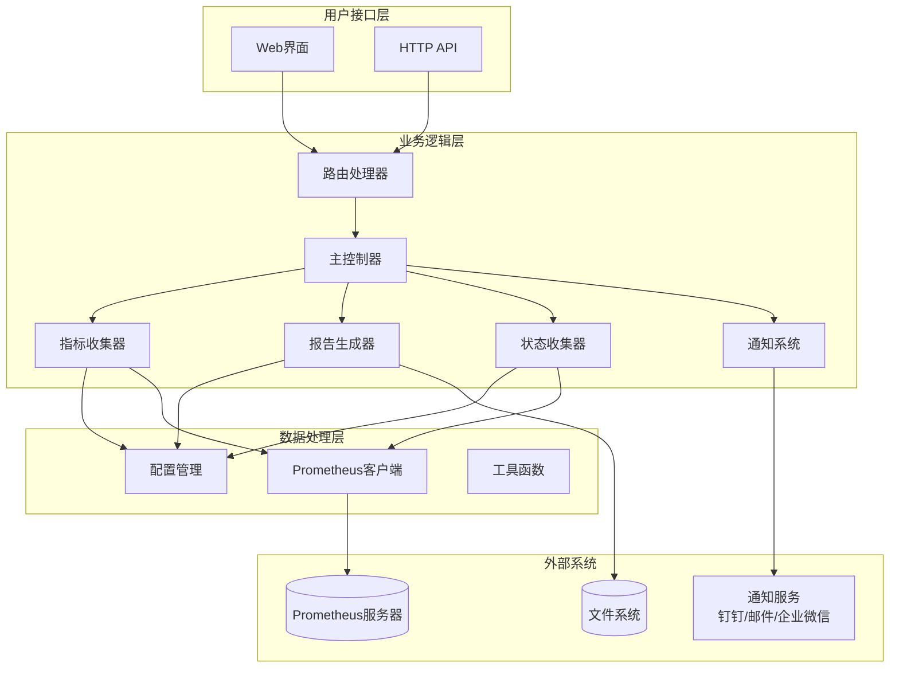
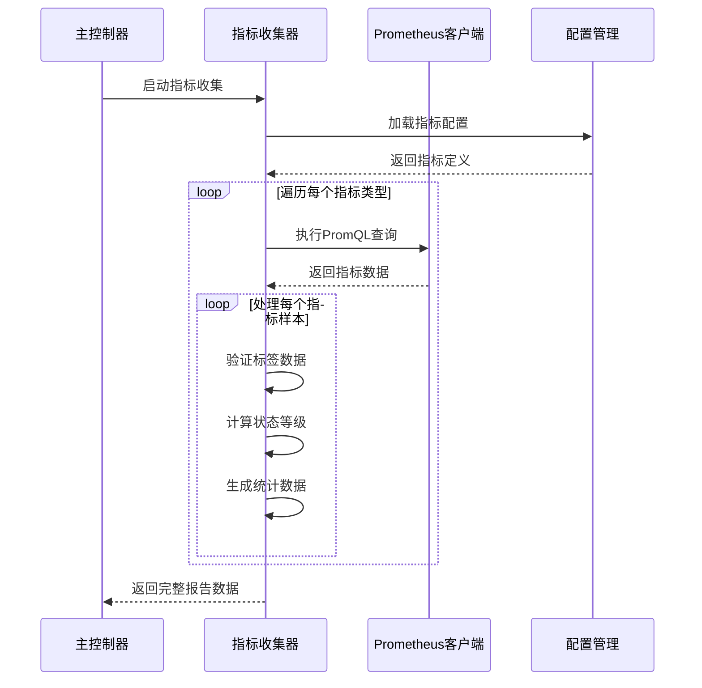
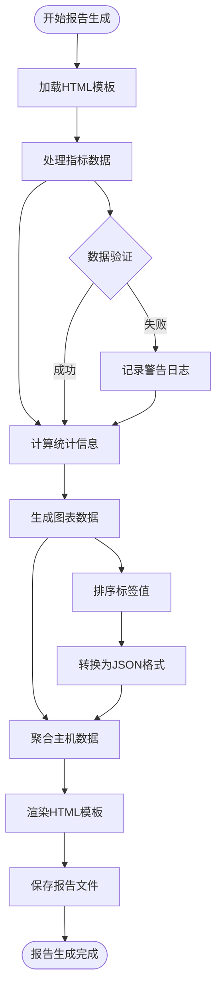
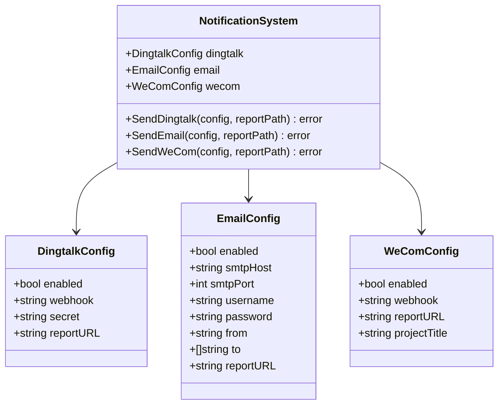
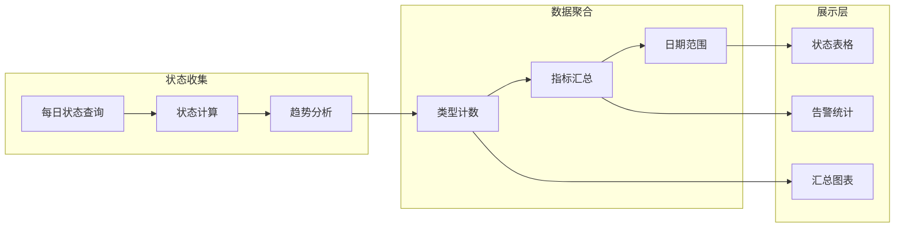
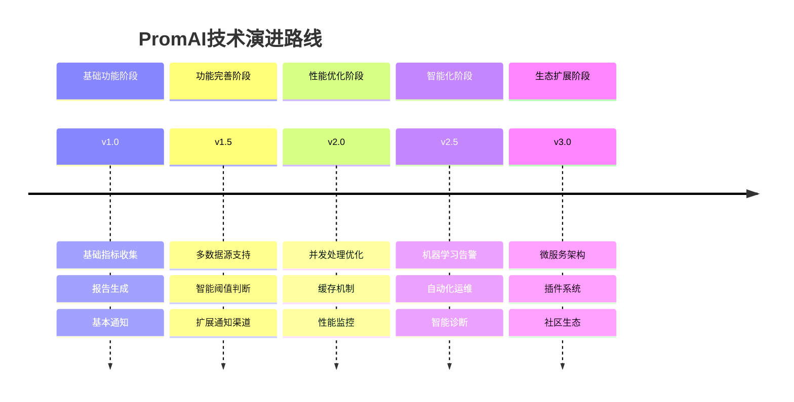

# PromAI项目概述

<cite>
**本文档中引用的文件**
- [README.md](file://README.md)
- [main.go](file://main.go)
- [pkg/config/config.go](file://pkg/config/config.go)
- [pkg/metrics/collector.go](file://pkg/metrics/collector.go)
- [pkg/report/generator.go](file://pkg/report/generator.go)
- [pkg/notify/notify.go](file://pkg/notify/notify.go)
- [pkg/status/status.go](file://pkg/status/status.go)
- [config/config.yaml](file://config/config.yaml)
- [templates/report.html](file://templates/report.html)
- [templates/status.html](file://templates/status.html)
</cite>

## 目录
1. [项目简介](#项目简介)
2. [核心价值与定位](#核心价值与定位)
3. [目标用户群体](#目标用户群体)
4. [系统架构概览](#系统架构概览)
5. [核心功能模块详解](#核心功能模块详解)
6. [使用场景与价值](#使用场景与价值)
7. [技术实现特色](#技术实现特色)
8. [学习路径指引](#学习路径指引)
9. [扩展性与未来发展](#扩展性与未来发展)
10. [总结](#总结)

## 项目简介

PromAI是一个基于Prometheus的自动化监控巡检系统，旨在简化监控数据的收集、分析和展示过程。该项目通过自动化的指标采集、智能的报告生成和多渠道的通知机制，帮助运维人员和开发者快速了解系统状态，提升监控效率，降低人工巡检成本。

### 主要特性

- **自动化指标采集**：基于Prometheus API自动收集各类监控指标
- **智能报告生成**：自动生成包含数据表格和图表的HTML报告
- **多维度数据分析**：支持基础资源、Kubernetes、应用服务等多种指标类型
- **灵活配置系统**：支持自定义指标阈值和标签别名
- **多渠道通知**：集成钉钉、邮件、企业微信等多种通知方式
- **状态看板**：提供实时的服务健康状态展示

## 核心价值与定位

### 设计初衷

PromAI项目的核心设计理念是"让监控变得更智能、更高效"。传统的监控系统往往需要人工定期检查各项指标，不仅耗时耗力，而且容易遗漏重要信息。PromAI通过自动化的方式，将这一过程智能化，让监控工作变得简单而高效。

### 系统定位

PromAI定位为一个**Prometheus增强型自动化巡检工具**，它不是替代现有的监控系统，而是作为现有Prometheus生态的补充和增强。通过提供：

- **统一的报告入口**：将分散在不同监控面板的数据整合到一份报告中
- **智能的状态评估**：自动计算指标状态和告警级别
- **美观的可视化展示**：提供专业的HTML报告格式
- **及时的通知机制**：确保重要信息能够及时传达给相关人员

## 目标用户群体

### 运维人员

对于运维团队而言，PromAI提供了：
- **批量监控能力**：一次性收集多个系统的监控指标
- **标准化报告**：确保每次巡检都有一致的质量标准
- **历史趋势分析**：通过长期数据积累发现潜在问题
- **故障预警**：提前识别可能影响系统稳定性的指标

### 开发者

对于开发团队来说，PromAI的价值体现在：
- **快速问题定位**：通过综合报告快速了解系统状态
- **性能优化参考**：基于历史数据制定优化策略
- **部署验证**：新版本上线后的系统状态验证
- **容量规划**：基于使用趋势进行资源规划

## 系统架构概览



**图表来源**
- [main.go](file://main.go#L1-L230)
- [pkg/metrics/collector.go](file://pkg/metrics/collector.go#L1-L195)
- [pkg/report/generator.go](file://pkg/report/generator.go#L1-L355)

### 整体架构流程

1. **配置加载阶段**：系统启动时加载YAML配置文件，初始化Prometheus客户端
2. **定时任务调度**：根据配置的Cron表达式定期执行监控任务
3. **指标数据收集**：通过Prometheus API查询指定的监控指标
4. **数据处理与分析**：对原始指标数据进行状态评估和统计分析
5. **报告生成**：将处理后的数据渲染为HTML报告
6. **通知分发**：通过配置的通知渠道发送报告和告警信息
7. **状态展示**：提供实时的健康状态看板

## 核心功能模块详解

### 指标采集模块（Metrics Collector）

指标采集模块是整个系统的核心，负责从Prometheus服务器获取各种监控指标数据。



**图表来源**
- [pkg/metrics/collector.go](file://pkg/metrics/collector.go#L30-L120)
- [pkg/config/config.go](file://pkg/config/config.go#L1-L37)

#### 关键特性

- **多指标类型支持**：支持基础资源、Kubernetes、应用服务等多种指标分类
- **动态阈值评估**：根据配置的阈值自动判断指标状态（正常、警告、严重）
- **标签映射**：支持将原始标签转换为更具可读性的别名
- **错误处理**：完善的错误处理机制，确保单个指标失败不影响整体流程

**章节来源**
- [pkg/metrics/collector.go](file://pkg/metrics/collector.go#L1-L195)

### 报告生成模块（Report Generator）

报告生成模块负责将收集到的指标数据转换为美观、专业的HTML报告。



**图表来源**
- [pkg/report/generator.go](file://pkg/report/generator.go#L120-L250)

#### 报告内容组成

1. **指标状态概览**：每个指标的当前状态和趋势
2. **统计数据**：最大值、最小值、告警数量等统计信息
3. **图表展示**：直观的历史趋势图表
4. **主机汇总**：按主机维度的资源使用情况
5. **详细表格**：完整的指标数据表格

**章节来源**
- [pkg/report/generator.go](file://pkg/report/generator.go#L1-L355)

### 通知系统模块（Notification System）

通知系统提供多种渠道的消息推送功能，确保重要监控信息能够及时传达。



**图表来源**
- [pkg/notify/notify.go](file://pkg/notify/notify.go#L1-L286)

#### 支持的通知渠道

- **钉钉机器人**：支持文件上传和Markdown格式的消息
- **电子邮件**：支持SMTP协议的邮件发送，带附件功能
- **企业微信**：支持企业内部的即时通讯通知

**章节来源**
- [pkg/notify/notify.go](file://pkg/notify/notify.go#L1-L286)

### 状态看板模块（Status Dashboard）

状态看板提供实时的系统健康状态展示，帮助用户快速了解整体系统状况。



**图表来源**
- [pkg/status/status.go](file://pkg/status/status.go#L80-L150)

#### 看板功能特性

- **7天历史追踪**：显示最近7天的指标状态变化
- **多状态分类**：区分正常、警告、异常三种状态
- **类型统计**：按指标类型统计各类指标的数量
- **趋势可视化**：通过图表展示指标状态的变化趋势

**章节来源**
- [pkg/status/status.go](file://pkg/status/status.go#L1-L295)

## 使用场景与价值

### 场景一：日常运维巡检

**典型用户**：运维工程师、系统管理员

**使用流程**：
1. 配置Prometheus服务器地址和监控指标
2. 设置定时任务（如每小时执行一次）
3. 系统自动收集指标并生成报告
4. 通过Web界面查看综合报告
5. 根据报告内容进行系统维护

**价值体现**：
- **减少人工工作量**：无需手动登录各个监控平台
- **提高巡检效率**：一站式获取所有关键指标状态
- **发现问题更及时**：通过自动化监控及时发现异常

### 场景二：系统上线前验证

**典型用户**：开发团队、测试团队

**使用流程**：
1. 配置新系统的关键监控指标
2. 上线前运行巡检任务
3. 分析生成的报告确认系统状态
4. 根据报告结果进行必要的调整

**价值体现**：
- **质量保证**：确保系统上线前达到预期状态
- **风险控制**：提前发现潜在的性能或稳定性问题
- **决策支持**：为系统上线提供数据支撑

### 场景三：容量规划与优化

**典型用户**：架构师、性能工程师

**使用流程**：
1. 长期运行监控任务收集历史数据
2. 分析报告中的趋势数据
3. 识别资源使用模式和瓶颈
4. 制定容量规划和优化方案

**价值体现**：
- **数据驱动决策**：基于真实数据制定规划方案
- **成本优化**：避免过度配置或资源浪费
- **预防性维护**：提前识别容量压力

## 技术实现特色

### 配置驱动架构

PromAI采用配置驱动的设计理念，通过YAML配置文件定义监控指标和系统行为：

```yaml
prometheus_url: "http://prometheus.k8s.kubehan.cn"

metric_types:
  - type: "基础资源使用情况"
    metrics:
      - name: "CPU使用率"
        description: "节点CPU使用率统计"
        query: "100 - (avg by(instance) (irate(node_cpu_seconds_total{mode='idle'}[5m])) * 100)"
        threshold: 80
        unit: "%"
        labels:
          instance: "节点"
```

这种设计的优势：
- **灵活性高**：无需修改代码即可调整监控范围
- **易于维护**：配置集中管理，便于版本控制
- **可扩展性强**：支持新增指标类型和配置项

### 多维度数据处理

系统实现了多层次的数据处理机制：

1. **原始数据收集**：从Prometheus获取原始指标数据
2. **状态评估**：根据阈值判断指标状态
3. **统计计算**：计算最大值、最小值、平均值等统计指标
4. **聚合分析**：按主机、按类型进行数据聚合
5. **图表生成**：将结构化数据转换为可视化图表

### 智能阈值判断

系统支持多种阈值比较方式，适应不同的业务场景：

```go
// 支持的阈值类型
switch thresholdType {
case "greater":
    // 值大于阈值时告警
case "less":
    // 值小于阈值时告警
case "equal":
    // 值等于阈值时正常
case "greater_equal":
    // 值大于等于阈值时告警
case "less_equal":
    // 值小于等于阈值时告警
}
```

### 模板化报告生成

采用Go语言的template包实现报告模板化生成：

- **HTML模板**：支持复杂的HTML结构和样式
- **JavaScript集成**：内置图表生成和交互功能
- **响应式设计**：适配不同设备的屏幕尺寸
- **国际化支持**：支持多语言标签和文本

## 学习路径指引

### 初学者路径

1. **环境准备**
   - 安装Go 1.22+和必要的依赖
   - 准备可访问的Prometheus服务器
   - 熟悉基本的PromQL查询语法

2. **快速上手**
   - 克隆项目代码
   - 复制配置文件模板
   - 修改Prometheus地址和指标配置
   - 运行程序查看效果

3. **深入理解**
   - 分析配置文件结构
   - 理解指标收集流程
   - 学习报告模板结构
   - 探索通知配置选项

### 进阶学习路径

1. **架构理解**
   - 分析main.go中的程序入口
   - 理解各模块间的依赖关系
   - 学习定时任务的实现机制
   - 掌握HTTP路由的处理逻辑

2. **功能扩展**
   - 添加新的指标类型
   - 实现自定义的通知渠道
   - 优化报告生成算法
   - 增强错误处理机制

3. **性能优化**
   - 分析查询性能瓶颈
   - 优化并发处理逻辑
   - 改进缓存机制
   - 增强日志记录功能

### 高级用户指南

对于希望深度定制和扩展的高级用户：

1. **代码结构分析**
   - 理解pkg目录下的模块划分
   - 学习接口设计模式
   - 掌握依赖注入机制
   - 研究错误处理最佳实践

2. **功能定制**
   - 开发自定义的指标收集器
   - 实现新的报告模板
   - 集成第三方通知服务
   - 构建监控仪表板

3. **部署运维**
   - 学习Docker容器化部署
   - 掌握Kubernetes部署配置
   - 理解监控和日志管理
   - 建立CI/CD流水线

## 扩展性与未来发展

### 现有扩展方向

根据项目规划，PromAI将在以下方面持续发展：

1. **多数据源支持**：除了Prometheus，还将支持其他监控系统
2. **自定义仪表板**：提供更灵活的可视化界面定制
3. **历史数据存储**：建立专门的历史数据存储和查询机制
4. **智能告警**：基于机器学习的异常检测和智能告警
5. **API接口**：提供RESTful API供第三方系统集成

### 技术演进路线



### 社区贡献机会

项目欢迎社区贡献，主要贡献领域包括：

- **功能开发**：新增监控指标类型和报告模板
- **性能优化**：改进查询效率和系统性能
- **文档完善**：编写更详细的使用文档和技术说明
- **测试覆盖**：增加单元测试和集成测试
- **国际化**：支持更多语言和地区

## 总结

PromAI作为一个基于Prometheus的自动化巡检系统，在提升监控效率、降低人工成本方面具有显著价值。通过其模块化的架构设计、灵活的配置机制和强大的功能特性，为运维人员和开发者提供了一个专业、高效的监控解决方案。

### 核心优势

1. **自动化程度高**：从指标收集到报告生成全程自动化
2. **配置灵活**：支持动态配置，无需修改代码即可调整监控范围
3. **功能完整**：涵盖指标收集、报告生成、状态展示、通知分发等完整功能链
4. **扩展性强**：模块化设计便于功能扩展和定制
5. **易于部署**：支持Docker和Kubernetes等多种部署方式

### 应用前景

随着云原生和微服务架构的普及，监控系统的重要性日益凸显。PromAI凭借其智能化的特性和易用性，将在以下方面发挥重要作用：

- **DevOps实践**：支持持续集成和持续交付流程
- **云原生监控**：适应Kubernetes等容器化环境的监控需求
- **智能化运维**：为AIOPS（智能运维）提供数据基础
- **企业级应用**：满足大型企业的复杂监控需求

通过持续的功能完善和技术演进，PromAI有望成为监控领域的重要工具，为构建更加智能、高效的监控体系贡献力量。