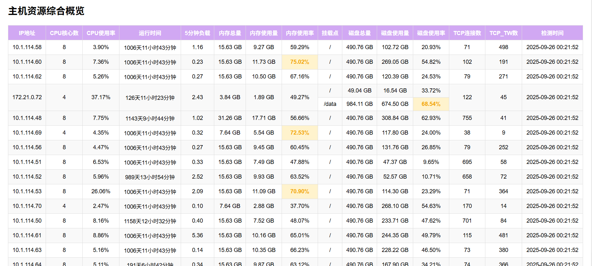

# Prometheus 监控报告生成器

> Prometheus Automated Inspection

## 项目简介

这是一个基于 Prometheus 的监控报告自动生成工具，可以自动收集、分析指标数据并生成可视化的 HTML 报告。该工具旨在简化监控数据的收集和展示过程，帮助运维人员快速了解系统状态。
项目基于 https://github.com/kubehan/PromAI 二次开发。  


## 报告样式
### 获取报告
http://localhost:8091/getreport

[报告样式](reports/inspection_report_20241214_131709.html)

<!--  -->

  

## 服务健康看板
### 获取服务健康看板
http://localhost:8091/status


## 功能特点

- 支持多种指标类型的监控（基础资源、Kubernetes、应用服务等）
- 自动计算指标状态和告警级别（正常、警告、严重）
- 生成包含数据表格和图表的 HTML 报告
- 支持自定义指标阈值和标签别名
- 灵活的配置文件系统
- 支持多维度数据分析和展示
- 自动计算关键统计指标（最大值、最小值、平均值等）
- 美观的可视化界面，支持响应式布局

## 系统要求

- Go 1.22 或更高版本
- 可访问的 Prometheus 服务器
- 现代浏览器（支持 HTML5 和 JavaScript）
- 至少 512MB 可用内存
- 50MB 可用磁盘空间

## 配置说明

配置文件采用 YAML 格式，主要包含以下几个部分：

### Prometheus 配置

在 `config/config.yaml` 中配置 Prometheus 服务器地址和监控指标。

```yaml
prometheus_url: "http://prometheus.k8s.kubehan.cn"

metric_types:
- type: "基础资源使用情况"
  metrics:
  # 基础资源中的metrics 的name不能修改，不然会导致判断不到，无法渲染到主机资源概览表中（只要是希望渲染到主机资源概览表中的，就不能修改）
  - name: "CPU使用率"
    type: "monitoring" #type 有三种：monitoring: 报告中会要警告颜色区分 display：仅做数据展示，不区分颜色
    show_in_table: false # 是否在资源类型详情表中展示，false 表示不展示,true 表示展示。一般在主机资源概览表中展示的就没必要再到资源类型详情的监控中展示了，如果全都在主机资源概览表中展示，表会很丑陋，所以增加了该参数来控制展示区域
    description: "节点CPU使用率统计"
    query: "100 - (avg by(instance) (irate(node_cpu_seconds_total{mode='idle'}[5m])) * 100)"
    threshold: 80
    threshold_type: "greater"
    unit: "%"
    labels:
      instance: "节点"
      # 其他指标...
```

### 指标说明

每个指标可以配置以下内容：

- `name`: 指标名称  
- `type`: 是否颜色告警  
- `show_in_table`: 是否展示详情表
- `description`: 指标描述
- `query`: 用于表格显示的即时查询
- `trend_query`: 用于图表显示的趋势查询
- `threshold`: 指标阈值
- `unit`: 指标单位
- `labels`: 标签别名
- `threshold_type`: 阈值比较方式: "greater", "less", "equal", "greater_equal", "less_equal"

```txt
greater: 表示值必须大于阈值才被视为 "critical" 状态。
greater_equal: 表示值必须大于或等于阈值才被视为 "critical" 状态。
less: 表示值必须小于阈值才被视为 "normal" 状态。
less_equal: 表示值必须小于或等于阈值才被视为 "normal" 状态。
equal: 表示值必须等于阈值才被视为 "normal" 状态。
```

## 快速开始

### 源码编译

1. 克隆仓库：

   ```bash
   git clone https://github.com/maolchen/PromAI.git
   cd PromAI
   ```
2. 安装依赖：

   ```bash
   go mod download
   ```
3. 修改配置文件：

   ```bash
   cp config/config.yaml config/config.yaml
   # 编辑 config.yaml 设置 Prometheus 服务器地址和监控指标
   ```
4. 构建并运行：

   ```bash
   go build -o PromAI main.go
   ./PromAI -config config/config.yaml
   ```
5. 查看报告：
   生成的报告将保存在 `reports` 目录下。

### Docker 部署

```bash
# docker 需要自己先打镜像
docker run -d --name PromAI -p 8091:8091 promai/promai:latest
```

### Kubernetes 部署

```bash
kubectl apply -f deploy/deployment.yaml
```

## 使用示例

在配置文件中添加所需的监控指标后，运行程序将生成 HTML 报告。报告中将包含各个指标的当前状态、历史趋势图表以及详细的表格数据。

1. 修改配置文件中的Prometheus地址为自己的地址
2. 修改配置文件中的指标
3. 运行程序 默认运行在8091端口，通过访问http://localhost:8091/getreport 查看报告

```bash
go build -o PromAI main.go
./PromAI -config config/config.yaml
```

# 本项目主要二次开发点  
- 增加了企业微信通知   
- 指标展示按照配置文件配置顺序展示，重要的指标放在每个分组的前面  
- 增加了主机资源综合概览表  
- 页面风格调整  
- 增加了巡检总结表格，可人工填写，可贴图（贴图不会上传到后端，我个人贴图是为了能打印为pdf，报告主要是输出pdf文档）  

# 后续可能会做的  
- 增加AI报告分析  

# 存在的一些问题   
- 因为主要是为了输出巡检报告，增加了一些仅展示数据的指标在status中没做剔除，status整个执行会比较耗时且展示页面会有比较多的警告数据。  


## 许可证

该项目采用 MIT 许可证，详细信息请查看 LICENSE 文件。
